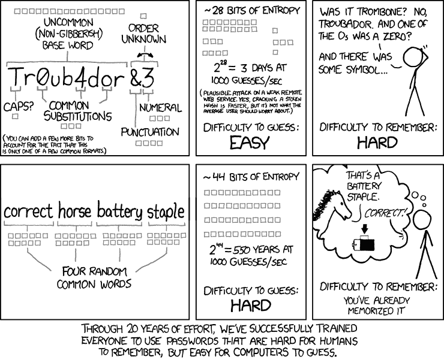

# 神奇的密码和如何生成它们

> 原文：<https://dev.to/belinde/fantastic-passwords-and-how-to-generate-them-1f1>

密码强度，密码管理，密码记忆，密码 bla bla bla。我们花半天时间为我们在网上使用的任何该死的服务编写(或保存在浏览器中)密码。而且我们总是使用相同的密码，因为我们肯定知道那是一个不好的(丑陋的！)习惯，但是我们真的记不住那么多抽象的*东西*。

关于这一论点已经写了很多文章。T2 提出了许多好建议。以我个人的拙见，XKCD 提出了生成一个长而安全的密码的最佳方法之一:

[T2】](https://res.cloudinary.com/practicaldev/image/fetch/s--7ZrLCC6g--/c_limit%2Cf_auto%2Cfl_progressive%2Cq_auto%2Cw_880/https://imgs.xkcd.com/comics/password_strength.png)

但是，这仍然是一个很好的记忆方法...一个？三个？六个？不同的密码。如果你试图为每个服务设置不同的密码，你会很快记住*很多*种可能的排列:*所以，gmail 是正确的马电池主食，github wolf 黄瓜铅笔杯，slack 是企鹅香蕉蜂蜜培根？或者是蜂蜜狼香蕉蜂蜜？*

所以，我个人的解决方法很简单。我们不就是开发商吗？我们不是每天都在管理算法吗？算法不是我们解决问题的日常工具吗？那么，我们为什么不用一种算法为每个网站生成一个唯一的密码呢？

算法必须简单，因为我们必须在大脑中运行。例如:

1.  第二级域名的前三个字母，在北约音标中，骆驼大小写
2.  左方括号
3.  二级域名的长度，以字母为单位
4.  一级域名的长度，以数字表示
5.  一个方括号关闭。

显然我已经为这个帖子编造了这个算法，所以不要在我的帐户上尝试它！:-)顺便说一下，它很复杂，但很容易记住，并且为每个站点生成不同的密码:

| 网站或服务 | 生成的密码 |
| --- | --- |
| dev.to | 三角洲回声维克托[三 2] |
| gmail.com | GolfMikeAlfa[五 3] |
| github.com | 高尔夫印度探戈[six3] |

诸如此类。显然，每个人都可以按照自己的意愿改进他的算法:根据任何参数添加其他符号，颠倒字符的顺序，添加简单的凯撒加密...没有限制，只是每个人决定的心理复杂性是可以承受的。

对于最偏执的人来说(当我们谈论安全性时，我们肯定*应该*都是偏执的)，即使单个密码被违反，算法也应该相当健壮。如果一些坏黑客入侵 github 并以某种方式获取我们的密码，阅读`GolfIndiaTango[six3]`的人可以理解语音部分，并考虑算法方法的可能性，并在我们使用的其他服务上尝试。我认为这种可能性很小，因为只有当有人专门针对你(T4)时，这种情况才会发生，而通常情况下不会发生。但仍然是一种可能性，所以每个人都必须仔细选择他的算法。

我从来没有读过任何关于这种算法的东西，但是我也没有搜索过，所以就像我们在意大利说的“我发现了热水”。但我真的很喜欢阅读你对。