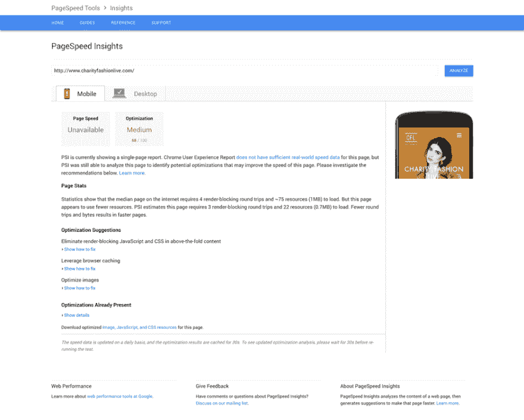
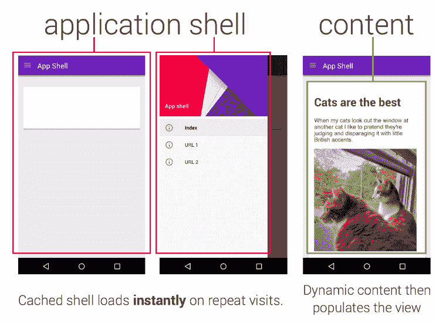
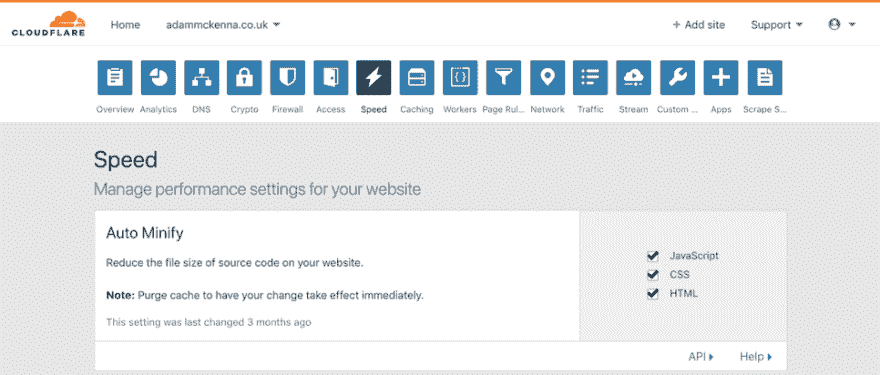

# 像威龙一样快:在 Google PageSpeed Insights 上达到 100/100 甚至更高

> 原文：<https://dev.to/adammckenna/fast-as-a-veyron-achieving-100100-on-google-pagespeed-insights-and-beyond-5ada>

文章原贴[此处](https://adammckenna.co.uk/articles/fast-as-a-veyron-achieving-100-100-on-google-pagespeed-insights-and-beyond)。

在我担任 web 开发人员的这些年里，我已经建立了各种不同的网站和 web 应用程序，越来越多地考虑每个项目的性能。我已经开发了许多据称超快的应用程序，却发现谷歌并不像我这么乐观。

在 Google page speed Insights(GPI)搜索栏中键入网站域名地址后，我会开始咬指甲，因为 Google 开始对该网络应用进行令人心痛的分析。当我读到桌面平台的“需要工作”琥珀色性能评级时，恐惧会变成失望。通常，当发现移动平台收到的难以形容的“糟糕”红色性能评级时，失望会加剧。为什么这些看似快速的网站在谷歌眼中表现如此之差？

[T2】](https://res.cloudinary.com/practicaldev/image/fetch/s--Dh_X-R23--/c_limit%2Cf_auto%2Cfl_progressive%2Cq_auto%2Cw_880/https://i.imgur.com/cLYAE4h.png)

我无法获得“良好”绿色评级的原因因项目而异。常见的例子包括缺乏对服务器端性能的控制；缺乏时间或预算来实现(看似)相当大的性能改进，或者在我职业生涯的早期，只是缺乏理解或无法消化有时令人困惑的 GPI 文档，这些文档建议如何配置和构建网站以符合工具的指标。

随着时间的推移，我只是接受了我的网站对谷歌来说永远不够好。“无论如何，这个工具不是一个有效的衡量网站性能的工具，”我总结道。

虽然我的后一个结论可能有些道理——在 PageSpeed Insights 的范围之外，肯定还有其他的 web 性能考虑；例如，该工具无法测量网站加载时间(Lucy Beer 演示的[),如果你开始将用户体验作为性能指标，它甚至更不准确(但是，这是另一个时间的讨论！)–前一个结论我错了。](https://wp-rocket.me/blog/the-truth-about-google-pagespeed-insights/)

在对网页性能进行了越来越深入的研究，试图确保我建立的每一个网站都比上一个网站更快，并采用了各种各样的网页性能技术——无论是新的还是旧的——是时候向 Google PageSpeed 展示我的网站可以足够好的洞察力了。这个机会出现在早该重新设计和重建的[个人网站](https://adammckenna.co.uk/)上。

没有任何限制，即预算、时间或技术方面的限制，我能够接受我所学到的一切，并将性能置于重建的核心。而且，随着故事的发展，我终于能够实现梦想:在 PageSpeed Insights 上获得 100/100 分(并通过 [WebPagetest](http://www.webpagetest.org/) 获得“A”分，这是一个可以说是更全面的衡量网站性能和优化的工具，也可以衡量加载时间)。

在这篇文章中，我将讨论我在追求和实现高网站性能方面的经验，讨论有助于提高我的网站性能的抽象概念和设计决策，并通过实际例子浏览 Google PageSpeed Insights 测试所包含的各种指标。

## 概念和设计

### 简单的 UI 设计

虽然我有涉猎，但我肯定不是用户界面设计师。然而，这似乎是常识:网站上显示的内容越多，浏览器需要呈现和加载的内容就越多。内容越多=加载时间越长。

根据我的经验，我发现很多网页——尤其是网站主页——充斥着大量看似随意的内容，试图在显示尺寸允许的情况下塞进尽可能多的内容，以推广他们服务的每一个细节。

我毫不怀疑一些网站和网络应用程序仅仅需要复杂，但并不意味着我的笔记本电脑屏幕需要充满英雄横幅、视频、动画等等。我不太确定。俗话说，少即是多。

所以，我问自己“我的网站的目的是什么？”我只有一个目标:我想要一个网站来张贴和展示我的文章。于是，我们决定，网站只为此目的服务，而不是其他目的。

我采用了[移动优先的设计方法](https://www.uxpin.com/studio/blog/a-hands-on-guide-to-mobile-first-design/)来设计(和构建)网站；从一个简单的导航开始(一个基于文本的标志和一些链接)；一个非常简单的页脚，宣传我的社交媒体帐户，在页眉和页脚元素之间，是一个文章的网格布局。仅此而已。(尽管我感到有点叛逆，并在网格布局中给文章添加了图片)。

我知道——也希望——我的设计不需要任何视频、重型英雄横幅图像或复杂的 JavaScript 或 CSS 动画。只是一些不错的旧 HTML，一些缩略图和少量的 CSS 和 JavaScript。如今，用很少的代码就能取得惊人的成就。

### 渐进式网络应用

我从 offset 知道我想把网站建成为 [Progressive Web App](https://developers.google.com/web/fundamentals/primers/service-workers/) (PWA)。如果你对 PWA 的概念不熟悉，我恳求你看看[妮可·赛迪的演讲:设计来自*的伟大的进步网络应用*](https://www.youtube.com/watch?v=2NZc4C7uNcU)。concat() 2018 。

长话短说，PWA 是一个常规网站，具有类似原生移动应用程序的交互功能，包括推送通知和离线支持。将我的网站建成 PWA 的理由越来越多，其中之一就是显著的 web 性能提升，这是通过一个 JavaScript 服务工作者实现缓存实现的。

具体的实现细节超出了本文的范围，但是如果您打算将您的网站构建为一个渐进式 Web 应用程序，Google 提供了关于通过服务工作者实现[离线支持和缓存的大量文档。](https://developers.google.com/web/fundamentals/codelabs/offline/)

### 应用外壳模型

有许多方法可以实现渐进式 web 应用程序，并利用其功能来提供出色的用户体验和高 Web 性能。我发现最吸引人的架构方法是[应用程序外壳模型](https://developers.google.com/web/fundamentals/architecture/app-shell)。

[T2】](https://res.cloudinary.com/practicaldev/image/fetch/s--2IEG8YVS--/c_limit%2Cf_auto%2Cfl_progressive%2Cq_auto%2Cw_880/https://developers.google.com/web/fundamentals/architectuimg/appshell.png)

这种方法需要向用户交付一个可缓存的网站用户界面“外壳”——即没有内容的网站布局——然后在内容可用时加载内容(我们很快会谈到一些实现细节)。

## 页面速度洞察指标

### 避免登陆页面重定向

列表中的第一个指标是最容易避免的:登录页面重定向。登录页面重定向是当用户试图导航到给定的网页 URL 时，网页将用户重定向到替代 URL 的过程。例如，如果用户试图导航到`example.com`，但是随后被重定向到`m.example.com`。

这一指标仍被视为 GPI 的一部分是有原因的。登录页面重定向的实现有一些常见和实用的用例。

登录页面重定向最常见的用途是重定向导航到以“ [www”开头的 URL 的用户。&# 39](http://www.')；到网站的“非 www”版本，反之亦然。例如:

> `adammckenna.co.uk`重定向到`www.adammckenna.co.uk`
> `www.adammckenna.co.uk`重定向到`adammckenna.co.uk`

虽然这是一个很好的接触——据说对 SEO 有[积极的含义——但对于那些不幸浏览到被重定向的网站版本的人来说，它会稍微影响网站的性能。但是，虽然我个人在我的网站中避免了这种重定向，但它肯定有一个有效的用例——特别是如果 SEO 是一个主要问题的话。](https://moz.com/blog/301-redirection-rules-for-seo)

重定向的另一个常见用途是(现在是中世纪的)将移动用户重定向到为移动用户构建的完全独立的网站，该网站通常托管在“m”子域上。例如:

> `adammckenna.co.uk`重定向至`m.adammckenna.co.uk`

在主流采用响应式网页设计之前，将移动用户重定向到一个独立的网站是很常见的。然而现在，整个网络社区和每个不幸经历过重定向的人都不喜欢它。

这种做法不仅会导致重定向方面的性能问题，还会带来过多的负面影响 ( [参见](https://www.smashingmagazine.com/2012/04/why-we-shouldnt-make-separate-mobile-websites/))。结论很清楚:“m”子域是过去的遗迹。

因此，我把我的个人网站建成了一个响应式网站，遵循伊桑·马科特的开创性著作[响应式网站设计](https://abookapart.com/products/responsive-web-design)中确立的原则——嗯，这些原则仍然适用。没有' m '子域重定向。

重定向还有许多其他的使用案例——例如，如果一个网站有几个相同网站的域名，或者该网站有多种语言版本，你就无法避免重定向——但是，除非绝对不可避免，否则我建议将重定向放在顶层书架上。

### 消除叠加内容中阻碍渲染的 JavaScript 和 CSS

当浏览器请求一个网页时，它开始建立一个 DOM 树。在呈现页面之前，必须完全构建 DOM 树。似乎很简单。

但是，作为 DOM 构建过程的一部分，当浏览器解析器遇到外部`<script>`或样式表资源时，它会暂停解析页面，直到相关资源被执行。

此外，许多网站依赖于托管在其他地方的外部资源，例如第三方 JavaScript 包、谷歌字体或内容交付网络(CDN)资源，当解析器遇到这些外部资源时，它也必须等待文件下载后才能执行。

通常，脚本和样式表会变成巨大的文档，导致页面呈现过程中出现明显的瓶颈。再加上对谷歌字体和其他外部资源的不严格使用，渲染阻塞可能会对网站性能造成很大影响。

在我的例子中，我请求一个大的样式表和中等大小的脚本文件——尽管两者都被缩小了(这个过程我们很快会谈到)——以及一个带有四个权重的外部 Google 字体和一个外部 Google 分析脚本。尽管与许多流行网站相比，我的网站对资源的使用很少，但即使是这些资源也造成了很大的加载延迟。

我需要一个解决方案。我需要通过页面渲染异步加载我的资源——但是怎么做呢？

回到过去，这可能是一项艰巨的任务。谢天谢地，在我们生活的十年里，HTML 规范的发展速度比以往任何时候都要快。随着每个新版本的推出，实现复杂功能的方法变得更加简单、高效。

HTML 规范中的一个新增功能是通过`<link>`元素的`rel`属性的[“预加载”值来预加载内容。](https://developer.mozilla.org/en-US/docs/Web/HTML/Preloading_content)

新的预加载值比它的前身有[多的好处，但最终它让浏览器加载资源——那些讨厌的样式表、脚本和外部文件——而不会阻止网页的 DOM 树的呈现。我们现在可以*本地*异步加载我们的资源。活着是多么美好的时光啊！](https://www.smashingmagazine.com/2016/02/preload-what-is-it-good-for/)

语法也非常简单(下面是来自 MDN 的一个[例子:](https://developer.mozilla.org/en-US/docs/Web/HTML/Preloading_content) 

```
<head>
  <meta charset="utf-8">
  JS and CSS preload example

  <link rel="preload" href="style.css" as="style">
  <link rel="preload" href="main.js" as="script">

  <link rel="stylesheet" href="style.css">
</head>

<body>
  <h1>bouncing balls</h1>
  <canvas></canvas>

  <script src="main.js"></script>
</body> 
```

Enter fullscreen mode Exit fullscreen mode

标准包括`<link rel="stylesheet">`和`<script>`标签。但是，在此之前，一些`<link rel="preload' as="x" href="y">`标签也被包含在每个被包含的资源中。在上面的例子中，我们正在加载一个`style.css`样式表和一个`main.js`脚本，所以我们需要为每个资源单独准备一个`<link rel="preload">`。

如果你认为这似乎好得不像是真的，那么，好吧…你可能有一点点正确。有一个很小很小的问题:浏览器支持。

截至本文撰写之时，新的预加载值仅在 Chrome、Safari 和少数移动浏览器中得到完全支持。这意味着没有 Firefox 或 Internet Explorer(惊喜，惊喜)支持，甚至 MS Edge 也只提供部分支持。

当然，由于我们有了对样式和脚本资源的常规引用，以及新的`rel="preload"` meta 标签，无论如何资源都会被加载。我们只是看不到预载的好处——这不是什么好消息。

这就是 [loadCSS](https://github.com/filamentgroup/loadCSS) 的用武之地。

loadCSS 是一个针对尚不支持`rel=preload`的浏览器的聚合填充，可以相对容易地实现。

首先，要使用 loadCSS，我们需要在
网站的某个地方包含 [loadCSS 预加载 polyfill 脚本](https://github.com/filamentgroup/loadCSS/blob/master/src/cssrelpreload.js)

```
<script>
/*! loadCSS rel=preload polyfill. [c]2017 Filament Group, Inc. MIT License */
(function(){ ... }());
</script> 
```

Enter fullscreen mode Exit fullscreen mode

接下来，我们需要包含一个稍微修改过的`<link rel=”…”>`标签。当利用 loadCSS 时，建议使用单个`<link rel=”preload”>`标签，而不是像我们之前的例子那样同时使用`rel=”preload”`和`rel=”style”`标签，因为否则浏览器只会**获取**样式表，而不会**将**应用到页面。

一旦通过利用`<link>`元素的本地`onload`事件加载了资源，我们就可以将`rel=preload`值转换为`rel=stylesheet`。这还有一个额外的好处，就是减少了我们实际需要编写的标记数量。

```
<!-— our local stylesheet. -->
<link rel="preload" href="path/to/style.css" as="style" onload=" this.rel='stylesheet'"> 
```

Enter fullscreen mode Exit fullscreen mode

还建议在`onload`处理程序(onload-exception)中将`onload`属性的值更改为`null`，因为当`rel`属性的值从`preload`切换到`style`时，一些浏览器会重新调用处理程序。

```
<!—- our local stylesheet. -->
<link rel="preload" href="path/to/style.css" as="style" onload="this.onload=null; this.rel='stylesheet'">

<!—- we can also apply the same logic to external stylesheets, such as Google Fonts -->
<link rel="preload" href="https://fonts.googleapis.com/css?family=Muli:300,300i,400,400i,600" as="style" onload="this.onload=null; this.rel='stylesheet'"> 
```

Enter fullscreen mode Exit fullscreen mode

当然，我们还需要考虑那些没有启用 JavaScript 的用户，因为`onload`处理程序需要 JavaScript，所以我们需要一个后备。我们可以通过`<noscript>`标签很容易地提供这样一种回退。

```
<!-— for users with JavaScript disabled -->
<noscript>
    <link rel="stylesheet" href="path/to/style.css">
    <link rel="stylesheet" href="https://fonts.googleapis.com/css?family=Muli:300,400,400i,600">
</noscript> 
```

Enter fullscreen mode Exit fullscreen mode

这样，loadCSS 就可以做它最擅长的事情了:加载我们的 CSS。这是我们完整的代码:

```
<link rel="preload" href="path/to/style.css" as="style" onload="this.onload=null; this.rel='stylesheet'">
<link rel="preload" href="https://fonts.googleapis.com/css?family=Muli:300,300i,400,400i,600" as="style" onload="this.onload=null; this.rel='stylesheet'">

<noscript>
    <link rel="stylesheet" href="path/to/style.css">
    <link rel="stylesheet" href="https://fonts.googleapis.com/css?family=Muli:300,400,400i,600">
</noscript> 

<script>
/*! loadCSS rel=preload polyfill. [c]2017 Filament Group, Inc. MIT License */
(function(){ ... }());
</script> 
```

Enter fullscreen mode Exit fullscreen mode

通过我们的小代码片段，我们能够跨大量浏览器异步加载我们的 CSS，而不管浏览器是否支持`rel="preload"`，并且我们仍然可以将我们的资源交付给没有启用 JavaScript 的用户。

尽管我确信样式表和脚本不会再造成任何阻碍页面呈现的问题，但我还没有完全解决这个问题。

我的样式表仍然是一个文件的庞然大物，并且没有优先考虑与我的网页的上层元素相关的样式。为此，需要另一种解决方案。是时候探索应用程序外壳模型架构了。

### 区分可视内容的优先级(通过应用外壳模型架构)

而不是在一个请求中加载所有的网站样式——可能会浪费宝贵的加载时间来呈现用户最初甚至看不到的 CSS，例如页脚、其他页面的内容等。–我们可以优先考虑[在](http://www.webvanta.com/post/2014-07-06/responsive-design-above-the-fold)之上的元素的样式–也就是说，任何在网站最初加载时可见的元素。在我的例子中，我上面的元素由网站标题、导航和“文章网格”组成。

这就是应用程序外壳模型的由来。应用程序外壳模型是确保可视内容优先交付给用户的几种解决方案之一。正如前面在应用程序外壳模型一节中概述的那样，这种方法首先关注为用户提供布局样式，然后再加载内容样式。

我们可以更进一步，确保不仅布局样式包含在优先化的样式中，而且我们可以专注于只交付高于折叠的布局样式。这样做将确保我们的优先样式尽可能少，尽可能快地将网站的外壳交付给用户。

理论够了。我们如何实际实现我们的应用程序外壳模型？

实现比您想象的要简单。我只需要分离属于上层元素的样式，将它们从网站的主样式表中移除，并嵌入到网站的`<head>`中。那些有优先级的样式将被直接呈现，而保留在主样式表中的任何样式(与文件夹下的内容和元素相关)可以稍后呈现。

这在理论上似乎很简单。然后我想起我在用[Sass](https://sass-lang.com/)；[液体](https://github.com/Shopify/liquid)(一个模板引擎)；构建工具和任务运行器。事情很快变得一团糟。

我需要从我的 Sass 中嵌入特定的样式，此时，它正被编译成一个样式表。不过，谢天谢地，我已经按照[原子设计方法学](https://blog.alexdevero.com/atomic-design-scalable-modular-css-sass/)构建了网站 Sass，这确保了我的风格被很好地解耦。

为了实现优先样式和非优先样式的分离，我需要编译两个样式表——一个提供嵌入网站`<head>`中的 CSS，另一个提供内容和文件夹下的样式，它们将在之后通过`<link rel="stylesheet">`加载。

因此，很简单，创建了第二个 Sass 文件——创造性地称为“inline.scss ”,与先前存在的“style.scss”主样式表放在一起。从`style.scss`导入的文件与上面的元素相关，被移动到‘inline’样式表中嵌入到`<head>`中。

一个小问题:我有一些包含变量(颜色、断点等)的 Sass“设置”文件。)和 mixins。我很快意识到这两个样式表仍然需要访问所有这些“设置”文件，否则我将不得不开始硬编码值。

因此，需要第三个文件——我将其命名为“master . scss”——它导入“内联”和“样式”Sass 文件(即设置文件)之间相互需要的 Sass 资源，并随后将“主”Sass 资源导入两个样式表中。

太好了。既然风格已经分开了，我需要弄清楚如何从网站的`<head>`开始服务。

我想到的第一个显而易见的引发 klaxon-horn 的解决方案是手动将样式复制到网站的头部。*多么优雅*。虽然是的，它会在功能上达到预期的结果，但它会带来无数的影响。

这种方法维护起来将是一场噩梦，因为相关 Sass 文件中的任何更改都必须手工复制到文件头中。假设，即使这不是可维护性的噩梦，重复的代码也必须提交给 Git repo，因为嵌入到`<head>`中的样式已经存在于各自的 Sass 文件中。这种解决方案永远不可行。

设计的第二个解决方案是利用项目的任务运行器——在本例中，它是 [Gulp](https://gulpjs.com/) (尽管 [Grunt](https://gruntjs.com/) 对于任务来说也是足够的)——在构建过程中将编译后的内联 CSS 文件的内容注入到`<head>`中。这看起来更现实，实现也非常简单。

首先，在网站的`<head>`中，我包含了一个任意的`<link>`标签，在 Gulp 构建过程中，这个标签被替换为嵌入的样式:

`<link href="inline.css">`

然后，我创建了一个 Gulp 任务，用样式替换任意的`<link>`标签。吞咽任务利用了[文件系统](https://www.npmjs.com/package/file-system)和[吞咽替换](https://www.npmjs.com/package/gulp-replace) npm 包。可以通过 CLI 使用以下命令安装 Gulp 和相关的软件包:

`npm i gulp gulp-replace fs --save-dev`

让我们来看看任务:

```
// instantiate the relevant packages
const gulp = require('gulp')
const fs = require('fs')
const replace = require('gulp-replace')

// The Gulp task “generates” the header of the website; in my case it finds the 
// “src” header file (located in "_includes/header.html”), subsequently finds the
// “<link href="inline.css">” tag and replaces it with the contents of the 
// inline.css stylesheet. The generated header is then stored 
// in the "_includes/build" directory
gulp.task('generate-header', () => {
    return gulp.src("_includes/header.html")
        .pipe(replace(/<link href="inline.css"[^>]*>/, (s) => {
            let style = fs.readFileSync("build/css/inline.css", 'utf8')
            return '<style>\n' + style + '\n</style>'
        }))
        .pipe(gulp.dest("_includes/build"))
}) 
```

Enter fullscreen mode Exit fullscreen mode

`<link>`标签`href`属性引用的 CSS 文件不存在；使用这个标签的决定是任意的。任何标签都可以使用。例如，我可以包含:

`<meta id="embedded-styles">`

然后在 Gulp 任务中，可以使用语法`replace(/<meta id="embedded-styles"[^>]\*>/ …`来代替`replace(/<link href="inline.css"[^>]\*>/ …`。结果应该是一样的:标记被我的`inline`样式表的内容替换。

就是这样！这样，网站的上层风格就嵌入了头部，我将生成的`header.html`文件包含在我的`.gitignore`中，这样 Git repo 中就没有重复，整个过程是自动化的。我的其余样式保留在一个单独的样式表中，该样式表被异步提供，不再阻止页面呈现。

以我的经验来看，解决渲染阻塞和高于折叠优先级的问题肯定是网站性能优化过程中最耗时和最困难的方面，但肯定是最有成效的。如果你只能从这篇文章中学到一件事，那就把它变成这几个部分。

### 启用压缩

好吧！现在，我们已经解决了大问题，让我们从压缩开始，专注于一些快速而轻松的胜利。

在 PageSpeed Insights 的上下文中，压缩指的是一个叫做 [gzip](https://www.gzip.org/) 的漂亮包，尽管它的网站和徽标看起来像是 90 年代的，但它是一个非常受欢迎和常用的提高网站性能的包。

Gzip 工作在服务器端，将网站资源压缩成压缩格式，并提供给浏览器。反过来，浏览器解压缩资源，并将其呈现给最终用户。这些压缩资源通常具有非常小的文件大小，大大减少了服务器下载时间。

关于 gzip 技术细节的更多信息，以及服务器和客户端浏览器之间的交互，请查看[这篇文章](https://betterexplained.com/articles/how-to-optimize-your-site-with-gzip-compression/)和[这篇文章](http://blog.servergrove.com/2014/04/14/gzip-compression-works/)。

因此，毫无疑问，gzip 有着不可思议的好处。剩下的只是一个挥之不去的问题:我到底如何让它与我的网站一起工作？

因为 gzip 是一种服务器端技术，所以实现实际上取决于您的 web 服务器正在运行什么软件。您可能正在使用 Apache、ngnix 或 IIS，因此这里有一些针对每个平台的指导:

*   [Apache–如何在 Apache 中启用 gzip 压缩](https://knackforge.com/blog/karalmax/how-enable-gzip-compression-apache)
*   [Ngnix–在 Ngnix 上启用 gzip 压缩](https://easyengine.io/tutorials/nginx/enable-gzip/)
*   [IIS–在 Windows 上的 IIS 中启用 Gzip 压缩](http://help.accusoft.com/PCC/v10.4/HTML/How%20to%20Enable%20Gzip%20Compression%20in%20IIS%20on%20Windows.html)

### 利用浏览器缓存

让我们转到浏览器缓存。

当加载网页时，浏览器从 web 服务器请求的每个资源——无论是样式表、脚本、图像还是其他资源——都会延迟网页的处理和呈现，并消耗越来越多的用户数据限额。后者对于数据有限或数据使用率昂贵的移动用户来说尤其具有毁灭性——请记住:在欧洲、美国和其他“西方”国家之外，数据成本通常要高得多。

当您考虑到整个网站使用的许多资源在整个网站的多个网页之间共享时，每次加载新页面时重新请求每个资源的想法是浪费时间(在处理和呈现方面)和数据(让我们帮助我们的用户节省一些钱！).

相反，如果已经加载的资源，无论是在用户的当前会话中，还是在以前与网站的交互中，都可以简单地重用*不是更容易吗？这正是浏览器缓存所允许的。*

 *要启用浏览器缓存，需要定义一个缓存策略来确定给定资源应该缓存多长时间。你可以告诉浏览器，比如:“我要。jpg，。巴新和。svg 图像将被缓存一年；HTML 和 CSS 资源要缓存一个月……”等等。如果需要，您甚至可以为单个资源设置缓存策略。

就像压缩一样，浏览器缓存策略是在服务器端操作的，这意味着实现依赖于 web 服务器运行的软件。以下是对三大平台的一些指导:

*   [Apache–利用浏览器缓存](https://varvy.com/pagespeed/leverage-browser-caching.html)
*   [Nginx–如何快速利用 Nginx 上的浏览器缓存](https://scotch.io/@leaderinternet/how-to-quickly-leverage-browser-caching-on-nginx)
*   [IIS -为 Web.config 中的静态内容启用客户端浏览器缓存](http://blog.janjonas.net/2011-08-21/microsoft-iis-7-enable-client-side-browser-caching-static-content-web-config)

不幸的是，我们还没有完成。尽管上述步骤可以容纳你网站 99.9%的资源，但是有一点需要注意:第三方资源。从外部服务器加载的资源的浏览器缓存策略由提供资源的服务器处理。通常，这不是问题，因为大多数 CDN 提供商认识到缓存策略的好处。

最具讽刺意味的是，有一个组织似乎没有认识到好的缓存政策的好处。一个组织提供了一个在网上非常受欢迎的包。这个组织就是谷歌。

广受欢迎的网络分析平台 Google Analytics 由外部 JavaScript 资源提供服务，当通过 Google PageSpeed Insights 验证时，将提示垃圾缓存策略错误。谷歌正在使他们自己的资源的使用无效。

虽然这似乎有悖常理，但这种疯狂是有方法的。这种特定资源的缓存策略非常宽松，因为 Google 希望确保用户始终使用最新版本的脚本，即使脚本刚刚更新。他们不希望过时的分析版本在用户的浏览器中缓存三个月，特别是如果过时的脚本由于重大更改而不再跟踪用户。

即使考虑到这一点，还是有一个解决方案:一个叫做 [ga-lite](https://github.com/jehna/ga-lite) 的包。该包通过[jsdelivr.net CDN](https://www.jsdelivr.com/)为谷歌分析脚本提供服务，具有更加“性能友好”的缓存策略。因此，你没有在网站的`<head>`中包含谷歌分析脚本，而是包含了 ga-lite 脚本:

```
<script>
(function(e,t,n,i,s,a,c){e[n]=e[n]||function(){(e[n].q=e[n].q||[]).push(arguments)}
;a=t.createElement(i);c=t.getElementsByTagName(i)[0];a.async=true;a.src=s
;c.parentNode.insertBefore(a,c)
})(window,document,"galite","script","https://cdn.jsdelivr.net/npm/ga-lite@2/dist/ga-lite.min.js");

// Replace UA-XXXXXXXX-X' with your own Analytics tracking code
galite('create', 'UA-XXXXXXXX-X', 'auto');
galite('send', 'pageview');
</script> 
```

Enter fullscreen mode Exit fullscreen mode

轻松点。现在，完全诚实地说，你不会发现使用这个包有任何显著的性能提高，但是如果你真的想通过 PageSpeed Insights 获得 100/100 分，并且你也想使用 Google Analytics，那么这可能是你的最佳选择。

### 减少服务器响应时间

在过去，服务器响应时间是一个完全不受我控制的考虑因素:为其开发网站的利益相关者通常决定了网站托管的服务器。通常情况下，客户会选择像 [123 Reg](https://www.123-reg.co.uk/) 、 [GoDaddy](https://godaddy.com/) 和 [1 & 1](https://www.1and1.com/) 这样的公司提供的高性价比的共享托管解决方案。

这些解决方案对许多人来说都很棒，并且肯定有广泛的目标受众:它们提供了经济高效的托管解决方案，并且完全不需要服务器配置。但是，对于希望从他们的 web 服务器中获得绝对最大价值的人来说，他们受到了限制:这些组织通常提供很少的服务器定制或配置选项，并且提供平均最好的性能。

我最近走了另一条路:通过 Linode 进行云托管。与该服务的主要竞争对手 [DigitalOcean](https://www.digitalocean.com/) 非常相似，Linode 提供了与上述服务完全不同的体验。他们去除了用户友好的预配置 web 服务器，并为用户提供对 web 服务器的访问(根据需求，有不同的规格可供使用)，其中用户需要安装和配置一切:操作系统，web 托管堆栈(在我的情况下， [Debian 8](https://www.debian.org/releases/jessie/) 带有经典的 [LAMP stack](https://www.liquidweb.com/kb/what-is-a-lamp-stack/) )。

虽然这种替代方法肯定比前一种方法更麻烦，但它有一个重要的上下文好处:显著增加了服务器响应时间。与一般的 GoDaddy 或 1&1 托管包相比，即使是 Linode 提供的最基本的包，其响应时间也大大缩短了；减少的服务器响应时间意味着浏览器可以更快地从 web 服务器接收资源，并且将花费更少的时间来等待开始呈现网页的机会。

选择 Linode 而不是 GoDaddy 或 1&1 是通过 PageSpeed Insights 实现 100/100 source 的主要贡献者。(不，不幸的是，我没有从 Linode 那里得到推广他们服务的报酬——这只是一项伟大的服务)。

### 缩小 HTML、CSS 和 JavaScript

没错，我保证不会再有服务器的东西了。让我们回到一些值得信赖的 HTML，CSS 和 JavaScript。在本文的消除渲染阻塞和区分可视内容的优先级部分，我们已经探讨了如何编写和构建我们的客户端代码来优化性能，但是有一种更快的方法可以让我们进一步优化。

缩小是尽可能减少和压缩资源内容(通常是 HTML、CSS 和 JavaScript)的过程，同时仍然确保资源仍然按照最初的意图运行。

该过程解析资源并移除代码注释、空格、格式、未使用的代码，以及减少变量名的长度等。结果是资源处于几乎不可读的状态。但是，虽然人类不能(容易地)读取缩小的资源，但浏览器读取资源绝对没有问题——事实上，它读取资源的速度要快得多。

毕竟，那些注释、空格、格式和描述性的变量名只是为了代码的可读性。删除后，文件大小会显著减小，这意味着从服务器请求资源所需的时间会减少，从而减少渲染相关网页所需的时间。

然而，我们怎样才能真正缩小 HTML、CSS 和 JavaScript 呢？我记得，当我第一次发现缩小时，我存储了两个独立的文件:源文件和源文件的缩小版本。每次我对一个资源做了更改，我都需要手动将我的样式和脚本从源文件复制并粘贴到一个在线缩小工具中，如 [CSS Compressor](https://csscompressor.com/) 或 JSCompress，然后将缩小后的结果复制到缩小后的文件中……这是一件多么麻烦的事情。

最近几年，我一直在使用 Gulp 来自动生成我的样式表和脚本的缩小版，每次都有变化。当然，我仍然有两个文件，但是我不需要手动做任何事情，我只需要运行 Gulp，编辑我的样式和脚本，让 Gulp 来做困难的工作。当然，我的 HTML 页面总是请求生成的文件的缩小版本，而我继续处理源版本。

让我们来看看我缩小 CSS 的吞咽任务。除了 Gulp，我还利用了[Gulp-速记](https://www.npmjs.com/package/gulp-shorthand)，它合并并减少了某些 CSS 声明的长度，以及 [gulp-cssnano](https://www.npmjs.com/package/gulp-cssnano) ，它缩小了文件。可以通过 CLI 使用以下命令安装 Gulp 和相关的软件包:

`npm i gulp gulp-shorthand gulp-cssnano --save-dev`

让我们来看看任务:

```
const gulp = require('gulp')
const shorthand = require('gulp-shorthand')
const cssnano = require('gulp-cssnano')

gulp.task('css', () => {
    return gulp.src('src/css/**/*.css')
        .pipe(shorthand())
        .pipe(cssnano())
        .pipe(gulp.dest('build/css'))
}) 
```

Enter fullscreen mode Exit fullscreen mode

Gulp 对于缩小效果很好(还有一百万种其他东西)，但是有一种更简单的方法可以实现整个网站范围内的 HTML、CSS 和 JavaScript 的缩小——甚至不需要一行代码。

答案:[云闪](https://www.cloudflare.com/)。

Cloudflare 是一项免费服务(带有付费选项)，提供的内容非常丰富，因此我不会深入介绍他们整个服务的细节。但是，在其众多功能中，Cloudflare 充当了强大的[内容交付网络(CDN)](https://www.cloudflare.com/learning/cdn/what-is-a-cdn/) 的角色，充当 web 服务器和浏览器之间的中间人。

CDN 是地理上分散的服务器的集合，这些服务器协同工作以更快地向用户提供内容。与典型的 web 服务器不同，CDN 可以从其庞大网络中在地理上最接近最终用户的服务器交付资源，从而显著减少可能远离网站 web 服务器的用户的请求时间。

除了作为 CDN 之外，Cloudflare 还提供了几个常规选项来提高它所服务的网站的“速度”。虽然这些选项中的大部分仅适用于高级用户，但免费用户可以访问“自动缩小”功能 Cloudflare 会通过单击复选框自动缩小您的 HTML、CSS 和 JavaScript。无手工作业；没有代码，没有构建工具。没有比这更好的了。

[T2】](https://res.cloudinary.com/practicaldev/image/fetch/s--l2louLGt--/c_limit%2Cf_auto%2Cfl_progressive%2Cq_auto%2Cw_880/https://i.imgur.com/NUcvsCO.png)

如前所述，Cloudflare 是免费的，让用户可以为任意多的网站提供服务。它还提供了许多其他有用的特性，包括 SSL、安全性和缓存。换句话说，这是一个显而易见的问题。(同样，不，不幸的是，Cloudflare 没有向我支付推广他们服务的费用，这只是一项很棒的服务)。

### 优化图像

唷。快到了。虽然我可能没有把最好的留到最后——但我肯定把最容易的留到了最后:图像优化。概括地说，这个建议很简单:确保网站中使用的图片文件尽可能的小。

有许多方法可以实现这一点，根据图像是否是[位图，步骤会有所不同。jpg，。png 或者。gif)或矢量(。svg)](https://vector-conversions.com/vectorizing/raster_vs_vector.html) 图像。

我已经讨论过优化。svg 图片在一篇单独的文章中，所以我不会在这里做太多的描述。

让我们探讨一些位图图像优化的建议。

确保减小文件大小的第一步是确保合适的图像尺寸。例如，如果一个图像将被用作宽度为 800px 的`<div>`元素的背景，那么这个图像绝对没有理由具有 1920px 的宽度。800 像素的图像宽度就足够了吗？

当然，这种逻辑也有警告。响应式网络以响应迅速而闻名。通常情况下，图像作为其背景的容器没有预定义的宽度，宽度范围可以从 0px 到 4000px(好吧，这可能有点极端，但你会明白的)。考虑到这一点，我总体上支持这种方法，并建议在适当的时候应用这种方法。

一旦位图有了合适的尺寸(或者没有，不管怎样)，我们可以采取很多方法来进一步优化它。

第一种方法是通过压缩工具进行手动优化。有许多桌面应用程序可以同时用于 Windows ( [FileOptimizer](https://nikkhokkho.sourceforge.io/static.php?page=FileOptimizer) )和 MacOS(比如非常受欢迎的 [ImageOptim](https://imageoptim.com/mac) )，以及大量的在线压缩工具(受欢迎的例子包括用于 Windows 的 [ImageCompressor](https://imagecompressor.com/) )。jpg 和。png 图像； [SVGGOM](https://jakearchibald.github.io/svgomg/) for。svg 图像)。

假设您的项目只有少量图像，手动方法应该是可以管理的。但是，当您处理一个包含成千上万张图片的项目时，会发生什么呢？除非你打算浪费几周时间，否则你可能会寻找一个自动化的解决方案。

我们可信赖的任务运行朋友 Gulp 再一次来拯救我们。

在我的项目中，我能够创建两个 Gulp 任务——一个用于位图，一个用于矢量——它们会定期检查项目目录，当相应格式的图像添加到项目中时，会自动运行相关任务，压缩图像并将其保存到“构建”目录中。

最后一次，让我们探索吞咽任务。该任务使用了两个包:用于位图缩小的 [gulp-imagemin](https://www.npmjs.com/package/gulp-imagemin) 和用于矢量缩小的 [gulp-svgmin](https://www.npmjs.com/package/gulp-svgmin) 。可以通过 CLI 使用以下命令安装 Gulp 和相关的软件包:

`npm i gulp gulp-imagemin gulp-svgmin --save-dev`

我们来看代码:

```
const gulp = require('gulp')
const imagemin = require('gulp-imagemin')
const svgmin = require('gulp-svgmin')

gulp.task('bitmap', () => {
    return gulp.src('src/img/**/*.{png,jpg,gif}')
        .pipe(imagemin({
            progressive: true
        }))
        .pipe(gulp.dest('build/img'))
}) 

gulp.task('vector', () => {
    return gulp.src('src/img/**/*.svg')
        .pipe(svgmin())
        .pipe(gulp.dest('build/img'))
}) 
```

Enter fullscreen mode Exit fullscreen mode

美化。现在，你可以坐下来，喝杯咖啡，让 Gulp 去跑腿，而不是手动缩小所有成千上万的图像。大口是多么好的朋友啊。

## 结论

所以，现在你知道了。我研究了大量 Google 的 PageSpeed Insights 在评估网站表现时评估的东西，提供了我自己获得宝贵的 100/100 分的经验。

如果您已经做到了这一步，那么您可以松一口气了——我希望您能够学到一些关于 web 性能的有价值和实用的东西。如果你对我的经历或方法有任何疑问，请随意发表评论，[发微博给我](https://twitter.com/AdamMcQuiff)或向我的窗户扔砖头——无论哪种方法都是正确的。

如果你想更详细地探索我的个人网站(这些例子的基础)，请在 GitHub 上查看完整的[源代码，最重要的是，感谢你的阅读！](https://github.com/AdamMcquiff/personal-site)*