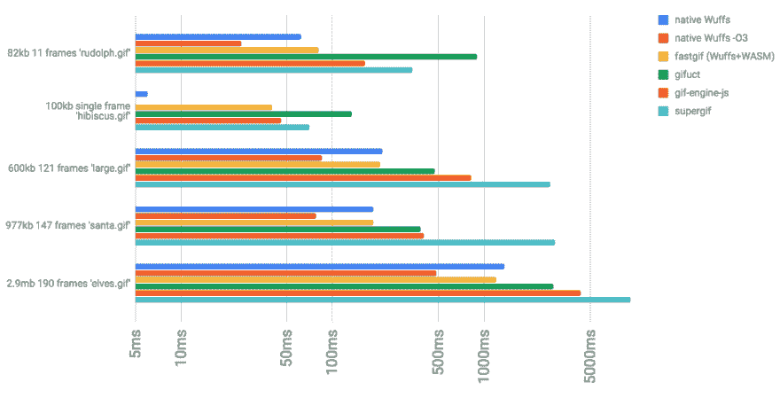
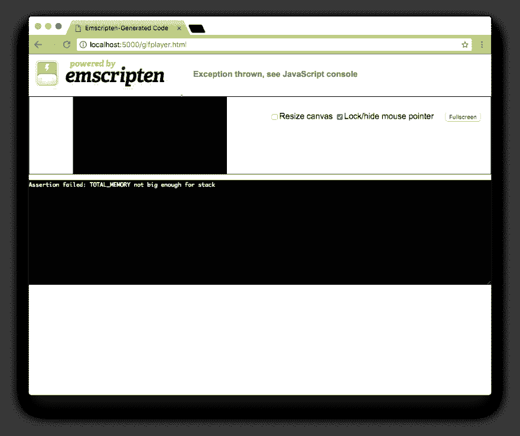
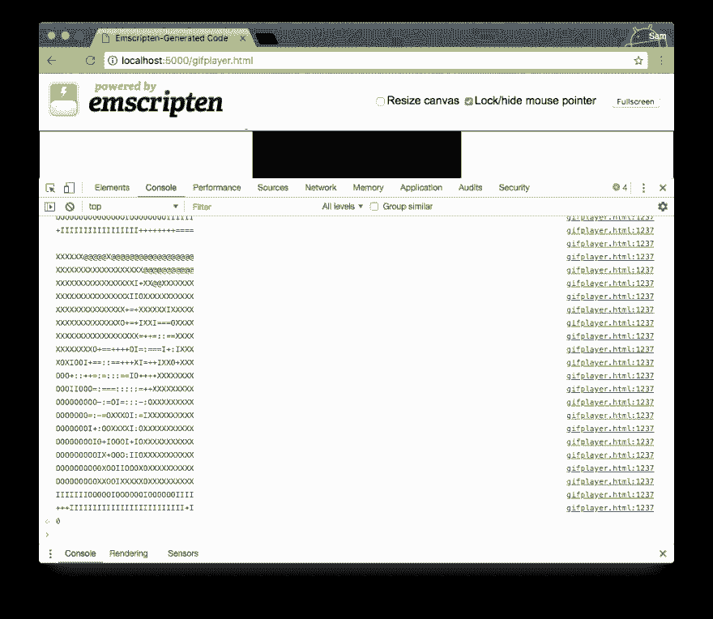
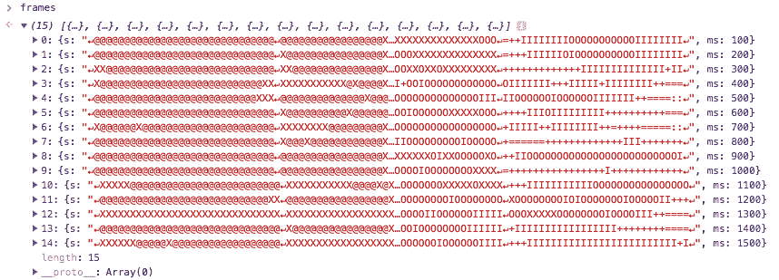

# 用 WASM + Wuffs 在网上快速解析 GIF

> 原文：<https://dev.to/chromiumdev/fast-gif-parsing-on-the-web-with-wasm--wuffs-48l4>

gif 或 JIFs 是互联网上那些奇怪的东西之一。格式慢，效率低，而且从 80 年代(！)-那时候我们还有彩色屏幕吗？

然而今天，它们无处不在。但是如果你想让*在网络上使用这种格式的*——而不仅仅是在``中显示它——最佳实践是读取 GIF 的原始字节，然后[使用 JavaScript](https://www.google.com.au/search?q=parse+gif+javascript) 解析它。

无可否认，这很深奥，但是纯 JavaScript 比用原生 C 语言编写要慢，因为只有许多低级的字节操作和工作要做。我们如何两全其美？网络大会，或 WASM。在这篇文章中，我将向您展示如何使用 WASM 在浏览器中直接解析，这比仅使用 JS 提高了大约 2 倍的速度。

为此，我们将使用 Wuffs:一个用于安全处理不可信文件格式的库。它生成现代的和*可证明*安全的 C 代码，用于处理多媒体或其他编码文件格式。你可以[在这里](https://github.com/google/wuffs)了解更多信息。

# 试玩

这里是`fastgif`，一个基于 Wuffs 和 WASM 解码 gif 的库；在右边，我们使用一个流行的只有 JS 的 GIF 库。解析 GIF 的时间是关键，现代 MacBook 上的 Wuffs 通常是纯 JS 版本的两倍。
(当然，你可能看不到如此惊人的结果，但是`fastgif`在大多数环境下更快。也可以试试别的浏览器！🤞😅)

[https://codepen.io/samthor/embed/EROaaJ?height=600&default-tab=result&embed-version=2](https://codepen.io/samthor/embed/EROaaJ?height=600&default-tab=result&embed-version=2)

## 今天带回家

如果你想在你的网站上使用`fastgif`，[点击这里](https://github.com/samthor/fastgif)查看。这个库和演示可以在所有现代的浏览器中运行:Edge、Safari、Firefox 和 Chrome。整洁！🤖📸

## 数字

[T2】](https://res.cloudinary.com/practicaldev/image/fetch/s--TBg18viE--/c_limit%2Cf_auto%2Cfl_progressive%2Cq_auto%2Cw_880/https://thepracticaldev.s3.amazonaws.com/i/mhgvwke6e2bbowewlcch.png)

注意:这是一个对数图。越小越好。

一些想法-

*   在 web 上，`fastgif`的速度几乎与 Wuffs 的本机、未优化的二进制文件(从命令行运行的 C 程序)完全相同。
*   当我们使用`-O3`来编译本机二进制文件时，它的速度大大提高了——这些优化似乎并不适用于 WASM。
*   第二个例子，只有一个帧，对于本地情况来说非常快:这暗示了移动大量的字节对网络来说是昂贵的。
*   还有一点启动/解析时间被封装在基于 web 的方法中。重复解码可能会更快。

尽管如此，`fastgif`可能是在网络上解码 gif 最快的方法。题外话:这类工作最适合主线程之外的`Worker`——但这超出了本文的范围。

## 想了解更多？

如果你想了解更多关于`fastgif`如何获得 Wuffs 并使其成为快速⚡💨对于网络，请继续阅读！

* * *

这篇文章的其余部分是写给那些:

*   对 JavaScript 有很好的理解
*   对 C 和命令行有基本的了解
*   想要将任何本地库——不一定只是 Wuffs——移植到 web 上吗

## 第零步:取脚本

虽然您可以手动或使用其他工具编写 WASM 文件，但构建 Web 程序集的主要工具链是 Emscripten。你可以按照[这里](https://kripken.github.io/emscripten-site/docs/getting_started/downloads.html)它的安装说明。

一旦你设置好了或者你想继续编码，确保为你的平台提供`emsdk_env.sh`:

```
# Linux/macOS
source ~/Desktop/path/to/emsdk/emsdk_env.sh

# Windows
C:\path\to\emsdk\emsdk_env.bat  # or .ps1 for PowerShell 
```

Enter fullscreen mode Exit fullscreen mode

Emscripten 需要设置某些版本的 Node、Clang 和其他一些环境变量。这也意味着您可以设置 Emscripten，而不用将其作为 root 用户安装，因为它不会替换您系统上的任何东西。

## 第一步:构建一个简单的演示

像许多其他原生 C 库一样，Wuffs 有一些演示应用程序——那些入口点为`int main()`的应用程序。这将从命令行读取输入，并将其输出到 shell。这与我们想在网络上做的事情并不一致，但这是一个很好的起点。

在 Wuffs 的例子中，在`example/`下面有一些例子。我开始只是试图编译 GIF 播放器，它通常输出 ASCII 艺术到终端。

```
git clone git@github.com:google/wuffs.git
cd wuffs/
source ~/Desktop/emsdk/emsdk_env.sh

# finally, compile:
emcc -s WASM=1 -o gifplayer.html example/gifplayer/gifplayer.c

# and run a quick webserver of choice:
python -m SimpleHTTPServer
serve 
```

Enter fullscreen mode Exit fullscreen mode

这将产生`gifplayer.html`、`gifplayer.js`和`gifplayer.wasm`。这是 Emscripten 提供的帮助，主要用于调试和入门——现在，如果您在浏览器中打开`http://localhost:5000/gifplayer.html`,您会看到:

[T2】](https://res.cloudinary.com/practicaldev/image/fetch/s--1H9ganVt--/c_limit%2Cf_auto%2Cfl_progressive%2Cq_auto%2Cw_880/https://thepracticaldev.s3.amazonaws.com/i/grj5ebztqsz1e8zih0a5.png)

...实际上，我们看到了一条错误消息。💥

一些快速谷歌搜索🔍后来，看起来我们需要给程序更多的内存。让我们重新编译:

```
emcc -s WASM=1 -s TOTAL_MEMORY=128MB -o gifplayer.html example/gifplayer/gifplayer.c 
```

Enter fullscreen mode Exit fullscreen mode

太好了！现在打开，我们会看到这个:

[T2】](https://res.cloudinary.com/practicaldev/image/fetch/s--oCE6L6wy--/c_limit%2Cf_auto%2Cfl_progressive%2Cq_auto%2Cw_880/https://thepracticaldev.s3.amazonaws.com/i/42cud6y82p01nhj1x2hy.png)

当您使用`scanf`或从命令行读取请求输入时，默认情况下，Emscripten 将使用 JavaScript 方法`prompt()`来请求数据。尝试粘贴一些文本——浏览器会继续提示，直到你*取消*输入，这算一个 EOF。

不幸的是，即使将原始 GIF 字节复制粘贴到这个表单中也可以..没什么。如果你这样做，并阅读浏览器的控制台，你会看到一个关于“gif 解析头失败”的消息。

所以代码正在运行-耶🎉！但是因为我们不能给它真正的字节，只能给它一个 JavaScript 字符串，所以什么都不会发生🙅。

## 第二步:发送原始字节到 GIF 解码器

由于在 C 语言中`gifplayer.c`有一个`int main()`方法，当我们启动它时，它将运行一些东西——等待输入。虽然这是一个很好的起点，但我希望能够向它传递原始字节——可能来自一个`window.fetch`或 AJAX 请求。

让我们对此进行修改。

### a .清除 main 方法

我可以打开`gifplayer.c`文件并修改它，删除`main`和`fail`方法，只需将它们注释掉:

```
/*
int fail(const char* msg) {
  ...
}

int main(int argc, char** argv) {
  ...
}
*/ 
```

Enter fullscreen mode Exit fullscreen mode

### b .用接受一个传递的缓冲区代替从输入中读取

我们把`read_stdin`方法注释掉，加一个`read_buffer`方法来代替。

```
/*
const char* read_stdin() {
  while (src_len < SRC_BUFFER_SIZE) {
    ...
  }
  return "input is too large";
}
*/

// add this method
const char* read_buffer(uint8_t *buf, size_t len) {
  src_buffer = buf;
  src_len = len;
  return NULL;
} 
```

Enter fullscreen mode Exit fullscreen mode

然而，`src_buffer`曾经是基于`SRC_BUFFER_SIZE`的固定大小的缓冲区。这限制了从命令行读取的数据量。相反，我们将接受一个指向内存中某个地方的指针。让我们更新一下`src_buffer`的声明:

```
// don't need a fixed buffer, now just a pointer
//uint8_t src_buffer[SRC_BUFFER_SIZE] = {0};
uint8_t *src_buffer;
size_t src_len = 0; 
```

Enter fullscreen mode Exit fullscreen mode

### c .重新编译并传递数据

现在，让我们直接在 JavaScript 控制台中重新编译并通过`read_buffer`方法传递数据。为了正确地向 JS 公开一个方法，我们需要在编译过程中指明它。我们还需要`play`方法来显示输出。

```
emcc -s WASM=1 -s TOTAL_MEMORY=128MB \
    -s EXPORTED_FUNCTIONS="['_read_buffer','_play']" \
    -o gifplayer.html \
    example/gifplayer/gifplayer.c 
```

Enter fullscreen mode Exit fullscreen mode

好了，现在让我们重新打开 Emscripten 窗口。什么也没有发生，控制台中也没有出现相关的错误消息——我们在`main()`中不再做任何事情。

然而，我们可以运行`Module._read_buffer`方法来加载我们的缓冲区。默认情况下，Emscripten 工具链在全局`Module`上公开这些方法。它还公开了 C 标准库——像`malloc`和`free`这样的方法。

为了测试，有几个步骤。我们需要得到图像的来源，我们需要`malloc`它一些内存，传递给`read_buffer`，然后播放它。下面的代码就是这么做的——所以**把它粘贴到 JavaScript 控制台** :

```
// the following base64 string is really long- just copy and paste this whole section
// it's the base64 encoded version of:
// https://raw.githubusercontent.com/google/wuffs/master/test/data/muybridge.gif

const testGifB64 = "R0lGODlhHgAUAIcAAAAAAAEBAQICAgMDAwQEBAUFBQYGBgcHBwgICAkJCQoKCgsLCwwMDA0NDQ4ODg8PDxAQEBERERISEhMTExQUFBUVFRYWFhcXFxgYGBkZGRoaGhsbGxwcHB0dHR4eHh8fHyAgICEhISIiIiMjIyQkJCUlJSYmJicnJygoKCkpKSoqKisrKywsLC0tLS4uLi8vLzAwMDExMTIyMjMzMzQ0NDU1NTY2Njc3Nzg4ODk5OTo6Ojs7Ozw8PD09PT4+Pj8/P0BAQEFBQUJCQkNDQ0REREVFRUZGRkdHR0hISElJSUpKSktLS0xMTE1NTU5OTk9PT1BQUFFRUVJSUlNTU1RUVFVVVVZWVldXV1hYWFlZWVpaWltbW1xcXF1dXV5eXl9fX2BgYGFhYWJiYmNjY2RkZGVlZWZmZmdnZ2hoaGlpaWpqamtra2xsbG1tbW5ubm9vb3BwcHFxcXJycnNzc3R0dHV1dXZ2dnd3d3h4eHl5eXp6ent7e3x8fH19fX5+fn9/f4CAgIGBgYKCgoODg4SEhIWFhYaGhoeHh4iIiImJiYqKiouLi4yMjI2NjY6Ojo+Pj5CQkJGRkZKSkpOTk5SUlJWVlZaWlpeXl5iYmJmZmZqampubm5ycnJ2dnZ6enp+fn6CgoKGhoaKioqOjo6SkpKWlpaampqenp6ioqKmpqaqqqqurq6ysrK2tra6urq+vr7CwsLGxsbKysrOzs7S0tLW1tba2tre3t7i4uLm5ubq6uru7u7y8vL29vb6+vr+/v8DAwMHBwcLCwsPDw8TExMXFxcbGxsfHx8jIyMnJycrKysvLy8zMzM3Nzc7Ozs/Pz9DQ0NHR0dLS0tPT09TU1NXV1dbW1tfX19jY2NnZ2dra2tvb29zc3N3d3d7e3t/f3+Dg4OHh4eLi4uPj4+Tk5OXl5ebm5ufn5+jo6Onp6erq6uvr6+zs7O3t7e7u7u/v7/Dw8PHx8fLy8vPz8/T09PX19fb29vf39/j4+Pn5+fr6+vv7+/z8/P39/f7+/v///yH/C05FVFNDQVBFMi4wAwEAAAAh+QQECgAAACwAAAAAHgAUAAAI/+UEmjt3Dl1BhOjSpUOnUN06dQshqlPX0Bw4jOHEjSNHbtzHjuXMlSN3DZs5c+QECuT4UZu3b94yhqNJc+NHcIcGfazZkya2bdy6dcP47Ru4cBiRfhMVJ1jRbtZgHsWITdu2od2mygRntJsiJ4jIdW22yc2uoUa9UTOZTdvVbUG5zd0mTA4UP7myxZqjg4iQXdq4bdNWzRo2bNniXs0mbNgyasu2gTsmxU2TIDxs6IjSLO42w9ee7WK2LNquNitc1Fixw8yuXWOYNImi5pcmJHGsarNmMlSKFFXI1MnB4keSKGHQyKGmiNAZO87GhdM2a7A2aoZpkRnGjVqeFzGGtP84kaNGGlRv1GxxJO6ouHDbsmHLbk1wTG7EmJhQ8WLIiRNmOMEFLO6AqRtuvOlGm2uuqS8boebyZhcaXkiEG1SsWEGGFXy4JZwFrWrwmmqmoeYwt+LCpYtkxFAGHHHECYYFFkQJ5xtuGBzRsGimQfEzakrhJAmhjhqGDFoq+aYb+UwaEZtoTkQMrsmeKQSTT6jhhg5nxLGFmcGyyeaa+RDrsZoG3XpLpmNoaWSPSy4ppZRbctSmzPkajEYaNK1RUzCYwPFGGm2o+oaw+ayxpj5roPHRmmrUVKwbrwD1RkH5EiXxxGpouUWXX3whhplmkhmGmGWWAQaYYpZpphlkllEx5plmjFGGGF10uQULNdoAZJBFKInkkUs2QcWVWVZZpRRYWFGFlFA40UQSRQCxFpCAAAAh+QQECgAAACwAAAAAHgAUAAAI/+PKmTt3Dl06hOgKoiOYEGE6dOoeqouI7lu4ceLIDSRYjhy5jOE+Gks1DmRGkB5BbvsGDly4cOLGZRQX7pu3bt62JRrjDVzLb9+6vfx5bZu2bdy65Qy6dFs2a8XczGnWbdu2atCwaVPajZs1bWG5el3K7em1X0hmiDGbLdmdJpaqXQ1bLZu2bHe57eUWFpu1ZbAwcaJkqxCXFjBaULoWNpu0atasXcOWN9uzVq5o4YpVDByxI0+KxEiRgoULXFu1QZtGTdkuYcaixboyY0iPFzl4pHrmR0mYJnCIqXJipVnYaNSmsVlRxEoiND5m7OjxZEoXPtIM9UkzRpg3m7Aaa/9LTq3Vo2mA79CwUQPHCxgytizagkZMInDcvN3Uhg3bs2mkoaYybK4RBowYYIhhBhhYiOEEF4rAIhpusLlqm7+sYSaa5P6qhppruJmkBiOkmcQHFVx4AYdVutGmGseukUyZZpyZ5kMcp0FDFSp84maWE4Z4wRe/8soQsGegEVC5G4H5AxMtcMmGm2qS6CaaU1SBirICr7lmmWfClGbMMa3pRhpM4oBkmmAw8cabY2jJ0MsukWHGmWeiGROaaKapzBtcFglDkWGw6UUUbaypRkbJqqmGGGXuzBOaJJOzC6ldhunmmEKvycpRR6mhZphklmmmGT2jgUZJaibzMy8vPZ1PphnlRA1QlVl2ASYYW3D5xRZdhhEGGFpo+cUYZIwh5phinBEGmWWSUZYYJdK4g49ECDEEkkk2AcWTUlqJhZRUXFkllVNI8YQwTzYhjJGAAAAh+QQECgAAACwAAAAAHgAUAAAI/9++mUOnTh26de7WqWv3rqE7du8kMoQXr6I7eO/cXcMWjly5cuPKpUNH0CA7dum63Uo3bt3DdyjZqYNWbRu3b968gRtHLtw4c+ZIkvMkpOM5dezWLUSH7pwzadi0bbu57Rs4cOHEkTOXbRCXXefCEVyXTl26c2mfRavGEVu2bd3ACQRHbhqXGEq8nfO27RaqXOjSBS3nDJq0aRzhygWnE1wyT4ISfRp2qAgMKFJ2lSxHrpmyZs+kUWs7ddiwYst4qYpm7MUVGChOzBjypFpnz8yaJYulSxi1Y246lFgRIoULTLSWrBiSwgksRUECbS237JkzNxs+iBhjxQUJGjKKHP+hcodXFjhTsNBqaYzOtc7JnDFDxeOVLVuAVKhI0QKFjB6mCGSLLJzo45ym0kmHHAaNOcY6ZNzaJYgVSoDhBBRmgMGDFHKQIhlzzgnxHAbHOSYZZZSpZhrStMFmERZiiKUMEkbgcAVGQMKNHHF61I0ZZ6KRJhpqrulGnDFi0KYcalQRooQQtpDFG3LGsTKcuZoJDZppWKymmmyeeUEHXrL5hRtRLhnHGl9UwRIrunQj0hqO2rJmm2nssGMPWHipphBxwoHmGHEEEsibbgwjjc5rurwmm6ssgaUXWFDZ5BtuWrmmsW6+6aabbZRxZi3SrqGGGmuw4QYccU7JBCdxuolyBpZwPOWGG6pCZYYZLk+dRppqrIGLTmB24aYbbZ6Ry5tbt9HmWU46keQSWGa5ZZdcdOFFF1tQkaUYYHwhRphYiHEmmWOOMYaYYYgBg4wz0iBDjTXUcGONNvLwYxFLJGnEEEQGYaSSTCx5JJFB+jiEkYAAACH5BAQKAAAALAAAAAAeABQAAAj/38KBCyfOYMFx4saNI1eOHDlxDx8qDLcQ3DdvGbt1w+iNWzdv3y4SBAeOGq9vIrttY6kNG7ZsLLNl01YzG8xt3D5u7OYJhzJt3LBZo1aU2rRpMK8pHWrtGs2a26ZREvNJ29Nr0p5JkwbNa82XQ69Vo1YtGzeW0dzcMLMtW7VrzXixghbNbjSw16xVI1v2WktlmNiUSRWME5kVJVScqhsNWt5rRclOswbT2jFj2H4JOXNDiJEULGQUK0st7LXI046yKtNljBY4XWy54nIjSZEngpaIMHSUGuprwrQ4ucLIjwwTSoo4sTKlELM5cLh06ZSNmSIYwlSjrhasyaFaqiit/wiBg0cKIl/8rIpTx0kabW65CTsqrey0aL74UkPlQQSGFFBAgQchblDCiS1a0eYtmKaRBilqvHKQK2kmKUEEF9gYYQQXTmgiiDR8g0aaaJxpxhm7nHHmGRVXhCYTE1CwyxZLqshhiCcYmUWaZphxZplllOlxGWaYaYZIIKNJwwZijnLwFDaI4cWRW4BMJhlllnnmGWaIPJKZLJ3Zow4+/qgEmUagMSyaZ0RxhhlksEQGmmeCVOZOZZA5JplKPoHGmV4YCUYRV7aSZhNohgTSKziVSQaZZTA75hlEggHzmWT2o5OVEodMphlQHdXzmGKIKcbROixtZpgJvWqGzlGP8UzFl1t62YWXXW6xBRZaYIHFET1kgeWTW2qhpRZbeOFlFlVUQSUVUSSphBNKHjEEkD78yCOQRCRBhJA/HHmkEkkSOaQRRfRQowsvsggIACH5BAQKAAAALAAAAAAeABQAAAj/5s6dQ0cQXcGD6RSaU6fwYEFz5ciNE9ctG7Zw4sZt3Khxo0Ry3MiRC7eLWzhw37px25atWjRo3r6Bo/ntm0ybNMFhsymsAquV2a5dq0btWTNm3bwt9dZtJTduSm9i47YKCZ9r2oZaKyrNGbNl25w6lek0alNv1BRdoJGs2zZs1qQli+YVbNSxTbnpdbpNGqouefZYU5bJDY8XfaI5a9YM79ixUKNmi6YMHLctZCwwWIBgwIFZ0J492yZZmzao25pRKsRoESZArmIJ2VCCgYYYNAbcEU0a6rQqPqY44lSkBA0bOJI0KfMsjJYeHaooS8YFhDBmzFhyyzblUjFSpmh0/7jRYgaNKnhiOZHyYkWxpd0A8VoW9vQ2a+CawuoAQkQMDzyAIYgMfDjBhjy82UasbqDJ7ppsstFmLG2qacKDDVawYoQQSIgABhgyuCUba6zB5ppmlknGGggl3OY0bVRZwYgagJHmF1IMgcEEGvQIZpppqJlGGWWOqWaoa7CJUJtspBGiFUZEycapb7ZZ5hY87ADEGWicQQaZYqph8cQls6GEj214EcOZBaEqsZRsfgGly2SSQaZEE5VkEps0mnGKmUg6gabCUjJh8RpTZmEGmWPCFHOoi04kBRpuUKsGGUeMUZK7oqrBRBljhhGGGmrEfFTMZlTBBptqklGyKBa5klImmmeOAcYXX4ARps5lFk1mmGMcSUUYWkbxhZdbatlFF150qUWWWErR5JJLJqHElFJQKYWUUjwpJZdXTCEFlU48yUQSRxxhxA84upAiiCB2sCEgACH5BAQKAAAALAAAAAAeABQAAAj/48oNNGfu3MFz5sahY5jO4UN16tJFlJgOnTdx4sJl5KixG7ly5MaJlEUNJDmUA0OO2/YN3DeYLsG9zAYunE1wyVCMCnfT5TdvM79xExoTKNBtQr21UmIoW8xu3bZl8+atm7aoWbtx47oNW9Vuj0jIOAVuGzdt1KxBs6aNW7dsXLlGRTs1rtRZbkBFGfbMWKEpZWzY0rbN69u3W7cVtnbNMLZdLi3l4GKCRYwUJbZg06bNMbdt1651xkZNVSZTqVRtCtXLSxEdRHzwePJixa3Ojrc9CzIiyJ9JSVCcMIFCRo8qyvbYsQLECSxriW4k6mwtW7ZrTTLRAvVJxAcaLHbI/0jyhlaXGUOAiConkJSXttY5YwO3tRGFDyhMeODAgkgJF4SQ4QeMbBLnm8WqwQYbqqTKZpIMPAghBzZQEOFCHIawIY1wwLJJG2yiaQybx6wpRQMQXiBjnG6MeWUTRJIgoocwiulsm25Ei4aaazjLxhppDGlhFVWycEmckUYyJxkwMLnGGs6sqWYa667TJhs+rCiGHGSogKmnnjICxxNRNIEyG2yuoYbB67AbwxpxwLlGjGS8kcmmcGJxRpxiJOGsxzXTZPORqqbS5hBhuKlqUWZe8kYZR6bBxpppREsTTUjO2mYacLJp5BXQzlJUMc+oUYuXYpIZRpljimlkFV+IkT4Fl1JYQSQXXnrhBZdehhlGGGCC8WUXXMjAQw4/ECHkEFAkQWSRSSbZxJJKCvFjDz/sqCOPO+IogwwutrAiIAAh+QQECgAAACwAAAAAHgAUAAAI/9/CiQs3UFy3ceTIlTPX0OG5c+giQjznkNw2bt0yevuWDRy4guLEjUvoTRa4cikVkiNIEBu2bNm2YbzWzZu3bt8+Frz149g4kQXDfbvpzZq1a9eyadNWjVvGjeC8qdICiuBHot64Ydx2tFo1azCpxWS6rds2RiN64AqHU6O2bUtnfv169Nq0pDCZVhOlhNSVXdqgbbLSZQ8rbHPBWquLF2nMbNGWecvmycOZCB9KcIBQhNpcamCZRasGrVo0XLF+8fKV6dinLkFeiHBh4kIFCqyyXaM2jVqsERxcgAk05AUNEx0ydJhjDQuWJR5sWDrmZkIimNV64/rCCtcwOC42dP8AkeHBg0HOWJTQcEJTwWx4jljL1luatGrYrP2qICHDBwwwmACBDFwQYYQMVogGp2+i+UWbbKrxbRrtpmlFwAxQkEOKDzIAoYfNPCBjmqVyAgdCaqSJBppoVixFAw8wQMEZcKj5ZRVOHgEkCAuyYIOaxLjRBhtqUnwGmmd6kcIOY1BghCm3ivImk0AowW8xa3yrRkVhhhBFm2BUSOYouGbK5qVsGLGjxfvuC623aBDJZRprGnEkwmrOxOYaCSm8hgxenjmSRRVVrCUUaZCZRphJJKTmGmtSdMYZaO7bRRFblJm0GWgofcaPI4/BL5RdpDEtxWaWaeYZaR6NppJWnGlNpplffPElmFhkeYUWXGzRxQtGWLklllhaecWVVmTpJRdecpGFFVZa+WOQQgZZ5BA9pmXEEk0UCQSRQOBAA4sw3oAjjS60WMIIIHzoISAAIfkEBAoAAAAsAAAAAB4AFAAACP/hxpEjWM6cuXPo0KlTx87hOoft3E10B88ivHfvvIHj+I1jOHHjyhlUiO4cN2Dp0kFkJ7FlO3bbtmmbSbObN4/gxJUjOM7UEnDmVKpcx1ClNWvVsCG9to3bTZwgw7EioosnuXMIEWY9dw0pUqXZtnX75o3st0wkdggbJy5kwZEHsV3zOo1atWvYaD7tFo2Qj1xyaH1b5onNGVm/Cia9Vk1aNLt5s+21y43brSJZZjRxsoOFGYHipo1OlisXL2TSnhUL5swZslbW9rQJo8RKlyUrbvwYppPatGiYJky4YARPixAoSKQQ0cLTLy1r3jC5MuqaoxuiwoX7HU0XHlvKmjn/CbEhw4kZNm6MSvVDSI0morJ+Q5RHZzXH1LJZk2bKAoYPKsiAgwxMgEEIHGb44YdpyDEIG2C2S2oaaaiJZpk+MNiAhCg2GQOEEDpgwYYabpCjm3EGGokjah6DBhpmfvnBAw5EQAaccLRJBhZNVqlFiirWiESaFMcB6bFmnGlGlickWUOGWrrZ6yaQyEnmEXK8WUUncL4J5xlonFlmmCdkeYMMZLrZjy69bvpmHEquAUeYaL4pizBmlkHGD1+USUOauaq5ixqksJmsr1K4mQYYyyxTRhlc/IDlGGMaARMaMCmUxi5r6OqGFmmgOUYbbAw95phTfilmGGIo6VMZZmB8WkaaTfHLyxpNriE1r2tA2eSRQjz5pJNEqsBEFFFIWUSTU2ihpRZbctEll1M+waWWWGR5JQwvsPhiCiuwMIOOMdA4gw48+PCjjzzssCOQQAjxo4412oAjjjoCAgAh+QQECgAAACwAAAAAHgAUAAAI/+EEhhNXsOA4hOPILWSIkFzCceLCgaNYseJAggYLNkOmsaDAbyG9eQsZ0iI4jAIZ5UkpENzIbt1GljT5jeJEcN9KgSl2Eee3mNxkkqRZ0iKnEkaEmawYMubTkVGlEp0mpwcsJ6W2oarDZMkqYd24jYU6deY3odm0tbKxw8OKEx4a4BlLthsyYsuOKaPG7Fcxa9iiBfPWB9CYFiqe3HhQYQSzbdvqcspgAgegQzJY3CihAsWOXM/m0OGT40qkZXogwNKmjWyyVNe4RcOxwUOGEDmGRPmVKsiQDVEeUcS2J1FryTJLvtKAAoSFDBgw1DjixIeLEiGIlaRWbJs2yUKjLuvqgGNFnkxiNmBoUWIGEA81qHlTzi1yXaHdaLXwIKQnSmuIWcWTVGiQI4wugHkqMvDue4YLEFCwpJqTLCqjG3CaAQWSsbTJJptt1OqlklLSUKYkoorqRCRvpHHluw+zCaYTV7ixJBuZnhoqqm4ueWqsYnTB5prA1NpmGVbwUxK/W8ZicJthqMHGmms+1CYWYhhsMDIuv7MlGvA8/LAaMnf5hRlnkpllmGSMSWYZY5QJxphglklGmF0+GYYYXm6BpZZegPFlDz0UkSSUV04hRRRRVrGFF1xiceWVVmKpRZdbaqllllZYOaWUTgICACH5BAQKAAAALAAAAAAeABQAAAj/5gSaK1dQ4DmE6NItVJdOnbp169hNZNduYjty5MaNEzcuIzmDCc+hC6YMncKHENc9XKdRXLhw4mSKyxjyXDk3lBIydMhwJjhw4cDN9GhwnKU+1UKeVMhUptCgMGHK1Bhu0I8ryYqWMzcO4cGXQMF9IwtUqrhjdLjESgLrGyQoVrKAYlbwHNBvY71160Y2L8xq3rxtw1RjTg0jRHiskAPSnGBvsXT5auWqlqpRsIoJwyXLG55CWXIIiZKEBpAiyLh+E2xGBJYiqtrIuNFjBgkZSoIhCwRIDZI2iYQdMnJqnDm/vZSB4/YqRgsaIFQgiXKm2CgmUaCoiWQOnbZEfcgh/ycLk6whFzJGhDBxooSRK1WUDMGR5Ns579uOmbvL2hvrbZqgQYZCVtmEihRSEGKIL5yo4QuQuPqqHLL2oiYTOUogg5RxYhpHml8+6SMKTQ5BYpiiCAKJr22A+eONGXCBCbJvYhJnFFwKUoaMZDzUiBxsQiFkFGLCaIa1brjZRhtuuvmvEaKy8eMYqmTahhtuoEEEGyy38TKbbLzsxhlVoIrpG1eCoUkmMI+5Y5ptstEGzGyuwQYbbbbRZRoapcJFFGJguoYXUaap8xprrlHUmkTvvOTKvQQryxttgpqFFFpW2QUXW3LBpZdbaBFFFVZwqcWTW2aJxRVXbPnll2GKMShmGC7EOKMNNtyQgw485lAjVznksIOPQva4gw825qBjDjjeaMONOQICACH5BAQKAAAALAAAAAAeABQAAAj/37558/YtHLhw4sSNG0eOIUNyEcmVM3euIrpzFrlt3NatoECB4ESC+wYOWbKE4iI2LDeRXDZtMWNu49bNozebHrsRguSNZDig4xQytHbtGjaj2LRto8l0KbZNgZTdLGkQ6EFqWatpvZbNa8xs1gYZIaOMKTeC20aKjCZN2rRqcY9iw5bN6DA/WEhh+YUtFBczezQhK+gtWjRo0ahN42r0mjVn1bBZe4QkU5QyUmrEEHQT2mdWrm6VIuWJ0iJKqFphClWNUaQoRq6MYZIiCJFlOKM9e1aGRA0pk+LsuEFkh4wkVEQle2SpEBVEhJQ9wtFqI+JovYRJQ9YpxYgTHkoU/6myRxYpJ0qk5BnETVy3UIZofn4Gd5q0PylogCBhIsSKIXpAgggdYoCjsHC8uWajZ6B5RhpqeqFlCxlgUOMWVupIoYQdcrCCiBf88AgtnDZyxkFomJGChRS6SMQZbjrCBplSeECjEioEaWqjbmJs5plmmImkBkKEiTEbumDSZpNMNpIGjl+0gckpbZiJ5RNMDFHmscessaaaonIZhRuZoPlDMpiy2aZKZAIxJav7GMsqq2gqOcqxbIYZxZokvVqGmQY/+8wttw4jBZov4wJTm158KWquZf5sphlnKuUNRWRemWZTaraqxqhPknn0mlZOkWUWXHLZhRdfesHFll1kwTfFF19uqUUXYpD5ERpWmKnUmTnk+IOQQxgxRJFEIIEEk042ISUUVlSJhRZbbLnllmpjiQWWWAICACH5BAQKAAAALAAAAAAeABQAAAj/4sYNHCiQ3EFy5cqRIzhOXDiBDsNN9MYN4sRw4MBBFBfR4UNo0MJ9+zYRHMlu3CxmJOmtm7eNG02C82ZoUEVu31xu25bt2rWNOrul5OZN57eTJ1ep6cUtG89t2rJZmzaNmkahRId6M6rz0g8017hh03ZN2jVk0qRFi0by21CV21Ru9YYMTpNFgKIZi4TlSqYwz6xO04mTG9S5Q6lZs/ZN0ppHOnzEMAEjk1VqXLttU7YNWzJcojBpYkVrVKZqn9gU4QHlyIwYOIIwgxYN7rAwdLi40fSmyhYoTqpocfQMEJ4yUtSksqZnRam1cZWVqoVM15EdQWyseEKFNy0nVtg0/ynVTdu2SY/YZpNKVmq1IFmaxLih4sSPF0RY9Lihp2y1arCxprZrsLmGsWtaQQWIH34wBZhFhCDhhBtuOGEF5qiZJpoNnYGmmgOpqQaWJGh4oQrUsOHpmVRYsIEGK9aKBhpmnmlGGWcYg2YaUiixpJhmrNFwMcZOQQOaVuyYBppmmFlGGWSOUUbIWCbRxRpV1GKLLWqk8eUOatAKJBq1nnFGGWWSQcaan66hZhRcomnGw7WkCeaPaA68Jo9prKmmKhqZmbIaPwejcRlmignFkVv8BPCaS5ihRkQNbWTmT7VCisZMZjqd9FMAqwmGlkdDlIZJYHIxRphgdtmFF11ooT3lFVVMScUVVljJBZdAStHFl15okWWVU4xxhRRYXkEllVNA+UQUTlBZpRRSRhmFFE5AOTaUUCAZBA857AgIACH5BAQKAAAALAAAAAAeABQAAAj/3QQO7MaN2zaEB7Vt03Ytm7aH2bBdq0ZtmjRp2jRm48jx2jVrH69NvEaMmUiKFqNBe/Zs5EuR1SpSqyhz2ptDMy1KW/nMmTNrQWUGpVYUo7Rp1KJJQnNr2sWeLJ0xY1ZUZlGLT59Gi/ZMz4020TB2fcbLJ7Nlyixe1XrxKc9aXabgdKZrUhdEUlwtQ3asWNKiWo8i5alsGbNmbfwEKmGiggYhwY4ZM6YVWrNp0YapklTo0KVOjSw1UxQmCQ4iKFawGNGI8l+Mt94YuvIm0p0pVLhYIdMFkzFJabpEmXMsGJgau4wV4xrN1iJMwFgZwfKkhgsxXPCwciWnUZEiuaRB/4NGSlgxYiyhRXsbrQyZLzhqeFCxAwYRHTeMnFrZLK2wYIBxpqVnWILklDuS+MGSYjC5QgMWitDggzd8aoaZZIwBBphfmmnmJ2dcsWSNPs7ARJoCo+klkhZCuMOXC9NChphffOnlsAuV6eQZUJ5ZaSq0msFkBzSgQUuZZJApRhheeNnFQ2eCkcSYsmrxSRlglFHmmDFS4cS/ZJDMMJgmefnwGWTIe6aWXJxpJplZGOlEj1xImQWtMJFJ5phhfGnyTPWcKcaZZQo1DBktRwEmyST70rAXXnpRUyo3j9QSGcqOqeQXZPqarJhigqmxF1902VPPyYjZZRVTREnllFVO8TYkkVZeaWWWWFr5RBFEDkFEF1l8GYaYYIrtJRddarHFFlVM4YSVV04pRRNIEumjjSm4uEKKgAAAIfkEBAoAAAAsAAAAAB4AFAAACP/jypkjiO6cQXTp0qlbh65dO3fv3kWEB88dRIntvokLF07cx3EfyQ00Nw4dOmvT1qljuDLdyZfcvoEDNzPct47ixo0ER47coT7mzp0zh84cOYHlyGHbxq1pN6jevNHE6a1bJTnCdnIMCY5jx2rZsmHLpq2p1G5WvV3rI4TLNXAdpdby9s1qt2jW9Fq7dq3stm1mt91qcyWOH23TZE254+KUNrLaoFHba63aNbJjyzKjVnaMnj45XHRQoeIXtmvWmkWbFg2atGnNYDnCE+iRJEGXqkH6kgNJkhlYvJyos3cZs2ihQIki9EcOGSVBsFwx0yXRNDtdwjBRk+1apR+7+iL/S8aMDw4to94QmQLFBgwrXN6IAmZnkBAjx+yCC2u5GLFjhCFGGmiSeSIJKnToYQQbjvDBiCK8sIIXbrSxcJtqpJGmGGOOYeYZZ1ZJRY8YhOhDmUwWTIGHE1wwZRts9KqmNWeaEUZAY5JZppAnbOCijmCmuYYaXwjJoQZEpLmmGmoIZEYZZJAB5pdefhmmmEty4cOZaJppBkRqYsECGmymgeaZZpRZRplihAmGF15w2QWYYDQJRhhFjEGGGE2KaYYMUqiJ5hlmkkHmGGOKeZOXW3S5xRZeYhEEGGM6uSXKYQQhBAZkQFzmGEOPCaaXXXTRJZZZaKkll1l+CSaYU4a5dZJDRH5Jc5k9hyEmmF1uweXXWnyVExhibjSGGGOOZUWTZ5ZxNtQ2edFll19HCYUVVlRhJZVRRjHFlFJSYcUVRFYxRRVtV2GFFE8ygaQQQxrRIxFDFkGkkUskYcSSSii5JBJKMkGEkD7+4MNgNtAoo4ssstAiIAAh+QQECgAAACwAAAAAHgAUAAAI/96+DRwYTtxBcd4OjhtHrtzDh+YkTpSILdtFbdq2devGjZs1byEHVmMWziRClOKoVbNW7dpLiy+hZcuYEVMcbt/AgSPYM9ozaNGkTZO2khq1ZtVYTrsUqJZHbh2hcuzGjFmzZs+ARuMKLVnQZXmMjGFmDdtZYZtoatyW7BgyZFadXX3G7FhWXXykkBEUDdonJEGQqKqG0RixYsSMJUuG7O0xY8qaCUv2jNgVPG2Q9GAxRIixtcSGDRM2LLEwVXymUHHDhs2fX5uo6GCiREmlOzoAXbs47BcwS6lQIcJzhUmOGUKkhAGDZpmgLnfkfMLmbNWbZmd/+eLFRoWNPmqE/P9w4kNGDyNWBunSgwYMHGrWrmnLZq0lr124JDlqxZ2LiSeUACKEGmaY4QYjwJDjmGmEUsqoW2yRxZZcdLHlllA4OCGIWziZIoQTeujAB1eggeYZoaahZpppYpHFRVxsmYUKEjzoApZklnGmF0poCOIRZ5pxJkgUu2qlFVlkmSXJS8oYwRZfSivmGEpSkOWZZZJRRstmmHHmGWdYaeWVV5KkRZdGUrmjE158OeUROSRBBZlijDHmsWOUYWYZVFTx0xUlbaHlEmL+oGUXUH645BFSihkGscPe0jKZU0pBJRVVXInFllR2ASYWWhihxJdddgnmt2CAAebRYR5DhZRUXHFhZRYKfwkmmF5K2YQ0O30DJpg64ZoSrkwouUQSSyzRRJRSYLHFlUZYUSWVWEfxhJRVUGEFlVE4+cQTT+ZoQw9ACmkEEkk08eQTTiaxpBFHMKFEk0gSQUSRRR5RJBBA/AgkIAA7";
const buf = Uint8Array.from(atob(testGifB64), (c) => c.charCodeAt(0));
const at = Module._malloc(buf.length);
Module.HEAP8.set(buf, at);
Module._read_buffer(at, buf.length);
Module._play(); 
```

Enter fullscreen mode Exit fullscreen mode

运气好的话，你应该会看到一个解码的，移动的 ASCII 艺术马🐎💨在您的主机上玩:

[T2】](https://res.cloudinary.com/practicaldev/image/fetch/s--kbraQJU0--/c_limit%2Cf_auto%2Cfl_progressive%2Cq_auto%2Cw_880/https://thepracticaldev.s3.amazonaws.com/i/tvooq4nem16st0b32nep.png)

恭喜你。此时，我奖励自己一个甜甜圈。你也应该这样做。🍩

## 第三步:不显示到屏幕

现在，我们只是在控制台上播放 ASCII 图片。Emscripten 甚至用一个*忙循环*实现了`usleep`方法:GIF 播放器在帧之间暂停，实际上只是循环阻止浏览器继续运行。呸！

与其这样，不如让我们来看看实际的框架。首先，在`play()`方法中，注释掉任何与睡眠和显示到屏幕上的内容:

```
#ifdef _POSIX_TIMERS
    /*
    if (started) {
      ...
    }
    */
#endif 
    //ignore_return_value(write(stdout_fd, print_buffer, n)); 
```

Enter fullscreen mode Exit fullscreen mode

现在，我们想使用`EM_ASM_`宏，它允许我们在 C 代码内部调用 JavaScript 内联。这纯粹是魔术，它接受宏内部的字符串，并将其放入 Emscripten 的输出 JS helper。所以剩下的方法现在应该是:

```
 // .. continued from above

    cumulative_delay_micros +=
        (1000 * wuffs_base__image_buffer__duration(&ib)) /
        WUFFS_BASE__FLICKS_PER_MILLISECOND;

    // .. add this bit
    EM_ASM_({
      onframe($0, $1, $2);
    }, print_buffer, n, cumulative_delay_micros);

    // TODO: should a zero duration mean to show this frame forever?
  }
  return NULL;
} 
```

Enter fullscreen mode Exit fullscreen mode

最后，一定要在文件的顶部添加 Emscripten 头文件，因为现在我们正在使用新的宏:

```
#include <emscripten.h> 
```

Enter fullscreen mode Exit fullscreen mode

您现在可以使用与之前相同的命令重新编译:

```
emcc -s WASM=1 -s TOTAL_MEMORY=128MB \
    -s EXPORTED_FUNCTIONS="['_read_buffer','_play']" \
    -o gifplayer.html \
    example/gifplayer/gifplayer.c 
```

Enter fullscreen mode Exit fullscreen mode

并重新加载页面。现在，再次运行我们的助手 blob，但是这次提供一个`onframe`方法:

```
const frames = [];
const decoder = new TextDecoder();
function onframe(buf, len, micros) {
  const s = decoder.decode(Module.HEAP8.slice(buf, buf + len));
  frames.push({s, ms: micros / 1000});
}

const testGifB64 = "R0lGODlhHgAUAIcAAAAAAAEBAQICAgMDAwQEBAUFBQYGBgcHBwgICAkJCQoKCgsLCwwMDA0NDQ4ODg8PDxAQEBERERISEhMTExQUFBUVFRYWFhcXFxgYGBkZGRoaGhsbGxwcHB0dHR4eHh8fHyAgICEhISIiIiMjIyQkJCUlJSYmJicnJygoKCkpKSoqKisrKywsLC0tLS4uLi8vLzAwMDExMTIyMjMzMzQ0NDU1NTY2Njc3Nzg4ODk5OTo6Ojs7Ozw8PD09PT4+Pj8/P0BAQEFBQUJCQkNDQ0REREVFRUZGRkdHR0hISElJSUpKSktLS0xMTE1NTU5OTk9PT1BQUFFRUVJSUlNTU1RUVFVVVVZWVldXV1hYWFlZWVpaWltbW1xcXF1dXV5eXl9fX2BgYGFhYWJiYmNjY2RkZGVlZWZmZmdnZ2hoaGlpaWpqamtra2xsbG1tbW5ubm9vb3BwcHFxcXJycnNzc3R0dHV1dXZ2dnd3d3h4eHl5eXp6ent7e3x8fH19fX5+fn9/f4CAgIGBgYKCgoODg4SEhIWFhYaGhoeHh4iIiImJiYqKiouLi4yMjI2NjY6Ojo+Pj5CQkJGRkZKSkpOTk5SUlJWVlZaWlpeXl5iYmJmZmZqampubm5ycnJ2dnZ6enp+fn6CgoKGhoaKioqOjo6SkpKWlpaampqenp6ioqKmpqaqqqqurq6ysrK2tra6urq+vr7CwsLGxsbKysrOzs7S0tLW1tba2tre3t7i4uLm5ubq6uru7u7y8vL29vb6+vr+/v8DAwMHBwcLCwsPDw8TExMXFxcbGxsfHx8jIyMnJycrKysvLy8zMzM3Nzc7Ozs/Pz9DQ0NHR0dLS0tPT09TU1NXV1dbW1tfX19jY2NnZ2dra2tvb29zc3N3d3d7e3t/f3+Dg4OHh4eLi4uPj4+Tk5OXl5ebm5ufn5+jo6Onp6erq6uvr6+zs7O3t7e7u7u/v7/Dw8PHx8fLy8vPz8/T09PX19fb29vf39/j4+Pn5+fr6+vv7+/z8/P39/f7+/v///yH/C05FVFNDQVBFMi4wAwEAAAAh+QQECgAAACwAAAAAHgAUAAAI/+UEmjt3Dl1BhOjSpUOnUN06dQshqlPX0Bw4jOHEjSNHbtzHjuXMlSN3DZs5c+QECuT4UZu3b94yhqNJc+NHcIcGfazZkya2bdy6dcP47Ru4cBiRfhMVJ1jRbtZgHsWITdu2od2mygRntJsiJ4jIdW22yc2uoUa9UTOZTdvVbUG5zd0mTA4UP7myxZqjg4iQXdq4bdNWzRo2bNniXs0mbNgyasu2gTsmxU2TIDxs6IjSLO42w9ee7WK2LNquNitc1Fixw8yuXWOYNImi5pcmJHGsarNmMlSKFFXI1MnB4keSKGHQyKGmiNAZO87GhdM2a7A2aoZpkRnGjVqeFzGGtP84kaNGGlRv1GxxJO6ouHDbsmHLbk1wTG7EmJhQ8WLIiRNmOMEFLO6AqRtuvOlGm2uuqS8boebyZhcaXkiEG1SsWEGGFXy4JZwFrWrwmmqmoeYwt+LCpYtkxFAGHHHECYYFFkQJ5xtuGBzRsGimQfEzakrhJAmhjhqGDFoq+aYb+UwaEZtoTkQMrsmeKQSTT6jhhg5nxLGFmcGyyeaa+RDrsZoG3XpLpmNoaWSPSy4ppZRbctSmzPkajEYaNK1RUzCYwPFGGm2o+oaw+ayxpj5roPHRmmrUVKwbrwD1RkH5EiXxxGpouUWXX3whhplmkhmGmGWWAQaYYpZpphlkllEx5plmjFGGGF10uQULNdoAZJBFKInkkUs2QcWVWVZZpRRYWFGFlFA40UQSRQCxFpCAAAAh+QQECgAAACwAAAAAHgAUAAAI/+PKmTt3Dl06hOgKoiOYEGE6dOoeqouI7lu4ceLIDSRYjhy5jOE+Gks1DmRGkB5BbvsGDly4cOLGZRQX7pu3bt62JRrjDVzLb9+6vfx5bZu2bdy65Qy6dFs2a8XczGnWbdu2atCwaVPajZs1bWG5el3K7em1X0hmiDGbLdmdJpaqXQ1bLZu2bHe57eUWFpu1ZbAwcaJkqxCXFjBaULoWNpu0atasXcOWN9uzVq5o4YpVDByxI0+KxEiRgoULXFu1QZtGTdkuYcaixboyY0iPFzl4pHrmR0mYJnCIqXJipVnYaNSmsVlRxEoiND5m7OjxZEoXPtIM9UkzRpg3m7Aaa/9LTq3Vo2mA79CwUQPHCxgytizagkZMInDcvN3Uhg3bs2mkoaYybK4RBowYYIhhBhhYiOEEF4rAIhpusLlqm7+sYSaa5P6qhppruJmkBiOkmcQHFVx4AYdVutGmGseukUyZZpyZ5kMcp0FDFSp84maWE4Z4wRe/8soQsGegEVC5G4H5AxMtcMmGm2qS6CaaU1SBirICr7lmmWfClGbMMa3pRhpM4oBkmmAw8cabY2jJ0MsukWHGmWeiGROaaKapzBtcFglDkWGw6UUUbaypRkbJqqmGGGXuzBOaJJOzC6ldhunmmEKvycpRR6mhZphklmmmGT2jgUZJaibzMy8vPZ1PphnlRA1QlVl2ASYYW3D5xRZdhhEGGFpo+cUYZIwh5phinBEGmWWSUZYYJdK4g49ECDEEkkk2AcWTUlqJhZRUXFkllVNI8YQwTzYhjJGAAAAh+QQECgAAACwAAAAAHgAUAAAI/9++mUOnTh26de7WqWv3rqE7du8kMoQXr6I7eO/cXcMWjly5cuPKpUNH0CA7dum63Uo3bt3DdyjZqYNWbRu3b968gRtHLtw4c+ZIkvMkpOM5dezWLUSH7pwzadi0bbu57Rs4cOHEkTOXbRCXXefCEVyXTl26c2mfRavGEVu2bd3ACQRHbhqXGEq8nfO27RaqXOjSBS3nDJq0aRzhygWnE1wyT4ISfRp2qAgMKFJ2lSxHrpmyZs+kUWs7ddiwYst4qYpm7MUVGChOzBjypFpnz8yaJYulSxi1Y246lFgRIoULTLSWrBiSwgksRUECbS237JkzNxs+iBhjxQUJGjKKHP+hcodXFjhTsNBqaYzOtc7JnDFDxeOVLVuAVKhI0QKFjB6mCGSLLJzo45ym0kmHHAaNOcY6ZNzaJYgVSoDhBBRmgMGDFHKQIhlzzgnxHAbHOSYZZZSpZhrStMFmERZiiKUMEkbgcAVGQMKNHHF61I0ZZ6KRJhpqrulGnDFi0KYcalQRooQQtpDFG3LGsTKcuZoJDZppWKymmmyeeUEHXrL5hRtRLhnHGl9UwRIrunQj0hqO2rJmm2nssGMPWHipphBxwoHmGHEEEsibbgwjjc5rurwmm6ssgaUXWFDZ5BtuWrmmsW6+6aabbZRxZi3SrqGGGmuw4QYccU7JBCdxuolyBpZwPOWGG6pCZYYZLk+dRppqrIGLTmB24aYbbZ6Ry5tbt9HmWU46keQSWGa5ZZdcdOFFF1tQkaUYYHwhRphYiHEmmWOOMYaYYYgBg4wz0iBDjTXUcGONNvLwYxFLJGnEEEQGYaSSTCx5JJFB+jiEkYAAACH5BAQKAAAALAAAAAAeABQAAAj/38KBCyfOYMFx4saNI1eOHDlxDx8qDLcQ3DdvGbt1w+iNWzdv3y4SBAeOGq9vIrttY6kNG7ZsLLNl01YzG8xt3D5u7OYJhzJt3LBZo1aU2rRpMK8pHWrtGs2a26ZREvNJ29Nr0p5JkwbNa82XQ69Vo1YtGzeW0dzcMLMtW7VrzXixghbNbjSw16xVI1v2WktlmNiUSRWME5kVJVScqhsNWt5rRclOswbT2jFj2H4JOXNDiJEULGQUK0st7LXI046yKtNljBY4XWy54nIjSZEngpaIMHSUGuprwrQ4ucLIjwwTSoo4sTKlELM5cLh06ZSNmSIYwlSjrhasyaFaqiit/wiBg0cKIl/8rIpTx0kabW65CTsqrey0aL74UkPlQQSGFFBAgQchblDCiS1a0eYtmKaRBilqvHKQK2kmKUEEF9gYYQQXTmgiiDR8g0aaaJxpxhm7nHHmGRVXhCYTE1CwyxZLqshhiCcYmUWaZphxZplllOlxGWaYaYZIIKNJwwZijnLwFDaI4cWRW4BMJhlllnnmGWaIPJKZLJ3Zow4+/qgEmUagMSyaZ0RxhhlksEQGmmeCVOZOZZA5JplKPoHGmV4YCUYRV7aSZhNohgTSKziVSQaZZTA75hlEggHzmWT2o5OVEodMphlQHdXzmGKIKcbROixtZpgJvWqGzlGP8UzFl1t62YWXXW6xBRZaYIHFET1kgeWTW2qhpRZbeOFlFlVUQSUVUSSphBNKHjEEkD78yCOQRCRBhJA/HHmkEkkSOaQRRfRQowsvsggIACH5BAQKAAAALAAAAAAeABQAAAj/5s6dQ0cQXcGD6RSaU6fwYEFz5ciNE9ctG7Zw4sZt3Khxo0Ry3MiRC7eLWzhw37px25atWjRo3r6Bo/ntm0ybNMFhsymsAquV2a5dq0btWTNm3bwt9dZtJTduSm9i47YKCZ9r2oZaKyrNGbNl25w6lek0alNv1BRdoJGs2zZs1qQli+YVbNSxTbnpdbpNGqouefZYU5bJDY8XfaI5a9YM79ixUKNmi6YMHLctZCwwWIBgwIFZ0J492yZZmzao25pRKsRoESZArmIJ2VCCgYYYNAbcEU0a6rQqPqY44lSkBA0bOJI0KfMsjJYeHaooS8YFhDBmzFhyyzblUjFSpmh0/7jRYgaNKnhiOZHyYkWxpd0A8VoW9vQ2a+CawuoAQkQMDzyAIYgMfDjBhjy82UasbqDJ7ppsstFmLG2qacKDDVawYoQQSIgABhgyuCUba6zB5ppmlknGGggl3OY0bVRZwYgagJHmF1IMgcEEGvQIZpppqJlGGWWOqWaoa7CJUJtspBGiFUZEycapb7ZZ5hY87ADEGWicQQaZYqph8cQls6GEj214EcOZBaEqsZRsfgGly2SSQaZEE5VkEps0mnGKmUg6gabCUjJh8RpTZmEGmWPCFHOoi04kBRpuUKsGGUeMUZK7oqrBRBljhhGGGmrEfFTMZlTBBptqklGyKBa5klImmmeOAcYXX4ARps5lFk1mmGMcSUUYWkbxhZdbatlFF150qUWWWErR5JJLJqHElFJQKYWUUjwpJZdXTCEFlU48yUQSRxxhxA84upAiiCB2sCEgACH5BAQKAAAALAAAAAAeABQAAAj/48oNNGfu3MFz5sahY5jO4UN16tJFlJgOnTdx4sJl5KixG7ly5MaJlEUNJDmUA0OO2/YN3DeYLsG9zAYunE1wyVCMCnfT5TdvM79xExoTKNBtQr21UmIoW8xu3bZl8+atm7aoWbtx47oNW9Vuj0jIOAVuGzdt1KxBs6aNW7dsXLlGRTs1rtRZbkBFGfbMWKEpZWzY0rbN69u3W7cVtnbNMLZdLi3l4GKCRYwUJbZg06bNMbdt1651xkZNVSZTqVRtCtXLSxEdRHzwePJixa3Ojrc9CzIiyJ9JSVCcMIFCRo8qyvbYsQLECSxriW4k6mwtW7ZrTTLRAvVJxAcaLHbI/0jyhlaXGUOAiConkJSXttY5YwO3tRGFDyhMeODAgkgJF4SQ4QeMbBLnm8WqwQYbqqTKZpIMPAghBzZQEOFCHIawIY1wwLJJG2yiaQybx6wpRQMQXiBjnG6MeWUTRJIgoocwiulsm25Ei4aaazjLxhppDGlhFVWycEmckUYyJxkwMLnGGs6sqWYa667TJhs+rCiGHGSogKmnnjICxxNRNIEyG2yuoYbB67AbwxpxwLlGjGS8kcmmcGJxRpxiJOGsxzXTZPORqqbS5hBhuKlqUWZe8kYZR6bBxpppREsTTUjO2mYacLJp5BXQzlJUMc+oUYuXYpIZRpljimlkFV+IkT4Fl1JYQSQXXnrhBZdehhlGGGCC8WUXXMjAQw4/ECHkEFAkQWSRSSbZxJJKCvFjDz/sqCOPO+IogwwutrAiIAAh+QQECgAAACwAAAAAHgAUAAAI/9/CiQs3UFy3ceTIlTPX0OG5c+giQjznkNw2bt0yevuWDRy4guLEjUvoTRa4cikVkiNIEBu2bNm2YbzWzZu3bt8+Frz149g4kQXDfbvpzZq1a9eyadNWjVvGjeC8qdICiuBHot64Ydx2tFo1azCpxWS6rds2RiN64AqHU6O2bUtnfv169Nq0pDCZVhOlhNSVXdqgbbLSZQ8rbHPBWquLF2nMbNGWecvmycOZCB9KcIBQhNpcamCZRasGrVo0XLF+8fKV6dinLkFeiHBh4kIFCqyyXaM2jVqsERxcgAk05AUNEx0ydJhjDQuWJR5sWDrmZkIimNV64/rCCtcwOC42dP8AkeHBg0HOWJTQcEJTwWx4jljL1luatGrYrP2qICHDBwwwmACBDFwQYYQMVogGp2+i+UWbbKrxbRrtpmlFwAxQkEOKDzIAoYfNPCBjmqVyAgdCaqSJBppoVixFAw8wQMEZcKj5ZRVOHgEkCAuyYIOaxLjRBhtqUnwGmmd6kcIOY1BghCm3ivImk0AowW8xa3yrRkVhhhBFm2BUSOYouGbK5qVsGLGjxfvuC623aBDJZRprGnEkwmrOxOYaCSm8hgxenjmSRRVVrCUUaZCZRphJJKTmGmtSdMYZaO7bRRFblJm0GWgofcaPI4/BL5RdpDEtxWaWaeYZaR6NppJWnGlNpplffPElmFhkeYUWXGzRxQtGWLklllhaecWVVmTpJRdecpGFFVZa+WOQQgZZ5BA9pmXEEk0UCQSRQOBAA4sw3oAjjS60WMIIIHzoISAAIfkEBAoAAAAsAAAAAB4AFAAACP/hxpEjWM6cuXPo0KlTx87hOoft3E10B88ivHfvvIHj+I1jOHHjyhlUiO4cN2Dp0kFkJ7FlO3bbtmmbSbObN4/gxJUjOM7UEnDmVKpcx1ClNWvVsCG9to3bTZwgw7EioosnuXMIEWY9dw0pUqXZtnX75o3st0wkdggbJy5kwZEHsV3zOo1atWvYaD7tFo2Qj1xyaH1b5onNGVm/Cia9Vk1aNLt5s+21y43brSJZZjRxsoOFGYHipo1OlisXL2TSnhUL5swZslbW9rQJo8RKlyUrbvwYppPatGiYJky4YARPixAoSKQQ0cLTLy1r3jC5MuqaoxuiwoX7HU0XHlvKmjn/CbEhw4kZNm6MSvVDSI0morJ+Q5RHZzXH1LJZk2bKAoYPKsiAgwxMgEEIHGb44YdpyDEIG2C2S2oaaaiJZpk+MNiAhCg2GQOEEDpgwYYabpCjm3EGGokjah6DBhpmfvnBAw5EQAaccLRJBhZNVqlFiirWiESaFMcB6bFmnGlGlickWUOGWrrZ6yaQyEnmEXK8WUUncL4J5xlonFlmmCdkeYMMZLrZjy69bvpmHEquAUeYaL4pizBmlkHGD1+USUOauaq5ixqksJmsr1K4mQYYyyxTRhlc/IDlGGMaARMaMCmUxi5r6OqGFmmgOUYbbAw95phTfilmGGIo6VMZZmB8WkaaTfHLyxpNriE1r2tA2eSRQjz5pJNEqsBEFFFIWUSTU2ihpRZbctEll1M+waWWWGR5JQwvsPhiCiuwMIOOMdA4gw48+PCjjzzssCOQQAjxo4412oAjjjoCAgAh+QQECgAAACwAAAAAHgAUAAAI/+EEhhNXsOA4hOPILWSIkFzCceLCgaNYseJAggYLNkOmsaDAbyG9eQsZ0iI4jAIZ5UkpENzIbt1GljT5jeJEcN9KgSl2Eee3mNxkkqRZ0iKnEkaEmawYMubTkVGlEp0mpwcsJ6W2oarDZMkqYd24jYU6deY3odm0tbKxw8OKEx4a4BlLthsyYsuOKaPG7Fcxa9iiBfPWB9CYFiqe3HhQYQSzbdvqcspgAgegQzJY3CihAsWOXM/m0OGT40qkZXogwNKmjWyyVNe4RcOxwUOGEDmGRPmVKsiQDVEeUcS2J1FryTJLvtKAAoSFDBgw1DjixIeLEiGIlaRWbJs2yUKjLuvqgGNFnkxiNmBoUWIGEA81qHlTzi1yXaHdaLXwIKQnSmuIWcWTVGiQI4wugHkqMvDue4YLEFCwpJqTLCqjG3CaAQWSsbTJJptt1OqlklLSUKYkoorqRCRvpHHluw+zCaYTV7ixJBuZnhoqqm4ueWqsYnTB5prA1NpmGVbwUxK/W8ZicJthqMHGmms+1CYWYhhsMDIuv7MlGvA8/LAaMnf5hRlnkpllmGSMSWYZY5QJxphglklGmF0+GYYYXm6BpZZegPFlDz0UkSSUV04hRRRRVrGFF1xiceWVVmKpRZdbaqllllZYOaWUTgICACH5BAQKAAAALAAAAAAeABQAAAj/5gSaK1dQ4DmE6NItVJdOnbp169hNZNduYjty5MaNEzcuIzmDCc+hC6YMncKHENc9XKdRXLhw4mSKyxjyXDk3lBIydMhwJjhw4cDN9GhwnKU+1UKeVMhUptCgMGHK1Bhu0I8ryYqWMzcO4cGXQMF9IwtUqrhjdLjESgLrGyQoVrKAYlbwHNBvY71160Y2L8xq3rxtw1RjTg0jRHiskAPSnGBvsXT5auWqlqpRsIoJwyXLG55CWXIIiZKEBpAiyLh+E2xGBJYiqtrIuNFjBgkZSoIhCwRIDZI2iYQdMnJqnDm/vZSB4/YqRgsaIFQgiXKm2CgmUaCoiWQOnbZEfcgh/ycLk6whFzJGhDBxooSRK1WUDMGR5Ns579uOmbvL2hvrbZqgQYZCVtmEihRSEGKIL5yo4QuQuPqqHLL2oiYTOUogg5RxYhpHml8+6SMKTQ5BYpiiCAKJr22A+eONGXCBCbJvYhJnFFwKUoaMZDzUiBxsQiFkFGLCaIa1brjZRhtuuvmvEaKy8eMYqmTahhtuoEEEGyy38TKbbLzsxhlVoIrpG1eCoUkmMI+5Y5ptstEGzGyuwQYbbbbRZRoapcJFFGJguoYXUaap8xprrlHUmkTvvOTKvQQryxttgpqFFFpW2QUXW3LBpZdbaBFFFVZwqcWTW2aJxRVXbPnll2GKMShmGC7EOKMNNtyQgw485lAjVznksIOPQva4gw825qBjDjjeaMONOQICACH5BAQKAAAALAAAAAAeABQAAAj/37558/YtHLhw4sSNG0eOIUNyEcmVM3euIrpzFrlt3NatoECB4ESC+wYOWbKE4iI2LDeRXDZtMWNu49bNozebHrsRguSNZDig4xQytHbtGjaj2LRto8l0KbZNgZTdLGkQ6EFqWatpvZbNa8xs1gYZIaOMKTeC20aKjCZN2rRqcY9iw5bN6DA/WEhh+YUtFBczezQhK+gtWjRo0ahN42r0mjVn1bBZe4QkU5QyUmrEEHQT2mdWrm6VIuWJ0iJKqFphClWNUaQoRq6MYZIiCJFlOKM9e1aGRA0pk+LsuEFkh4wkVEQle2SpEBVEhJQ9wtFqI+JovYRJQ9YpxYgTHkoU/6myRxYpJ0qk5BnETVy3UIZofn4Gd5q0PylogCBhIsSKIXpAgggdYoCjsHC8uWajZ6B5RhpqeqFlCxlgUOMWVupIoYQdcrCCiBf88AgtnDZyxkFomJGChRS6SMQZbjrCBplSeECjEioEaWqjbmJs5plmmImkBkKEiTEbumDSZpNMNpIGjl+0gckpbZiJ5RNMDFHmscessaaaonIZhRuZoPlDMpiy2aZKZAIxJav7GMsqq2gqOcqxbIYZxZokvVqGmQY/+8wttw4jBZov4wJTm158KWquZf5sphlnKuUNRWRemWZTaraqxqhPknn0mlZOkWUWXHLZhRdfesHFll1kwTfFF19uqUUXYpD5ERpWmKnUmTnk+IOQQxgxRJFEIIEEk042ISUUVlSJhRZbbLnllmpjiQWWWAICACH5BAQKAAAALAAAAAAeABQAAAj/4sYNHCiQ3EFy5cqRIzhOXDiBDsNN9MYN4sRw4MBBFBfR4UNo0MJ9+zYRHMlu3CxmJOmtm7eNG02C82ZoUEVu31xu25bt2rWNOrul5OZN57eTJ1ep6cUtG89t2rJZmzaNmkahRId6M6rz0g8017hh03ZN2jVk0qRFi0by21CV21Ru9YYMTpNFgKIZi4TlSqYwz6xO04mTG9S5Q6lZs/ZN0ppHOnzEMAEjk1VqXLttU7YNWzJcojBpYkVrVKZqn9gU4QHlyIwYOIIwgxYN7rAwdLi40fSmyhYoTqpocfQMEJ4yUtSksqZnRam1cZWVqoVM15EdQWyseEKFNy0nVtg0/ynVTdu2SY/YZpNKVmq1IFmaxLih4sSPF0RY9Lihp2y1arCxprZrsLmGsWtaQQWIH34wBZhFhCDhhBtuOGEF5qiZJpoNnYGmmgOpqQaWJGh4oQrUsOHpmVRYsIEGK9aKBhpmnmlGGWcYg2YaUiixpJhmrNFwMcZOQQOaVuyYBppmmFlGGWSOUUbIWCbRxRpV1GKLLWqk8eUOatAKJBq1nnFGGWWSQcaan66hZhRcomnGw7WkCeaPaA68Jo9prKmmKhqZmbIaPwejcRlmignFkVv8BPCaS5ihRkQNbWTmT7VCisZMZjqd9FMAqwmGlkdDlIZJYHIxRphgdtmFF11ooT3lFVVMScUVVljJBZdAStHFl15okWWVU4xxhRRYXkEllVNA+UQUTlBZpRRSRhmFFE5AOTaUUCAZBA857AgIACH5BAQKAAAALAAAAAAeABQAAAj/3QQO7MaN2zaEB7Vt03Ytm7aH2bBdq0ZtmjRp2jRm48jx2jVrH69NvEaMmUiKFqNBe/Zs5EuR1SpSqyhz2ptDMy1KW/nMmTNrQWUGpVYUo7Rp1KJJQnNr2sWeLJ0xY1ZUZlGLT59Gi/ZMz4020TB2fcbLJ7Nlyixe1XrxKc9aXabgdKZrUhdEUlwtQ3asWNKiWo8i5alsGbNmbfwEKmGiggYhwY4ZM6YVWrNp0YapklTo0KVOjSw1UxQmCQ4iKFawGNGI8l+Mt94YuvIm0p0pVLhYIdMFkzFJabpEmXMsGJgau4wV4xrN1iJMwFgZwfKkhgsxXPCwciWnUZEiuaRB/4NGSlgxYiyhRXsbrQyZLzhqeFCxAwYRHTeMnFrZLK2wYIBxpqVnWILklDuS+MGSYjC5QgMWitDggzd8aoaZZIwBBphfmmnmJ2dcsWSNPs7ARJoCo+klkhZCuMOXC9NChphffOnlsAuV6eQZUJ5ZaSq0msFkBzSgQUuZZJApRhheeNnFQ2eCkcSYsmrxSRlglFHmmDFS4cS/ZJDMMJgmefnwGWTIe6aWXJxpJplZGOlEj1xImQWtMJFJ5phhfGnyTPWcKcaZZQo1DBktRwEmyST70rAXXnpRUyo3j9QSGcqOqeQXZPqarJhigqmxF1902VPPyYjZZRVTREnllFVO8TYkkVZeaWWWWFr5RBFEDkFEF1l8GYaYYIrtJRddarHFFlVM4YSVV04pRRNIEumjjSm4uEKKgAAAIfkEBAoAAAAsAAAAAB4AFAAACP/jypkjiO6cQXTp0qlbh65dO3fv3kWEB88dRIntvokLF07cx3EfyQ00Nw4dOmvT1qljuDLdyZfcvoEDNzPct47ixo0ER47coT7mzp0zh84cOYHlyGHbxq1pN6jevNHE6a1bJTnCdnIMCY5jx2rZsmHLpq2p1G5WvV3rI4TLNXAdpdby9s1qt2jW9Fq7dq3stm1mt91qcyWOH23TZE254+KUNrLaoFHba63aNbJjyzKjVnaMnj45XHRQoeIXtmvWmkWbFg2atGnNYDnCE+iRJEGXqkH6kgNJkhlYvJyos3cZs2ihQIki9EcOGSVBsFwx0yXRNDtdwjBRk+1apR+7+iL/S8aMDw4to94QmQLFBgwrXN6IAmZnkBAjx+yCC2u5GLFjhCFGGmiSeSIJKnToYQQbjvDBiCK8sIIXbrSxcJtqpJGmGGOOYeYZZ1ZJRY8YhOhDmUwWTIGHE1wwZRts9KqmNWeaEUZAY5JZppAnbOCijmCmuYYaXwjJoQZEpLmmGmoIZEYZZJAB5pdefhmmmEty4cOZaJppBkRqYsECGmymgeaZZpRZRplihAmGF15w2QWYYDQJRhhFjEGGGE2KaYYMUqiJ5hlmkkHmGGOKeZOXW3S5xRZeYhEEGGM6uSXKYQQhBAZkQFzmGEOPCaaXXXTRJZZZaKkll1l+CSaYU4a5dZJDRH5Jc5k9hyEmmF1uweXXWnyVExhibjSGGGOOZUWTZ5ZxNtQ2edFll19HCYUVVlRhJZVRRjHFlFJSYcUVRFYxRRVtV2GFFE8ygaQQQxrRIxFDFkGkkUskYcSSSii5JBJKMkGEkD7+4MNgNtAoo4ssstAiIAAh+QQECgAAACwAAAAAHgAUAAAI/96+DRwYTtxBcd4OjhtHrtzDh+YkTpSILdtFbdq2devGjZs1byEHVmMWziRClOKoVbNW7dpLiy+hZcuYEVMcbt/AgSPYM9ozaNGkTZO2khq1ZtVYTrsUqJZHbh2hcuzGjFmzZs+ARuMKLVnQZXmMjGFmDdtZYZtoatyW7BgyZFadXX3G7FhWXXykkBEUDdonJEGQqKqG0RixYsSMJUuG7O0xY8qaCUv2jNgVPG2Q9GAxRIixtcSGDRM2LLEwVXymUHHDhs2fX5uo6GCiREmlOzoAXbs47BcwS6lQIcJzhUmOGUKkhAGDZpmgLnfkfMLmbNWbZmd/+eLFRoWNPmqE/P9w4kNGDyNWBunSgwYMHGrWrmnLZq0lr124JDlqxZ2LiSeUACKEGmaY4QYjwJDjmGmEUsqoW2yRxZZcdLHlllA4OCGIWziZIoQTeujAB1eggeYZoaahZpppYpHFRVxsmYUKEjzoApZklnGmF0poCOIRZ5pxJkgUu2qlFVlkmSXJS8oYwRZfSivmGEpSkOWZZZJRRstmmHHmGWdYaeWVV5KkRZdGUrmjE158OeUROSRBBZlijDHmsWOUYWYZVFTx0xUlbaHlEmL+oGUXUH645BFSihkGscPe0jKZU0pBJRVVXInFllR2ASYWWhihxJdddgnmt2CAAebRYR5DhZRUXHFhZRYKfwkmmF5K2YQ0O30DJpg64ZoSrkwouUQSSyzRRJRSYLHFlUZYUSWVWEfxhJRVUGEFlVE4+cQTT+ZoQw9ACmkEEkk08eQTTiaxpBFHMKFEk0gSQUSRRR5RJBBA/AgkIAA7";
const buf = Uint8Array.from(atob(testGifB64), (c) => c.charCodeAt(0));
const at = Module._malloc(buf.length);
Module.HEAP8.set(buf, at);
Module._read_buffer(at, buf.length);
Module._play(); 
```

Enter fullscreen mode Exit fullscreen mode

一旦运行了上面的代码，一定要记录下`frames`对象，就像这样。

[T2】](https://res.cloudinary.com/practicaldev/image/fetch/s--RznSP60M--/c_limit%2Cf_auto%2Cfl_progressive%2Cq_auto%2Cw_880/https://thepracticaldev.s3.amazonaws.com/i/r1k5nbodvnotzmwxncl1.png)

唷！现在，你可以修改它们，打印出来，或者在闲暇时使用它们。这肯定不是完美的，因为您需要将`onframe`添加到您的全局范围(！).但是，Emscripten 的助手库在这方面已经很糟糕了——他们已经在你的窗口中添加了`Module`。

## 第四步:获取图像字节

我们一直在修复的演示实际上只是将 ASCII 艺术渲染到控制台。让我们实际上简化代码，只获取 GIF 的原始字节。

让我们更新`gifplayer.c`来传递更多不同的参数给`onframe` JavaScript 方法:

```
// update the forward declaration at top
extern void onframe(uint32_t *, uint32_t, uint32_t, uint32_t);

// -- removed for brevity --

    // update EM_ASM_
    EM_ASM_({
      onframe($0, $1, $2, $3);
    }, dst_buffer, width, height, cumulative_delay_micros); 
```

Enter fullscreen mode Exit fullscreen mode

现在，重新编译代码——只需使用与之前相同的命令，在终端中点击⬆️。

在您的浏览器中，重新加载并运行这段代码来生成`ImageData`个实例，足以呈现给我们:

```
const frames = [];
const decoder = new TextDecoder();
function onframe(buf, width, height, micros) {
  const len = width * height;
  const buf = new Uint32Array(len);
  buf.set(Module.HEAPU32.subarray(buf, buf + len))
  const clamped = new Uint8ClampedArray(buf.buffer);
  const imageData = new ImageData(clamped, width, height);
  frames.push({imageData, ms: micros / 1000});
}

const testGifB64 = "R0lGODlhHgAUAIcAAAAAAAEBAQICAgMDAwQEBAUFBQYGBgcHBwgICAkJCQoKCgsLCwwMDA0NDQ4ODg8PDxAQEBERERISEhMTExQUFBUVFRYWFhcXFxgYGBkZGRoaGhsbGxwcHB0dHR4eHh8fHyAgICEhISIiIiMjIyQkJCUlJSYmJicnJygoKCkpKSoqKisrKywsLC0tLS4uLi8vLzAwMDExMTIyMjMzMzQ0NDU1NTY2Njc3Nzg4ODk5OTo6Ojs7Ozw8PD09PT4+Pj8/P0BAQEFBQUJCQkNDQ0REREVFRUZGRkdHR0hISElJSUpKSktLS0xMTE1NTU5OTk9PT1BQUFFRUVJSUlNTU1RUVFVVVVZWVldXV1hYWFlZWVpaWltbW1xcXF1dXV5eXl9fX2BgYGFhYWJiYmNjY2RkZGVlZWZmZmdnZ2hoaGlpaWpqamtra2xsbG1tbW5ubm9vb3BwcHFxcXJycnNzc3R0dHV1dXZ2dnd3d3h4eHl5eXp6ent7e3x8fH19fX5+fn9/f4CAgIGBgYKCgoODg4SEhIWFhYaGhoeHh4iIiImJiYqKiouLi4yMjI2NjY6Ojo+Pj5CQkJGRkZKSkpOTk5SUlJWVlZaWlpeXl5iYmJmZmZqampubm5ycnJ2dnZ6enp+fn6CgoKGhoaKioqOjo6SkpKWlpaampqenp6ioqKmpqaqqqqurq6ysrK2tra6urq+vr7CwsLGxsbKysrOzs7S0tLW1tba2tre3t7i4uLm5ubq6uru7u7y8vL29vb6+vr+/v8DAwMHBwcLCwsPDw8TExMXFxcbGxsfHx8jIyMnJycrKysvLy8zMzM3Nzc7Ozs/Pz9DQ0NHR0dLS0tPT09TU1NXV1dbW1tfX19jY2NnZ2dra2tvb29zc3N3d3d7e3t/f3+Dg4OHh4eLi4uPj4+Tk5OXl5ebm5ufn5+jo6Onp6erq6uvr6+zs7O3t7e7u7u/v7/Dw8PHx8fLy8vPz8/T09PX19fb29vf39/j4+Pn5+fr6+vv7+/z8/P39/f7+/v///yH/C05FVFNDQVBFMi4wAwEAAAAh+QQECgAAACwAAAAAHgAUAAAI/+UEmjt3Dl1BhOjSpUOnUN06dQshqlPX0Bw4jOHEjSNHbtzHjuXMlSN3DZs5c+QECuT4UZu3b94yhqNJc+NHcIcGfazZkya2bdy6dcP47Ru4cBiRfhMVJ1jRbtZgHsWITdu2od2mygRntJsiJ4jIdW22yc2uoUa9UTOZTdvVbUG5zd0mTA4UP7myxZqjg4iQXdq4bdNWzRo2bNniXs0mbNgyasu2gTsmxU2TIDxs6IjSLO42w9ee7WK2LNquNitc1Fixw8yuXWOYNImi5pcmJHGsarNmMlSKFFXI1MnB4keSKGHQyKGmiNAZO87GhdM2a7A2aoZpkRnGjVqeFzGGtP84kaNGGlRv1GxxJO6ouHDbsmHLbk1wTG7EmJhQ8WLIiRNmOMEFLO6AqRtuvOlGm2uuqS8boebyZhcaXkiEG1SsWEGGFXy4JZwFrWrwmmqmoeYwt+LCpYtkxFAGHHHECYYFFkQJ5xtuGBzRsGimQfEzakrhJAmhjhqGDFoq+aYb+UwaEZtoTkQMrsmeKQSTT6jhhg5nxLGFmcGyyeaa+RDrsZoG3XpLpmNoaWSPSy4ppZRbctSmzPkajEYaNK1RUzCYwPFGGm2o+oaw+ayxpj5roPHRmmrUVKwbrwD1RkH5EiXxxGpouUWXX3whhplmkhmGmGWWAQaYYpZpphlkllEx5plmjFGGGF10uQULNdoAZJBFKInkkUs2QcWVWVZZpRRYWFGFlFA40UQSRQCxFpCAAAAh+QQECgAAACwAAAAAHgAUAAAI/+PKmTt3Dl06hOgKoiOYEGE6dOoeqouI7lu4ceLIDSRYjhy5jOE+Gks1DmRGkB5BbvsGDly4cOLGZRQX7pu3bt62JRrjDVzLb9+6vfx5bZu2bdy65Qy6dFs2a8XczGnWbdu2atCwaVPajZs1bWG5el3K7em1X0hmiDGbLdmdJpaqXQ1bLZu2bHe57eUWFpu1ZbAwcaJkqxCXFjBaULoWNpu0atasXcOWN9uzVq5o4YpVDByxI0+KxEiRgoULXFu1QZtGTdkuYcaixboyY0iPFzl4pHrmR0mYJnCIqXJipVnYaNSmsVlRxEoiND5m7OjxZEoXPtIM9UkzRpg3m7Aaa/9LTq3Vo2mA79CwUQPHCxgytizagkZMInDcvN3Uhg3bs2mkoaYybK4RBowYYIhhBhhYiOEEF4rAIhpusLlqm7+sYSaa5P6qhppruJmkBiOkmcQHFVx4AYdVutGmGseukUyZZpyZ5kMcp0FDFSp84maWE4Z4wRe/8soQsGegEVC5G4H5AxMtcMmGm2qS6CaaU1SBirICr7lmmWfClGbMMa3pRhpM4oBkmmAw8cabY2jJ0MsukWHGmWeiGROaaKapzBtcFglDkWGw6UUUbaypRkbJqqmGGGXuzBOaJJOzC6ldhunmmEKvycpRR6mhZphklmmmGT2jgUZJaibzMy8vPZ1PphnlRA1QlVl2ASYYW3D5xRZdhhEGGFpo+cUYZIwh5phinBEGmWWSUZYYJdK4g49ECDEEkkk2AcWTUlqJhZRUXFkllVNI8YQwTzYhjJGAAAAh+QQECgAAACwAAAAAHgAUAAAI/9++mUOnTh26de7WqWv3rqE7du8kMoQXr6I7eO/cXcMWjly5cuPKpUNH0CA7dum63Uo3bt3DdyjZqYNWbRu3b968gRtHLtw4c+ZIkvMkpOM5dezWLUSH7pwzadi0bbu57Rs4cOHEkTOXbRCXXefCEVyXTl26c2mfRavGEVu2bd3ACQRHbhqXGEq8nfO27RaqXOjSBS3nDJq0aRzhygWnE1wyT4ISfRp2qAgMKFJ2lSxHrpmyZs+kUWs7ddiwYst4qYpm7MUVGChOzBjypFpnz8yaJYulSxi1Y246lFgRIoULTLSWrBiSwgksRUECbS237JkzNxs+iBhjxQUJGjKKHP+hcodXFjhTsNBqaYzOtc7JnDFDxeOVLVuAVKhI0QKFjB6mCGSLLJzo45ym0kmHHAaNOcY6ZNzaJYgVSoDhBBRmgMGDFHKQIhlzzgnxHAbHOSYZZZSpZhrStMFmERZiiKUMEkbgcAVGQMKNHHF61I0ZZ6KRJhpqrulGnDFi0KYcalQRooQQtpDFG3LGsTKcuZoJDZppWKymmmyeeUEHXrL5hRtRLhnHGl9UwRIrunQj0hqO2rJmm2nssGMPWHipphBxwoHmGHEEEsibbgwjjc5rurwmm6ssgaUXWFDZ5BtuWrmmsW6+6aabbZRxZi3SrqGGGmuw4QYccU7JBCdxuolyBpZwPOWGG6pCZYYZLk+dRppqrIGLTmB24aYbbZ6Ry5tbt9HmWU46keQSWGa5ZZdcdOFFF1tQkaUYYHwhRphYiHEmmWOOMYaYYYgBg4wz0iBDjTXUcGONNvLwYxFLJGnEEEQGYaSSTCx5JJFB+jiEkYAAACH5BAQKAAAALAAAAAAeABQAAAj/38KBCyfOYMFx4saNI1eOHDlxDx8qDLcQ3DdvGbt1w+iNWzdv3y4SBAeOGq9vIrttY6kNG7ZsLLNl01YzG8xt3D5u7OYJhzJt3LBZo1aU2rRpMK8pHWrtGs2a26ZREvNJ29Nr0p5JkwbNa82XQ69Vo1YtGzeW0dzcMLMtW7VrzXixghbNbjSw16xVI1v2WktlmNiUSRWME5kVJVScqhsNWt5rRclOswbT2jFj2H4JOXNDiJEULGQUK0st7LXI046yKtNljBY4XWy54nIjSZEngpaIMHSUGuprwrQ4ucLIjwwTSoo4sTKlELM5cLh06ZSNmSIYwlSjrhasyaFaqiit/wiBg0cKIl/8rIpTx0kabW65CTsqrey0aL74UkPlQQSGFFBAgQchblDCiS1a0eYtmKaRBilqvHKQK2kmKUEEF9gYYQQXTmgiiDR8g0aaaJxpxhm7nHHmGRVXhCYTE1CwyxZLqshhiCcYmUWaZphxZplllOlxGWaYaYZIIKNJwwZijnLwFDaI4cWRW4BMJhlllnnmGWaIPJKZLJ3Zow4+/qgEmUagMSyaZ0RxhhlksEQGmmeCVOZOZZA5JplKPoHGmV4YCUYRV7aSZhNohgTSKziVSQaZZTA75hlEggHzmWT2o5OVEodMphlQHdXzmGKIKcbROixtZpgJvWqGzlGP8UzFl1t62YWXXW6xBRZaYIHFET1kgeWTW2qhpRZbeOFlFlVUQSUVUSSphBNKHjEEkD78yCOQRCRBhJA/HHmkEkkSOaQRRfRQowsvsggIACH5BAQKAAAALAAAAAAeABQAAAj/5s6dQ0cQXcGD6RSaU6fwYEFz5ciNE9ctG7Zw4sZt3Khxo0Ry3MiRC7eLWzhw37px25atWjRo3r6Bo/ntm0ybNMFhsymsAquV2a5dq0btWTNm3bwt9dZtJTduSm9i47YKCZ9r2oZaKyrNGbNl25w6lek0alNv1BRdoJGs2zZs1qQli+YVbNSxTbnpdbpNGqouefZYU5bJDY8XfaI5a9YM79ixUKNmi6YMHLctZCwwWIBgwIFZ0J492yZZmzao25pRKsRoESZArmIJ2VCCgYYYNAbcEU0a6rQqPqY44lSkBA0bOJI0KfMsjJYeHaooS8YFhDBmzFhyyzblUjFSpmh0/7jRYgaNKnhiOZHyYkWxpd0A8VoW9vQ2a+CawuoAQkQMDzyAIYgMfDjBhjy82UasbqDJ7ppsstFmLG2qacKDDVawYoQQSIgABhgyuCUba6zB5ppmlknGGggl3OY0bVRZwYgagJHmF1IMgcEEGvQIZpppqJlGGWWOqWaoa7CJUJtspBGiFUZEycapb7ZZ5hY87ADEGWicQQaZYqph8cQls6GEj214EcOZBaEqsZRsfgGly2SSQaZEE5VkEps0mnGKmUg6gabCUjJh8RpTZmEGmWPCFHOoi04kBRpuUKsGGUeMUZK7oqrBRBljhhGGGmrEfFTMZlTBBptqklGyKBa5klImmmeOAcYXX4ARps5lFk1mmGMcSUUYWkbxhZdbatlFF150qUWWWErR5JJLJqHElFJQKYWUUjwpJZdXTCEFlU48yUQSRxxhxA84upAiiCB2sCEgACH5BAQKAAAALAAAAAAeABQAAAj/48oNNGfu3MFz5sahY5jO4UN16tJFlJgOnTdx4sJl5KixG7ly5MaJlEUNJDmUA0OO2/YN3DeYLsG9zAYunE1wyVCMCnfT5TdvM79xExoTKNBtQr21UmIoW8xu3bZl8+atm7aoWbtx47oNW9Vuj0jIOAVuGzdt1KxBs6aNW7dsXLlGRTs1rtRZbkBFGfbMWKEpZWzY0rbN69u3W7cVtnbNMLZdLi3l4GKCRYwUJbZg06bNMbdt1651xkZNVSZTqVRtCtXLSxEdRHzwePJixa3Ojrc9CzIiyJ9JSVCcMIFCRo8qyvbYsQLECSxriW4k6mwtW7ZrTTLRAvVJxAcaLHbI/0jyhlaXGUOAiConkJSXttY5YwO3tRGFDyhMeODAgkgJF4SQ4QeMbBLnm8WqwQYbqqTKZpIMPAghBzZQEOFCHIawIY1wwLJJG2yiaQybx6wpRQMQXiBjnG6MeWUTRJIgoocwiulsm25Ei4aaazjLxhppDGlhFVWycEmckUYyJxkwMLnGGs6sqWYa667TJhs+rCiGHGSogKmnnjICxxNRNIEyG2yuoYbB67AbwxpxwLlGjGS8kcmmcGJxRpxiJOGsxzXTZPORqqbS5hBhuKlqUWZe8kYZR6bBxpppREsTTUjO2mYacLJp5BXQzlJUMc+oUYuXYpIZRpljimlkFV+IkT4Fl1JYQSQXXnrhBZdehhlGGGCC8WUXXMjAQw4/ECHkEFAkQWSRSSbZxJJKCvFjDz/sqCOPO+IogwwutrAiIAAh+QQECgAAACwAAAAAHgAUAAAI/9/CiQs3UFy3ceTIlTPX0OG5c+giQjznkNw2bt0yevuWDRy4guLEjUvoTRa4cikVkiNIEBu2bNm2YbzWzZu3bt8+Frz149g4kQXDfbvpzZq1a9eyadNWjVvGjeC8qdICiuBHot64Ydx2tFo1azCpxWS6rds2RiN64AqHU6O2bUtnfv169Nq0pDCZVhOlhNSVXdqgbbLSZQ8rbHPBWquLF2nMbNGWecvmycOZCB9KcIBQhNpcamCZRasGrVo0XLF+8fKV6dinLkFeiHBh4kIFCqyyXaM2jVqsERxcgAk05AUNEx0ydJhjDQuWJR5sWDrmZkIimNV64/rCCtcwOC42dP8AkeHBg0HOWJTQcEJTwWx4jljL1luatGrYrP2qICHDBwwwmACBDFwQYYQMVogGp2+i+UWbbKrxbRrtpmlFwAxQkEOKDzIAoYfNPCBjmqVyAgdCaqSJBppoVixFAw8wQMEZcKj5ZRVOHgEkCAuyYIOaxLjRBhtqUnwGmmd6kcIOY1BghCm3ivImk0AowW8xa3yrRkVhhhBFm2BUSOYouGbK5qVsGLGjxfvuC623aBDJZRprGnEkwmrOxOYaCSm8hgxenjmSRRVVrCUUaZCZRphJJKTmGmtSdMYZaO7bRRFblJm0GWgofcaPI4/BL5RdpDEtxWaWaeYZaR6NppJWnGlNpplffPElmFhkeYUWXGzRxQtGWLklllhaecWVVmTpJRdecpGFFVZa+WOQQgZZ5BA9pmXEEk0UCQSRQOBAA4sw3oAjjS60WMIIIHzoISAAIfkEBAoAAAAsAAAAAB4AFAAACP/hxpEjWM6cuXPo0KlTx87hOoft3E10B88ivHfvvIHj+I1jOHHjyhlUiO4cN2Dp0kFkJ7FlO3bbtmmbSbObN4/gxJUjOM7UEnDmVKpcx1ClNWvVsCG9to3bTZwgw7EioosnuXMIEWY9dw0pUqXZtnX75o3st0wkdggbJy5kwZEHsV3zOo1atWvYaD7tFo2Qj1xyaH1b5onNGVm/Cia9Vk1aNLt5s+21y43brSJZZjRxsoOFGYHipo1OlisXL2TSnhUL5swZslbW9rQJo8RKlyUrbvwYppPatGiYJky4YARPixAoSKQQ0cLTLy1r3jC5MuqaoxuiwoX7HU0XHlvKmjn/CbEhw4kZNm6MSvVDSI0morJ+Q5RHZzXH1LJZk2bKAoYPKsiAgwxMgEEIHGb44YdpyDEIG2C2S2oaaaiJZpk+MNiAhCg2GQOEEDpgwYYabpCjm3EGGokjah6DBhpmfvnBAw5EQAaccLRJBhZNVqlFiirWiESaFMcB6bFmnGlGlickWUOGWrrZ6yaQyEnmEXK8WUUncL4J5xlonFlmmCdkeYMMZLrZjy69bvpmHEquAUeYaL4pizBmlkHGD1+USUOauaq5ixqksJmsr1K4mQYYyyxTRhlc/IDlGGMaARMaMCmUxi5r6OqGFmmgOUYbbAw95phTfilmGGIo6VMZZmB8WkaaTfHLyxpNriE1r2tA2eSRQjz5pJNEqsBEFFFIWUSTU2ihpRZbctEll1M+waWWWGR5JQwvsPhiCiuwMIOOMdA4gw48+PCjjzzssCOQQAjxo4412oAjjjoCAgAh+QQECgAAACwAAAAAHgAUAAAI/+EEhhNXsOA4hOPILWSIkFzCceLCgaNYseJAggYLNkOmsaDAbyG9eQsZ0iI4jAIZ5UkpENzIbt1GljT5jeJEcN9KgSl2Eee3mNxkkqRZ0iKnEkaEmawYMubTkVGlEp0mpwcsJ6W2oarDZMkqYd24jYU6deY3odm0tbKxw8OKEx4a4BlLthsyYsuOKaPG7Fcxa9iiBfPWB9CYFiqe3HhQYQSzbdvqcspgAgegQzJY3CihAsWOXM/m0OGT40qkZXogwNKmjWyyVNe4RcOxwUOGEDmGRPmVKsiQDVEeUcS2J1FryTJLvtKAAoSFDBgw1DjixIeLEiGIlaRWbJs2yUKjLuvqgGNFnkxiNmBoUWIGEA81qHlTzi1yXaHdaLXwIKQnSmuIWcWTVGiQI4wugHkqMvDue4YLEFCwpJqTLCqjG3CaAQWSsbTJJptt1OqlklLSUKYkoorqRCRvpHHluw+zCaYTV7ixJBuZnhoqqm4ueWqsYnTB5prA1NpmGVbwUxK/W8ZicJthqMHGmms+1CYWYhhsMDIuv7MlGvA8/LAaMnf5hRlnkpllmGSMSWYZY5QJxphglklGmF0+GYYYXm6BpZZegPFlDz0UkSSUV04hRRRRVrGFF1xiceWVVmKpRZdbaqllllZYOaWUTgICACH5BAQKAAAALAAAAAAeABQAAAj/5gSaK1dQ4DmE6NItVJdOnbp169hNZNduYjty5MaNEzcuIzmDCc+hC6YMncKHENc9XKdRXLhw4mSKyxjyXDk3lBIydMhwJjhw4cDN9GhwnKU+1UKeVMhUptCgMGHK1Bhu0I8ryYqWMzcO4cGXQMF9IwtUqrhjdLjESgLrGyQoVrKAYlbwHNBvY71160Y2L8xq3rxtw1RjTg0jRHiskAPSnGBvsXT5auWqlqpRsIoJwyXLG55CWXIIiZKEBpAiyLh+E2xGBJYiqtrIuNFjBgkZSoIhCwRIDZI2iYQdMnJqnDm/vZSB4/YqRgsaIFQgiXKm2CgmUaCoiWQOnbZEfcgh/ycLk6whFzJGhDBxooSRK1WUDMGR5Ns579uOmbvL2hvrbZqgQYZCVtmEihRSEGKIL5yo4QuQuPqqHLL2oiYTOUogg5RxYhpHml8+6SMKTQ5BYpiiCAKJr22A+eONGXCBCbJvYhJnFFwKUoaMZDzUiBxsQiFkFGLCaIa1brjZRhtuuvmvEaKy8eMYqmTahhtuoEEEGyy38TKbbLzsxhlVoIrpG1eCoUkmMI+5Y5ptstEGzGyuwQYbbbbRZRoapcJFFGJguoYXUaap8xprrlHUmkTvvOTKvQQryxttgpqFFFpW2QUXW3LBpZdbaBFFFVZwqcWTW2aJxRVXbPnll2GKMShmGC7EOKMNNtyQgw485lAjVznksIOPQva4gw825qBjDjjeaMONOQICACH5BAQKAAAALAAAAAAeABQAAAj/37558/YtHLhw4sSNG0eOIUNyEcmVM3euIrpzFrlt3NatoECB4ESC+wYOWbKE4iI2LDeRXDZtMWNu49bNozebHrsRguSNZDig4xQytHbtGjaj2LRto8l0KbZNgZTdLGkQ6EFqWatpvZbNa8xs1gYZIaOMKTeC20aKjCZN2rRqcY9iw5bN6DA/WEhh+YUtFBczezQhK+gtWjRo0ahN42r0mjVn1bBZe4QkU5QyUmrEEHQT2mdWrm6VIuWJ0iJKqFphClWNUaQoRq6MYZIiCJFlOKM9e1aGRA0pk+LsuEFkh4wkVEQle2SpEBVEhJQ9wtFqI+JovYRJQ9YpxYgTHkoU/6myRxYpJ0qk5BnETVy3UIZofn4Gd5q0PylogCBhIsSKIXpAgggdYoCjsHC8uWajZ6B5RhpqeqFlCxlgUOMWVupIoYQdcrCCiBf88AgtnDZyxkFomJGChRS6SMQZbjrCBplSeECjEioEaWqjbmJs5plmmImkBkKEiTEbumDSZpNMNpIGjl+0gckpbZiJ5RNMDFHmscessaaaonIZhRuZoPlDMpiy2aZKZAIxJav7GMsqq2gqOcqxbIYZxZokvVqGmQY/+8wttw4jBZov4wJTm158KWquZf5sphlnKuUNRWRemWZTaraqxqhPknn0mlZOkWUWXHLZhRdfesHFll1kwTfFF19uqUUXYpD5ERpWmKnUmTnk+IOQQxgxRJFEIIEEk042ISUUVlSJhRZbbLnllmpjiQWWWAICACH5BAQKAAAALAAAAAAeABQAAAj/4sYNHCiQ3EFy5cqRIzhOXDiBDsNN9MYN4sRw4MBBFBfR4UNo0MJ9+zYRHMlu3CxmJOmtm7eNG02C82ZoUEVu31xu25bt2rWNOrul5OZN57eTJ1ep6cUtG89t2rJZmzaNmkahRId6M6rz0g8017hh03ZN2jVk0qRFi0by21CV21Ru9YYMTpNFgKIZi4TlSqYwz6xO04mTG9S5Q6lZs/ZN0ppHOnzEMAEjk1VqXLttU7YNWzJcojBpYkVrVKZqn9gU4QHlyIwYOIIwgxYN7rAwdLi40fSmyhYoTqpocfQMEJ4yUtSksqZnRam1cZWVqoVM15EdQWyseEKFNy0nVtg0/ynVTdu2SY/YZpNKVmq1IFmaxLih4sSPF0RY9Lihp2y1arCxprZrsLmGsWtaQQWIH34wBZhFhCDhhBtuOGEF5qiZJpoNnYGmmgOpqQaWJGh4oQrUsOHpmVRYsIEGK9aKBhpmnmlGGWcYg2YaUiixpJhmrNFwMcZOQQOaVuyYBppmmFlGGWSOUUbIWCbRxRpV1GKLLWqk8eUOatAKJBq1nnFGGWWSQcaan66hZhRcomnGw7WkCeaPaA68Jo9prKmmKhqZmbIaPwejcRlmignFkVv8BPCaS5ihRkQNbWTmT7VCisZMZjqd9FMAqwmGlkdDlIZJYHIxRphgdtmFF11ooT3lFVVMScUVVljJBZdAStHFl15okWWVU4xxhRRYXkEllVNA+UQUTlBZpRRSRhmFFE5AOTaUUCAZBA857AgIACH5BAQKAAAALAAAAAAeABQAAAj/3QQO7MaN2zaEB7Vt03Ytm7aH2bBdq0ZtmjRp2jRm48jx2jVrH69NvEaMmUiKFqNBe/Zs5EuR1SpSqyhz2ptDMy1KW/nMmTNrQWUGpVYUo7Rp1KJJQnNr2sWeLJ0xY1ZUZlGLT59Gi/ZMz4020TB2fcbLJ7Nlyixe1XrxKc9aXabgdKZrUhdEUlwtQ3asWNKiWo8i5alsGbNmbfwEKmGiggYhwY4ZM6YVWrNp0YapklTo0KVOjSw1UxQmCQ4iKFawGNGI8l+Mt94YuvIm0p0pVLhYIdMFkzFJabpEmXMsGJgau4wV4xrN1iJMwFgZwfKkhgsxXPCwciWnUZEiuaRB/4NGSlgxYiyhRXsbrQyZLzhqeFCxAwYRHTeMnFrZLK2wYIBxpqVnWILklDuS+MGSYjC5QgMWitDggzd8aoaZZIwBBphfmmnmJ2dcsWSNPs7ARJoCo+klkhZCuMOXC9NChphffOnlsAuV6eQZUJ5ZaSq0msFkBzSgQUuZZJApRhheeNnFQ2eCkcSYsmrxSRlglFHmmDFS4cS/ZJDMMJgmefnwGWTIe6aWXJxpJplZGOlEj1xImQWtMJFJ5phhfGnyTPWcKcaZZQo1DBktRwEmyST70rAXXnpRUyo3j9QSGcqOqeQXZPqarJhigqmxF1902VPPyYjZZRVTREnllFVO8TYkkVZeaWWWWFr5RBFEDkFEF1l8GYaYYIrtJRddarHFFlVM4YSVV04pRRNIEumjjSm4uEKKgAAAIfkEBAoAAAAsAAAAAB4AFAAACP/jypkjiO6cQXTp0qlbh65dO3fv3kWEB88dRIntvokLF07cx3EfyQ00Nw4dOmvT1qljuDLdyZfcvoEDNzPct47ixo0ER47coT7mzp0zh84cOYHlyGHbxq1pN6jevNHE6a1bJTnCdnIMCY5jx2rZsmHLpq2p1G5WvV3rI4TLNXAdpdby9s1qt2jW9Fq7dq3stm1mt91qcyWOH23TZE254+KUNrLaoFHba63aNbJjyzKjVnaMnj45XHRQoeIXtmvWmkWbFg2atGnNYDnCE+iRJEGXqkH6kgNJkhlYvJyos3cZs2ihQIki9EcOGSVBsFwx0yXRNDtdwjBRk+1apR+7+iL/S8aMDw4to94QmQLFBgwrXN6IAmZnkBAjx+yCC2u5GLFjhCFGGmiSeSIJKnToYQQbjvDBiCK8sIIXbrSxcJtqpJGmGGOOYeYZZ1ZJRY8YhOhDmUwWTIGHE1wwZRts9KqmNWeaEUZAY5JZppAnbOCijmCmuYYaXwjJoQZEpLmmGmoIZEYZZJAB5pdefhmmmEty4cOZaJppBkRqYsECGmymgeaZZpRZRplihAmGF15w2QWYYDQJRhhFjEGGGE2KaYYMUqiJ5hlmkkHmGGOKeZOXW3S5xRZeYhEEGGM6uSXKYQQhBAZkQFzmGEOPCaaXXXTRJZZZaKkll1l+CSaYU4a5dZJDRH5Jc5k9hyEmmF1uweXXWnyVExhibjSGGGOOZUWTZ5ZxNtQ2edFll19HCYUVVlRhJZVRRjHFlFJSYcUVRFYxRRVtV2GFFE8ygaQQQxrRIxFDFkGkkUskYcSSSii5JBJKMkGEkD7+4MNgNtAoo4ssstAiIAAh+QQECgAAACwAAAAAHgAUAAAI/96+DRwYTtxBcd4OjhtHrtzDh+YkTpSILdtFbdq2devGjZs1byEHVmMWziRClOKoVbNW7dpLiy+hZcuYEVMcbt/AgSPYM9ozaNGkTZO2khq1ZtVYTrsUqJZHbh2hcuzGjFmzZs+ARuMKLVnQZXmMjGFmDdtZYZtoatyW7BgyZFadXX3G7FhWXXykkBEUDdonJEGQqKqG0RixYsSMJUuG7O0xY8qaCUv2jNgVPG2Q9GAxRIixtcSGDRM2LLEwVXymUHHDhs2fX5uo6GCiREmlOzoAXbs47BcwS6lQIcJzhUmOGUKkhAGDZpmgLnfkfMLmbNWbZmd/+eLFRoWNPmqE/P9w4kNGDyNWBunSgwYMHGrWrmnLZq0lr124JDlqxZ2LiSeUACKEGmaY4QYjwJDjmGmEUsqoW2yRxZZcdLHlllA4OCGIWziZIoQTeujAB1eggeYZoaahZpppYpHFRVxsmYUKEjzoApZklnGmF0poCOIRZ5pxJkgUu2qlFVlkmSXJS8oYwRZfSivmGEpSkOWZZZJRRstmmHHmGWdYaeWVV5KkRZdGUrmjE158OeUROSRBBZlijDHmsWOUYWYZVFTx0xUlbaHlEmL+oGUXUH645BFSihkGscPe0jKZU0pBJRVVXInFllR2ASYWWhihxJdddgnmt2CAAebRYR5DhZRUXHFhZRYKfwkmmF5K2YQ0O30DJpg64ZoSrkwouUQSSyzRRJRSYLHFlUZYUSWVWEfxhJRVUGEFlVE4+cQTT+ZoQw9ACmkEEkk08eQTTiaxpBFHMKFEk0gSQUSRRR5RJBBA/AgkIAA7";
const buf = Uint8Array.from(atob(testGifB64), (c) => c.charCodeAt(0));
const at = Module._malloc(buf.length);
Module.HEAP8.set(buf, at);
Module._read_buffer(at, buf.length);
Module._play(); 
```

Enter fullscreen mode Exit fullscreen mode

最后，运行这段代码将`frames[0]`显示到屏幕上:

```
const canvas = document.createElement('canvas');
document.body.appendChild(canvas);
const context = canvas.getContext('2d');
context.putImageData(frames[0].imageData, 0, 0); 
```

Enter fullscreen mode Exit fullscreen mode

恭喜你！你让一个图像出现了！🖼️🎉

显然，从我们刚刚所做的到创建一个像你之前在`fastgif`中看到的可用的库，还有一些垫脚石。

一个挑战是，Emscripten 的 helper 层非常庞大(约 100kb 的 JS，更多的 HTML)，并且实际上是为单片程序设计的——其中所有代码都是用 C 语言编写的，而不仅仅是试图包装一个库。

如果你想了解更多关于 Emscripten 以及如何避免使用它的助手层，它的“运行时”，[在这里查看我的后续帖子](https://dev.to/samthor/emscriptens-compiled-web-assembly-used-minimally-4fd4)。它比这篇文章更具技术性，这说明了一些东西——需要一些 C 语言知识。

* * *

# 搞定

我希望你已经学会了:

a)WASM 很酷，可以加速传统的复杂计算任务，如 GIF 解码:和/或
b)将原生 C 库移植到网络并不太难——尽管是以非常基本的方式。

感谢阅读！✨