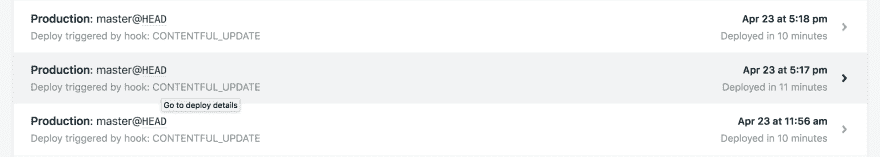

# 更快的静态站点构建第 1 部分——只处理您需要的东西

> 原文：<https://dev.to/stefanjudis/faster-static-site-builds-part-1--process-only-what-you-need-2j70>

*这篇文章最初发表在[contentful.com](https://www.contentful.com/blog/2018/05/17/faster-static-site-builds-part-one-process-only-what-you-need/)。*

* * *

静态网站越来越受欢迎。像 Smashing Magazine 这样的大出版商依靠静态网站生成(T2)来更快地提供内容(T3)。而且他们不用担心[安全补丁](https://www.contentful.com/blog/2018/03/16/reducing-the-attack-surface-with-static-sites/?utm_campaign=faster-static-sites-part-one&utm_medium=referral&utm_source=devto&utm_content=faster-static-sites-part-one)或可扩展的服务器设置。静态站点生成所需要的只是一个启动你的构建的 CI 服务和一个为你生成的静态文件提供服务的静态主机提供商，然后我们[用无服务器技术](https://www.slideshare.net/rwessling/making-static-websites-more-dynamic-with-serverless)丰富这些文件。

我非常相信静态站点方法，但是这种方法会带来一系列挑战，这取决于您想要完成什么。一个问题是保证短的构建时间:文件生成需要时间，如果您想要生成两万页，构建时间会增加—这导致发布工作流中的挫折和延迟。

你可能会说你的项目或个人网站不会遇到这些挑战，几个月前我也这么认为。但是最近我面临着构建时间越来越长的问题。我的私人网站用的是 [Contentful](https://www.contentful.com/?utm_campaign=faster-static-sites-part-one&utm_medium=referral&utm_source=devto&utm_content=faster-static-sites-part-one) 和 [Nuxt.js](https://nuxtjs.org/) (基于 [Vue.js](https://vuejs.org/) )。它是通过 [Netlify 到 Netlify](https://www.netlify.com/) 部署的，我的构建时间超过了 10 分钟——这是不可接受的。

在这两篇关于静态站点的文章的第一篇中，我将与您分享如何使用自定义缓存层来加速 Netlify 上的构建过程。第二篇文章将讨论使用 Nuxt.js 实现增量构建。

## 美丽的 SQIP 形象占位符

为什么构建时间一开始就增加了这么多？几个月前，我遇到了 SQIP。SQIP 是由 [Tobias Baldauf](https://twitter.com/tbaldauf) 开发的一个新工具，可以使用原语生成漂亮的 SVG 占位符图像。这些占位符可以提高延迟加载图像的感知性能。Primitive 检查图像并生成 SVG，这些 SVG 用原始形状来表示图像，当您应用模糊效果时，这些原始形状看起来非常好。

[T2】](https://res.cloudinary.com/practicaldev/image/fetch/s--oXRpJOSa--/c_limit%2Cf_auto%2Cfl_progressive%2Cq_auto%2Cw_880/https://images.ctfassets.net/fo9twyrwpveg/2nzwoS95GsCkCaay624Ske/f0a81353f0d00e0b6c12fea9bf5e0204/Screen_Shot_2018-05-03_at_17.23.10____.png)

使用这些漂亮的预览图像，用户知道当图像加载开始时会发生什么，这比微调器或随机加载图形会带来更好的用户体验。

它的工作方式是在图像下面放置一个小的 SVG 图形，这个图形最终会出现并淡入。

如果您对实现这些好看的占位符图像不感兴趣，而只想了解 Netlify 上的缓存，您可以直接跳到“为成功而缓存”一节。

## 使用 SQIP 生成预览图像

它是这样工作的——我的图像存储在 Contentful 中，要生成 SVG 预览，我需要完成以下步骤:

*   获取 Contentful 中存储的所有资产的信息
*   下载所有图像
*   生成图像的占位符 SVG
*   创建一个包含所有 SVG 的 JavaScript 文件，以便以后内联它们

以下所有代码部分都是一个较长脚本的一小部分，该脚本将在文章末尾链接，代码大量使用异步函数，这使得异步操作的处理变得更好！因此，每当您在某处看到一个`await`时，它就被放在整个实现中的一个异步函数内。

遵循最佳实践，[产生的脚本](https://gist.github.com/stefanjudis/3402288b9970d161b5da5f62caf0db66#file-sqip-it-with-caching-js)要求所有的依赖项都在文件的顶部，而在包含的代码部分中，我将它们放在使用它们之前，以使代码片段更容易理解。

## 从 Contentful 获取所有资产

从 Contentful API 获取所有资产信息非常简单。我只需要初始化 Contentful SDK 客户端， [`getAssets`](https://www.contentful.com/developers/docs/references/content-delivery-api/#/reference/assets/assets-collection/get-all-assets-of-a-space/console/js?utm_campaign=faster-static-sites-part-one&utm_medium=referral&utm_source=devto&utm_content=faster-static-sites-part-one) 函数给了我需要的信息。

```
const contentful = require('contentful')
const client = contentful.createClient({ … })

//Getting asset information

// Contentful collection responses have a default limit 
// of 100 -> increase it to 1000 to avoid the need for
// pagination at this stage
const {items} = await client.getAssets({limit: 1000})
let images = items
  // only treat image files
  // there can also be pdfs and so one
  .filter(
    ({fields}) => fields.file && ['image/png', 'image/jpeg'].indexOf(fields.file.contentType) !== -1
  )
  // strip out useless information
  // and flatten data structure with needed information
  .map(({sys, fields}) => ({
    id: sys.id,
    revision: sys.revision,
    url: fields.file.url,
    filename: `${sys.id}-${sys.revision}.${fields.file.contentType.split('/')[1]}`
  })) 
```

Enter fullscreen mode Exit fullscreen mode

首先，我必须过滤所有的资产，剔除不是 png 或 JPEGs 的文件。然后我通过一个`map`函数去掉所有我不感兴趣的元信息。

此时，我有一个数组`images`保存着`id`、`revision`和特定的图像`url`。该集合还包括一个`filename`属性，它是资产 ID 及其修订版的组合。

这两个属性的连接是必要的，因为每当我更新一个资产时，我还想生成一个新的预览 SVG——这就是修订号发挥作用的地方，因为它在这种情况下发生了变化。

### 下载图片创建 SVG

收集了我的站点的所有资产的信息后，我继续下载所有的资产。我在 npm 上找到的[下载](https://www.npmjs.com/package/download)包非常适合。

```
const download = require('download')
const IMAGE_FOLDER = '...'

// Downloading images for missing SVGs
await Promise.all(
  // map all image objects to Promises representing
  // the image download
  images.map(({url, filename}) => {
    return download(
      url.replace(/\/\//, 'https://'),
      IMAGE_FOLDER,
      { filename }
    )
  })
) 
```

Enter fullscreen mode Exit fullscreen mode

所有的资产条目都被映射到 download 函数返回的承诺，所有的东西都被打包到一个`Promise.all`中，这样我就可以确保所有的图像都被下载到预定义的`IMAGE_FOLDER`中。这就是 async/await 大放异彩的地方！

### SQIP 它

SQIP 可以以编程方式使用，这意味着您可以需要该模块，并且您已经准备好了。

```
const {writeFile} = require('fs-extra')
const sqip = require('sqip')

// Writing of generated preview SVGs to disk
await Promise.all(images.map(({id, revision, filename}) => {
  const {final_svg} = sqip({
    filename: path.join(IMAGE_FOLDER, filename),
    numberOfPrimitives: 10,
    mode: 0,
    blur: 0
  })

  return writeFile(
    path.join(IMAGE_FOLDER, `${id}-${revision}.svg`),
    final_svg
  )
})) 
```

Enter fullscreen mode Exit fullscreen mode

然而,`sqip`模块并不将文件写入磁盘。它在`final_svg`属性中返回一个包含生成的 SVG 的对象。您可能会说，我可以使用 SVG 字符串值并将 SVG 直接存储在`images`集合中，但是我首先将 SVG 写入磁盘。

我还使用了 [fs-extra](https://www.npmjs.com/package/fs-extra) 包，该包在本机`fs`模块上提供了一些方便的方法，并且还将回调函数映射到它们的 promises 版本，这样我就不必自己做出例如`writeFile`承诺。

这样做的好处是，我可以快速查看硬盘上生成的 SVG，这在本文后面的缓存部分也会派上用场。

SQIP 模块接受以下参数:

*   定义形状的数量(10 个形状对我来说很有用，SVG 文件很小，但是预览效果很好)
*   `mode`定义生成的 SVG 应该包括哪种形状(三角形、正方形、圆形，所有这些)
*   定义应用模糊的级别(我在 SVG 中没有使用模糊，因为我发现 CSS 模糊的结果会带来更好的效果)

### 读取 SVGs

下一步是读取所有生成的 SVG，并准备好在我的 JavaScript 应用程序中使用它们。

```
const {readFile} = require('fs-extra')

// Reading SVGs
images = await Promise.all(images.map(async (image) => {
  const svg = await readFile(path.join(IMAGE_FOLDER, `${image.id}-${image.revision}.svg`), 'utf8')

  // add ID to SVG for easier debugging later
  image.svg = svg.replace('Enter fullscreen mode Exit fullscreen mode

[fs-extra](https://www.npmjs.com/package/fs-extra) 也提供了一个`readFile`函数，所以我准备基于流量承诺。

生成的 SVG 的字符串值丰富了资产对象的集合。这个字符串值还将资产 ID 添加到 SVG 中，以便我以后可以看到特定 SVG 预览图像的基础是什么资产。

### 将 SVG 映射到 JavaScript，使它们在 Nuxt.js(或任何其他 js 环境)中可用

最后一步——资产集合现在包括元信息，以及在每个项目的`svg`属性中生成的字符串化 SVG。是时候让它在 JavaScript 环境中可重用了。

```
const JS_DESTINATION = path.resolve(__dirname, 'image-map.js')

// Writing JS mapping file
writeFile(
  JS_DESTINATION,
  `export default {\n ${images.map(({id, svg}) => `'${id}': '${svg}'`).join(', ')}\n}\n`
) 
```

Enter fullscreen mode Exit fullscreen mode

这一步编写了一个 JavaScript 文件，这个文件在我的 git 存储库中被忽略了。JavaScript 文件导出一个对象，该对象通过资产 ID 定义每个 SVG。这样，我可以在以后导入这个文件，并在运行和构建时使用资产 ID 来获取生成的 SVG。

```
import imageMap from '~/plugins/image-map.js'

const preview = imageMap[this.asset.sys.id] || null 
```

Enter fullscreen mode Exit fullscreen mode

在我的 MacBook Pro 上执行 55 项资产的[结果脚本](https://gist.github.com/stefanjudis/3402288b9970d161b5da5f62caf0db66#file-sqip-it-without-caching-js)，包括良好的日志记录消息，需要 2 到 4 分钟(取决于我的机器上运行的其他内容)。

```
▶ ./scripts/sqip-it-without-cache               [19:46:49]
Getting asset information
Asset information queried - 55 assets
// --------------------------------------------
Downloading images for SVGs...
Images downloaded
// --------------------------------------------
Creating SVGs...
SVGs created
// --------------------------------------------
Reading SVGs...
SVGs read
// --------------------------------------------
Writing JS mapping file
JS file written
// --------------------------------------------
▶                                                [19:50:46] 
```

Enter fullscreen mode Exit fullscreen mode

但是，当它在 Netlify 上运行时，脚本执行可能需要 5 到 7 分钟，因此构建时间大约为上述的 10 分钟。

[T2】](https://res.cloudinary.com/practicaldev/image/fetch/s--57MY61Ep--/c_limit%2Cf_auto%2Cfl_progressive%2Cq_auto%2Cw_880/https://images.ctfassets.net/fo9twyrwpveg/3Hl0AfIIreIYEQka20wQm8/c2bdb8d64b291d6106190ebd59f58a60/Screen_Shot_2018-05-03_at_17.46.43____.png)

重复再生不是最佳方法。有了这个脚本，每一次构建都要做同样的繁重工作——一遍又一遍。每当您重复操作时，可能是图像优化或其他需要几分钟的大量计算，是时候改进了。

连续交付管道的美妙之处在于，事情可以有规律地快速上线——10 分钟内将一个打字错误修复投入生产可不是我的小网站想要应对的环境。

那么，我该如何解决这个问题呢？

我可以自己生成图像预览，并将它们上传到 Contentful，这样做的缺点是我需要处理两个相互依赖的资产(图像和预览)——这不是一个选项。

我可以将预览提交给 git 存储库，但是将大量资产提交给 git 总是让我感觉不好。大的二进制文件不是 git 的目标，它会大大增加存储库的大小——也没有选择。

## 缓存为赢

Netlify 在 docker 容器中运行每个部署，不可能重用以前部署的东西(除了依赖项——但是我不想误用 node_modules 文件夹来存放我自己的东西)。我最初的解决方案是一个 S3 桶，在我的构建过程中充当缓存层。

缓存层将保存从先前构建下载的图像和生成的预览，并且由于 ID 和修订版命名约定，文件存在检查将足以确定需要生成什么新资产。这种方法工作得很好，但是【Netlify 的 Phil 和我分享了一个秘密(但是要小心，它没有被记录下来，使用要自担风险)。

原来有一个文件夹在不同的构建中持续存在-`/opt/build/cache/`。您可以使用这个文件夹跨构建存储文件，这导致我的脚本中的一些额外步骤，但大大减少了 SVG 生成的时间:

*   获取 Contentful 中存储的所有资产的信息
*   *检查已经生成了哪些 SVGs】*
*   *下载丢失的图像*
*   *生成缺失图像的占位符 SVGs】*
*   创建一个包含所有 SVG 的 JavaScript 文件，以便以后内联它们

### 在本地和网络中定义一个缓存文件夹

我在脚本中定义的图像文件夹现在变成了一个缓存文件夹(`SQIP_CACHE`)，这取决于环境。

```
const isProduction = process.env.NODE_ENV === 'production'
const SQIP_CACHE = isProduction
  ? path.join('/', 'opt', 'build', 'cache', 'sqip')
  : path.resolve(__dirname, '.sqip') 
```

Enter fullscreen mode Exit fullscreen mode

这样，我可以在我的开发机器上运行脚本，并将所有文件放在 git 也会忽略的文件夹中，但是当在 Netlify 上运行时，它使用持久文件夹。

### 检查已存在的生成文件

还记得我之前用的`images`系列吗？

```
const {readFile} = require('fs-extra')

// Reading cached SVGs
images = await Promise.all(images.map(async (image) => {
  try {
    const svg = await readFile(`${SQIP_CACHE}/${image.id}-${image.revision}.svg`, 'utf8')
    if (svg.startsWith('Enter fullscreen mode Exit fullscreen mode

然后，我将另一个步骤添加到前面的脚本中，并查看在缓存文件夹中是否有具有正确资产 ID 和修订组合的 SVG。

如果是，读取文件并定义图像条目的`svg`属性，如果不是，继续。

### 生成新的预览 SVG

SVG 文件的生成保持不变，只是我现在可以检查是否已经有一个生成的 SVG 值可用，如下所示:

```
// Creating missing SVGs...
await Promise.all(images.map(({id, revision, filename, svg}) => {
  // if there was an SVG in the cache
  // do nothing \o/
  if (!svg) {
    const command = `${SQIP_EXEC} -o ${id}-${revision}.svg -n 10 -m 0 -b 0 ${filename}`

    return execute(
      command,
      {cwd: SQIP_CACHE}
    )
  }

  return Promise.resolve()
})) 
```

Enter fullscreen mode Exit fullscreen mode

有了改进的脚本,我可以避免重复计算，并且在我的本地机器和 Netlify 上，用满缓存重复构建的时间甚至减少到不到一秒钟！

[T2】](https://res.cloudinary.com/practicaldev/image/fetch/s--1guSsbC0--/c_limit%2Cf_auto%2Cfl_progressive%2Cq_auto%2Cw_880/https://images.ctfassets.net/fo9twyrwpveg/3XZ502E8rm6KsKsI4OMsAU/952c2161d63abe9732f6d06d79488f61/gallery-preview.jpg)

如果你想玩玩它，[提供的要点](https://gist.github.com/stefanjudis/3402288b9970d161b5da5f62caf0db66)包括你需要生成和缓存漂亮的图像预览和一个内容丰富的例子空间。

## 想象一个终止开关——清除缓存

不过还有最后一件事——缓存可能很难，尤其是当您在无法访问的远程服务器上实现缓存时，您应该能够扔掉一切，重新开始。

在我运行在 Netlify 上的例子中，我使用了一个定制的 webhook，当这个 webhook 触发构建时，它会在任何事情发生之前清除缓存目录。

```
const {emptyDir} = require('fs-extra')

if (process.env.WEBHOOK_TITLE === 'CLEAR_CUSTOM_CACHE') {
  console.log(`Clearing ${SQIP_CACHE}`)
  await emptyDir(SQIP_CACHE)
} 
```

Enter fullscreen mode Exit fullscreen mode

问题解决了！

## 尽可能快地保持你的构建

预览缓存的加入极大地改善了我的静态站点的构建体验。我喜欢 Contentful、Nuxt.js 和 Netlify 设置，现在构建时间又到了三分钟，我可以开始考虑下一个改进了——静态 HTML 文件生成的加速。

我的计划是只使用 Netlify 的缓存文件夹来生成特定的文件，而不是整个网站。例如，当我添加一篇新的博客文章时，只有几个页面需要更新，而不是所有的 150 个页面和所有的 JavaScript、图像和 CSS 文件。这是现在可以避免的计算。

Contentful 的 sync endpoint 提供了关于与上次同步相比发生了什么变化的详细信息，非常适合这种用例，这使得增量构建成为可能——这是许多大型静态站点生成器都在努力解决的问题。你很快就会读到。我会让你知道的！