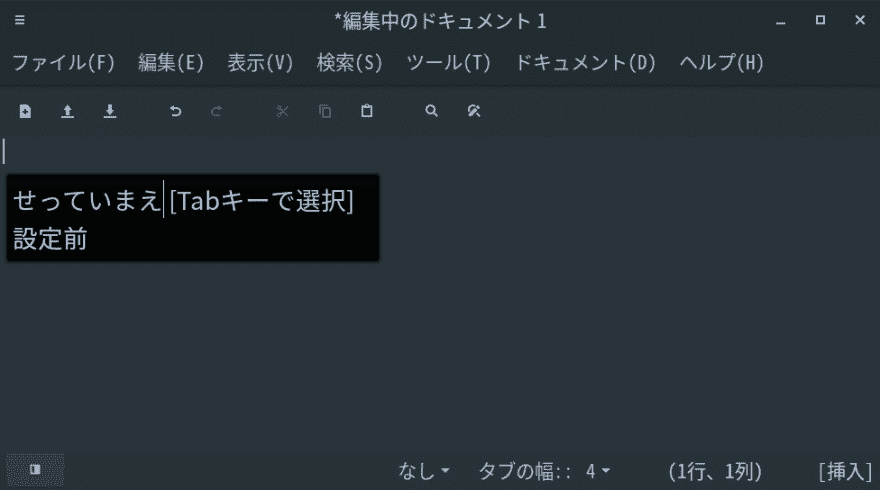
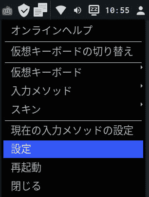
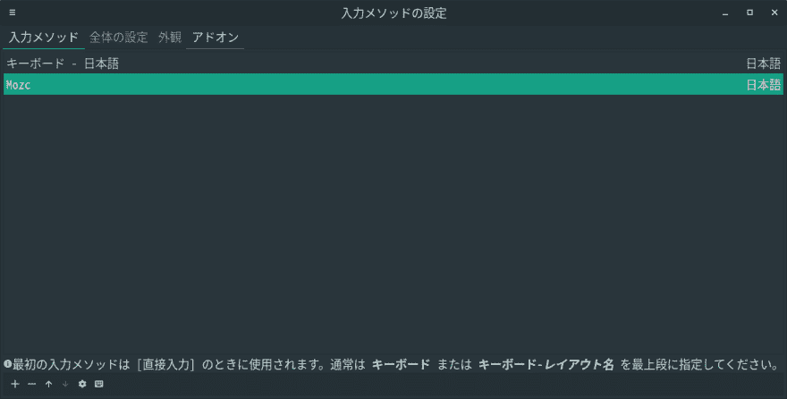
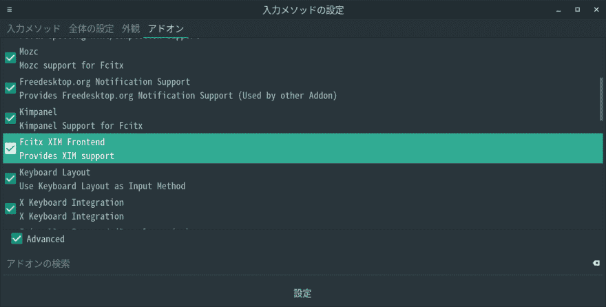
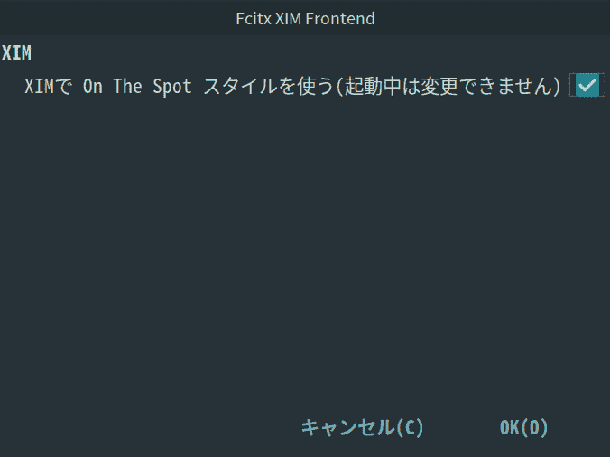
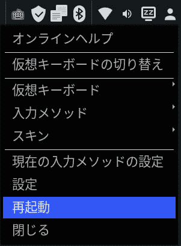
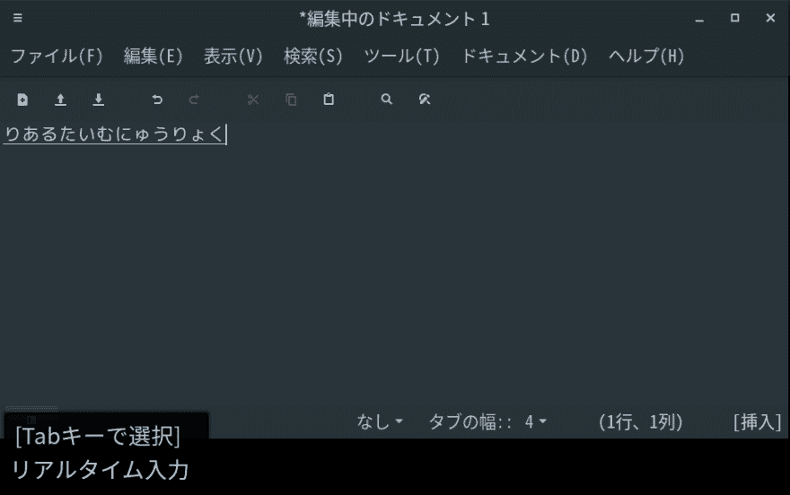

# Fcitx :用于实时输入(内联输入)的设置

> 原文：<https://dev.to/nabbisen/fcitx--1n59>

# Summary

[Fcitx](https://fcitx-im.org/wiki/Fcitx) 是在 Linux/Unix 系统中广泛使用的输入方法。
(其他代表性的输入方法有[iBus](https://github.com/ibus/ibus/wiki) 。 )
支持使用[Mozc](https://github.com/google/mozc) 和 Anthy 作为后端的日语输入。
 介绍用于通过使用 Fcitx 的文字输入，可以进行实时输入(在线输入)的设定方法。

**补充:在事先安装了 GUI 相关的 Fcitx 模块的环境下，即使不进行特别的设定，也不会发生本次的问题。 安装这些模块可能比较好:*

 [## Fcitx :调整输入辅助弹出窗口的显示位置

### 纳比森 11 月 6 日 181 分钟阅读

#fcitx #japanese](/nabbisen/fcitx--a5g)

# problem

[针对 Manjaro Linux](https://manjaro.org/) 的[Cinnamon 桌面](https://manjaro.org/community-editions/)，构建了使用 Fcitx-Mozc 的日语输入环境。
那个时候，发生了在日语输入时，不能向输入地 APP 应用程序实时反映的问题。

### Before :文本编辑器 Xed 中的图像

在确认输入之前，只会显示自动图文集弹出窗口，而 APP 应用程序(文本编辑器)的显示不会反映您的输入。

[T2】](https://res.cloudinary.com/practicaldev/image/fetch/s--fn3rBoVh--/c_limit%2Cf_auto%2Cfl_progressive%2Cq_auto%2Cw_880/https://thepracticaldev.s3.amazonaws.com/i/9lq3por48ca0ylr49hd4.png)

# Solution

在 Fcitx 的“高级”设置中启用 XIM Frontend 设置。

### Smooth hands

打开 Fcitx 的“设置”菜单。

[T2】](https://res.cloudinary.com/practicaldev/image/fetch/s--RjD52e6Y--/c_limit%2Cf_auto%2Cfl_progressive%2Cq_auto%2Cw_880/https://thepracticaldev.s3.amazonaws.com/i/bcjf8k7f42dd5mfmlxf6.jpg)

打开“附加”选项卡。

[T2】](https://res.cloudinary.com/practicaldev/image/fetch/s--rIy_Et_2--/c_limit%2Cf_auto%2Cfl_progressive%2Cq_auto%2Cw_880/https://thepracticaldev.s3.amazonaws.com/i/8q3q31oe10mlhgwanbrn.png)

如果选中最下部的“Advanced”，则会显示隐藏项目。
随之，标签内的中央稍上方附近出现“Fcitx XIM Frontend”。
请双击(或者将该行设为选择状态并单击下面的“设置”)。

[T2】](https://res.cloudinary.com/practicaldev/image/fetch/s--RrTrbf1z--/c_limit%2Cf_auto%2Cfl_progressive%2Cq_auto%2Cw_880/https://thepracticaldev.s3.amazonaws.com/i/97rw5nxgni26zbyb9bjw.png)

将显示子窗口。 勾选
，然后按“OK”关闭。

[T2】](https://res.cloudinary.com/practicaldev/image/fetch/s--tbfIBxdn--/c_limit%2Cf_auto%2Cfl_progressive%2Cq_auto%2Cw_880/https://thepracticaldev.s3.amazonaws.com/i/jycdwkellirwr53vhq93.png)

重新启动 Fcitx。

[T2】](https://res.cloudinary.com/practicaldev/image/fetch/s--IDcUUbb7--/c_limit%2Cf_auto%2Cfl_progressive%2Cq_auto%2Cw_880/https://thepracticaldev.s3.amazonaws.com/i/j63ferzm3ninln2e493r.jpg)

### After :文本编辑器 Xed 中的图像

可以进行实时输入。

[T2】](https://res.cloudinary.com/practicaldev/image/fetch/s--6lszKnyX--/c_limit%2Cf_auto%2Cfl_progressive%2Cq_auto%2Cw_880/https://thepracticaldev.s3.amazonaws.com/i/bgn9pf8c71nig96941kz.jpg)

**补充:在仅安装了 Fcitx 单体的情况下，有时会出现自动图文集弹出窗口显示在 APP 应用程序窗口之外的问题。 [可以通过添加 GUI 相关模块](#advanced-settings)来解决。*