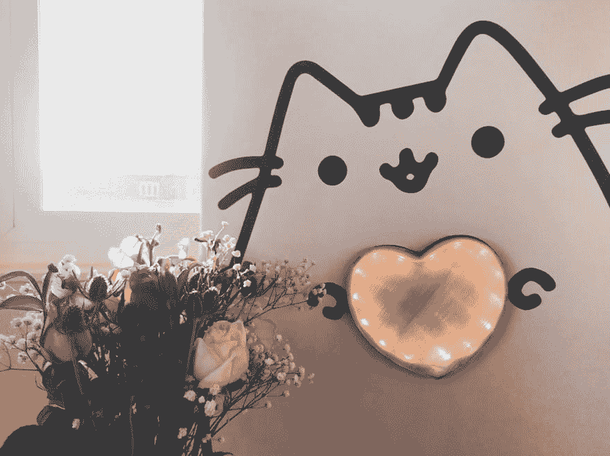
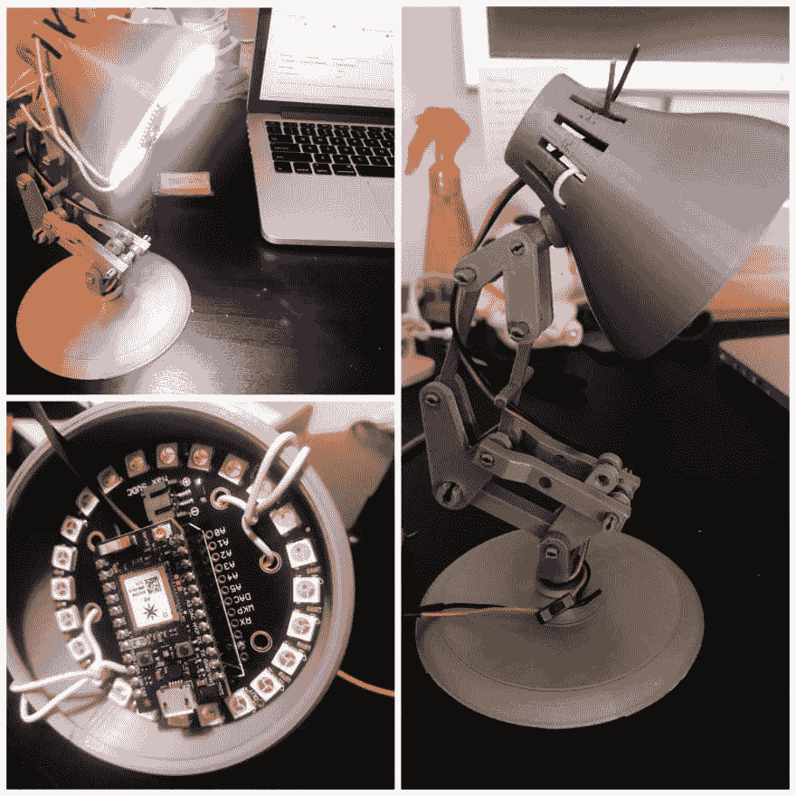

# 二月品牌:Pusheen Heart

> 原文：<https://dev.to/charlyn/february-make-pusheen-heart-18h0>

[T2】](https://res.cloudinary.com/practicaldev/image/fetch/s--wQW9YNKH--/c_limit%2Cf_auto%2Cfl_progressive%2Cq_auto%2Cw_880/https://thepracticaldev.s3.amazonaws.com/i/3v0qbnfwnrs7p2iq0ne2.JPG)

创建一个谷歌助手应用程序，如何避免焊接，以及发现是什么让项目变得有动力和有趣。警告:极端情人节奶酪在前面。

如果你还不知道 Pusheen 的事，那你就有得吃了。

这个月，我想做一些涉及 Google Home 的东西。我通常只问谷歌现在是什么时间，天气如何，所以我认为做一些可以用它工作的东西会很有趣，而不是购买。我对智能灯感兴趣已经有一段时间了，所以我想看看是否能创造自己的智能灯。我找到了这个[皮克斯风格的灯](https://www.thingiverse.com/thing:27062)并打印了出来，使用了我放在身边的[新像素光子工具包](https://www.adafruit.com/product/2268)，并取得了相当不错的进展:

[T2】](https://res.cloudinary.com/practicaldev/image/fetch/s--N623B3PA--/c_limit%2Cf_auto%2Cfl_progressive%2Cq_auto%2Cw_880/https://thepracticaldev.s3.amazonaws.com/i/c2vulk6atoy1o8vfbyvn.jpg)

我可以用粒子 API 远程开关它。项目半途而废耶！

但是在这盏小灯里没有情感，没有快乐(尽管很可爱)。我不能把它和任何感觉联系起来。

那时我意识到，当我不仅仅是为自己而创作时，我最喜欢创作。我想我的爱好是预测如何让某人微笑或大笑，然后看看我是否能创造一些东西让它发生。当我开始创造一些很酷的东西时，这很有趣，但当我开始为别人创造时，这更有趣也更有意义。这盏灯虽然很可爱，但并没有特别的含义，也不是指共同的经历。

> 我想我的爱好是预测如何让某人微笑或大笑，然后看看我是否能创造一些东西让它发生。

然后我突然想到:现在是二月！也许我可以为我的情人做一个俗气的情人节项目。他碰巧和我一样对 Pusheen 猫着迷(也许更多)，所以一个计划开始形成。我们都一直梦想拥有那只巨大的毛绒玩具，但是因为我还不能做一只巨大的毛绒玩具。)，我会找到一些其他方法来制作一个连接到 Google Home 的大 Pusheen。

我想到了这个:

[https://www.youtube.com/embed/YoLyoAI4O0k](https://www.youtube.com/embed/YoLyoAI4O0k)
*潇洒如承诺。也挺甜的。*

这是一个智能心脏，通过调用我称为“Pusheen Heart”的谷歌助手应用程序来发光。当我说“好的谷歌，请 Pusheen Heart 告诉 Bryan 我爱他”时，它会亮起，当我说“请 Pusheen Heart 关闭”时，它会熄灭。😄💖简单又甜蜜。

## 样机及电路图

首先，我想快速创建一个谷歌助手应用程序，并让它控制 Neopixel 条。所以我首先在粒子光子上创建固件(固件是进入控制灯光颜色的微控制器的代码)。