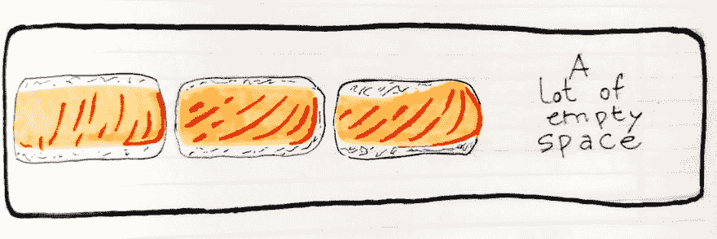
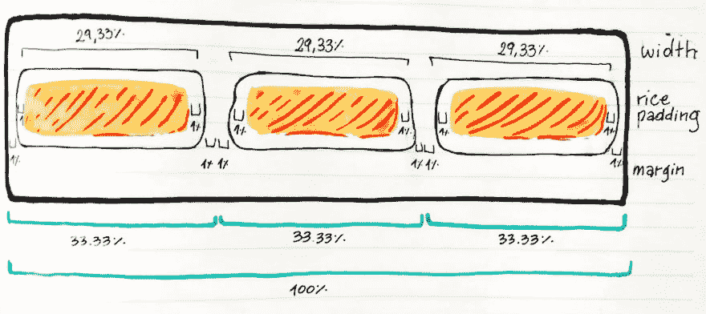

# 用两个寿司食谱算出 CSS 浮动

> 原文：<https://dev.to/anabella/figuring-out-css-floats-with-sushi-recipes-2c5o>

*本文[最初发表于](https://medium.freecodecamp.org/how-to-understand-css-floats-with-two-simple-sushi-layout-recipes-dded925706b9)freeCodeCamp。*

几周前，我决定我应该承认我从来没有理解过的关于 CSS 的事情。我会试着深入并有意识地探究它们，最终*得到*它们。似乎现在，在第一次学习 CSS 几年后，我可以利用我收集的所有经验。这一次应该会更容易，更清晰。

八月，我用[向](https://dev.to/anabella/understanding-the-different-pairings-of-css-position-flavours-5855)介绍了`position`房产的神秘组合，以此拉开了序幕。这是我旅程的第二站:

烹饪食谱形式的`float`属性。

## 菜谱索引

*   寿司行-使元素以均匀的方式覆盖整行
*   清除肉汤——使浮子下的内容正常工作

### 寿司沟

我们将使用浮点和百分比值在整个(容器)宽度上均匀分布元素。就像盘子里的寿司一样。

#### 配料:

*   1 个容器或板
*   一些你需要并排分发的寿司。
*   %符号
*   1 浮动:左；

#### 说明:

准备好你的寿司件，也就是你要排成一排展示的元素。他们可以是 makis，项目卡，nigiris，图标，任何适合你的口味。

你也可以添加任何非定位样式:颜色、文本对齐、字体或酱油。

把它们放在一个块状容器里，比如一块木板。在其最基本的形式中，这应该是一个`div`(但您可以使用任何其他 HTML5 语义元素，如`header`、`footer`、`section`、`article`、`main`)。为它们添加一个描述类。我会用`nigiri`。

```
<html>
  <body>
    <div class="board">
        <div class="nigiri">
          <h1>/ / / / /</h1>
        </div>
        <div class="nigiri">
          <h1>/ / / / /</h1>
        </div>
        <div class="nigiri">
          <h1>/ / / / /</h1>
        </div>
    </div>
  </body>
</html>

<!-- Don't mind the `/`s, they're for the salmon's stripy effect. --> 
```

现在，在 nigiri 类上我们将应用一些样式，包括我们的 float:left；。花点时间通读它们:

```
.nigiri {
  margin: 0 10px;  /* fixed 10px margin and padding... for now! */
  padding: 0 10px;
  float: left;

/*  Extra things to makit look nice  */
  background-color: #fff;
  border-radius: 100px;
  box-shadow: inset -3px -6px 0 0 #ece0cd;
}

.nigiri > h1 {
  background-color: #fca35d;
  color: #fce2da;
  border-radius: 100px;
  font-weight: 100;
}

.board {
  width: 500px;
  height: 200px; /* we need this because floated elements don't occupy real Document Flow space, try removing it! */
  margin: 20px auto;
  padding: 10px;
  background: #CBAD8C;
  border-radius: 8px;
  box-shadow: 12px 8px 0 rgba(#000, 0.1);
} 
```

`float: left;`所做的是告诉每个元素贴在一边——在这个例子中是左边——并且从左到右排成一排。

请注意，我们正在增加板的高度。通常我们不需要这个:板子会扩展以适应里面的任何东西。但是浮动元素，比如我们的 nigiris，就不同了:它们不占用真正的文档空间，也不影响其他非浮动元素。这就是为什么我们使用一个固定的，像素大小的高度。

现在，您应该在一行中看到所有的元素。但是有些事情不太对劲。它们都堆积在左边，你的棋盘右边可能有很多空位。

[T2】](https://res.cloudinary.com/practicaldev/image/fetch/s--Ny9N__ze--/c_limit%2Cf_auto%2Cfl_progressive%2Cq_auto%2Cw_880/https://cdn-images-1.medium.com/max/1600/1%2APTeK-2AbKxznolPfgWC6JQ.jpeg)

我们需要让它们均匀分布。

我们可以通过使用百分比值将 nigiri 的宽度设置为相对于其容器(在本例中为棋盘)的宽度来实现。但是，对于 3 个元素来说，仅仅是 33.33%吗？嗯，没那么简单...

现在这是棘手的部分:你需要设置的百分比将取决于三件事

*   你有多少件物品
*   它们的内部结构(填充)
*   以及它们之间需要多大的空间。

你希望它们并排贴在一起，还是它们之间需要一些间隔？如果寿司块有*米饭*填料** ，那就会导致它们比里面的东西大。你必须通过减少它们的宽度来补偿。因此，在填充值中使用%也是明智的。

我知道这可能会让人困惑。这里有一个手工单按插图，我希望可以...嗯，说明清楚。

[T2】](https://res.cloudinary.com/practicaldev/image/fetch/s--CkwZ6ik8--/c_limit%2Cf_auto%2Cfl_progressive%2Cq_auto%2Cw_880/https://cdn-images-1.medium.com/max/1600/1%2AvEajpTwwxymHQr89D8ez1Q.jpeg)

每个网布为木板全宽的 33.33%；

*   每边 2%的保证金，
*   每侧填充 2%
*   然后是它们实际宽度的 29.33%。

但这是食谱，不是数学课。亲爱的读者，为了方便你，这里有一些肩并肩和空白元素的常见组合，都有 1%的大米填充:

```
/* Two elements in the row */

.two.shoulder {
  width: 48%;
  padding: 1%;
}

.two.spaced {
  width: 46%;
  padding: 1%;
  margin: 1%;
}

/* Three elements in the row */

.three.shoulder {
  width: 31.33%;
  padding: 1%;
}

.three.spaced {
  width: 29.33%;
  padding: 1%;
  margin: 1%;
}

/* Four elements in the row */

.four.shoulder {
  width: 23%;
  padding: 1%;
}

.four.spaced {
  width: 21%;
  padding: 1%;
  margin: 1%;
}

/* Five elements in the row */

.five.shoulder {
  width: 18%;
  padding: 1%;
}

.five.spaced {
  width: 16%;
  padding: 1%;
  margin: 1%;
} 
```

你想拿多少就拿多少。

您可能已经注意到了这里的模式:我们假设元素带有 1%的填充。他们需要通过从元素的百分比宽度中减去 2%(每边 1%)来进行补偿。我们 1%的利润率也是如此。现在，对于一行中的 3 个元素，不使用 33.33%的宽度更有意义。取而代之的是，在每张纸上留出 2%的空白和 2%的边距后，将其设置为 29.33%。

唉…那是一大堆数学。好了，现在，不管你的寿司卷被切了多少块，你都知道如何把它们很好地放在纸板上。

如果你想试试这个设置，这里有一个专门为此制作的[代码笔](https://codepen.io/anabellaspinelli/pen/OwRVMK)。

> 如果你喜欢 CSS 寿司，不要错过 Sasha Tran 非常鼓舞人心的 [CSS 寿司板](https://codepen.io/sashatran/pen/bgZVdm)。

### 清汤🍲

完美的汤，配上漂浮的寿司，同时确保你的食物不会在里面游泳。

#### 配料:

*   一个装有漂浮寿司的容器或板
*   接下来是汤或肉汤。
*   一清:肉汤；

#### 说明:

一旦你准备好一排漂浮的寿司，把你的汤容器放在它们下面。

我们的寿司旨在优雅地浮在文档流的“上方”,而不影响其他元素。如果我们不小心的话，它们可能最终会漂浮在汤里，而寿司拉面不是这个世界已经准备好要吃的东西。

记住浮动元素没有真正的文档高度。这也意味着他们不会把汤“推”下去。现在看看这可怕的混乱:

[https://codepen.io/anabellaspinelli/embed/wxzrgv?height=600&default-tab=result&embed-version=2](https://codepen.io/anabellaspinelli/embed/wxzrgv?height=600&default-tab=result&embed-version=2)
为了防止这种暴行，我们需要补充清楚:误事；…我是指两者；！

我们有两个选择:

我们可以简单地把汤放在碗里或容器里，给碗一个`clear: both;`的风格。这将*某种程度上*完成工作，但它将导致像`margin-top`这样的东西在碗上根本不工作。

所以，如果我们想让寿司完全不受汤水的影响，并且不失去任何特色，我们需要把它们放在一个边缘很高的盘子里。为了实现这一点，我们将添加一个`:after`伪元素到寿司盘中(也就是我们的小 nigiri floaters 的容器):

```
 .nigiri-plate {
  background-color: #223;
  box-shadow: inset -8px -8px 0 0 #558;
  border-radius: 20px;
  height: 105px;
}

.nigiri-plate:after {
  content: "";
  clear: both;
  display: block;
} 
```

伪元素需要一个空的`content`才能存在。那么“clear:both”和“display:block”就是为了这个技术而存在的。

下面还有一个例子供你参考。我已经使用高度和背景色使盘子可见。尽管这对于汤的摆放来说并不是必须的，但它只会让汤看起来更美味🎩

[https://codepen.io/anabellaspinelli/embed/LBWrMz?height=600&default-tab=result&embed-version=2](https://codepen.io/anabellaspinelli/embed/LBWrMz?height=600&default-tab=result&embed-version=2)

我还用经典的`margin: anything, auto;`技术将汤碗放在前面和中央。

把这个策略想象成让寿司有一个很高的南墙，以防止汤涌入。但是……像……一堵漂亮的墙。

> 好的，我非常高兴你能做到这一步，我希望这本小食谱能帮助你更好地了解浮动是如何工作的…以及我们如何使用浮动。请继续关注更深入的基本但难以捉摸的东西，比如😉