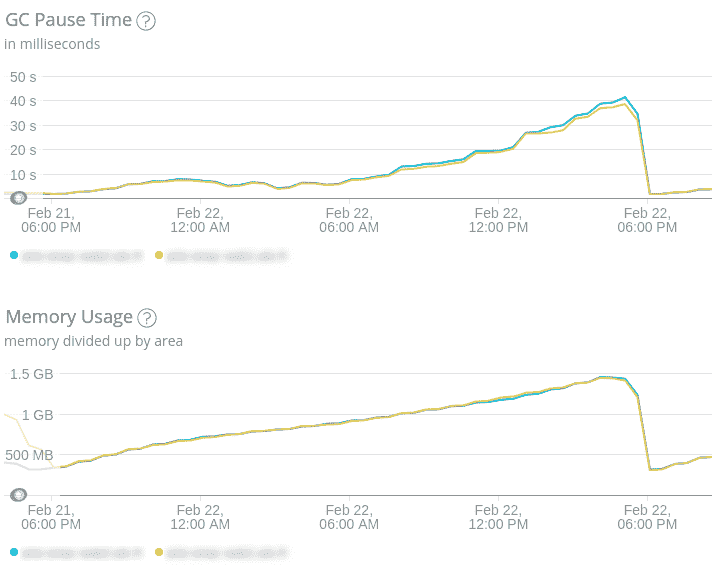
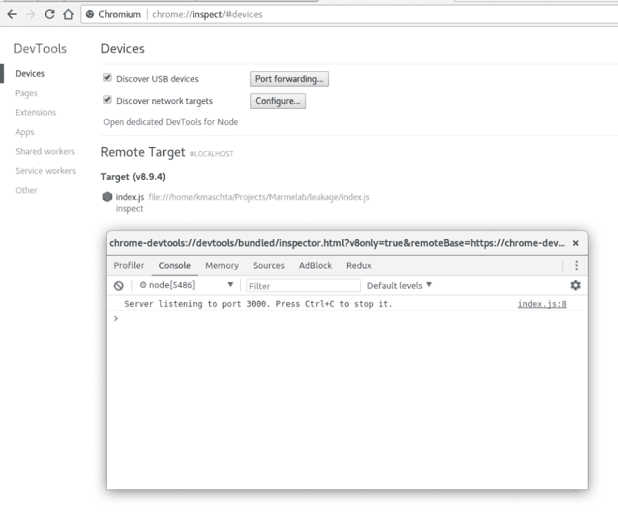
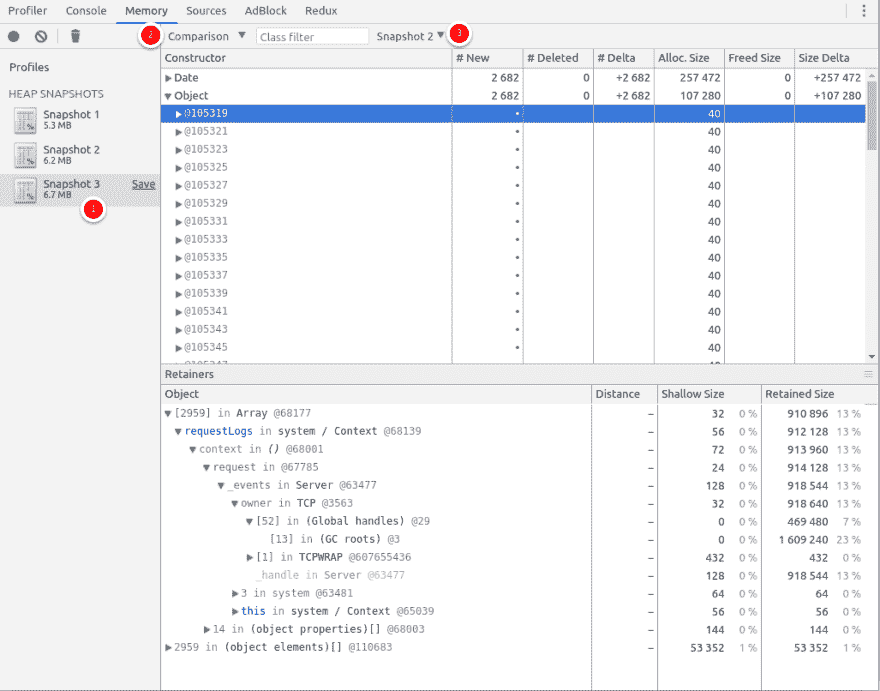
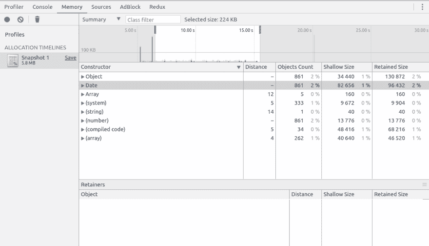
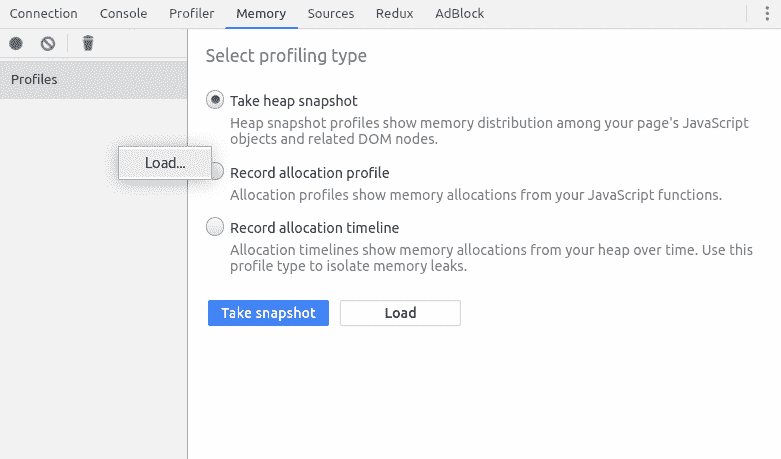

# 查找和修复 Node.js 内存泄漏:实用指南

> 原文：<https://dev.to/kmaschta/finding-and-fixing-nodejs-memory-leaks-a-practical-guide-3f5a>

修复内存泄漏可能不是简历上最闪亮的技能，但当生产出现问题时，最好做好准备！

阅读完本文后，您将能够监控、理解和调试 Node.js 应用程序的内存消耗。

## 当内存泄漏成为问题时

内存泄漏经常被忽视。当有人特别关注生产绩效指标时，它们就会成为一个问题。

生产应用程序中内存泄漏的第一个症状是，随着时间的推移，主机的内存、CPU 使用率和平均负载会增加，而没有任何明显的原因。

不知不觉中，响应时间变得越来越长，直到 CPU 使用率达到 100%，应用程序停止响应。当内存已满，并且没有足够的交换空间时，服务器甚至可能无法接受 SSH 连接。

但是当应用程序重新启动时，所有的问题都神奇地消失了！没有人知道发生了什么，所以他们转移到其他优先事项上，但问题周期性地重复出现。

[T2】](https://marmelab.cimg/blog/memory/response-time-over-time.png)

内存泄漏并不总是那么明显，但是当这种模式出现时，就应该寻找内存使用和响应时间之间的相关性了。

[T2】](https://marmelab.cimg/blog/memory/memory-usage-over-time.png)

恭喜你！您发现了内存泄漏。现在你的乐趣开始了。

不用说，我假设您监控您的服务器。否则，我强烈建议看一看[新遗迹](https://newrelic.com/)、[弹性 APM](https://www.elastic.co/solutions/apm) ，或任何监测解决方案。不能测量的东西不能固定。

## 趁早重启

查找和修复 Node.js 中的内存泄漏需要时间——通常需要一天或更长时间。如果您的积压不能容纳一些时间来调查泄漏在不久的将来，我建议寻找一个临时的解决方案，并处理后的根本原因。推迟这个问题的一个合理的方法(在短期内)是在它达到临界膨胀之前重启应用程序。

对于 [PM2](http://pm2.keymetrics.io/) 用户， [`max_memory_restart`](http://pm2.keymetrics.io/docs/usage/process-management/#max-memory-restart) 选项可以在节点进程达到一定内存量时自动重启。

现在我们已经舒舒服服地坐好了，喝了一杯茶，还有几个小时，让我们深入研究一下那些能帮你找到这些小公羊的工具。

## 创造有效的测试环境

在测量任何东西之前，先帮自己一个忙，花时间建立一个合适的测试环境。它可以是一个虚拟机，也可以是一个 AWS EC2 实例，但是它需要重复与生产中完全相同的条件。

代码的构建、优化和配置应该与它在生产环境中运行时完全相同，以便完全相同地再现泄漏。理想情况下，最好使用相同的[部署工件](/blog/2018/01/22/configurable-artifact-in-deployment.html)，这样您就可以确定生产环境和新的测试环境之间没有区别。

一个适当配置的测试环境是不够的:它还应该运行与生产环境相同的负载。为此，可以随意获取生产日志，并向测试环境发送相同的请求。在我的调试任务中，我发现了[围攻](https://www.joedog.org/siege-home/) *一个 HTTP/FTP 负载测试器和基准测试实用程序*，在测量高负载下的内存时非常有用。

此外，如果没有必要的话，抵制启用开发工具或详细日志程序的冲动，否则[你将结束调试这些开发工具](https://github.com/bithavoc/express-winston/pull/164)！

## 使用 V8 Inspector & Chrome 开发工具访问 Node.js 内存

我喜欢 Chrome 开发工具。`F12`是继`Ctrl+C`和`Ctrl+V`之后我输入最多的键(因为我大多做栈溢出驱动开发——开玩笑)。

您知道可以使用相同的开发工具来检查 Node.js 应用程序吗？Node.js 和 Chrome 运行相同的引擎， [`Chrome V8`](https://developers.google.com/v8/) ，其中包含了 Dev 工具使用的 inspector。

出于教育目的，假设我们有一个有史以来最简单的 HTTP 服务器，唯一的目的是显示它收到的所有请求:

```
const http = require('http');

const requestLogs = [];
const server = http.createServer((req, res) => {
    requestLogs.push({ url: req.url, date: new Date() });
    res.end(JSON.stringify(requestLogs));
});

server.listen(3000);
console.log('Server listening to port 3000\. Press Ctrl+C to stop it.'); 
```

为了公开检查器，让我们运行带有`--inspect`标志的 Node.js。

```
$ node --inspect index.js 
Debugger listening on ws://127.0.0.1:9229/655aa7fe-a557-457c-9204-fb9abfe26b0f
For help see https://nodejs.org/en/docs/inspector
Server listening to port 3000\. Press Ctrl+C to stop it. 
```

现在，运行 Chrome(或者 Chrome)，进入下面的 URI: `chrome://inspect`。瞧啊。Node.js 应用程序的全功能调试器。

[T2】](https://marmelab.cimg/blog/memory/chrome-devtools.png)

## 拍摄 V8 内存的快照

让我们来玩一下*内存*标签。可用的最简单选项是*获取堆快照*。它做了您所期望的事情:它为被检查的应用程序创建一个堆内存转储，其中包含大量关于内存使用的详细信息。

内存快照对于跟踪内存泄漏非常有用。一种常用的技术包括比较不同关键点的多个快照，以查看内存大小是否增长、何时增长以及如何增长。

例如，我们将拍摄三个快照:一个在服务器启动后，一个在加载 30 秒后，最后一个在另一个加载会话后。

为了模拟负载，我将使用上面介绍的`siege`实用程序:

```
$ timeout 30s siege http://localhost:3000

** SIEGE 4.0.2          
** Preparing 25 concurrent users for battle.
The server is now under siege...
Lifting the server siege...
Transactions:               2682 hits
Availability:             100.00 %
Elapsed time:              30.00 secs
Data transferred:         192.18 MB
Response time:              0.01 secs
Transaction rate:          89.40 trans/sec
Throughput:             6.41 MB/sec
Concurrency:                0.71
Successful transactions:        2682
Failed transactions:               0
Longest transaction:            0.03
Shortest transaction:           0.00 
```

以下是我模拟的结果(点击查看全图):

[T2】](https://marmelab.cimg/blog/memory/snapshots-comparison.png)

很多要看的！

在第一个快照上，在处理任何请求之前，已经分配了 5MB。这完全是意料之中的:每个变量或导入的模块都被注入内存。例如，分析第一个快照可以优化服务器启动——但这不是我们当前的任务。

我感兴趣的是知道服务器内存在使用过程中是否会随着时间增长。如您所见，第三个快照有 6.7MB，而第二个快照有 6.2MB:在此期间，分配了一些内存。但是哪个功能做到了呢？

我可以通过点击最新的快照(1)来比较已分配对象的差异，改变*比较*的模式(2)，并选择要比较的快照(3)。这是当前图像的状态。

在两个加载会话之间分配了 2，682 个`Date`对象和 2，682 个`Objects`。不出所料，围攻服务器发出了 2，682 个请求:这是一个巨大的迹象，表明我们对每个请求都有一个分配。但是所有的“泄漏”并不是那么明显，所以检查器会告诉你它被分配到了哪里:在系统上下文的`requestLogs`变量中(这是应用程序的根范围)。

**提示**:V8 为新对象分配内存很正常。JavaScript 是一个垃圾收集运行时，所以 V8 引擎定期释放内存。不正常的是几秒钟后它不收集分配的内存。

## 实时观察内存分配

另一种测量内存分配的方法是实时查看，而不是拍摄多个快照。为此，在攻城模拟过程中点击*记录分配时间线*。

在下面的例子中，我在 5 秒后开始攻城，在 10 秒内。

[T2】](https://marmelab.cimg/blog/memory/allocation-timeline.png)

对于第一个请求，您可以看到一个明显的分配高峰。这与 HTTP 模块初始化有关。但是如果你放大到更常见的分配(比如上图)，你会注意到，同样是日期和对象占用了最多的内存。

## 使用堆转储 Npm 包

获取堆快照的另一种方法是使用[堆转储](https://www.npmjs.com/package/heapdump)模块。它的用法非常简单:一旦模块被导入，您可以调用`writeSnapshot`方法，或者向节点进程发送一个 [SIGUSR2 信号](https://en.wikipedia.org/wiki/Signal_(IPC))。

只需更新应用程序:

```
const http = require('http');
const heapdump = require('heapdump');

const requestLogs = [];
const server = http.createServer((req, res) => {
    if (req.url === '/heapdump') {
        heapdump.writeSnapshot((err, filename) => {
            console.log('Heap dump written to', filename)
        });
    }
    requestLogs.push({ url: req.url, date: new Date() });
    res.end(JSON.stringify(requestLogs));
});

server.listen(3000);
console.log('Server listening to port 3000\. Press Ctrl+C to stop it.');
console.log(`Heapdump enabled. Run "kill -USR2 ${process.pid}" or send a request to "/heapdump" to generate a heapdump.`); 
```

并触发转储:

```
$ node index.js
Server listening to port 3000\. Press Ctrl+C to stop it.
Heapdump enabled. Run "kill -USR2 29431" or send a request to "/heapdump" to generate a heapdump.

$ kill -USR2 29431
$ curl http://localhost:3000/heapdump
$ ls heapdump-31208326.300922.heapsnapshot
heapdump-31216569.978846.heapsnapshot 
```

您会注意到，运行`kill -USR2`实际上并没有杀死进程。`kill`命令，尽管它的名字很吓人，但它只是一个向进程发送信号的工具，默认情况下是一个`SIGTERM`。对于参数`-USR2`，我选择发送一个`SIGUSR2`信号，这是一个用户自定义的信号。

最后，您可以使用 signal 方法在生产实例上生成 heapdump。但是您需要知道，创建堆快照需要两倍于快照时的堆大小。

一旦快照可用，您就可以使用 Chrome DevTools 读取它。只需打开内存选项卡，右键点击侧面，选择*加载*。

[T2】](https://marmelab.cimg/blog/memory/load-heap-snapshot.png)

## 修补漏洞

现在我已经确定了是什么增加了内存堆，我必须找到一个解决方案。对于我的例子，解决方案是不将日志存储在内存中，而是存储在文件系统中。在实际项目中，最好将日志存储委托给另一个服务，比如 syslog，或者使用一个合适的存储，比如数据库、Redis 实例或其他任何东西。

下面是修改后的 web 服务器，不再有内存泄漏:

```
// Not the best implementation. Do not try this at home.
const fs = require('fs');
const http = require('http');

const filename = './requests.json';

const readRequests = () => {
    try {
        return fs.readFileSync(filename);
    } catch (e) {
        return '[]';
    }
};

const writeRequest = (req) => {
    const requests = JSON.parse(readRequests());
    requests.push({ url: req.url, date: new Date() });
    fs.writeFileSync(filename, JSON.stringify(requests));
};

const server = http.createServer((req, res) => {
    writeRequest(req);
    res.end(readRequests());
});

server.listen(3000);
console.log('Server listening to port 3000\. Press Ctrl+C to stop it.'); 
```

现在，让我们运行与之前相同的测试场景，并测量结果:

```
$ timeout 30s siege http://localhost:3000

** SIEGE 4.0.2
** Preparing 25 concurrent users for battle.
The server is now under siege...
Lifting the server siege...
Transactions:               1931 hits
Availability:             100.00 %
Elapsed time:              30.00 secs
Data transferred:        1065.68 MB
Response time:              0.14 secs
Transaction rate:          64.37 trans/sec
Throughput:            35.52 MB/sec
Concurrency:                9.10
Successful transactions:        1931
Failed transactions:               0
Longest transaction:            0.38
Shortest transaction:           0.01 
```

[T2】](https://marmelab.cimg/blog/memory/fixed-memory-usage.png)

正如你所看到的，内存增长要慢得多！这是因为我们不再为每个请求将请求日志存储在内存中(在`requestLogs`变量中的[)。](#first-code-example)

也就是说，API 需要更多的时间来响应:我每秒钟有 89.40 个事务，现在我们有 64.37 个。读写磁盘是有代价的，其他 API 调用或数据库请求也是如此。

请注意，为了确认(并证明)内存问题已经解决，测量潜在修复前后的内存消耗非常重要。

## 结论

实际上，一旦发现内存泄漏，修复它是比较容易的:使用众所周知的和经过测试的库，不要复制或存储太长时间的重对象，等等。

最难的是找到他们。幸运的是，[尽管有一些小错误](https://github.com/nodejs/node/issues/18759)，当前的 Node.js 工具是整洁的。现在你知道如何使用它们了！

为了使这篇文章简短易懂，我没有提到其他一些工具，如 [memwatch](https://www.npmjs.com/package/memwatch) 模块(简单)或带有`llnode`或`mdb`的核心转储分析(高级)，但是我让您阅读关于它们的更详细的内容:

延伸阅读:

*   调试 Node.js 应用程序中的内存泄漏
*   [了解垃圾收集和寻找 Node.js 中的内存泄漏](https://blog.codeship.com/understanding-garbage-collection-in-node-js/)
*   [llnode . js 内存泄漏分析节点](http://www.brendangregg.com/blog/2016-07-13/llnode-nodejs-memory-leak-analysis.html)作者 Brendan Gregg
*   使用核心转储调试 Node.js 应用程序