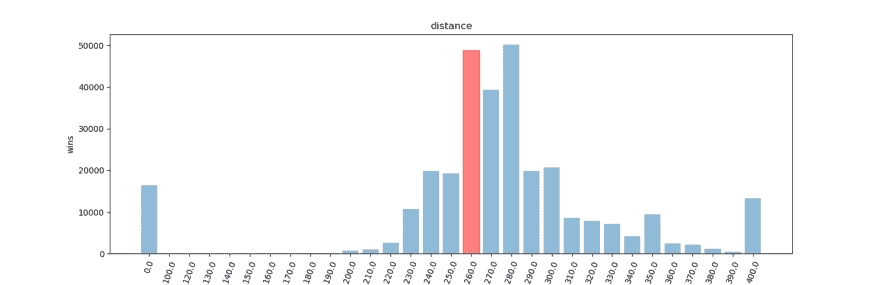
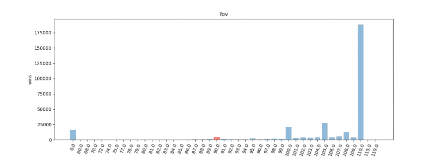
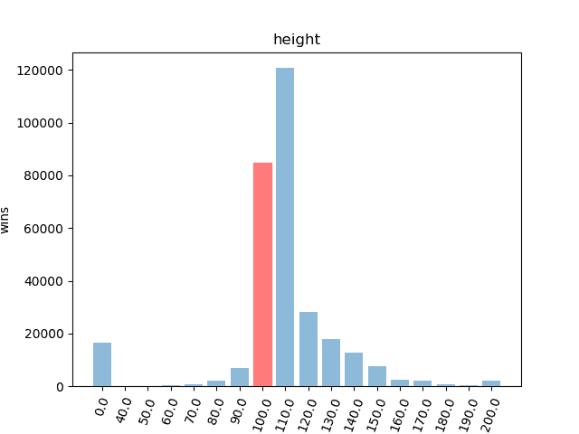
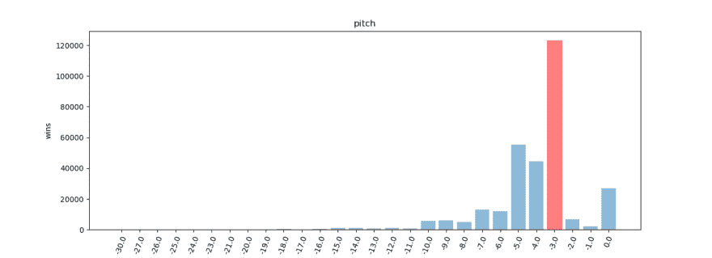
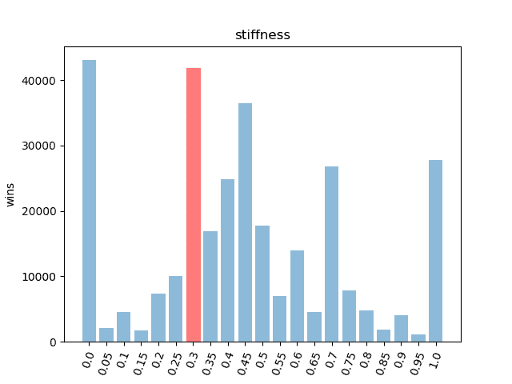
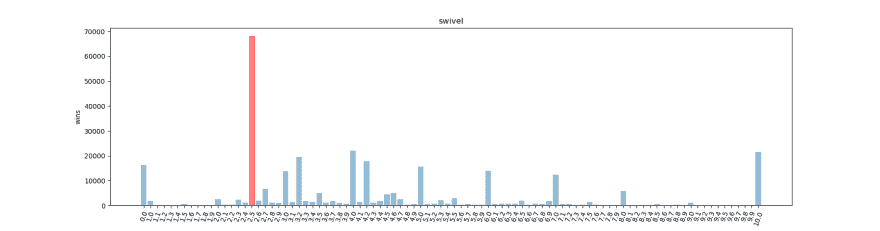

# 为火箭联盟寻找“最佳”相机设置。

> 原文：<https://dev.to/agentd00nut/finding-the-best-camera-settings-for-rocket-league-cb6>

通过从 150，000 次回放中提取相机设置，并且仅考虑获胜球队的设置，我们可以假装已经找到了“最佳”配置。

红色条表示默认相机设置。0 是无效数据，但我把它留在这里是因为为什么不。

## 图表显示每个选项每个配置的成功案例。

[T22】](https://res.cloudinary.com/practicaldev/image/fetch/s--qoMmEPrT--/c_limit%2Cf_auto%2Cfl_progressive%2Cq_auto%2Cw_880/https://pastebin.com/raw/dkQdms7q)

## 关于数据

最近，SunlessKhan 在 youtube 上发布了一段 https://ballchasing.com/的视频，这个网站允许用户上传火箭联盟的回放。它提供了一种非常棒的方式在你的浏览器中查看回放，而且还提供了大量的分析、统计和比赛信息。

相机设置似乎总是社区中一个有趣的辩论。所以我决定找出大多数人使用的设置。

## 获取数据

老实说，我本打算写下我所做的事情，但事实证明这并不有趣。归结起来就是。

1.  使用 css 选择器来选择您想要的数据。
2.  您可以使用选择器获得包含所需数据的页面的链接，并获得到下一页的分页链接。这对于没有简单分页 URL 的网站尤其有用。
3.  使用 node 和 cheerio。节点使得异步抓取变得容易。
4.  使用计时器或超时对服务器友好。
5.  有时候输出杂乱的数据，用`sed`和`tr`之类的东西清理更容易。

这是我使用的工具...大约一年前，我写得很糟糕，代码本身没有注释，而且几乎总是有效。

## [agent d00n ut](https://github.com/agentd00nut)/[CSS _ scraper](https://github.com/agentd00nut/css_scraper)

### 通过 css 选择器简化网页抓取。

<article class="markdown-body entry-content container-lg" itemprop="text">

# Css_scraper

通过 css 选择器简化网页抓取。

通过为每种数据类型指定多个选择器，轻松地从单个页面中抓取链接、文本和文件。

组合输出以方便阅读结果。

转储原始输出，以便用其他工具处理或转储到磁盘。

通过指定下一个链接选择器和要抓取的页数来抓取多个页面

通过指定下一个页面选择器来抓取**多个**页面。

控制从哪一页开始抓取。

指定加载超时。

使用睡眠间隔等待下一页。

指定要添加到链接或文件 src 的前缀文本

*通过指定 url 如何分页来抓取多个页面*

*为输出指定自定义分隔符*

斜体很快就会成为特色。

# 不要做一个混蛋

很明显，使用任何从网页上抓取数据的东西时要谨慎。如果你的 ip 被你喜欢的网站禁止了，那是你的错，或者…

</article>

[View on GitHub](https://github.com/agentd00nut/css_scraper)

真正的强大之处在于，您可以将`-n`下一个分页选择器与`-d`深度选择器结合起来。

深度选择器会将所有的`-t -f -l`选择器应用到它找到的每个链接上。
下一个分页选择器将跟随它找到的链接到达下一页。
使用`-p`只进行一定次数的分页。

您可能希望使用`-r`来获得非 json 风格的输出。

## 制作图表

这又一次变得不那么有趣了。我只是在 python 中使用 matplotlib 来增加字典中的计数器，其中的键是赢得比赛的球队的相机设置。

### 我甚至不确定我为什么要解释这些。