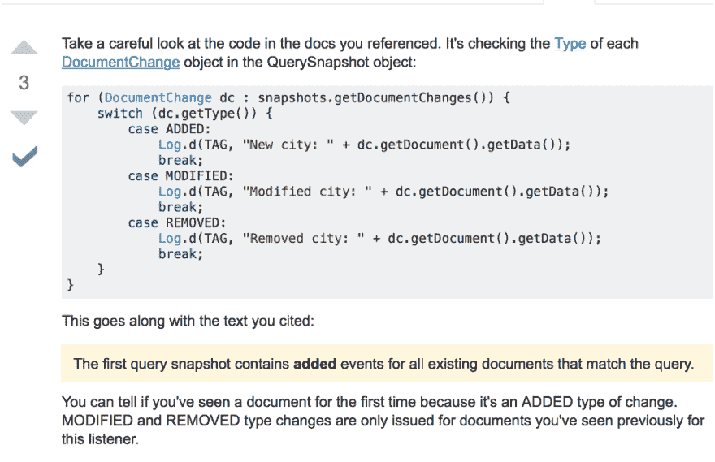

# Firebase Firestore 初始有效负载，带 onSnapshot

> 原文：<https://dev.to/omnisyle/firebase-firestore-initial-payload-with-onsnapshot-3i98>

# Firebase Firestore 初始有效负载，带 onSnapshot

<figure> 

<figcaption>图片来自[https://firebase.google.cimg/social.png](https://firebase.google.cimg/social.png)</figcaption>

</figure>

**注意**:这种方法只适用于 web，因为 Firestore 不提供 web 缓存。在 iOS 和 Android 上，由于缓存的原因，您必须采取另一种方法来处理初始有效负载和后续更新。iOS 或 Android 上订阅的第一个响应将来自缓存。第二个响应是 Firestore 的新更新，后续响应是仅更新/创建/销毁。

我使用 Firebase 已经有一段时间了。我在 Firebase 上遇到的一个问题是，当你想[订阅一个查询](https://firebase.google.com/docs/firestore/query-data/listen)时，它会在第一次调用时返回整个结果，然后返回新的/更新的文档。

假设我想忽略初始负载，只听新的变化。那只是纯粹的订阅。**你怎么知道哪个是第一个电话？**

Firebase 没有提供任何方法来检查结果集是否是第一个。我试过 stackoverflow，看看是否有人遇到了同样的问题。这个[线程](https://stackoverflow.com/questions/49798693/differentate-between-first-time-querysnapshot-and-change-listener-in-firestore)很有前途:

<figure>

<figcaption>stack overflow 线程[https://stack overflow . com/questions/49798693/differentate-between-first-time-query snapshot-and-change-listener-in-firestore](https://stackoverflow.com/questions/49798693/differentate-between-first-time-querysnapshot-and-change-listener-in-firestore)</figcaption>

</figure>

看起来第一个查询快照只包含添加的事件。当然，但是如果您也想收听新的文档事件呢？您必须像处理后续添加的事件一样处理第一个添加的事件吗？

在我的例子中，我希望**完全忽略第一个有效载荷**，只监听新的更新。新的更新可以是其他事件之外的添加事件。因此，检查它是否是第一个有效负载的添加事件不起作用。

如果我可以计算回调函数的调用次数并忽略第一次调用，那会怎么样？这是一个通用的函数包装器，它计算被包装的函数被调用的次数。