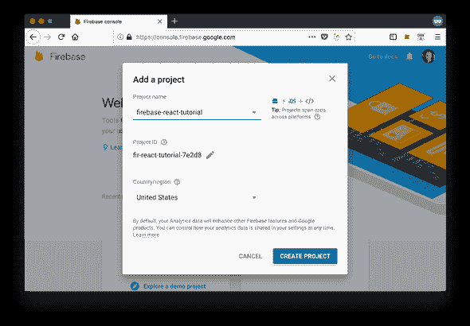
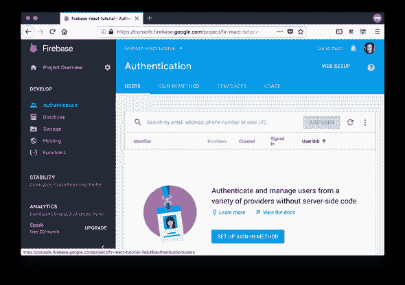
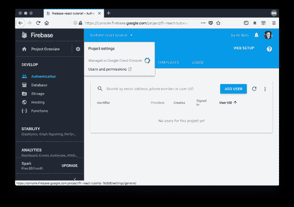

# Firebase React 身份验证教程

> 原文：<https://dev.to/satansdeer/firebase-react-authentication-tutorial-dg0>

有时你只需要快速制作一个原型，你不想弄乱后端，认证，授权和所有这一切。这就是谷歌的 firebase 可以帮助你的地方。在本教程中，我将向你展示如何连接你的反应应用程序与 Firebase 认证模块。

## 我们要建造什么

超级简单的 app。只有 3 个屏幕:注册，登录和主屏幕。

我们将使用 Firebase 身份验证模块来处理登录/注册，并使用 React 路由器来管理路由。

请务必阅读到最后，我会发布一个 Github repo 的链接，并在那里提供示例代码。

## 设置 Firebase

### 新建 Firebase App

首先进入 [firebase 控制台](https://console.firebase.google.com/)并创建新的应用程序。

[T2】](///static/firebase_react_1-bc9e75fefff4d10ea38ee408d05d8c59-d6bad.png)

### 添加认证方法

点击**认证**，然后**设置签到方式**。

[T2】](///static/firebase_tutorial_2-77ad3244e6e8fef0048ad3a909074552-4a0bd.png)

启用**电子邮件/密码**认证。

### 获取 Firebase 凭证

转到项目设置:

[T2】](///static/firebase_tutorial_3-7b90fea517ced0aeb6f38f1f04a8dd12-4a0bd.png)

并选择**将 firebase 添加到您的 web 应用程序**。从那里复制您的凭证，并将它们保存到项目根目录下的`.env`文件中。

```
REACT_APP_FIREBASE_KEY=your_key
REACT_APP_FIREBASE_DOMAIN=your_app_id.firebaseapp.com
REACT_APP_FIREBASE_DATABASE=https://your_app_id.firebaseio.com
REACT_APP_FIREBASE_PROJECT_ID=your_app_id
REACT_APP_FIREBASE_STORAGE_BUCKET=your_storage_bucket
REACT_APP_FIREBASE_SENDER_ID=sender_id 
```

Enter fullscreen mode Exit fullscreen mode

`create-react-app` webpack config 自动加载以`REACT_APP`开头的环境变量，所以我们可以引用它们。

在 [create-react-app 文档](https://github.com/facebook/create-react-app/blob/master/packages/react-scripts/template/README.md#adding-custom-environment-variables)中了解更多信息

## 设置前端

我们将使用`create-react-app`来设置应用程序。我假设您有现代版的`npm`，所以我将使用`npx`来运行脚本。

```
npx create-react-app firebase-auth-tutorial 
```

Enter fullscreen mode Exit fullscreen mode

我们还需要路由，所以也要安装 React 路由器:

```
yarn add react-router 
```

Enter fullscreen mode Exit fullscreen mode

同时删除`src/index.css`、`src/App.css`和`src/App.test.js`文件。我们现在不需要它们了。

### 将 App 连接到 Firebase

首先安装`firebase`包:

```
yarn add firebase 
```

Enter fullscreen mode Exit fullscreen mode

现在创建文件`src/base.js`，内容如下:

```
import firebase from "firebase";

const app = firebase.initializeApp({
  apiKey: process.env.REACT_APP_FIREBASE_KEY,
  authDomain: process.env.REACT_APP_FIREBASE_DOMAIN,
  databaseURL: process.env.REACT_APP_FIREBASE_DATABASE,
  projectId: process.env.REACT_APP_FIREBASE_PROJECT_ID,
  storageBucket: process.env.REACT_APP_FIREBASE_STORAGE_BUCKET,
  messagingSenderId: process.env.REACT_APP_FIREBASE_SENDER_ID
});

export default app; 
```

Enter fullscreen mode Exit fullscreen mode

### 添加路由

打开`src/App.js`，让它看起来像这样:

```
import React from "react";
import { BrowserRouter as Router, Route } from "react-router-dom";

import Home from "./Home";
import Login from "./Login";
import SignUp from "./SignUp";

const App = () => {
  return (
    <Router>
      <div>
        <Route exact path="/" component={Home} />
        <Route exact path="/login" component={Login} />
        <Route exact path="/signup" component={SignUp} />
      </div>
    </Router>
  );
};

export default App; 
```

Enter fullscreen mode Exit fullscreen mode

创建`Home`、`LogIn`和`SignUp`组件，现在只是渲染一些头部。这里，例如`src/Home.js` :

```
import React from "react";

const Home = () => {
  return <h1>Home</h1>;
};

export default Home; 
```

Enter fullscreen mode Exit fullscreen mode

运行应用程序。你应该有所有可用的路线。

### 创建注册和登录组件

现在让我们添加一些注册逻辑。创建`src/SignUp`目录并将我们的`SignUp.js`移到那里。也改名为`SignUpView.js`。让它看起来像这样:

`src/SignUp/SignUpView.js`

```
import React from "react";

const SignUpView = ({ onSubmit }) => {
  return (
    <div>
      <h1>Sign up</h1>
      <form onSubmit={onSubmit}>
        <label>
          Email
          <input
            name="email"
            type="email"
            placeholder="Email"
          />
        </label>
        <label>
          Password
          <input
            name="password"
            type="password"
            placeholder="Password"
          />
        </label>
        <button type="submit">Sign Up</button>
      </form>
    </div>
  );
};

export default SignUpView; 
```

Enter fullscreen mode Exit fullscreen mode

这是简单的表示组件。我们将`onSubmit`处理程序作为道具之一，并将其附加到表单上。我们定义了`email`和`password`字段，并添加了`Sign Up`按钮。

现在创建容器组件`src/SignUp/index.js` :

```
import React, { Component } from "react";
import { withRouter } from "react-router";
import app from "../base";

import SignUpView from "./SignUpView";

class SignUpContainer extends Component {
  handleSignUp = async event => {
    event.preventDefault();
    const { email, password } = event.target.elements;
    try {
      const user = await app
        .auth()
        .createUserWithEmailAndPassword(email.value, password.value);
      this.props.history.push("/");
    } catch (error) {
      alert(error);
    }
  };

  render() {
    return <SignUpView onSubmit={this.handleSignUp} />;
  }
}

export default withRouter(SignUpContainer); 
```

Enter fullscreen mode Exit fullscreen mode

这个组件将处理我们的注册逻辑。

让我们看看我们的`handleSignUp`函数。它被定义为匿名箭头函数。我在这里这样做是为了避免使用`bind(this)`。

在这个例子中，我真的需要类级别`this`，因为我通过使用`withRouter`包装器从 props 获得了`history`对象。否则我最好把它定义为一个常规函数。

所以在这个函数中，我`preventDefault`为了避免重新加载页面，从表单`elements`中获取`password`和`email`，并尝试使用`createUserWithEmailAndPassword`函数在 Firebase 上创建新用户。

我们的`LogIn`组件会差不多，只是把`createUserWithEmailAndPassword`函数调用改成`signInWithEmailAndPassword`

### 添加私人路线

很好，现在我们可以注册并登录了，但不幸的是这没有多大意义，因为主页甚至对非授权用户也是可用的。让我们修理它。

用以下内容创建【T0:】T1

```
import React from "react";
import { Route, Redirect } from "react-router-dom";

export default function PrivateRoute({
  component: Component,
  authenticated,
  ...rest
}) {
  return (
    <Route
      {...rest}
      render={props =>
        authenticated === true ? (
          <Component {...props} {...rest} />
        ) : (
          <Redirect to="/login" />
        )
      }
    />
  );
} 
```

Enter fullscreen mode Exit fullscreen mode

基本上，这个组件将有条件地渲染通过的`Component`或`<Redirect/>`块，这取决于通过的`authenticated`属性。

现在让我们在`App.js`中使用它。将`Home`路线改为`PrivateRoute` :

```
<PrivateRoute exact path="/" component={Home} authenticated={this.state.authenticated}/> 
```

Enter fullscreen mode Exit fullscreen mode

我们使用了我们的`state`的`authenticated`字段，但是它还不存在。让我们修理它。

### 监控认证状态

首先将你的`App.js`恢复正常`Component`，并设置初始状态:

```
class App extends Component {
  state = { loading: true, authenticated: false, user: null };

  render() {
    const { authenticated, loading } = this.state;

    if (loading) {
      return <p>Loading..</p>;
    }

    return (
      <Router>
        <div>
          <PrivateRoute
            exact
            path="/"
            component={Home}
            authenticated={authenticated}
          />
          <Route exact path="/login" component={LogIn} />
          <Route exact path="/signup" component={SignUp} />
        </div>
      </Router>
    );
  }
} 
```

Enter fullscreen mode Exit fullscreen mode

现在给你的`App.js`加上`componentWillMount`，内容如下:

```
componentWillMount() {
  app.auth().onAuthStateChanged(user => {
    if (user) {
      this.setState({
        authenticated: true,
        currentUser: user,
        loading: false
      });
    } else {
      this.setState({
        authenticated: false,
        currentUser: null,
        loading: false
      });
    }
  });
} 
```

Enter fullscreen mode Exit fullscreen mode

所以现在我们将渲染`Loading...`，直到我们从 Firebase 获得数据并更新我们的状态。然后我们渲染路由，如果我们没有注册，`PrivateRoute`会将我们重定向到`Log In`页面。

## 下一步做什么

现在，如果您已经登录，您可以添加从登录页面重定向，也可以添加注销功能(去阅读 [firebase 文档](https://firebase.google.com/docs/auth/web/manage-users)

有了这些知识，你还可以从 [React Ethereum 教程](https://maksimivanov.com/posts/ethereum-react-dapp-tutorial)中为钱包应用添加认证！

哦，顺便说一句——这是你的 [Github 链接](https://github.com/satansdeer/firebase-auth-tutorial)