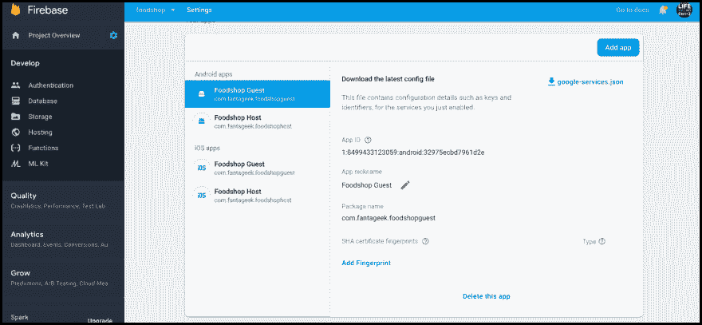
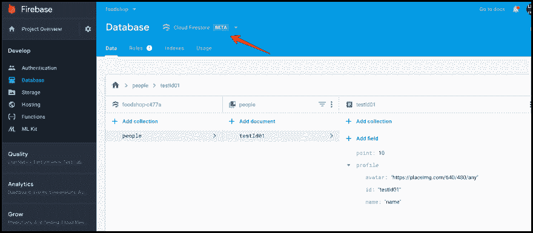
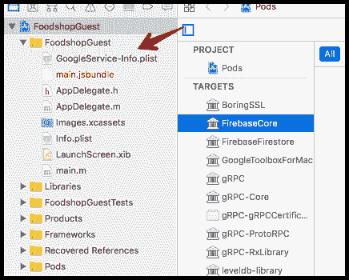
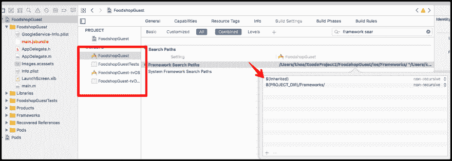

# 2018 年 Firebase SDK 和 Firestore for React 原生应用

> 原文：<https://dev.to/onmyway133/firebase-sdk-with-firestore-for-react-native-apps-in-2018-6an>

[T2】](https://res.cloudinary.com/practicaldev/image/fetch/s--S5RV4GaC--/c_limit%2Cf_auto%2Cfl_progressive%2Cq_auto%2Cw_880/https://cdn-images-1.medium.com/max/1600/0%2AVlZ7ou_WmSvHZg9a.jpg)

在 2017 年 Firebase Dev Summit[上，谷歌推出了](https://www.youtube.com/watch?v=W3xIOQu0h1w) [Firestore](https://firebase.googleblog.com/2017/10/introducing-cloud-firestore.html) 作为完全管理的 NoSQL 文档数据库，用于移动和 web 应用开发。与 Firebase 实时数据库相比，它拥有[更好的查询](https://firebase.googleblog.com/2017/10/cloud-firestore-for-rtdb-developers.html)和更多的结构化数据，以及轻松的手动获取数据。

集合和文档的新结构可能是引人注目的，这使得数据对用户来说更加直观，查询也变得轻而易举。

[](img/4d2fefa5a695ffae9fe81fe952972fb4.png) ](https://res.cloudinary.com/practicaldev/image/fetch/s--KRBLprlR--/c_limit%2Cf_auto%2Cfl_progressive%2Cq_auto%2Cw_880/https://cdn-images-1.medium.com/max/2000/0%2AmEjeh2eMqIvQYNTa.png) *来自[https://firebase . Google blog . com/2017/10/cloud-firestore-for-rtdb-developers . html](https://firebase.googleblog.com/2017/10/cloud-firestore-for-rtdb-developers.html)*

在这篇文章中，我将展示如何在 iOS 和 Android 的 React 本机应用程序中设置 Firebase Cloud Firestore，当然，还有一些难点。然后我们在 Firestore 数据库中创建和获取文档。

## Firebase Javascript SDK

我的第一个选择是使用 [Firebase Javascript SDK](https://github.com/firebase/firebase-js-sdk) ，因为它对我来说与 Firebase 实时数据库配合得很好。我的用例只是获取和更新 Firestore 集合，我认为它不涉及太多的原生功能。此外，在处理 React Native 时，如果可能的话，我会尽量避免使用本机代码。

因此，让我们尝试[开始使用云 Firestore](https://firebase.google.com/docs/firestore/quickstart)

```
npm install firebase 
```

Enter fullscreen mode Exit fullscreen mode

我安装的版本是 5.4.0。接下来，导入 firebase，注意我们还需要导入 firestore

```
const firebase = require("firebase");
// Required for side-effects
require("firebase/firestore"); 
```

Enter fullscreen mode Exit fullscreen mode

### 单据未定义

这个[问题](https://github.com/firebase/firebase-js-sdk/issues/1157)让我在桌子上敲了一会儿。正如[人](https://github.com/firebase/firebase-js-sdk/issues/1138)所指出的，是因为文件被访问。

```
var BrowserPlatform = /** @class */ (function () {
    function BrowserPlatform() {
        this.emptyByteString = '';
        this.document = document; // delete this line
        this.window = window; // delete this line
        this.base64Available = typeof atob !== 'undefined';
    } 
```

Enter fullscreen mode Exit fullscreen mode

当前 Firebase Javascript SDK 中的 firestore 组件不完全支持 React Native，因此我们需要解决这个问题或使用 npm install firebase@next 的测试版。同时，让我们试试反应原生火焰基。

## 反应原生火基

阅读 [Cloud Firestore 库和框架集成](https://firebase.google.com/docs/firestore/library-integrations)，推荐 React Native Firebase。虽然来自 [Firebase Web SDK](https://www.npmjs.com/package/firebase) 的一些功能通常可以与 React Native 一起工作，但它主要是为 Web 构建的，因此具有有限的兼容功能集。

[](img/2925f691f9d2a81a6d4f972b5ffe1479.png) ](https://res.cloudinary.com/practicaldev/image/fetch/s--U35YTrW5--/c_limit%2Cf_auto%2Cfl_progressive%2Cq_auto%2Cw_880/https://cdn-images-1.medium.com/max/2000/1%2Arae3_7gLeEQvPRDNesXgrw.png) *来源:【https://rnfirebase.io/docs/v4.3.x/getting-started】*T4

下面这篇文章和他们的[入门 app](https://github.com/invertase/react-native-firebase-starter) 就是指路星。在 iOS 和 Android 中集成本机代码可能会很痛苦，但我认为本机 Firebase 非常强大，因为它有最新的本机 Firebase SDK 包装器。

让我们安装 NPM react-native-firebase，当前版本是 4.3.8，并遵循现有项目的[手动安装指南](https://rnfirebase.io/docs/v4.3.x/installation/initial-setup)，这有助于您了解更多关于过程和引导脚本的信息。

## 匆匆一瞥

首先你需要 [Firebase 控制台](https://firebase.google.com/console)并添加一个项目。一个项目允许许多应用程序驻留，例如我有 4 个应用程序(2 个 iOS，2 个 Android)可以访问 Firestore 数据库。

[T2】](https://res.cloudinary.com/practicaldev/image/fetch/s--_JNnAalS--/c_limit%2Cf_auto%2Cfl_progressive%2Cq_auto%2Cw_880/https://cdn-images-1.medium.com/max/2868/1%2Aab5VL-6oUZdahAQAFYFBuQ.png)

在左侧菜单中，我们可以快速浏览 Firestore 及其收藏/文档结构

[T2】](https://res.cloudinary.com/practicaldev/image/fetch/s--txd7Ae8r--/c_limit%2Cf_auto%2Cfl_progressive%2Cq_auto%2Cw_880/https://cdn-images-1.medium.com/max/2796/1%2A0NEWzQZ9oiKY3lkMBxHtcA.png)

### iOS 设置

遵循 [iOS 安装指南](https://rnfirebase.io/docs/v4.3.x/installation/ios)

首先，下载 [GoogleService-Info.plist](https://rnfirebase.io/docs/v4.3.x/installation/ios#1.1.-Setup-GoogleService-Info.plist) 并放在正确的文件夹中，确保它已经通过 Xcode 添加到项目中。否则 Firebase SDK 会导致应用程序在启动后立即崩溃。

[T2】](https://res.cloudinary.com/practicaldev/image/fetch/s--VYdPNrK6--/c_limit%2Cf_auto%2Cfl_progressive%2Cq_auto%2Cw_880/https://cdn-images-1.medium.com/max/2000/1%2A-Tz59Dx1xbIyqUEuKOlXCA.png)

然后添加#import 到 AppDelegate.m 和【FIRApp configure】；以运行 didFinishLaunchingWithOptions。接下来在 ios 文件夹中用 pod init 创建 Podfile。对于 Firestore，您需要 Firebase/Firestore 来防止以下错误

> 您试图通过调用 firebase.firestore()来使用 iOS 项目中未本机安装的 firebase 模块

而且不应该用 use_frameworks！因为它给出错误“找不到 firebase core/firalyticsconfiguration . h”文件

```
platform :ios, '9.0'

target 'FoodshopGuest' do
  pod 'Firebase/Core', '~> 5.3.0'
  pod 'Firebase/Firestore', '~> 5.3.0'
end 
```

Enter fullscreen mode Exit fullscreen mode

如果您得到 Framework not found firebase analytics，那么确保每个目标在框架搜索路径的顶部都有$(inherited)

[T2】](https://res.cloudinary.com/practicaldev/image/fetch/s--tY75V3Qe--/c_limit%2Cf_auto%2Cfl_progressive%2Cq_auto%2Cw_880/https://cdn-images-1.medium.com/max/2446/1%2ATBQZ1GbbDtWFz8Ife2mTEg.png)

然后运行 react-native link react-native-firebase，你应该对 iOS 很好。

### Android 设置

与 iOS 相比，Android 的设置有点不那么简单。但也不是不可能。让我们跟随[安卓安装指南](https://rnfirebase.io/docs/v4.3.x/installation/android)。

首先，将 [google-services.json](https://rnfirebase.io/docs/v4.3.x/installation/android#2.-Setup-google-services.json) 放在 Android/app/Google-services . JSON 中。让我们也使用 Gradle 4.4 和 Google Play 服务 15.0.1。更改要使用的 gradle/gradle-wrapper . properties

```
distributionUrl=https\://services.gradle.org/distributions/gradle-4.4-all.zip 
```

Enter fullscreen mode Exit fullscreen mode

下面是我的项目 build.gradle 用 compileSdkVersion 27 和 buildToolsVersion 27.0.3。确保 google()保持在 jcenter()之上

```
// Top-level build file where you can add configuration options common to all sub-projects/modules.

buildscript {
    repositories {
        mavenLocal()
        google()
        jcenter()
        maven {
            url '[https://maven.google.com/'](https://maven.google.com/')
            name 'Google'
        }
    }
    dependencies {
        classpath 'com.android.tools.build:gradle:3.1.3'
        classpath 'com.google.gms:google-services:4.0.1'

// NOTE: Do not place your application dependencies here; they belong
        // in the individual module build.gradle files
    }
}

allprojects {
    repositories {
        mavenLocal()
        google()
        jcenter()
        maven {
            // All of React Native (JS, Obj-C sources, Android binaries) is installed from npm
            url "$rootDir/../node_modules/react-native/android"
        }
    }
}

ext {
    buildToolsVersion = "27.0.3"
    minSdkVersion = 16
    compileSdkVersion = 27
    targetSdkVersion = 26
    supportLibVersion = "26.1.0"
} 
```

Enter fullscreen mode Exit fullscreen mode

对于我的应用程序模块 build.gradle，让我们在文件的最底部应用插件:“com.google.gms.google-services”，这很重要。在依赖项部分，您必须拥有 com . Google . firebase:firebase-firestore 以包含 Firestore 组件。

```
dependencies {
    implementation project(':react-native-firebase')
    implementation fileTree(dir: "libs", include: ["*.jar"])
    implementation "com.android.support:appcompat-v7:${rootProject.ext.supportLibVersion}"

// Firebase dependencies
    implementation "com.google.android.gms:play-services-base:15.0.1"
    implementation "com.google.firebase:firebase-core:16.0.1"
    implementation "com.google.firebase:firebase-firestore:17.0.2"

} 
```

Enter fullscreen mode Exit fullscreen mode

确保没有重复的项目(':react-native-firebase ')。而且既然用的是 Gradle 4，那就用实现代替编译
[**在 Gradle 中实现和编译有什么区别？**
*本网站使用 cookies 提供我们的服务，并向您显示相关广告和工作列表。通过使用我们的网站，您……* stack overflow . com](https://stackoverflow.com/questions/44493378/whats-the-difference-between-implementation-and-compile-in-gradle)

因为 Firestore，让我们按照[react-native-firebase-starter](https://github.com/invertase/react-native-firebase-starter/blob/master/android/app/build.gradle)来修复堆问题

```
dexOptions {
    javaMaxHeapSize "4g"
}

multiDexEnabled true 
```

Enter fullscreen mode Exit fullscreen mode

如果获得本机模块，RNFirebaseModule 会尝试重写 FNFirebaseModule

> 本机模块 RNFirebaseModule 试图重写模块名为 Firebase 的 FNFirebaseModule。如果这是您的意图，请设置“canOverrideExistingModule=true”

然后确保您的 MainApplication.java 对于新的 RNFirebasePackage()没有重复。这里是我的 MainApplication.java，注意需要导入 io . invertase . firebase . firestore . rnfirebasefirestorepackage；若要使用 RNFirebaseFirestorePackage

```
package com.fantageek.foodshophost;

import android.app.Application;

import com.facebook.react.ReactApplication;
import io.invertase.firebase.RNFirebasePackage;
import io.invertase.firebase.firestore.RNFirebaseFirestorePackage;
import com.facebook.react.ReactNativeHost;
import com.facebook.react.ReactPackage;
import com.facebook.react.shell.MainReactPackage;
import com.facebook.soloader.SoLoader;

import java.util.Arrays;
import java.util.List;

public class MainApplication extends Application implements ReactApplication {

private final ReactNativeHost mReactNativeHost = new ReactNativeHost(this) {
    [@Override](http://twitter.com/Override)
    public boolean getUseDeveloperSupport() {
      return BuildConfig.DEBUG;
    }

[@Override](http://twitter.com/Override)
    protected List<ReactPackage> getPackages() {
      return Arrays.<ReactPackage>asList(
          new MainReactPackage(),
          new RNFirebasePackage(),
          new RNFirebaseFirestorePackage()
      );
    }

[@Override](http://twitter.com/Override)
    protected String getJSMainModuleName() {
      return "index";
    }
  };

[@Override](http://twitter.com/Override)
  public ReactNativeHost getReactNativeHost() {
    return mReactNativeHost;
  }

[@Override](http://twitter.com/Override)
  public void onCreate() {
    super.onCreate();
    SoLoader.init(this, /* native exopackage */ false);
  }
} 
```

Enter fullscreen mode Exit fullscreen mode

我的经验是，你应该总是使用 Android Studio 来执行 Gradle sync 或构建项目，在那里你应该能够更容易地发现编译问题。有了上面的所有步骤，编译应该会成功。

在 Android 上运行 React Native 的一个问题是，如果在 react-native run-android 和 Metro 一直显示加载依赖图，done，那么你应该通过 Android Studio -> AVD Manager 或 adb 启动模拟器，应用程序应该已经安装在模拟器中，打开应用程序，Metro 将再次开始加载。

## 试火

React Native Firebase 应该为您提供与 web 中的 API 类似的 API，所以请从[Get data with Cloud Firestore](https://firebase.google.com/docs/firestore/query-data/get-data)了解如何获取或设置文档。

我喜欢在单独的文件中组织服务，以下是如何引用 firestore 和加载文档。

```
import firebase from 'react-native-firebase'

类 FirebaseService { 
构造函数(){
this . ref = firebase . firestore()。收藏(‘人’)
}

异步加载(id){
const doc = await this . ref . doc(id)。get()
if(doc . exists){
return doc . data()
} else {
const default doc = {
name:" ABC "，
 age: 2 
 }

等待此引用文件(id)。设置【默认单据】
返回单据
 } 
 } 

export const firebaseService = new firebaseService() 
```

Enter fullscreen mode Exit fullscreen mode

## 
  
何去何从

我希望这篇文章有助于在 React Native apps 中设置 Firebase SDK。以下是一些有助于您进一步探索的资源。如果您在使用 react-native-firebase 时遇到任何麻烦，react-native-firebase-starter 包含了非常棒的参考代码。
[**React Native 上的云 Firestore 入门**
*一周前，Firebase 宣布推出云 Firestore，这是一个很棒的 NoSQL 文档数据库，补充了现有的…* blog . inversase . io](https://blog.invertase.io/getting-started-with-cloud-firestore-on-react-native-b338fb6525b9)
[**inversase/React-Native-Firebase-starter**
* React-Native-Firebase-starter-🎁预集成了 react-native-firebase 的基本 react 原生应用程序，因此您可以…*github.com](https://github.com/invertase/react-native-firebase-starter)

原帖[https://medium . com/react-native-training/firebase-SDK-with-firestore-for-react-native-apps-in-2018-aa89 a67d 6934](https://medium.com/react-native-training/firebase-sdk-with-firestore-for-react-native-apps-in-2018-aa89a67d6934)

* * *

支持我的应用程序

*   [推送 Hero -测试推送通知的纯 Swift 原生 macOS 应用](https://www.producthunt.com/posts/push-hero-2)
*   [快速访问-在 Mac 菜单栏中组织文件](https://www.producthunt.com/posts/quick-access)
*   [帧记录器-带帧记录器 gif 和视频](https://www.producthunt.com/posts/frame-recorder)
*   [其他应用](https://onmyway133.github.io/projects/)

❤️❤️😇😍🤘❤️❤️