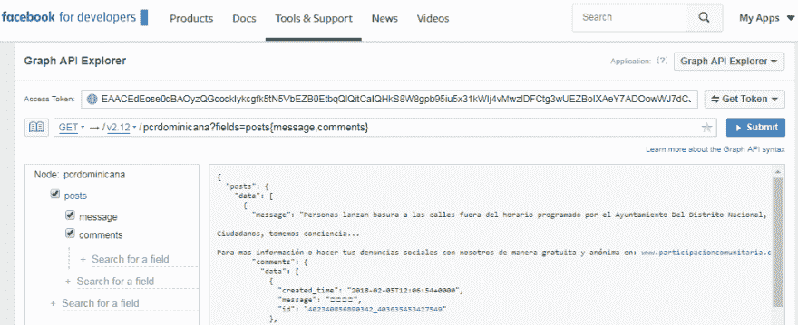

# 对脸书图形 API 的第一印象

> 原文：<https://dev.to/jjsantos/first-impression-about-facebooks-graph-api--59i5>

[T2】](https://res.cloudinary.com/practicaldev/image/fetch/s--HzGoaBBj--/c_limit%2Cf_auto%2Cfl_progressive%2Cq_auto%2Cw_880/https://thepracticaldev.s3.amazonaws.com/i/iuy7epdgln1vx0pov33c.jpg)

这几天我一直在查看脸书的 Graph API，下面是我对它的第一印象。

对于那些不知道脸书的 Graph API 的人来说，他们将其定义为*“进出脸书社交图的主要方式”*或*“Facebook 平台的核心，使开发者能够从脸书读取数据并将数据写入其中”。*

在快速浏览了文档之后，我只能说学习曲线比其他类似的服务要低很多，比如 Twitter 的 API。

脸书的 Graph API 相对于其他 API 的最大优势之一(至少从我的角度来看)，是你不需要任何特殊的代码结构就可以从他们的 API 中获取大部分信息；您只需遵循常规流程来使用 JSON 响应...

从脸书的图形 API 中获取数据:

```
fetch("https://graph.facebook.com/v2.9/HereGoesThePageID/posts?access_token=HereGoesYourToken")
       .then(response => response.json())
       .then(json => {
         console.log(json);
         this.setState({data: json});
       }); 
```

Enter fullscreen mode Exit fullscreen mode

在 UI 中显示结果:

```
 {this.state.data['data'].map((item) => {
               return (
                 <div key={item.id}>
                 <Card>
                    <Row>
                          <Col>
                            <h6>{item.story}</h6>
                            <h6>{item.message}</h6>
                          </Col>
                    </Row>
                </Card>
                 </div> 
             );
                  })} 
```

Enter fullscreen mode Exit fullscreen mode

Twitter 的 API 过去也是这样工作的，但几年前，他们增加了一个新的安全级别，实现了**“Oauth”**，这使得请求和响应更加“安全”，但这增加了学习曲线，需要更多时间来正确处理 API。脸书的 Graph API 也有安全请求，就像 Twitter 中的 Oauth 一样，但在这种情况下，它只适用于一些特殊的请求，比如当你试图获取被所有者或脸书警方视为隐私的数据时。

[T2】](https://res.cloudinary.com/practicaldev/image/fetch/s--p_L-1bGS--/c_limit%2Cf_auto%2Cfl_progressive%2Cq_auto%2Cw_880/https://thepracticaldev.s3.amazonaws.com/i/i9hx2aeodb2utpgwkxig.PNG)

脸书 Graph API 的另一个优势是他们拥有大量的文档和工具，我们可以在他们自己的“控制台”中发出请求，这让我们很容易理解我们可用的标准，并帮助我们在开始使用 API 之前确定我们需要什么。

* * *

我在 github 中做了一个简单的演示，演示了如何使用脸书的 Graph API 和 Javascript (ReactJS)从脸书页面获取帖子，所以你可以在那里找到上面例子的完整代码。

你用过脸书的图形 API 吗？让我知道你的体验如何，以及你为什么使用它...