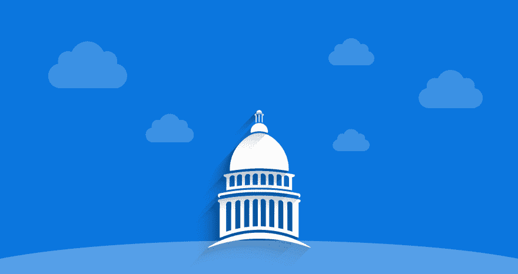

# 第一个 MongoDB 托管 DBaaS 来支持 Azure 政府公共部门

> 原文：<https://dev.to/scalegrid/first-mongodb-hosting-dbaas-to-support-azure-government-for-public-sector-2onk>

 
加利福尼亚州 PALO 阿尔托，2018 年 7 月 19 日——数据库托管和管理领域的新兴领导者 ScaleGrid 刚刚宣布在 [Azure 政府云](https://mongodb.scalegrid.io/mongodb-hosting-on-azure-government)上提供完全托管的 [MongoDB 托管](https://scalegrid.io/mongodb.html)。他们的高级数据库即服务(DBaaS)解决方案允许美国政府机构、承包商、教育机构和非营利组织为其政府工作负载采用高级数据库管理平台，以满足其广泛的法规和合规性要求。

Azure 政府云计算已经建立了具有世界级安全框架的专属数据中心，以保护我们国家最敏感的信息免受网络安全威胁。

ScaleGrid 是第一个也是唯一一个通过其 MongoDB 自带云(BYOC)解决方案支持 Azure Government 的数据库管理平台。这些计划提供了他们的 MongoDB 专用和共享集群计划的高级 DBaaS 功能，但是是在您自己的 Azure 政府帐户的安全范围内。它们使公共部门能够简化其复杂的基础设施运营，节省数百万美元的纳税人资金，同时获得世界领先的数据库管理工具来优化其运营。

ScaleGrid 首席执行官兼创始人 Dharshan Rangegowda 表示:“随着美国政府机构和合作伙伴越来越倾向于云计算，我们不断收到 Azure 政府对 MongoDB 托管的高级监管支持需求。“我们的政府客户希望消除维护生产部署的巨大负担，并利用完全托管的云数据库的灵活性和省时优势，借助 ScaleGrid，他们可以在不影响国家数据安全性的情况下实现基础设施的现代化。”

ScaleGrid 的 Azure Government 计划包括利用私有虚拟网络(VNET)、保留实例、混合云、安全组的能力，以及维护对 MongoDB 的完全管理访问。ScaleGrid 的一些高级功能包括监控控制台、无限备份、警报、慢速查询分析、高性能集群、外壳管理、磁盘加密、动态扩展和月度报告。随着 ScaleGrid 的 MongoDB on Azure Government 的发布，美国联邦、州和地方政府机构可以减轻内部管理数据库的负担和风险，并专注于为创新构建更强大的基础设施。

阅读原文:[第一个 MongoDB 托管 DBaaS 来支持 Azure Government for Public Sector](https://scalegrid.io/blog/first-mongodb-hosting-dbaas-to-support-azure-government-for-public-sector/)

**关于 ScaleGrid**

[ScaleGrid](https://scalegrid.io) 提供全面管理的数据库即服务(DBaaS)解决方案，被包括 ups、戴尔和 Adobe 在内的数千家开发人员、初创公司和企业客户所使用。该平台支持公共云和私有云上的 [MongoDB 托管](https://scalegrid.io/mongodb.html)和 [Redis 托管](https://scalegrid.io/redis.html)，包括 AWS、Azure、DigitalOcean 和 VMware，并处理您所有的数据库操作，以便您可以专注于您的产品。