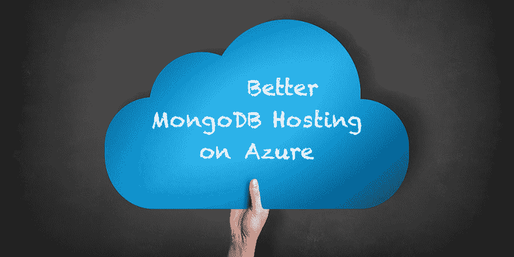

# 在 Azure 上托管更好的 MongoDB 的五个技巧

> 原文：<https://dev.to/scalegrid/five-tips-for-better-mongodb-hosting-on-azure-53m1>

[T2】](https://res.cloudinary.com/practicaldev/image/fetch/s--kLVV3kcn--/c_limit%2Cf_auto%2Cfl_progressive%2Cq_auto%2Cw_880/https://thepracticaldev.s3.amazonaws.com/i/8vru4wtcqd5o0m08m0o8.jpg)

Azure 云计算平台在过去几年经历了一系列令人眼花缭乱的改进，几乎不像微软在 2010 年开始的原始平台。ScaleGrid 是最早支持 Azure 的 MongoDB 托管平台之一，随着 Azure 的发展，我们将继续改进我们的产品。

无论你使用 Azure 已经有一段时间了，还是刚刚开始使用 Azure 进行 MongoDB 托管，这里有一些你应该考虑的架构设计模式，以确保你利用 Azure 平台获得最佳的 MongoDB 托管体验。

1.  ## Azure 资源管理器(ARM)平台

    利用新的 [Azure 资源管理器](https://azure.microsoft.com/en-us/features/resource-manager/ "Azure Resource Manager") (ARM)平台的力量。如果你还在 Azure Classic 平台上，现在就是行动的时候了！迁移到新的 ARM 平台有几个好处，包括利用托管磁盘、虚拟网络和保留实例。所有的好处都在[将 IaaS 迁移到 Azure Resource Manager 的好处](https://azure.microsoft.com/en-us/blog/migrate-iaas-to-azure-resource-manager/ "Benefits of migrating IaaS to Azure Resource Manager")博文中有详细介绍。

2.  ## Azure 虚拟网络和网络安全组

    数据库最好部署在不暴露于互联网的私有子网中。Azure 允许你创建自己的[虚拟网络](https://docs.microsoft.com/en-us/azure/virtual-network/virtual-networks-overview "Azure Virtual Network (VNET)") (VNET)并将你的数据库服务器部署到特定的子网。您还可以通过创建网络安全组(NSG)规则来处理访问控制，并为您的数据库服务器分配一个公共 IP(仅当您需要通过 internet 访问它时)。作为我们[自带云](https://scalegrid.io/blog/bring-your-own-azure-account-for-mongodb-redis-hosting/ "Bring Your Own Cloud - Azure MongoDB Hosting")模式的一部分，我们允许我们的客户在他们自己的 VNET 部署他们的 MongoDB 集群，以利用先进的 VNET 和 NSG 安全控制。

3.  ## Azure 可用性集和可用性区域

    [可用性集](https://docs.microsoft.com/en-us/azure/virtual-machines/linux/tutorial-availability-sets "Azure Availability Sets")对于跨不同硬件分布集群节点至关重要。这样，单个硬件故障不会影响所有节点。我们的建议是为每个副本创建一个可用性集。Azure 最近还引入了[可用性区域](https://docs.microsoft.com/en-us/azure/availability-zones/az-overview "Azure Availability Zones")，以保护您免受数据中心级中断的影响。您可以在 99.99%的正常运行时间内跨可用性区域分发您的副本。

4.  ## Azure 实例类型

    为 MongoDB 负载选择正确的 Azure 实例类型非常重要——并不是所有的实例类型都适合 MongoDB。通常，您应该关注“内存优化”实例类型或“存储优化”实例类型。

    最新的 Ev3 系列内存优化实例通常是大多数 MongoDB 工作负载的良好起点。如果您需要比 E2 v3 更多的 CPU，您可以考虑“通用”Dv3 实例类型。

    “突发”模式实例“B1S、B1MS、B2MS”通常非常适合小型工作负载、开发/测试环境等。随着您的数据变得越来越大，带有 Azure 本地 SSD 磁盘的“存储优化”L4 系列是一个很好的选择——在下面的 Azure 磁盘部分有更多详细信息。一般来说，正确的实例类型取决于您的工作负载，因此根据您的工作负载对各种实例类型进行迭代和[负载测试](https://scalegrid.io/blog/how-to-benchmark-mongodb-with-ycsb/ "Load Tests - How to Benchmark MongoDB with YCSB")非常重要。

5.  ## 天蓝色磁盘

    Azure 提供多种磁盘类型来处理不同的工作负载:
    *   ### 传统磁盘（标准和高级)

        出于讨论的目的，我们不打算考虑传统 Azure 磁盘。如果您使用的是传统磁盘，您应该考虑迁移到被管理的磁盘。
    *   ### 托管磁盘(标准和高级)

        [Azure 托管磁盘](https://azure.microsoft.com/en-us/services/managed-disks/ "Azure Managed Disks")极大地简化了 Azure 上计算磁盘的管理。与传统磁盘相比，它们有几个优点:

        *   无需担心存储帐户。
        *   无需担心存储帐户大小和性能限制。
        *   简单的快照和从快照创建新磁盘。
        *   轻松地从标准版转换到高级版，反之亦然。
        *   利用增强的可用性集来应用到您的磁盘。

        你可以在 [Azure 文档](https://docs.microsoft.com/en-us/azure/virtual-machines/windows/managed-disks-overview)中找到关于托管磁盘和传统磁盘之间差异的完整细节。

        [Premium Managed Disks](https://docs.microsoft.com/en-us/azure/virtual-machines/windows/premium-storage "Azure Premium Managed Disks") also offer different IOPS gaurantees depending on the size of the disk. For production MongoDB clusters, we would highly recommend Premium Managed Disks while for dev/test environments, Standard Managed Disks are a good fit.
    *   ### 本地 SSD 磁盘

        Azure“存储优化”实例类型提供大型本地 SSD 磁盘，这些磁盘在 Azure 中提供最佳吞吐量。这非常适合需要大量磁盘输入/输出(I/O)的大型集群。我们用于 MongoDB 的 [Azure 高性能](https://scalegrid.io/pricing.html "Azure High Performance MongoDB Hosting")集群使用了 [L 系列](https://azure.microsoft.com/en-us/pricing/details/virtual-machines/series/ "Azure L-Series")实例。然而，本地 SSD 磁盘是“短暂的”——当您停止实例时，数据会消失。因此，在使用本地磁盘时非常小心是很重要的。我们的建议是使用托管高级磁盘上的一个副本，以确保数据的安全。

6.  ## 利用 Azure 保留实例

    Azure 现在支持[保留实例](https://azure.microsoft.com/en-us/pricing/reserved-vm-instances/ "Azure Reserved Instances") (RI 的)又名 AWS。您可以提前购买一年或三年的 Azure Reserved 实例，并大幅降低 MongoDB 托管成本高达 82%。