# 提高反应模式的五种方法

> 原文：<https://dev.to/yazanaabed/five-ways-to-advanced-react-patterns-2bai>

*我在*[*Frontend Masters*](https://medium.com/u/1b199ed2dfd)*观看*[*Kent c . Dodds*](https://medium.com/u/db72389e89d8)*【高级反应模式】课程后所学到的东西。*

<figure> 

<figcaption>照片由 rawpixel.com 发自 Pexels</figcaption>

</figure>

我爱上了 ReactJS，开始学习我能确定的东西。我开始看课程，写代码，读文章。之后，我决定开始写我从 ReactJS 社区和那里的专家那里学到的东西。

你可以在 twitter 上关注我，或者在我的网站 yaabed.com 上查看我的最新文章。另外，我在 blog.yaabed.com 媒体的[有我的出版物。](https://medium.com/yazanaabed)

在继续阅读这篇文章之前，我建议你阅读我的另一篇关于 ReactJS 的文章。“如果你是 ReactJS 的初学者，或者在[https://egghead.io/](https://egghead.io/)观看[肯特·c·多兹](https://medium.com/u/db72389e89d8) [初级课程。](https://egghead.io/courses/the-beginner-s-guide-to-react)

> 让我们一起开始学习高级反应。

React 编程模式用于简化大型 React 应用程序，并使您的团队体验更容易，这有助于您的团队构建独立的组件并在它们之间共享逻辑。

阅读完本文后，您将了解更多现代 React 模式，如复合组件、渲染道具、道具获取器、控制器道具、上下文 API。

### 高级反应模式

软件模式让你有能力让你的代码更加可重用。

#### 复合成分

复合组件是一种在彼此内部编写元素的方式，但主要条件是内部组件没有其主要父组件就无法工作。

我们也可以将其定义为共享同一个状态、共享同一个父状态和共享父状态。

我最喜欢的一个例子是 tabs 组件，这是我在开始学习 ReactJS 时构建的。

[https://medium . com/media/f 039 ce a09 c 73 e 99 b 79 a 33 ed 9 CB 95d 168/href](https://medium.com/media/f039cea09c73e99b79a33ed9cb95d168/href)

<figure>[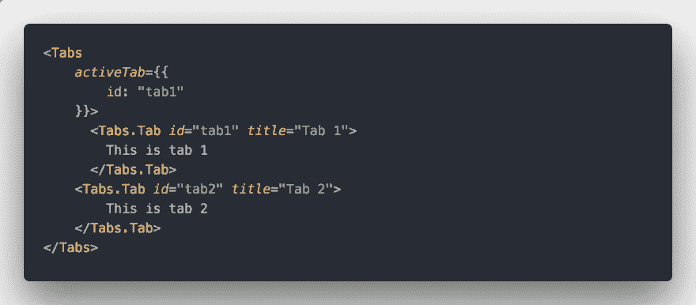](https://res.cloudinary.com/practicaldev/image/fetch/s--fC854Wqu--/c_limit%2Cf_auto%2Cfl_progressive%2Cq_auto%2Cw_880/https://cdn-images-1.medium.com/max/1024/1%2AQ2GT9jT73stIP74NZRamwQ.png) 

<figcaption>复合元件举例。</figcaption>

</figure>

如果需要将父容器中的内容共享给其子容器，可以使用 React。儿童提供了处理这些问题的工具

<figure>[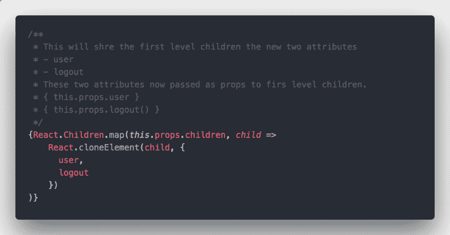](https://res.cloudinary.com/practicaldev/image/fetch/s--0mmccbbC--/c_limit%2Cf_auto%2Cfl_progressive%2Cq_auto%2Cw_880/https://cdn-images-1.medium.com/max/1024/1%2Afmah_c-NhYabdzVTK0DG4g.png) 

<figcaption>从父组件共享道具。</figcaption>

</figure>

但是，这种解决方案对于复合组件不够灵活，因为当您更改部件的顺序或将它们包装在另一个元素中时，它们现在将无法访问 props，因为 map 函数循环通过父组件中的第一级。

为了解决上述问题，我们需要另一种方法来共享组件之间的状态，如果你的插件的用户改变了他表示元素的方式。我们可以使用上下文 API 在组件之间共享状态。

使用上下文 API 的第一个元素称为 provider，Provider 元素是共享相同状态的元素的包装器父元素。然后是消费者，提供者内部的每个组件都可以使用它从提供者那里获取或检索值。

<figure>[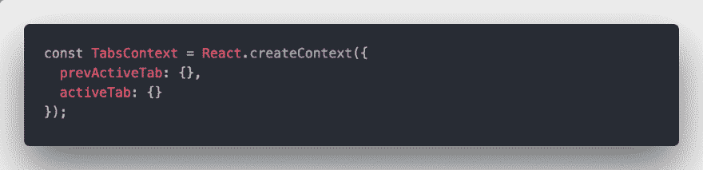](https://res.cloudinary.com/practicaldev/image/fetch/s--Xi0XoJ9S--/c_limit%2Cf_auto%2Cfl_progressive%2Cq_auto%2Cw_880/https://cdn-images-1.medium.com/max/1024/1%2A0NHlhyfcpTAycVx8wlAqFg.png) 

<figcaption>如何用 React 创建上下文元素。</figcaption>

</figure>

<figure>[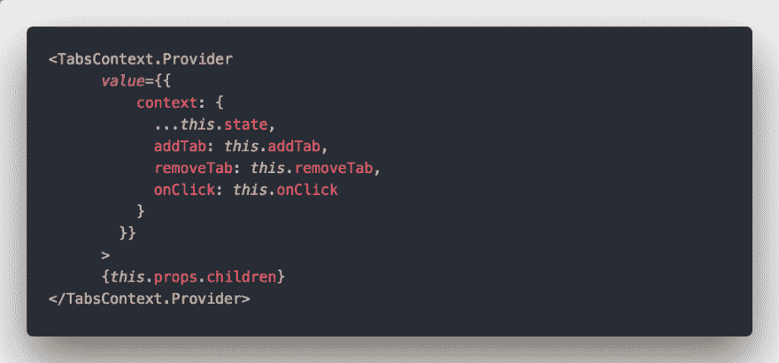](https://res.cloudinary.com/practicaldev/image/fetch/s--9kOMZzIo--/c_limit%2Cf_auto%2Cfl_progressive%2Cq_auto%2Cw_880/https://cdn-images-1.medium.com/max/1024/1%2AFlBUvuRhGLeGMDMyE1L-ng.png) 

<figcaption>这是每个消费者需要使用的父元素的父状态。</figcaption>

</figure>

> 对于上面的代码，这样设置 object 不是一个最佳实践，因为每次调用 render 方法都会创建一个新的引用和新的对象。所以人们说要把这些东西放在组件状态中，甚至是回调中，以避免每次不必要的重新渲染。

[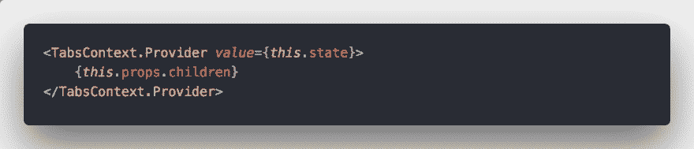T2】](https://res.cloudinary.com/practicaldev/image/fetch/s--15OMBtOi--/c_limit%2Cf_auto%2Cfl_progressive%2Cq_auto%2Cw_880/https://cdn-images-1.medium.com/max/1024/1%2AVZzBHA18B3-HWt3ATm63mw.png)

<figure>[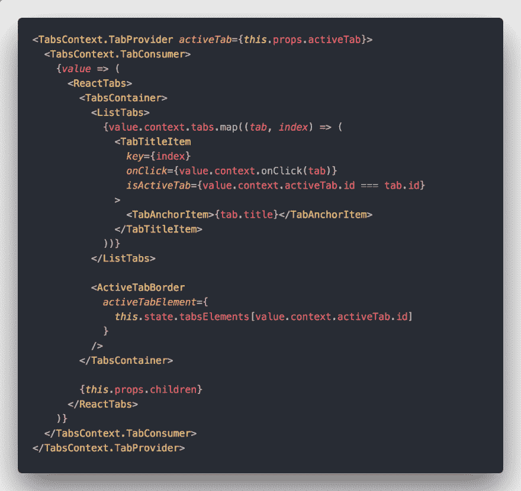](https://res.cloudinary.com/practicaldev/image/fetch/s--49ixfvTw--/c_limit%2Cf_auto%2Cfl_progressive%2Cq_auto%2Cw_880/https://cdn-images-1.medium.com/max/1024/1%2A-l5GOXOQH8f6xskSyHZyvg.png) 

<figcaption>这就是如何使用消费和检索父状态。</figcaption>

</figure>

请注意，消费者子代是传递给消费者的函数，消费者将状态传递给子代。

当我的用户对于组件，不需要关心实现细节时，复合组件是有用的。例如，我们在父组件中检查标签是否被点击。

我建议你自己尝试一下，以了解更多关于如何在组件之间共享东西的信息，[这里的](https://codesandbox.io/s/6vx9026q1z)是一个简单的开始工作的项目。尽量让它使用上下文 API，而不是 React.Children。

#### 渲染道具

这种技术使用道具，这就是为什么它被称为渲染道具。您将一个函数作为 render 方法传递，该方法返回 ReactJS 元素并用于呈现事物。

约定俗成的是给它起个渲染道具的名字，但没必要这么叫，有些人还把儿童道具当功能用。但是，你传递的任何属性作为一个函数来渲染来自另一个地方的东西，这叫做“渲染道具”。

我说的道具是指你的组件输入。让我在下一段代码中展示一个例子。

[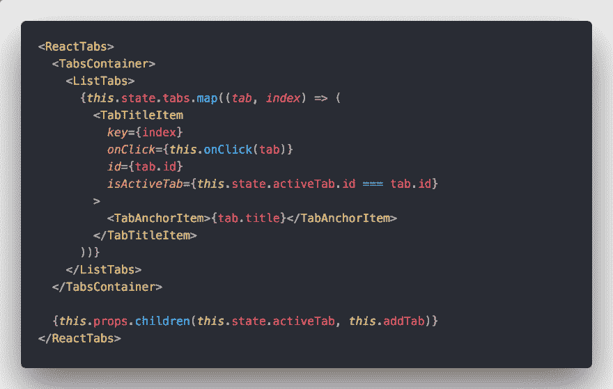T2】](https://res.cloudinary.com/practicaldev/image/fetch/s--5r2PD7Lu--/c_limit%2Cf_auto%2Cfl_progressive%2Cq_auto%2Cw_880/https://cdn-images-1.medium.com/max/1024/1%2AtLfVv8PJbyUK4xbPUP3Xxg.png)

看组件的末尾。它是一个子组件，但我们没有把它当作{this.props.children}来使用，而是把它当作一个函数来使用，并向它传递我们需要的参数，以使我们组件的用户为我们返回他需要的组件。看看下一段代码如何使用这个组件。

[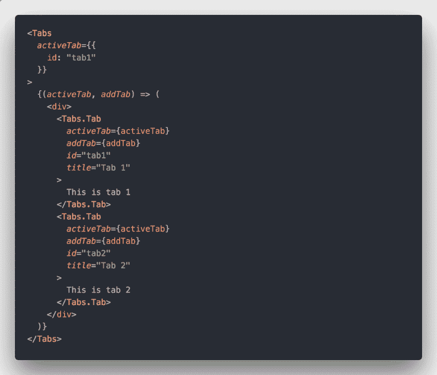T2】](https://res.cloudinary.com/practicaldev/image/fetch/s--ARi4tNv7--/c_limit%2Cf_auto%2Cfl_progressive%2Cq_auto%2Cw_880/https://cdn-images-1.medium.com/max/1024/1%2A46mK7NGtKwcEr_PaUAKgew.png)

不错吧？自己试试，把你的一个道具换成一个功能，把你需要移动的任何东西都传给它。这个技巧允许你创建共享的东西，甚至不需要使用上下文 API。

在 [Frontend Masters](https://medium.com/u/1b199ed2dfd) 的 [Kent C. Dodds](https://medium.com/u/db72389e89d8) 的“高级反应模式”课程中，他给出了一些在使用渲染道具时使用的极好的技巧。我还推荐观看 [egghead.io](https://egghead.io/) 中的“[高级 React 组件模式](https://egghead.io/courses/advanced-react-component-patterns)课程。

<figure> 

<figcaption>照片由[鲁德梅乌拉·费尔南德斯](https://unsplash.com/@ludemeula?utm_source=medium&utm_medium=referral)上[下](https://unsplash.com?utm_source=medium&utm_medium=referral)</figcaption>

</figure>

#### 受控组件

受控是指你自己负责改变事物的状态。其中一个著名的例子就是你的表单输入，当你传递一个价值道具给你的“输入”时事情就改变了。

现在，当用户开始输入时，您必须为您的输入传递 onChange 事件，以确保在您的状态中更改它。如果在不改变状态的情况下给出一个值属性，用户输入将永远不会反映他输入的实际文本。

这就是为什么它被称为受控的，你控制的变化，并传递给你的输入。

[Kent C. Dodds](https://medium.com/u/db72389e89d8) 也举了一个很好的例子，比如当用户点击某个东西超过四次，我需要给他一个消息，阻止他打字，如果我不是写组件的人，这就不可能发生。

[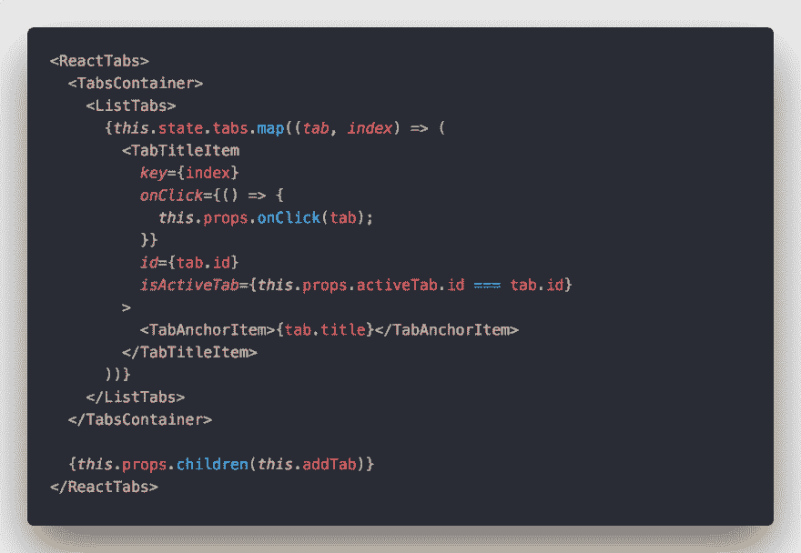T2】](https://res.cloudinary.com/practicaldev/image/fetch/s--pt7oqToe--/c_limit%2Cf_auto%2Cfl_progressive%2Cq_auto%2Cw_880/https://cdn-images-1.medium.com/max/1024/1%2ASh3Tw5IydO9u7INNJYlNIw.png)

[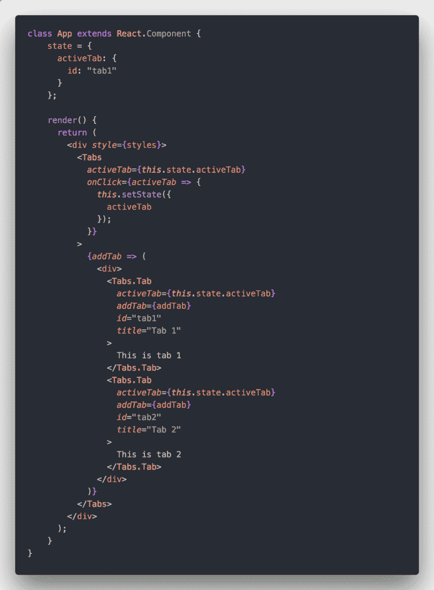T2】](https://res.cloudinary.com/practicaldev/image/fetch/s--6Wkh5mYK--/c_limit%2Cf_auto%2Cfl_progressive%2Cq_auto%2Cw_880/https://cdn-images-1.medium.com/max/1024/1%2At2ysMbK_K4l7q_VYXy1seA.png)

对于我的选项卡组件，我已经更改了活动选项卡现在从道具中获取，并且我不是控制它的人。我触发了一个事件，用户点击了我的组件，你自己改变了活动标签。

#### 状态减速器

缩减器是一个简单的函数，它接受输入并返回输出，而不会改变应用程序的状态。这种类型的服务称为纯功能。

用于为组件提供生成新状态的功能的状态缩减器依赖于从缩减器返回的值。例如，在我的 tabs 组件上，用户将一个名为 stateReducer 的属性作为函数传递，而在 tabs 组件内部，我们在 tabs 组件内部发生任何状态更改时调用该函数，并将其指定为一个新状态。

这种模式就像用你的道具控制一个组件一样，但是这次组件的所有者会把旧的状态和变化发送给你，并让你决定改变内部状态。

<figure>[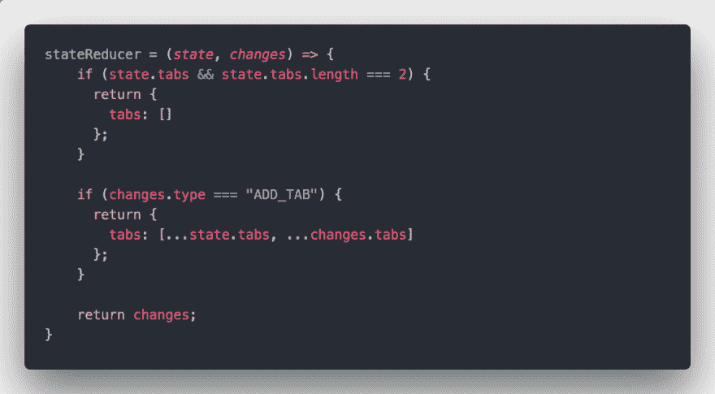](https://res.cloudinary.com/practicaldev/image/fetch/s--boVnFd4l--/c_limit%2Cf_auto%2Cfl_progressive%2Cq_auto%2Cw_880/https://cdn-images-1.medium.com/max/1024/1%2AuFhpzHRxE-jbgL1W1yQkog.png) 

<figcaption>[状态减速器示例](https://codesandbox.io/s/w7kv2080vw)。</figcaption>

</figure>

<figure>[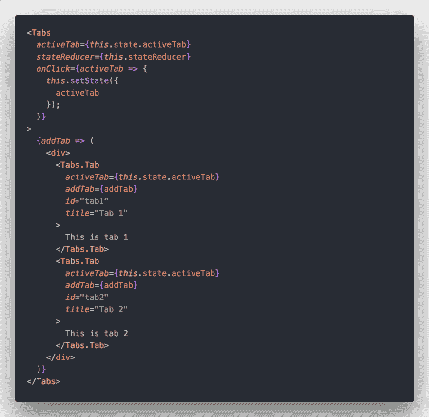](https://res.cloudinary.com/practicaldev/image/fetch/s--B1803CgD--/c_limit%2Cf_auto%2Cfl_progressive%2Cq_auto%2Cw_880/https://cdn-images-1.medium.com/max/1024/1%2ADVC1x3Gq5tMS4tu2m4E4YA.png) 

<figcaption>传递状态减速器给构件。</figcaption>

</figure>

[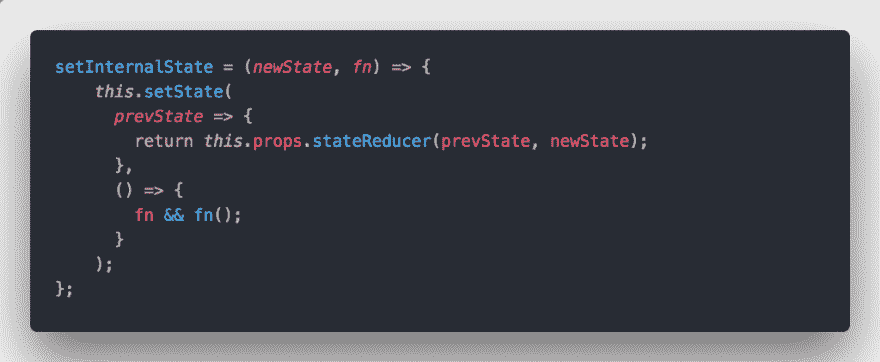T2】](https://res.cloudinary.com/practicaldev/image/fetch/s--XyEWksyq--/c_limit%2Cf_auto%2Cfl_progressive%2Cq_auto%2Cw_880/https://cdn-images-1.medium.com/max/1024/1%2AAqHvOBNUS-x9qtUeJYie-Q.png)

用状态缩减器返回的值触发状态的最终代码。你可以说这有点像 redux 中使用的 reducers。

#### 高阶分量

高阶组件是一个函数，它接受一个 ReactJS 组件，并在其上执行一些逻辑，然后返回新的应用程序组件。这种模式在 ReactJS 的大多数库中使用。例如，redux 使用它将道具从商店顶层合并到任何组件。

此外，我已经将它与 [Material-UI](https://medium.com/u/9d99f1b2974b) 一起使用，将类对象传递给你的组件，或者扩展它们的应用程序组件的样式。这种用 [Material-UI](https://medium.com/u/9d99f1b2974b) 编写应用组件的方式叫做 withStyle HOC。

<figure>[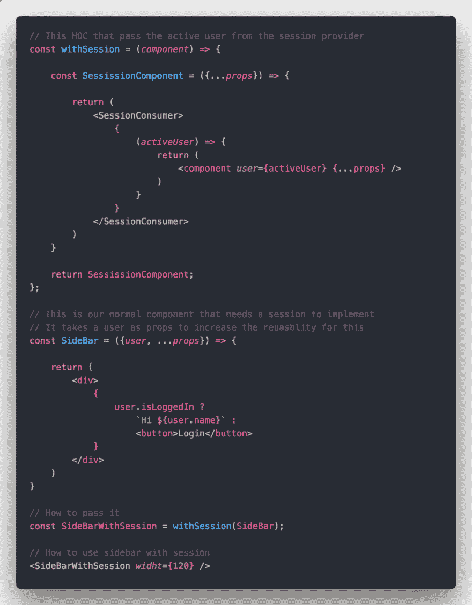](https://res.cloudinary.com/practicaldev/image/fetch/s--V1lbw8-O--/c_limit%2Cf_auto%2Cfl_progressive%2Cq_auto%2Cw_880/https://cdn-images-1.medium.com/max/1024/1%2ADFUZawHb_VWkrAV6vm4nzQ.png) 

<figcaption>侧边栏示例为显示用户名或登录按钮</figcaption>

</figure>

#### 结论

过了一段时间，我发现写下你学到的东西会让你的信息更加有力。试试这些模式，它们让你的组件独一无二，尤其是如果你是开源社区的一员。这些模式使你的组件更加可重用，更多的人使用它。