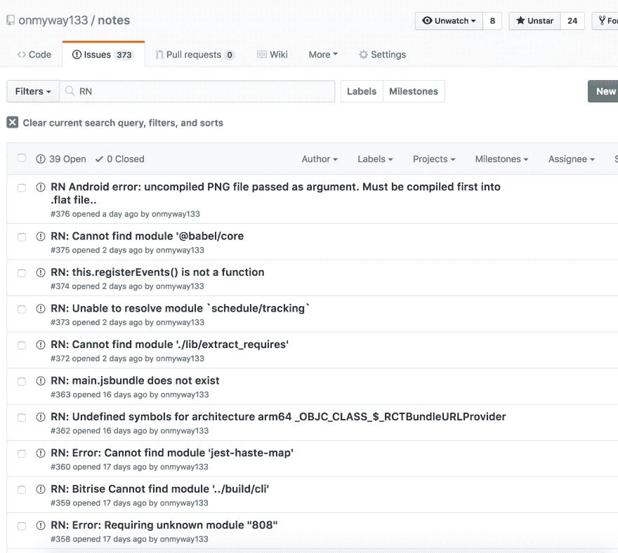
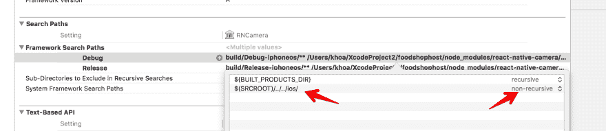
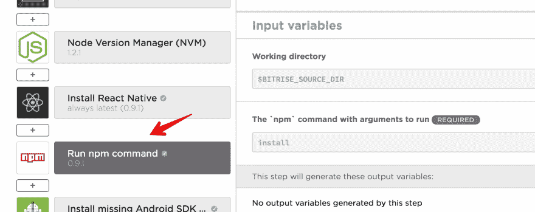
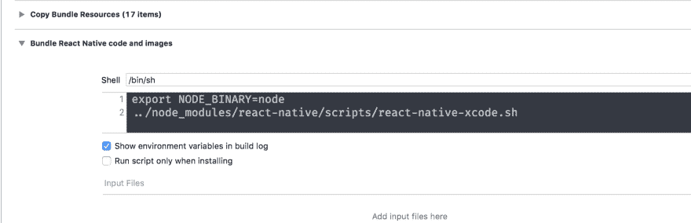
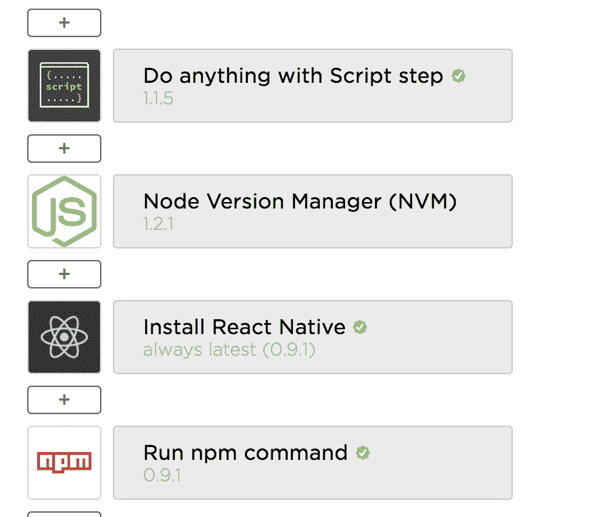
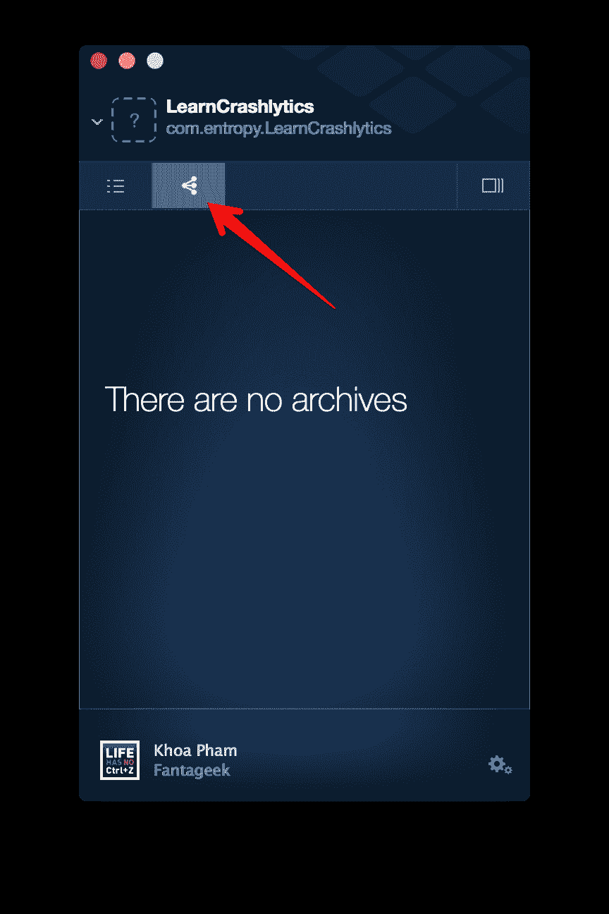
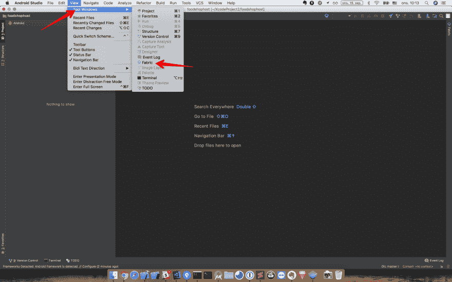
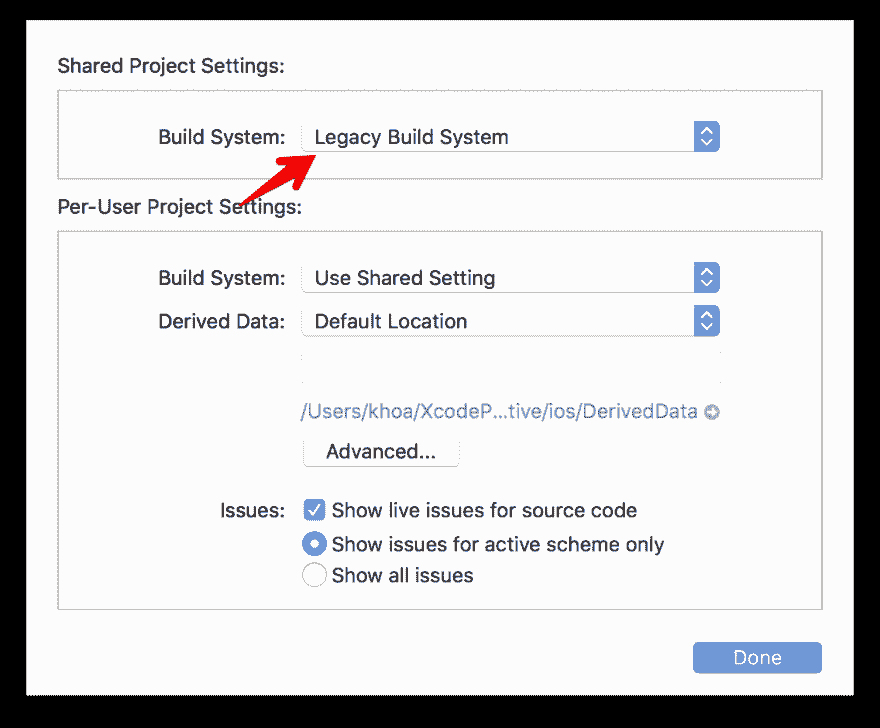

# 修复 React 本机问题，并愉快地部署到位崛起，结构，CircleCI

> 原文：<https://dev.to/onmyway133/fixing-react-native-issues-and-happy-deploy-to-bitrise-fabric-circleci-2n27>

[T2】](https://res.cloudinary.com/practicaldev/image/fetch/s--4mzNUKdy--/c_limit%2Cf_auto%2Cfl_progressive%2Cq_auto%2Cw_880/https://cdn-images-1.medium.com/max/1600/0%2A7vKg_mdUkSLfvPVz.jpg)

这篇帖子是关于实现二维码扫描，修复构建问题，与 [Bitrise](https://www.bitrise.io/) 的持续集成，Fabric 的崩溃报告以及如何将 React 原生项目驯服为源代码控制。对本地做出反应很难，但处理[依赖](https://medium.com/fantageek/what-is-create-react-native-app-9f3bc5a6c2a3)更难。过了一会儿，我收集了大量的[问题](https://github.com/onmyway133/notes/issues?utf8=%E2%9C%93&q=RN)，其中大部分是众所周知的问题，但有些需要一段时间才能弄清楚。让我们从一个简单的 QR 扫描仪功能开始。
[**什么是创建-反应-原生-app？**
*作为一个从 iOS 和 Android 背景过来 React Native 的人，我喜欢 React 和 Javascript 就像喜欢…*medium.com](https://medium.com/fantageek/what-is-create-react-native-app-9f3bc5a6c2a3)

[T2】](https://res.cloudinary.com/practicaldev/image/fetch/s--q73tEY31--/c_limit%2Cf_auto%2Cfl_progressive%2Cq_auto%2Cw_880/https://cdn-images-1.medium.com/max/3760/1%2A8hINdX6Zsomwy8u3e6QrQg.png)

## 带 react-native-camera 的二维码扫描仪

在整合了[脸书](http://React%20Native%20Login%20Using%20the%20Facebook%20SDK)和 [Firebase](https://medium.com/react-native-training/firebase-sdk-with-firestore-for-react-native-apps-in-2018-aa89a67d6934) 之后，我的应用程序需要二维码扫描功能。快速搜索显示了几个库，但它们似乎都只是围绕 [react-native-camera](https://github.com/react-native-community/react-native-camera) 的包装。

在理想情况下，我们可以只运行 NPM install react-native-camera-save 和 react-native link react-native-camera 来拥有相机特性。我们当然需要为每个平台做一些调整。首先在 Android 上有权限，在 iOS 上有 NSCameraUsageDescription。然后是一些问题。我用的版本是 react-native-camera 1.2.0。未来版本的库将有望修复下面的错误，但我们都必须为其他错误做好准备。

### [重复模块名:react-native](https://github.com/onmyway133/notes/issues/351)

```
Loading dependency graph...(node:15556) UnhandledPromiseRejectionWarning: Unhandled promise rejection (rejection id: 2): Error: jest-haste-map: @providesModule naming collision:
  Duplicate module name: react-native
  Paths: /Users/khoa/XcodeProject2/MyApp/node_modules/react-native/package.json collides with /Users/khoa/XcodeProject2/MyApp/ios/Pods/React/package.json

This error is caused by a @providesModule declaration with the same name across two different files.
(node:34363) [DEP0018] DeprecationWarning: Unhandled promise rejections are deprecated. In the future, promise rejections that are not handled will terminate the Node.js process with a non-zero exit code. 
```

Enter fullscreen mode Exit fullscreen mode

这清楚地表明有两个模块具有相同的名称 react-native。因为 react-native-camera 使用 CocoaPods 安装一个名为 RNCamera 的项目，不知何故他们带来了一个 pod React，这就是为什么会有 Users/khoa/xcode project 2/MyApp/IOs/Pods/React/package . JSON，其中包含 react-native 的名称。

例如，一个快速的解决方法是将名称改为其他名称

```
"name": "react-native-avoid-collision" 
```

Enter fullscreen mode Exit fullscreen mode

### [自变量列表过长](https://github.com/onmyway133/notes/issues/352)

```
Argument list too long: recursive header expansion failed at /Users/*k*hoa/XcodeProject2/MyApp/node_modules/react-native-camera/ios/../../../ios/build 
```

Enter fullscreen mode Exit fullscreen mode

这是因为框架搜索路径中的递归搜索路径。如果在 node _ modules/react-native-camera/IOs/RNCamera.xcodeproj/project . PBX proj 打开 rn camera . xcode proj，在 Build settings 下寻找框架搜索路径，可以看到它目前是递归的。您应该兑换$(SRCROOT)/../../IOs/对于调试和发布配置都是非递归的。

[T2】](https://res.cloudinary.com/practicaldev/image/fetch/s--S5kcJ7AL--/c_limit%2Cf_auto%2Cfl_progressive%2Cq_auto%2Cw_880/https://cdn-images-1.medium.com/max/4264/1%2AKFKLuzMYTibCkehW6vAsWA.png)

### [图书馆 com . Google . Android . GMS:play-services-Basel 正在被其他各图书馆请求](https://github.com/onmyway133/notes/issues/354)

```
org.gradle.api.GradleException: The library com.google.android.gms:play-services-basement is being requested by various other libraries at [[15.0.1,15.0.1]], but resolves to 12.0.1\. Disable the plugin and check your dependencies tree using ./gradlew :app:dependencies. 
```

Enter fullscreen mode Exit fullscreen mode

因为我用的是 [Firebase](https://medium.com/react-native-training/firebase-sdk-with-firestore-for-react-native-apps-in-2018-aa89a67d6934) ，和 react-native-camera 有冲突。仅仅是因为它需要 Firebase 进行人脸和文本检测。在我看来，这是好事，但打破了单一责任原则。相机库应该只有相机功能！！！

> iOS RNCamera 使用 GMV(谷歌移动视觉)进行人脸检测/文本识别。您必须将 google 框架链接到您的项目，才能成功编译 RNCamera 项目。

一个快速的解决方法是在项目 build.gradle 中指定 ext { googlePlayServicesVersion = " 15 . 0 . 1 " }

用法非常简单

```
render() {
  return (
    <View style={styles.container}>
      <Camera
        style={styles.camera}
        aspect={Camera.constants.Aspect.fill}
        onBarCodeRead={this.onBarCodeRead}
        ref={cam => this.camera = cam}
      />
      {this.makeOverlayIfAny()}
    </View>
  )
} 
```

Enter fullscreen mode Exit fullscreen mode

onBarCodeRead 是我们处理 QR 码检测回调的地方。

好了，所有的问题似乎都解决了。让我们看看它是如何建立在 CI 基础上的。

## 在 Bitrise 上运行 React 原生应用

我对 Android 和 iOS 应用程序的 [Bitrise](https://hackernoon.com/using-bitrise-ci-for-android-apps-fa9c48e301d8) 有很好的体验，因为它也支持 [React Native](https://blog.bitrise.io/how-to-set-up-a-react-native-app-on-bitrise) ，所以使用它没有任何问题。理论上，我们可以添加一个 React 原生应用程序，Bitrise 可以构建 iOS 和 Android 应用程序。但实际上，总会有问题。

### [找不到模块‘玩笑-匆忙-地图’](https://github.com/onmyway133/notes/issues/360)

我的应用在本地运行良好，但在 Bitrise 上失败了。我已经联系了支持人员，但毫无头绪。由于 Bitrise 支持包含许多步骤的工作流，我可以选择运行 npm 命令来安装缺少的模块

[T2】](https://res.cloudinary.com/practicaldev/image/fetch/s--9JyuOCqe--/c_limit%2Cf_auto%2Cfl_progressive%2Cq_auto%2Cw_880/https://cdn-images-1.medium.com/max/3396/1%2AsdO5TWK3dStoeDRTFz6ZnQ.png)

在运行 npm install jest-haste-map 之后，我得到

```
Cannot find module 'jest-worker' 
```

Enter fullscreen mode Exit fullscreen mode

然后我运行 npm 安装 jest-worker，我得到

```
Cannot find module 'jest-serializer' 
```

Enter fullscreen mode Exit fullscreen mode

然后我运行 npm install jest-serializer，我得到

```
Loading dependency graph...(node:74975) UnhandledPromiseRejectionWarning: Error: fseventsunavailable (this watcher can only be used on Darwin)
at new FSEventsWatcher 
```

Enter fullscreen mode Exit fullscreen mode

### [main.jsbundle 不存在](https://github.com/onmyway133/notes/issues/363)

我遇到的另一个问题是

```
main.jsbundle does not exist. This must be a bug with + echo 'React Native. 
```

Enter fullscreen mode Exit fullscreen mode

这意味着在绑定过程中有一个错误，所以找不到 main.jsbundle。由于它在本地运行良好，我认为我应该手动生成 bundle 并跟踪它到 Git，因为 react-native init 默认添加 jsbundle。gitignore。让我们将以下内容添加到 package.json 中，记住 name 字段必须全部小写，并且不包含空格。

```
"build:ios": "react-native bundle --entry-file ./index.js --platform ios --bundle-output ios/main.jsbundle" 
```

Enter fullscreen mode Exit fullscreen mode

在 Bitrise 上仍然失败。对于 React 的新版本，这是不需要的，因为 React 在 Xcode 构建短语中内置了一个捆绑脚本，可以检测配置以及我们是使用 index.js 还是 index.ios.js

```
# Define entry file
if [[ -s "index.ios.js" ]]; then
  ENTRY_FILE=${1:-index.ios.js}
else
  ENTRY_FILE=${1:-index.js}
fi 
```

Enter fullscreen mode Exit fullscreen mode

[T2】](https://res.cloudinary.com/practicaldev/image/fetch/s--IX9kL1GD--/c_limit%2Cf_auto%2Cfl_progressive%2Cq_auto%2Cw_880/https://cdn-images-1.medium.com/max/3736/1%2AFP3yKJ4h1AurMGNfwICo5w.png)

```
if [[ "$CONFIGURATION" = "Debug" && ! "$PLATFORM_NAME" == *simulator ]]; then
  IP=$(ipconfig getifaddr en0)
  if [ -z "$IP" ]; then
    IP=$(ifconfig | grep 'inet ' | grep -v ' 127.' | cut -d\   -f2  | awk 'NR==1{print $1}')
  fi

echo "$IP" > "$DEST/ip.txt"
fi

BUNDLE_FILE="$DEST/main.jsbundle"

$NODE_BINARY "$CLI_PATH" $BUNDLE_COMMAND \
  $CONFIG_ARG \
  --entry-file "$ENTRY_FILE" \
  --platform ios \
  --dev $DEV \
  --reset-cache \
  --bundle-output "$BUNDLE_FILE" \
  --assets-dest "$DEST" \
  $EXTRA_PACKAGER_ARGS 
```

Enter fullscreen mode Exit fullscreen mode

对于 Android，在 React Native 0.19.0 之前我们需要手动运行下面来生成 [bundle](https://proandroiddev.com/bundling-react-native-during-android-release-builds-ec52c24e200d) 。

```
react-native bundle --platform android --dev false --entry-file index.android.js --bundle-output android/app/src/main/assets/index.android.bundle --assets-dest android/app/src/main/res/ 
```

Enter fullscreen mode Exit fullscreen mode

[**在 Android 发布版本期间绑定 React Native**
*在 Android 发布版本期间自动绑定 React Native 的 js 资源*proandroiddev.com](https://proandroiddev.com/bundling-react-native-during-android-release-builds-ec52c24e200d)

现在我们不需要手动运行 React Native bundle 命令，因为有 [react.gradle](https://github.com/facebook/react-native/blob/master/react.gradle) 作为构建步骤的一部分。如果你看看 build.gradle 这个应用，你会发现

> react.gradle 文件为每个构建变体注册一个任务(例如 bundleDebugJsAndAssets
> 和 bundleReleaseJsAndAssets)。
> 这些基本上是在 Android 构建
> 周期中用正确的参数调用`react-native bundle`。默认情况下，bundleDebugJsAndAssets 被跳过，因为在调试/开发模式下，我们更喜欢直接从开发服务器加载
> 包。下面你可以看到所有可能的配置
> 及其默认值。如果您决定添加一个配置块，确保将其添加在
> `apply from: “../../node_modules/react-native/react.gradle”`行之前。

这里没什么可疑的。我还尝试了[清除缓存](https://gist.github.com/jarretmoses/c2e4786fd342b3444f3bc6beff32098d)，关闭调试器，删除应用程序，但在 Bitrise 上仍然失败。它在本地运行得非常好，这让我觉得本地和 Bitrise 之间的工具和环境不匹配。

### 匹配工装版本

运行 react-native info 来获取我们使用的所有工具的版本。这里我有

```
React Native Environment Info:
    System:
      OS: macOS High Sierra 10.13.6
      CPU: x64 Intel(R) Core(TM) i7-7700HQ CPU @ 2.80GHz
      Memory: 94.97 MB / 16.00 GB
      Shell: 5.3 - /bin/zsh
    Binaries:
      Node: 8.11.4 - ~/.nodenv/versions/8.11.4/bin/node
      npm: 5.6.0 - ~/.nodenv/versions/8.11.4/bin/npm
      Watchman: 4.9.0 - /usr/local/bin/watchman
    SDKs:
      iOS SDK:
        Platforms: iOS 11.4, macOS 10.13, tvOS 11.4, watchOS 4.3
    IDEs:
      Android Studio: 3.1 AI-173.4907809
      Xcode: 9.4.1/9F2000 - /usr/bin/xcodebuild
    npmPackages:
      react: 16.4.1 => 16.4.1
      react-native: ^0.56.0 => 0.56.0
    npmGlobalPackages:
      react-native-cli: 2.0.1 
```

Enter fullscreen mode Exit fullscreen mode

因此，让我们确保我们有相同的节点、npm、react-native 版本。幸运的是，Bitrise 有定制的步骤来改变

[T2】](https://res.cloudinary.com/practicaldev/image/fetch/s--pEq1xosy--/c_limit%2Cf_auto%2Cfl_progressive%2Cq_auto%2Cw_880/https://cdn-images-1.medium.com/max/2000/1%2AKh-FrpeUh5UnH-H6vG8Avg.png)

但即使有相同的版本和配置，它在 Bitrise 上仍然会失败😕

## 尝试使用干净的 git 克隆

我应该做的下一件[事情](https://discuss.bitrise.io/t/how-to-debug-your-build-locally-it-works-on-my-mac-pc-but-not-on-bitrise-io/392)是删除本地回购并再次从远程克隆。令人惊讶的是，我在 Bitrise 上也遇到了同样的错误。是时候深入研究这些问题了。
[**如何在本地调试你的构建/“它在我的 Mac/PC 上工作，但在 bitrise.io 上不工作”**
*如果构建在你的本地 Mac/PC 上工作，但在 bitrise.io 上不工作，那通常是因为未提交/ gitignored 文件……* discuse . bitrise . io](https://discuss.bitrise.io/t/how-to-debug-your-build-locally-it-works-on-my-mac-pc-but-not-on-bitrise-io/392)

还记得我为了让 react-native-camera 工作而采取的变通办法吗？为了保持这些变化，我跟踪 node_modules 和 Pods 到 git，因为我[不](https://blog.npmjs.org/post/141577284765/kik-left-pad-and-npm) [信任](https://www.theregister.co.uk/2016/03/23/npm_left_pad_chaos/)NPM 系统，并且我还希望看到我的任何依赖项的变化。这样，CI 可以直接构建我的应用程序，而无需 npm 安装或 pod 安装

问题是，有了这个，我们必须明白。gitignore 非常好，因为它是基于模式的。有些文件被跟踪，有些文件不被跟踪，这可能会在本地和配置项之间留下不一致的空间。因此，合理的做法是忽略 node_modules 和 Pods，并以某种方式保持工作区的变化。跟踪依赖关系是没有用的，因为当它改变时，git diff 中会有很多变化，我们可能不知道(也不想知道)发生了什么。

我学到的教训是永远不要跟踪生成的或可下载的东西，比如 node_modules、jsbundle、Pods，因为它们不是我们关心的。

我们有 package-lock.json 和 Podfile.lock，所以我们应该使用相同的版本。剩下的应该由包管理器来处理。是啊，希望如此。

[T2】](https://res.cloudinary.com/practicaldev/image/fetch/s--at6Sqef_--/c_limit%2Cf_auto%2Cfl_progressive%2Cq_auto%2Cw_880/https://cdn-images-1.medium.com/max/2000/0%2AY_2csNNYoXnezSgI.png)

那么，如何保持变通方法的变化呢？我知道有几种方法

### 分叉模块

React Native 有一堆依赖项，任何一个都可能有 bug，尤其是版本变化期间，比如 React Native 0.57.0 中的这个 [schedule 0.5.0](https://github.com/facebook/react-native/issues/21150) 。我们可以解决问题，等待，祈祷，希望有人来解决。这就是我们成为依赖者的地方，我们无法控制我们所做的事情。一种方法是保持我们自己的[分叉](http://debuggable.com/posts/how-to-fork-patch-npm-modules:4e2eb9f3-e584-44be-b1a9-3db7cbdd56cb)以适应我们需要的变化

> 下面是使用 npm 管理模块的分叉版本时的正确方法:
> 
> *   在 GitHub 上分叉项目
> *   将 fork 克隆到您的机器上
> *   修复错误或添加您想要的功能
> *   在 GitHub 上把你的提交推到你的分叉上
> *   在 GitHub 上打开你的 fork，点击你最近提交的
> *   在提交页面上，单击“下载”按钮
> *   右键点击弹出菜单中的“Download .tar.gz”按钮，复制链接(Chrome 中的“复制链接地址”)
> *   打开 package.json 文件，用刚才复制的 url 替换模块的版本号
> *   向上游发送一个 pull 请求(可选的，但是这样你就可以避免为你派生的模块的新版本维护你的补丁)

或者，如果我们想告别[老式的叉子](https://blog.callstack.io/say-goodbye-to-old-fashioned-forks-thanks-to-the-patch-package-3c63a62eea1c)，我们可以使用补丁包应用补丁
[**由于补丁包，告别老式的叉子。**
*您是否曾经遇到过这样的情况:您不得不分叉库来对您的应用程序进行一些修复？使用…*blog.callstack.io](https://blog.callstack.io/say-goodbye-to-old-fashioned-forks-thanks-to-the-patch-package-3c63a62eea1c) 时

### 跟踪里面被忽略的文件夹

另一种方法是只跟踪我们更改的文件。的。由 react-native init 生成的 gitignore 文件包含 node_modules，这意味着 React Native team 建议不要跟踪节点模块。但是从 git 2.8 开始，我们可以跟踪忽略文件夹中的文件。下面是我如何在 node_modules 中保存对 RNCamera.xcodeproj 的更改。用！英寸 gitignore

```
!node_modules/react-native-camera/ios/RNCamera.xcodeproj 
```

Enter fullscreen mode Exit fullscreen mode

这很好，但是对于一个懒惰的程序员来说太手工了。此外，它很容易被下一次 npm 安装或 pod 安装覆盖

### 外壳脚本

懒惰的程序员应该将枯燥的任务自动化。你知道 npm 可以在许多事件中运行许多脚本吗？
[**脚本| npm 文档**
*记录所有 npm 事物的地方*docs.npmjs.com](https://docs.npmjs.com/misc/scripts)

> 对于以下脚本，npm 支持 package.json 文件的“脚本”属性
> 
> *   预安装:在软件包安装之前运行
> *   install，postinstall:在软件包安装后运行。
> *   preuninstall，uninstall:在卸载软件包之前运行。
> *   卸载后:在软件包卸载后运行。

我们可以使用 shell 脚本。例如，要在 Pods/React/package.json 中更改名称以避免问题[重复模块名称:react-native](https://github.com/onmyway133/notes/issues/351) ，我们可以创建一个名为 postinstall.sh 的文件，名称是任意的

```
#!/bin/bash
set -e

# Fix Duplicate module name: react-native

PODS_REACT_PACKAGE_JSON = 'ios/Pods/React/package.json'

if [ -e PODS_REACT_PACKAGE_JSON ]
then
    sed -i -e 's/"name": "react-native"/"name": "react-native-avoid-collision"/g' PODS_REACT_PACKAGE_JSON
fi

# Fix react-native-camera Argument list too long

REACT_NATIVE_CAMERA_PROJECT = ./node_modules/react-native-camera/ios/RNCamera.xcodeproj/project.pbxproj

if [ -e PODS_REACT_PACKAGE_JSON ]
then
    sed -i -e 's/ios\/\*\*/ios\/\*/g' REACT_NATIVE_CAMERA_PROJECT
fi 
```

Enter fullscreen mode Exit fullscreen mode

并在根 package.json 的脚本中添加 postinstall

```
"postinstall": "./postinstall.sh" 
```

Enter fullscreen mode Exit fullscreen mode

### 节点脚本

shell 脚本中有很多代码。我们有节点环境，让我们将它与许多包(如 fs)一起使用，因此创建一个名为 postinstall.js 的新文件。我们可以创建函数来封装公共功能。

```
const fs = require('fs')

function replaceJson(path, process) {
    if (fs.existsSync(path)) {
        let json = JSON.parse(fs.readFileSync(path, 'utf8'))
        json = process(json)
        fs.writeFileSync(path, JSON.stringify(json, null, 2))
    }
}

function replaceString(path, oldString, newString) {
    if (fs.existsSync(path)) {
        let string = fs.readFileSync(path, 'utf8')
        string = string.replace(oldString, newString)

fs.writeFileSync(path, string, 'utf8')
    }
}

function write(path, string) {
    fs.writeFileSync(path, string, 'utf8')
}

// Fix Duplicate module name: react-native
PODS_REACT_PACKAGE_JSON='ios/Pods/React/package.json'
replaceJson(PODS_REACT_PACKAGE_JSON, function(json) {
    json.name = 'react-native-avoid-collision'
    return json
})

// Fix react-native-camera Argument list too long
REACT_NATIVE_CAMERA_PROJECT='./node_modules/react-native-camera/ios/RNCamera.xcodeproj/project.pbxproj'
replaceString(REACT_NATIVE_CAMERA_PROJECT, 
    '$(SRCROOT)/../../ios/**', 
    '$(SRCROOT)/../../ios/'
)

replaceString(REACT_NATIVE_CAMERA_PROJECT, 
    '$(SRCROOT)/../../../ios/**', 
    '$(SRCROOT)/../../../ios/'
)

// Android sdk
const sdkDir = "sdk.dir = /Users/khoa/Library/Android/sdk"
LOCAL_PROPERTIES = "android/local.properties"
write(LOCAL_PROPERTIES, sdkDir) 
```

Enter fullscreen mode Exit fullscreen mode

现在，每次我们运行 npm install 后，我们需要的解决方法都会为我们重新应用。这有助于解决类似问题的其他情况

```
Error: SDK location not found. Define location with sdk.dir in the local.properties file or with an ANDROID_HOME environment variable. 
```

Enter fullscreen mode Exit fullscreen mode

为了解决这个问题，我们需要用 SDK 路径创建 local.properties。我的是 SDK . dir =/Users/khoa/Library/Android/SDK。这个在路径里有我的用户名，和 Bitrise 里的用户名流浪汉很不一样。我似乎不能使用${HOME}或$HOME 变量，所以这种变化不应该被跟踪到 git 中。从上面可以看到，脚本自动为我们生成了这个文件。太棒了。

现在一切都很好，构建在 Bitrise 中也很好。

## 部署到 Fabric 并报告崩溃

老实说，我几乎最终在本地构建并将 IPA/APK 上传到 Fabric，因为我无法找到解决 Bitrise 上构建错误的方法。但是现在我们无论如何都要使用 Fabric，因为它有很好的测试人员安装页面，而且它的 Crashlytics 报告也很好。关于 Fabric 好的(或者讨厌的)一点是，我们需要在一个应用注册到 Fabric 之前成功地构建并运行它。

对于 iOS，我们需要安装 [Fabric macOS app](https://fabric.io/downloads/xcode) 并遵循[指令](https://fabric.io/kits/ios/crashlytics/install)。比起使用 CocoaPods，我更喜欢将 Fabric 和 Crashlytics 框架拖到我们的 Xcode 项目中。此外，如果您在 Xcode 中归档项目，那么您可以手动选择归档并上传到 Fabric。只需在 Fabric 应用程序中选择存档选项卡。

[T2】](https://res.cloudinary.com/practicaldev/image/fetch/s--22bY93xK--/c_limit%2Cf_auto%2Cfl_progressive%2Cq_auto%2Cw_880/https://cdn-images-1.medium.com/max/2000/1%2AjYjFvs1hCaAQUjTH6eIzpQ.png)

对于 Android，我们需要为 Android Studio 安装 [Fabric。安装后，在视图- >工具窗口- >结构中可用](https://plugins.jetbrains.com/plugin/8002-fabric-for-android-studio)

[T2】](https://res.cloudinary.com/practicaldev/image/fetch/s--x1l4rTYW--/c_limit%2Cf_auto%2Cfl_progressive%2Cq_auto%2Cw_880/https://cdn-images-1.medium.com/max/6720/1%2A3eP-zzqkK2VM6731n2404Q.png)

该工具只设置简单的东西。我们仍然需要配置 gradle，按照[上的说明通过 Gradle](https://fabric.io/kits/android/crashlytics/install) 安装 Crashlytics

## 部署到 CircleCI 2.0

CircleCI 配置很多，需要时间学习。这里有一个简单的配置来检查 React 原生项目是否可以在 iOS 和 Android 上很好地构建。在里面创建一个名为 config.yml 的文件。circleci 文件夹。

```
version: 2

jobs:

  node:

    docker:

      - image: circleci/node:8

    steps:

      - checkout

      - run: npm install

Android:
docker:
-image:circle ci/Android:API-27-node 8-alpha
步骤:
-check out
-run:NPM install
-run:CD Android&&。/grad Lew assembler 请

IOs:
MAC OS:
xcode:“9 . 4 . 1”

# 使用 a - login shell，这样我们的“设置 Ruby 版本”命令就可以在后面的步骤中使用了

```
shell: /bin/bash --login -o pipefail 
```

    Enter fullscreen mode 

    Exit fullscreen mode 

步骤:
-check out
-run:NPM install
-run:xcode build-project iOS/MyApp . xcode proj-scheme " MyApp "-SDK iPhone Simulator-destination ' platform = iOS Simulator，OS=11.4，name=iPhone X '

工作流:
版本:2 
节点-android-ios: 
作业:
 -节点
 - android: 
需求:
 -节点
 - ios: 
需求:
 -节点 
```

Enter fullscreen mode Exit fullscreen mode

## 
  
反应原生于 Xcode 10

对于现在的 React 原生 0.57.0，它还不能在 Xcode 10 中完全[工作](https://github.com/facebook/react-native/issues/19573)。我经常得到这个错误错误:多个命令产生。在这种情况下，我们需要将-UseModernBuildSystem=N 追加到 xcodebuild 命令中。或者在 Xcode 中，我们需要使用旧的遗留构建系统。转到文件- >项目设置，并将构建系统设置为遗留构建系统

[T2】](https://res.cloudinary.com/practicaldev/image/fetch/s--U-abhbGW--/c_limit%2Cf_auto%2Cfl_progressive%2Cq_auto%2Cw_880/https://cdn-images-1.medium.com/max/2272/1%2An_Ydz7oLbwieJb5Ko-msRw.png)

## 何去何从

在本帖中，我们将介绍如何使用 react-native-camera 实现 QR 码扫描仪功能，如何调试 CI 和本地环境之间的不一致问题，如何克隆存储库以重新启动，以及如何部署到 Bitrise、Fabric 和 CircleCI。对我来说，关键的教训是一个接一个地跟踪问题，永远不要跟踪 git 中生成的或可下载的内容，让包管理器来处理。我们还应该使用更多的脚本来自动化枯燥的任务，并在脚本中使用节点包。

原帖[https://medium . com/react-native-training/fixing-react-native-issues-and-happy-deploy-to-bit rise-fabric-circle ci-44d a4 ab 1487 b](https://medium.com/react-native-training/fixing-react-native-issues-and-happy-deploy-to-bitrise-fabric-circleci-44da4ab1487b)