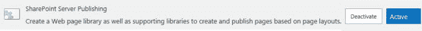

# 修复了 SharePoint 2016 服务器场中的“字典中不存在给定的键”导航错误

> 原文：<https://dev.to/mlisidoro/fixing-the-the-given-key-was-not-present-in-the-dictionary-navigation-error-in-a-sharepoint-2016-farm-2p35>

帖子[修复了 SharePoint 2016 服务器场](https://blogit.create.pt/miguelisidoro/2018/09/12/fixing-the-the-given-key-was-not-present-in-the-dictionary-navigation-error-in-a-sharepoint-2016-farm/)中的“给定键不在字典中”导航错误，该帖子首先出现在[博客 IT](https://blogit.create.pt) 上。

你好，

今天，在将 SharePoint 2010 服务器场迁移到 SharePoint 2016 后，我突然在 SharePoint 发布网站的当前导航中发现了一个错误。网站集包含三个主要的子网站。对于其中的两个，SharePoint 导航工作得非常好，但对于另一个，导航没有显示。

# 问题

为了找出有问题的子站点中的问题，我导航到导航设置页面，发现了以下错误:

_ **字典中没有给定的关键字。**堆栈跟踪:at 系统。throw helper . ThrowKeyNotFoundException()。collections . generic . dictionary`2.get_Item(TKey key) at Microsoft.SharePoint.Publishing.CachedArea.CreateResultSetFromSuperUserAndSuperReader(StringCollection superReaderItemIDs, StringCollection superUserItemIDs, Dictionary`2 cached objects，SPWeb contextWeb，SPQuery query，List `1 fieldrefs, ICachedObjectFactory objectFactory) at Microsoft.SharePoint.Publishing.CachedArea.GetChildForListByQuery(String listName, SPQuery query, SPWeb contextWeb, Boolean onlyPopulateCache, List` 1 & itemsFetched，Boolean skipIfThrottled)在微软。微软的 SharePoint . publishing . navigation . portal websitemapnode . fetchdynamicitems(publishing web public web，NodeTypes includedTypes，Boolean&webs fracted，Boolean&pages fracted)。Microsoft 的 SharePoint . publishing . navigation . portal websitemapnode . populatenavigationchildreninner(NodeTypes included types)。Microsoft 的 SharePoint . publishing . navigation . portal websitemapnode . populatenavigationchildren(NodeTypes included types)。Microsoft 的 SharePoint . publishing . navigation . portalsitemapnode . getnavigationchildren(NodeTypes included types，NodeTypes includedHiddenTypes，Boolean trimmingEnabled，OrderingMethod ordering，AutomaticSortingMethod method，Boolean ascending，Int32 lcid)。Microsoft 的 SharePoint . publishing . navigation . portalsitemapnode . getnavigationchildren(NodeTypes included types，NodeTypes includedHiddenTypes，OrderingMethod ordering，AutomaticSortingMethod method，Boolean ascending，Int32 lcid)。Microsoft 的 SharePoint . publishing . navigation . portalsitemapnode . getnavigationchildren(NodeTypes included hiddentypes)。SharePoint . publishing . navigation . portalsitemapprovider . get child nodes(PortalSiteMapNode 节点，NodeTypes includeddhiddentypes)_

# 解

为了解决这个问题，我所要做的就是在有问题的子网站上重新激活“SharePoint Server 发布”网站功能(而不是相应的网站集功能):

[T2】](https://res.cloudinary.com/practicaldev/image/fetch/s--612D7fKr--/c_limit%2Cf_auto%2Cfl_progressive%2Cq_auto%2Cw_880/https://i2.wp.com/blogit.create.pt/wp-content/uploads/2018/09/PublishingSiteFeature.jpg%3Fresize%3D696%252C52%26ssl%3D1)

重新激活该功能后，导航开始按预期工作。

**注意:**此解决方案也应适用于其他版本的 SharePoint Server，包括 SharePoint 2019。要了解 SharePoint 2019 中所有即将推出的功能的更多信息，请点击[此处](https://blogit.create.pt/miguelisidoro/2018/08/04/sharepoint-server-gets-modern-sharepoint-2019-is-here/)。

希望这对某人有所帮助！

如果您想了解有关使用名为 AutoSPInstaller 的 PowerShell 解决方案以完全自动化的方式安装 SharePoint 2016 服务器场的更多信息，请单击[此处](https://blogit.create.pt/miguelisidoro/2018/07/28/how-to-install-a-sharepoint-2016-farm-using-powershell-and-autospinstaller-part-1/)和[此处](https://blogit.create.pt/miguelisidoro/2018/07/28/how-to-install-a-sharepoint-2016-farm-using-powershell-and-autospinstaller-part-2/)。

分享快乐！

帖子[修复了 SharePoint 2016 服务器场](https://blogit.create.pt/miguelisidoro/2018/09/12/fixing-the-the-given-key-was-not-present-in-the-dictionary-navigation-error-in-a-sharepoint-2016-farm/)中的“给定键不在字典中”导航错误，该帖子首先出现在[博客 IT](https://blogit.create.pt) 上。