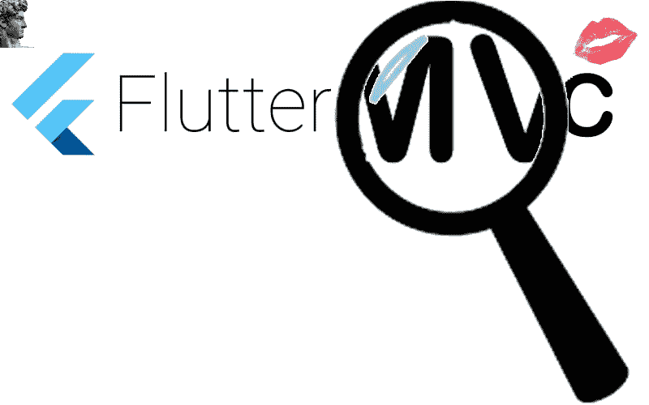
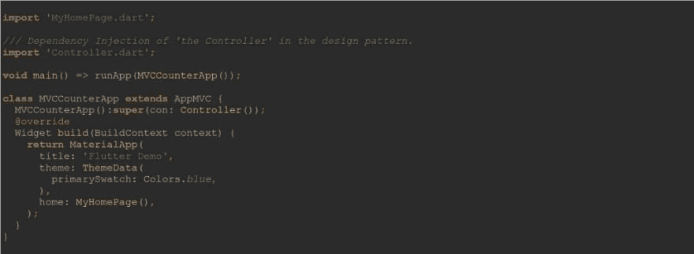
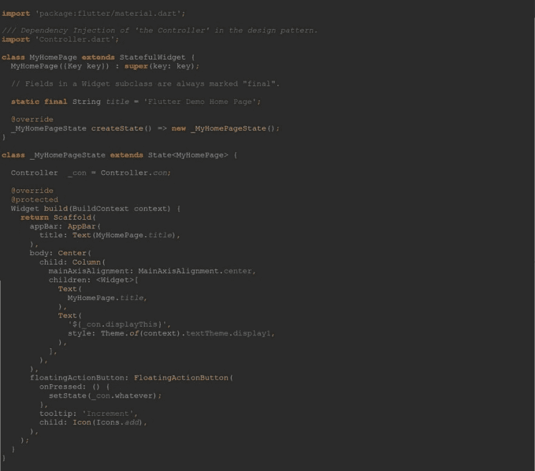
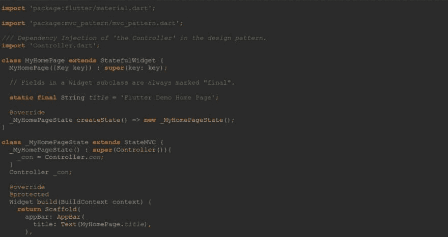
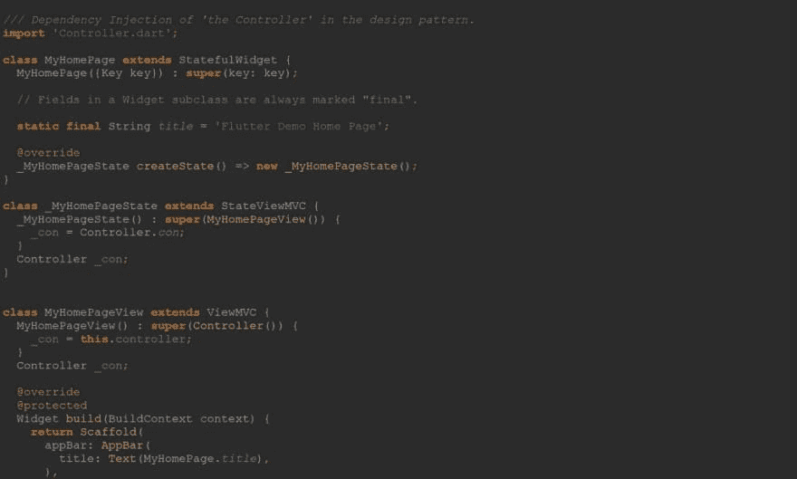
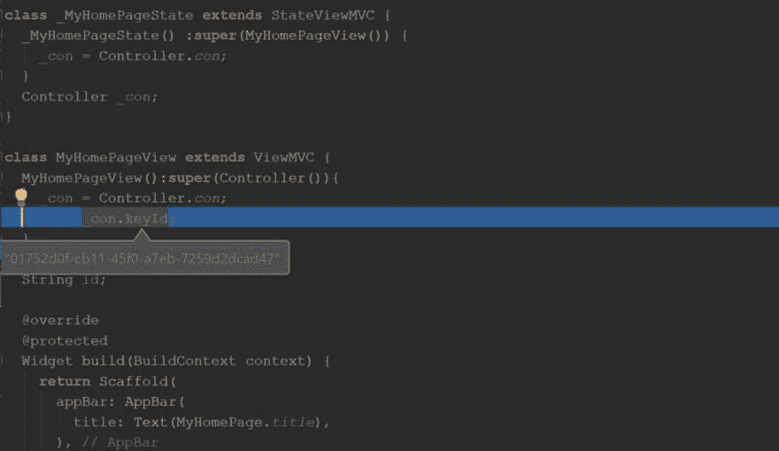
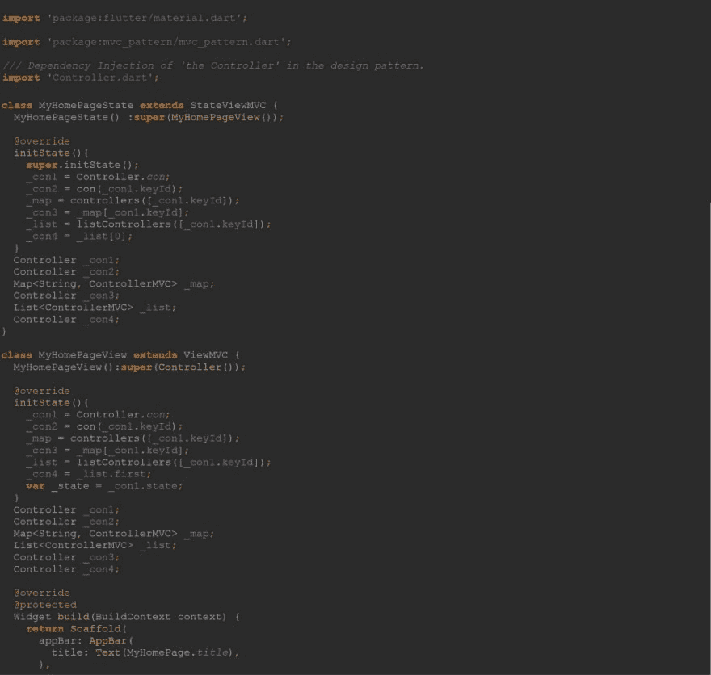
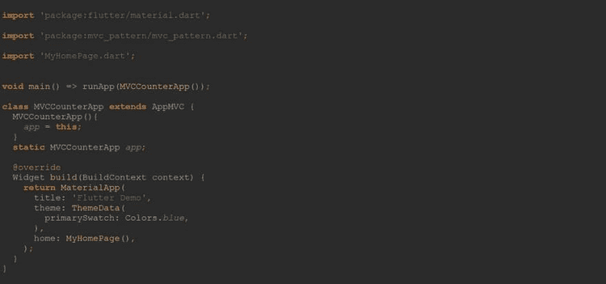
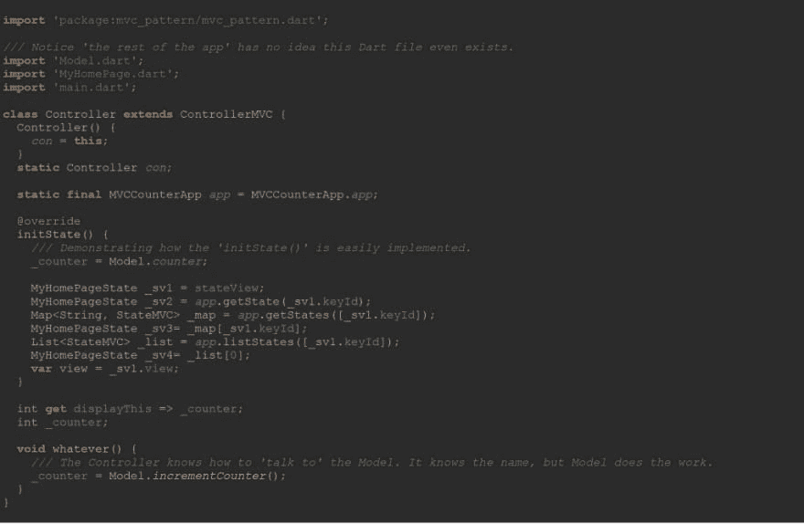

# 扑& MVC。仔细看看。

> 原文：<https://dev.to/andrious/flutter--mvc-a-closer-look-4dod>

研究 mvc_pattern 库包能为您做什么。

这是首发刊物的后续文章，[终于扑+ MVC 了！](https://dev.to/andrious/flutter--mvc-at-last-29j5-temp-slug-5360480)，首先描述了库包，[，mvc_pattern](https://pub.dartlang.org/packages/mvc_pattern) 。它用于在您的移动应用程序中实现 MVC 设计模式。

T3】

### 无怨无悔。嗯…

我对我以前的工作很满意，比如我写的第一篇关于 Medium.com 的文章，一个用 MVC 方法来跳舞的文章。我希望里面的陈述能激发读者的洞察力。然而，有一个特别的声明我想“走回来。”

> 坦率地说，没有什么比将三个 MVC 组件作为参数互相传递更有内涵的了

好吧，我错了。你知道更内在的是什么吗！？一个进口声明，它也更干净。这与[依赖注入](https://en.wikipedia.org/wiki/Dependency_injection)有关。你实际上是用一行代码“注入”你的应用程序的另一个组件！

然而，有了参数，就有点混乱了。我的意思是，你在接受参数的地方“宣布”注入，然后在接收参数的地方。最重要的是，您正在输入相同的导入语句…两次！在许多情况下，没有必要。尽可能只使用一个 import 语句。当您打开一个 Dart 文件时，一眼就可以看到依赖注入——只需查看导入语句。您很容易看到该文件中包含的依赖关系。

[T2】](https://res.cloudinary.com/practicaldev/image/fetch/s--mPv9d1aL--/c_limit%2Cf_auto%2Cfl_progressive%2Cq_auto%2Cw_880/https://cdn-images-1.medium.com/max/1024/1%2ARN3zgMpt2K9SRq8_ZjfmdQ.jpeg)

### 飞镖文件。不仅仅是文件。是图书馆！

说到 Dart 文件。不像 Java，其中一个。‘Java’文件必须只包含一个主类，并且该类的名称必须与文件的名称相匹配——Dart 没有这种限制。这是巨大的！

> 有些语言，如 Java，将文件的组织与类的组织联系起来——每个文件只能定义一个顶级类。Dart 没有这种限制。”— [有效飞镖:设计](https://www.dartlang.org/guides/language/effective-dart/design#consider-declaring-multiple-classes-in-the-same-library)

Dart 文件被称为库，我认为这是因为你可以在同一个文件中声明多个类！那更大！(word？)完全允许一个 Dart 文件包含多个类、多个顶级变量和多个顶级函数。那是最大的！那就是厉害！这对于开发工业级应用非常有帮助。

再看看上面的截图。(如果你太懒，就看下面。)控制器类被称为“Con”而不是“Controller”。它可以被称为“阿尔伯克基”因为我在乎！文件 Controller.dart 可以包含任意数量的类、函数和变量！您可以简单地将 import 语句留在那里“很久很久”,然后在这段时间内，切换并更改文件 Controller.dart 中的代码，而不修改下面代码中的一个字符……非常大。

[T2】](https://res.cloudinary.com/practicaldev/image/fetch/s--mPv9d1aL--/c_limit%2Cf_auto%2Cfl_progressive%2Cq_auto%2Cw_880/https://cdn-images-1.medium.com/max/1024/1%2ARN3zgMpt2K9SRq8_ZjfmdQ.jpeg)

### 有选项。伙计。你有选择！

像任何好的库包一样，完成工作的方法不止一种。你有选择。例如，我可以马上想到三种方法来将 MVC 包实现到 ol' Counter 应用程序中。

### App 有视图

第一种方法是让 AppMVC 类使用自己的 **build()** 函数定义视图，并将控制器作为其父类构造函数的参数。然后，文件 MyHomePage.dart 相对直接，从静态字段引用控制器。

[T2】](https://res.cloudinary.com/practicaldev/image/fetch/s--XFPvfS6j--/c_limit%2Cf_auto%2Cfl_progressive%2Cq_auto%2Cw_880/https://cdn-images-1.medium.com/max/1024/1%2AiNYGuHFTyMLWGTNWE3oiUQ.jpeg)

 

<figcaption>[首先走近](https://gist.github.com/Andrious/983f685b1cddf4090a087c332e6962b5)要点。</figcaption>

### 风景在哪里？

接下来的两种方法将视图和控制器移动到文件 MyHomePage.dart 中，在这种情况下，留下“main”类来扩展 StatelessWidget。

[T2】](https://res.cloudinary.com/practicaldev/image/fetch/s--Pyj5wkU0--/c_limit%2Cf_auto%2Cfl_progressive%2Cq_auto%2Cw_880/https://cdn-images-1.medium.com/max/1024/1%2At15PP5qInkhH0X-CIYjKHQ.png)

### 对抗状态

在第二种方法中，状态对象应用于 MVC 实现。这样，现在表示视图的是状态对象的 **build()** 函数，并且这个状态对象现在将控制器接收到其父类的构造函数中。State 对象扩展了 MVC 库包 mvc_pattern 中的 State 类 StateMVC。

 

<figcaption>[第二种方法](https://gist.github.com/Andrious/68dd50f14401f957b78dc79fb7c66022)阐述要旨。</figcaption>

### 自己的看法

在第三个和最后一个(或者是？)方法。涉及到两个新的课程。这种方法为您提供了自己专用的视图类。一个是实现它的 **build()** 函数。同样，MVC 库包中的 State 类用于实现 MVC 设计模式。它被称为 StateViewMVC，它的父类构造函数接受我提到的这个专用视图类，它扩展了 ViewMVC 类。这个视图类依次将控制器放入其父类的构造函数中。

 

<figcaption>[第三种方法](https://gist.github.com/Andrious/efc0c9e185f6e9c63c7bdec0cefbbcff)阐述要旨。</figcaption>

所以你有它。在你的应用中实现 MVC 的三种方式。现在你可能会问，为什么选择？首先，谁不喜欢期权呢？！其次，请继续关注，我将在随后的文章中解释为什么会有这样的选项。

### 你上课了！

所以，现在让我们列出当你使用这个 MVC 库包时所有可用的公共类:

> [AppMVC](https://pub.dartlang.org/documentation/mvc_pattern/latest/mvc_pattern/AppMVC-class.html) —传递给 **runApp()** 函数的主类或第一个类。
> 
> [ControllerMVC](https://pub.dartlang.org/documentation/mvc_pattern/latest/mvc_pattern/ControllerMVC-class.html) —关注功能的“工作”阶层。
> 
> [stated widget](https://pub.dartlang.org/documentation/mvc_pattern/latest/mvc_pattern/StatedWidget-class.html)—将 StatefulWidget &状态类合并为一个。
> 
> [StateEvents](https://pub.dartlang.org/documentation/mvc_pattern/latest/mvc_pattern/StateEvents-class.html) —所有控制器、监听器和视图中的事件处理程序。
> 
> [StateMVC](https://pub.dartlang.org/documentation/mvc_pattern/latest/mvc_pattern/StateMVC-class.html) —被视为“状态视图”的状态对象
> 
> [StateViewMVC](https://pub.dartlang.org/documentation/mvc_pattern/latest/mvc_pattern/StateViewMVC-class.html) —在其 **build()** 函数中带有错误处理程序的状态对象。
> 
> [ViewMVC](https://pub.dartlang.org/documentation/mvc_pattern/latest/mvc_pattern/ViewMVC-class.html) —一个显式视图类。

### 陈述其状态

我们在紧张地奔跑。不妨用一用。您会发现您的控制器(类 ControllerMVC)、视图(类 StateMVC)和侦听器(类 StateEvents)将具有状态对象的所有属性，甚至更多。

> [上下文](https://pub.dartlang.org/documentation/mvc_pattern/latest/mvc_pattern/StateEvents/context.html)—build()函数中传递的 BuildContext。
> 
> [mounted](https://pub.dartlang.org/documentation/mvc_pattern/latest/mvc_pattern/StateEvents/mounted.html) —一个布尔值，指示状态对象是否终止。
> 
> [widget](https://pub.dartlang.org/documentation/mvc_pattern/latest/mvc_pattern/StateEvents/widget.html) —关联的“StatefulWidget”对象。
> 
> [initState](https://pub.dartlang.org/documentation/mvc_pattern/latest/mvc_pattern/StateEvents/initState.html) () —在第一次创建状态对象时调用一次。
> 
> [dispose](https://pub.dartlang.org/documentation/mvc_pattern/latest/mvc_pattern/StateEvents/dispose.html) () —当状态对象不再构建时调用。它被终止了。
> 
> [deactivate](https://pub.dartlang.org/documentation/mvc_pattern/latest/mvc_pattern/StateEvents/deactivate.html) () —当状态对象从部件树中移除时调用。
> 
> [didChangeAccessibilityFeatures](https://pub.dartlang.org/documentation/mvc_pattern/latest/mvc_pattern/StateEvents/didChangeAccessibilityFeatures.html)()—当系统更改活动辅助功能集时调用。
> 
> [didchangeapplifecyclsate](https://pub.dartlang.org/documentation/mvc_pattern/latest/mvc_pattern/StateEvents/didChangeAppLifecycleState.html)([applifecyclsate](https://api.dartlang.org/dev/2.1.0-dev.5.0/dart-ui/AppLifecycleState-class.html)状态)——当系统将应用置于后台或返回前台时调用。
> 
> [didChangeDependencies](https://pub.dartlang.org/documentation/mvc_pattern/latest/mvc_pattern/StateEvents/didChangeDependencies.html)()—当这个[状态](https://docs.flutter.io/flutter/widgets/State-class.html)对象的依赖关系改变时调用。
> 
> [did change Locale](https://pub.dartlang.org/documentation/mvc_pattern/latest/mvc_pattern/StateEvents/didChangeLocale.html)([Locale](https://api.dartlang.org/dev/2.1.0-dev.5.0/dart-ui/Locale-class.html)Locale)——当系统告诉 app 用户的区域设置发生变化时调用。
> 
> [didChangeMetrics](https://pub.dartlang.org/documentation/mvc_pattern/latest/mvc_pattern/StateEvents/didChangeMetrics.html) () —当应用程序的维度改变时调用。比如手机旋转的时候。
> 
> [didChangeTextScaleFactor](https://pub.dartlang.org/documentation/mvc_pattern/latest/mvc_pattern/StateEvents/didChangeTextScaleFactor.html)()—当平台的文本比例因子改变时调用。
> 
> [didhavememorypression](https://pub.dartlang.org/documentation/mvc_pattern/latest/mvc_pattern/StateEvents/didHaveMemoryPressure.html)()—当系统内存不足时调用。
> 
> [didUpdateWidget](https://pub.dartlang.org/documentation/mvc_pattern/latest/mvc_pattern/StateEvents/didUpdateWidget.html)([stateful Widget](https://docs.flutter.io/flutter/widgets/StatefulWidget-class.html)old Widget)—覆盖此方法以在小部件发生变化时做出响应(例如，启动隐式动画)。
> 
> on Error([FlutterErrorDetails](https://docs.flutter.io/flutter/foundation/FlutterErrorDetails-class.html)details)——允许用户定义自己的错误处理程序。默认例程是将错误转储到控制台。
> 
> [重新组装](https://pub.dartlang.org/documentation/mvc_pattern/latest/mvc_pattern/StateEvents/reassemble.html) () —在调试期间重新组装应用程序时调用，例如在热重装期间。

### ControllerMVC 类

控制器具有上面列出的那些“事件”功能以及更多功能。以下是控制器特有的一些附加属性和功能:

> [*setState*](https://pub.dartlang.org/documentation/mvc_pattern/latest/mvc_pattern/ControllerMVC/setState.html)_()—_ 通知框架将要重建小部件树。
> 
> [*keyId*](https://pub.dartlang.org/documentation/mvc_pattern/latest/mvc_pattern/StateEvents/keyId.html) *—返回唯一标识该控制器的 Sting 对象。*
> 
> [*状态*](https://pub.dartlang.org/documentation/mvc_pattern/latest/mvc_pattern/ControllerMVC/state.html) *—返回与之关联的*状态< StatefulWidget >对象。
> 
> [*state MVC*](https://pub.dartlang.org/documentation/mvc_pattern/latest/mvc_pattern/StateMVC/stateMVC.html)*——二传手。将“状态视图”分配给该控制器。*
> 
> [*stateView*](https://pub.dartlang.org/documentation/mvc_pattern/latest/mvc_pattern/ControllerMVC/stateView.html) *—返回与之关联的* StateMVC 对象。
> 
> [*addAfterListener*](https://pub.dartlang.org/documentation/mvc_pattern/latest/mvc_pattern/ControllerMVC/addAfterListener.html)—_ 添加一个在控制器“之后”运行的事件监听器。
> 
> [*addBeforeListener*](https://pub.dartlang.org/documentation/mvc_pattern/latest/mvc_pattern/ControllerMVC/addBeforeListener.html)_—_ 添加一个在控制器“之前”运行的事件监听器。
> 
> [*Add listener*](https://pub.dartlang.org/documentation/mvc_pattern/latest/mvc_pattern/ControllerMVC/addListener.html)—_ 添加一个在控制器“之后”运行的事件监听器。
> 
> [*删除监听器*](https://pub.dartlang.org/documentation/mvc_pattern/latest/mvc_pattern/ControllerMVC/removeListener.html)_—_ 删除事件监听器。

### StateMVC 类

“StateView”由 StateMVC 类定义。当然，它也具有在“陈述其状态”标题下列出的属性和功能。正是这个类被分配了可能涉及特定应用程序的许多控制器和监听器。

### 陈述谁在听

由于具有任意数量的监听器，这个“StateView”被提供了许多用于添加、列出和移除它们的函数。

> [*addAfterListener*](https://pub.dartlang.org/documentation/mvc_pattern/latest/mvc_pattern/StateMVC/addAfterListener.html)*—添加在控制器之后运行的事件监听器。*
> 
> [*addBeforeListener*](https://pub.dartlang.org/documentation/mvc_pattern/latest/mvc_pattern/StateMVC/addBeforeListener.html)*—添加在控制器之前运行的事件监听器。*
> 
> [*addListener*](https://pub.dartlang.org/documentation/mvc_pattern/latest/mvc_pattern/StateMVC/addListener.html)*—添加在控制器之后运行的事件监听器。*
> 
> [*after 包含*](https://pub.dartlang.org/documentation/mvc_pattern/latest/mvc_pattern/StateMVC/afterContains.html) *—确定监听程序是否在“之后”列表中。*
> 
> [*afterList*](https://pub.dartlang.org/documentation/mvc_pattern/latest/mvc_pattern/StateMVC/afterList.html) *—通过唯一字符串 id 的列表获取监听器列表。*
> 
> [*after Listener*](https://pub.dartlang.org/documentation/mvc_pattern/latest/mvc_pattern/StateMVC/afterListener.html)*—通过唯一的字符串 id 获取“after”侦听器。*
> 
> [*之前包含*](https://pub.dartlang.org/documentation/mvc_pattern/latest/mvc_pattern/StateMVC/beforeContains.html) *—确定监听程序是否在“之前”列表中。*
> 
> [*beforeList*](https://pub.dartlang.org/documentation/mvc_pattern/latest/mvc_pattern/StateMVC/beforeList.html) *—通过唯一字符串 id 的列表获取监听器列表。*
> 
> [*before Listener*](https://pub.dartlang.org/documentation/mvc_pattern/latest/mvc_pattern/StateMVC/beforeListener.html)*—通过唯一的字符串 id 获取“before”侦听器。*
> 
> [*删除监听器*](https://pub.dartlang.org/documentation/mvc_pattern/latest/mvc_pattern/StateMVC/removeListener.html) *—从“状态视图”中删除特定的事件监听器*

### 陈述你的控制器

当然，在这个框架中，一个视图可以有任意数量的控制器。“状态视图”中有一些功能来管理这些控制器。

> [添加](https://pub.dartlang.org/documentation/mvc_pattern/latest/mvc_pattern/StateMVC/add.html) —向这个“状态视图”添加一个控制器返回唯一的字符串 id。
> 
> [控制器](https://pub.dartlang.org/documentation/mvc_pattern/latest/mvc_pattern/StateMVC/controller.html) —用于再次将控制器分配给该“状态视图”的设置器
> 
> [*添加列表*](https://pub.dartlang.org/documentation/mvc_pattern/latest/mvc_pattern/StateMVC/addList.html) *—将控制器列表添加到此“状态视图”*
> 
> [*con*](https://pub.dartlang.org/documentation/mvc_pattern/latest/mvc_pattern/StateMVC/con.html) *—通过唯一的字符串标识符返回控制器。*
> 
> [*包含*](https://pub.dartlang.org/documentation/mvc_pattern/latest/mvc_pattern/StateMVC/contains.html) *—确定这个“状态视图”是否包含特定的控制器。*
> 
> [*控制器*](https://pub.dartlang.org/documentation/mvc_pattern/latest/mvc_pattern/StateMVC/controllers.html) *—根据控制器的唯一字符串标识符返回控制器的映射。*
> 
> [*List Controllers*](https://pub.dartlang.org/documentation/mvc_pattern/latest/mvc_pattern/StateMVC/listControllers.html)*—返回控制器列表，按其唯一的字符串 id 排序。*
> 
> [*移除*](https://pub.dartlang.org/documentation/mvc_pattern/latest/mvc_pattern/StateMVC/remove.html) *—通过控制器的唯一 id 从该“状态视图”中移除控制器。*

“StateView”的两个有趣的属性是函数 refresh 和公共字符串字段 keyId。

> [刷新](https://pub.dartlang.org/documentation/mvc_pattern/latest/mvc_pattern/StateMVC/refresh.html) —允许您调用 setState()来重建小部件树。
> 
> [keyId](https://pub.dartlang.org/documentation/mvc_pattern/latest/mvc_pattern/StateMVC/keyId.html) — *返回唯一标识这个“状态视图”的 Sting 对象*

### 这些字符串 id 是什么？

像任何好的框架一样，它应该容纳特定应用程序中的任意数量的“参与者”:控制器、状态视图、监听器……以及它们的开发者！

### 聚而不散

为了鼓励模块化和并行开发，该框架允许任意数量的开发人员向应用程序贡献他们自己的控制器，甚至他们自己的“状态视图”。然而，允许一个开发人员访问另一个开发人员的控制器之类的东西并不是一种好的形式。因此，从一个视图可能拥有的任何控制器列表中，例如，开发人员可以通过使用唯一的字符串标识符来挑选他们自己的……

 

<figcaption>一个控制器的唯一字符串标识符。</figcaption>

### 获取控制器

例如，对于一个控制器，当它与一个特定的“状态视图”关联时，它被分配一个唯一的字符串标识符，称为 keyId。开发人员可以很容易地从他们的控制器获得这个 id，并在应用程序的其他部分使用它(例如“StateView”对象)来检索他们“拥有”的控制器，而不会干扰其他人的控制器。

下面，你可以看到在“StateView”和 ViewMVC 类中有多达四种方法来访问你的控制器。每个类中列出的第一种方法只是将控制器本身分配给一个公共的“getter”。然而，其他三种方法需要控制器的唯一字符串标识符 keyId。

[T2】](https://res.cloudinary.com/practicaldev/image/fetch/s--TM6qKHJ1--/c_limit%2Cf_auto%2Cfl_progressive%2Cq_auto%2Cw_880/https://cdn-images-1.medium.com/max/1024/1%2AR_LTim6KaUb3hiazGMCv4A.jpeg)

注意，在 MyHomePageView 类中，可以引用“StateView”对象 MyHomePageState。可以想象，有了所有控制器的按键，你就可以得到你负责的所有控制器。例如，在地图或列表中抓取它们。你有选择。所有这些都无法访问其他开发者的控制器。很好。

### 得到状态

下面，为了演示“StateView”类中“keyId”字段的用法，实现了对“AppMVC”对象的静态引用。在本例中，AppMVC 类在控制器中被引用。

[T2】](https://res.cloudinary.com/practicaldev/image/fetch/s--FrnIrBWS--/c_limit%2Cf_auto%2Cfl_progressive%2Cq_auto%2Cw_880/https://cdn-images-1.medium.com/max/1024/1%2Aj_DHgafuDYpj1NuOZ-aTow.jpeg)

下面你可以看到四种访问与控制器相关的“状态视图”的方法。当然，第一种方法使用控制器自己的属性字段 stateView。接下来的三种方式同样涉及到唯一的字符串标识符。一个标识符，在这种情况下，当您实现 AppMVC 类时，它被分配给“StateView”对象。最后，请注意语句“var view = _sv1.view”引用了扩展 ViewMVC 类的 MyHomePageView 类。

[T2】](https://res.cloudinary.com/practicaldev/image/fetch/s--PQwGceU---/c_limit%2Cf_auto%2Cfl_progressive%2Cq_auto%2Cw_880/https://cdn-images-1.medium.com/max/1024/1%2AgOhZm5cbJKu0Ceqo7aortg.jpeg)

### 工业实力

使用框架将允许你创建更多的移动应用程序。它提供了组织代码的方法。随着 Flutter 允许单个 Dart 文件包含这样的代码分类，您的应用程序就真正成为其可修改部分的组合。明智地使用，它只会让你的应用程序更可靠、更易管理、更具可扩展性和行业优势。

* * *