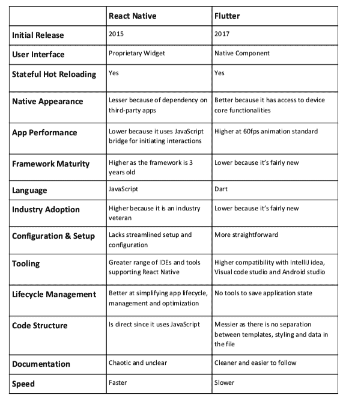

# 颤动 vs 自然反应

> 原文：<https://dev.to/vijaykhatri96/flutter-vs-react-native-3l5l>

随着技术的飞速发展，许多移动公司正在投入大量资金，以求在竞争中立于不败之地。与竞争对手相比，每个公司都想增加销售额。新型手机以高性能和低价格投放电子市场。

随着手机变得越来越智能，用户也变得越来越聪明。每个客户在选择和购买之前都会研究其功能和使用的技术。当谈到 Android 操作系统和 iOS 开发时，每个企业都在考虑如何才能最好地为他们的客户提供具有最佳 UI(用户界面)和出色 UX(用户体验)的移动应用程序。企业试图提供兼容多种平台的应用程序，并且在一个地方开发速度更快。然后旋舞和 RN(反应原生)进来的地方。两者都是开发移动应用的跨平台框架。

Flutter 是一款跨平台的移动 app 开发 SDK。这是一个免费的开源平台。Flutter 由谷歌开发，用于开发 iOS 和 Android 的应用程序。它使用谷歌创造的 Dart 编程语言。

React Native 是一个框架，它在 JavaScript 的帮助下帮助开发令人兴奋的真实的移动应用程序。它同时支持 Android 和 iOS 平台。
虽然 Flutter 和 React Native 有相似之处，但两者是不同的，使用不同的编程语言。如果你是一个移动应用开发者，那么你必须知道 Flutter 和 React Native 之间的区别。在这里，我们提供了两个框架之间的差异的列表。
Flutter 最初发布于 2017 年，React Native 发布于 2015 年。

**编程语言:**

React Native 使用的 JavaScript 编程语言在顶级编程语言列表中。JavaScript 是 web 开发的默认脚本语言。Node.js 推出后，JavaScript 也开始支持服务器开发。您可以使用您的 JavaScript 知识在 React Native 中构建移动应用程序。另一方面，Flutter 是基于 Google 创建的 Dart 编程语言。Dart 是一种鲜为人知的语言。这类似于 JavaScript，但不是 JavaScript。所以你需要了解 Dart 语言的基础知识。

**IDE 支持:**

React Native 已经存在 3 年多了，这就是为什么所有可用的 ide 都支持它。另一方面，Flutter 由有限的 ide 支持，包括 Android Studio、VS Code 和 IntelliJ IDEA。

*接口:* *

React Native 提供了关于蓝牙、摄像头、生物识别、NFC 支付的 Wi-Fi 原生接口，但没有任何可定制图形的工具。虽然 Flutter 只为蓝牙和 NFC 支付提供接口，但这些都处于开发阶段。

**开源平台:**

Flutter 和 React Native，都是开源的但是 Flutter 是 Google 的开源 SDK，React Native 是开源语言。

**代码结构:**

Flutter 的代码结构与 React Native 有很大不同。Flutter 不需要为开发人员分离样式、数据和模板。在 flutter 中，几乎所有需要的工具都很容易从相同的位置获得。这节省了开发人员的时间，并使其更加方便。在这方面，本土的反应是落后于颤振的。

**看起来&感觉起来:**

当我们谈到外观和感觉时，React Native 赢得了这个称号，因为越来越多的人推荐使用 JavaScript，开发人员对此也很熟悉。颤振在这一类别中得分较低。

**用户体验:**

React Native 使用本地组件来创建用户界面的块。而在 Flutter 的情况下，它与专有小部件集配合得非常好。专有小部件有助于获得全面定制的 UI 设计，具有良好的互操作性，但它缺乏 iOS 风格的表单组件。所以 React Native 的用户体验肯定比 Flutter 好。

**开发时间:**

当我们谈到开发时间时，这些天来公司已经证明了他们在按照承诺提供按时交付方面的卓越表现，对于这一点，React Native 是开发人员以及所有其他公司的最佳伴侣。颤振是一种较新的本土反应。所以需要更多的时间来开发这方面的项目。React Native 已经准备好使用节省时间的组件来开发项目，而不会给开发人员带来许多问题。

**性能:**

关于性能，应用程序开发人员希望使用 Flutter。了解这两种语言的移动应用程序开发人员支持 Google 的 Flutter，这是因为它的 Dart 框架。此外，JavaScript 层很容易与其本机组件连接。React native 拥有大量追随者，但当涉及到混合应用程序开发时，开发人员知道其中的痛苦。Flutter 让开发人员很容易重用现有的代码。C++引擎也支持它获得额外奖励。

**稳定性:**

稳定性是移动应用开发公司最重要的部分。旋舞和反应土著之间的竞争在这里似乎非常困难。Flutter 的可用版本不适合大型项目，因为它只有 Alpha 版本。Flutter beta 2 是谷歌去年宣布的。React native 拥有一个大型社区的支持，自推出以来相当稳定。

**文档:**

Flutter 有清晰结构化的文档，而 React Native 的文档不清晰混乱。毫无疑问，Google 知道为他们的编程语言编写可理解和详细的结构化文档的最佳方式，并以最适合开发者使用 Flutter 的方式提供文档。另一方面，React Native 使用外部开发工具包，因此您需要搜索每个工具包的文档。所以当我们谈论文档和工具包时，Flutter 是竞争的赢家。

**结论**

 
所以我们为您提供[**Flutter vs React Native**](https://hackr.io/blog/react-native-vs-flutter)开源、跨平台 app 开发框架的详细对比。总之，这两种框架在特定的应用中都有各自的重要性。Flutter 的 app 性能更高。其标准支持 60 fps 动画。但它的行业采用率较低，因为已知的应用程序只有 Hamilton 和 Flutter Gallery。在 RN (React Native)的情况下，app 性能低于 Flutter，因为它需要 JavaScript Bridge 与本机组件进行交互，但其行业采用率高于 Flutter 框架。RN 被脸书、Instagram、沃尔玛、Skype、LinkedIn、Airbnb 等采用。n 都是热门应用。

如果你正在寻找颤振教程，然后 [**点击这里**](https://hackr.io/tutorials/learn-flutter) 并获得最佳教程。