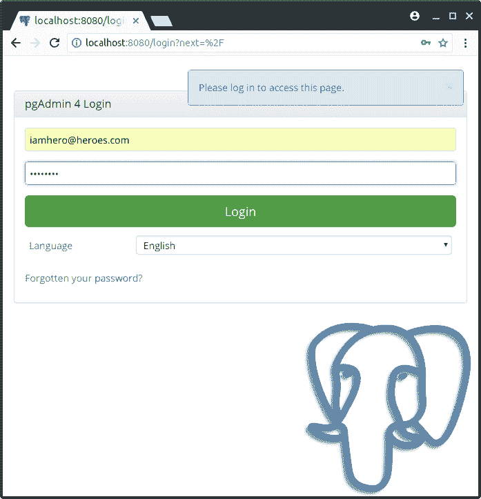
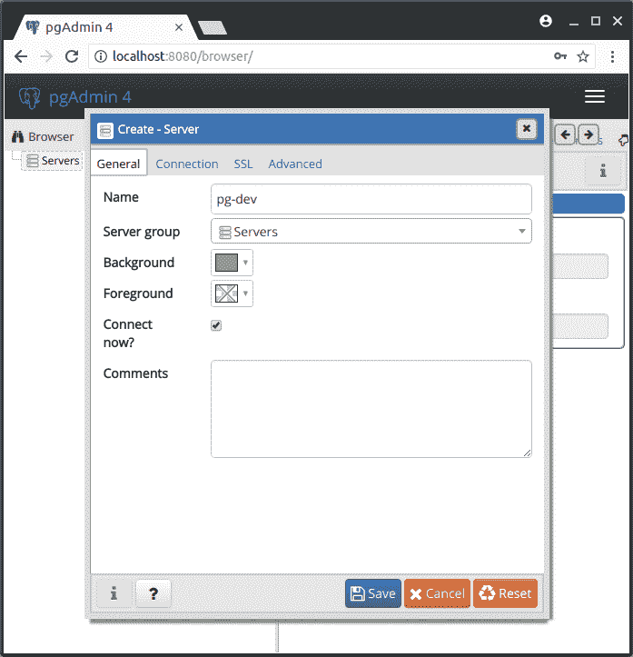
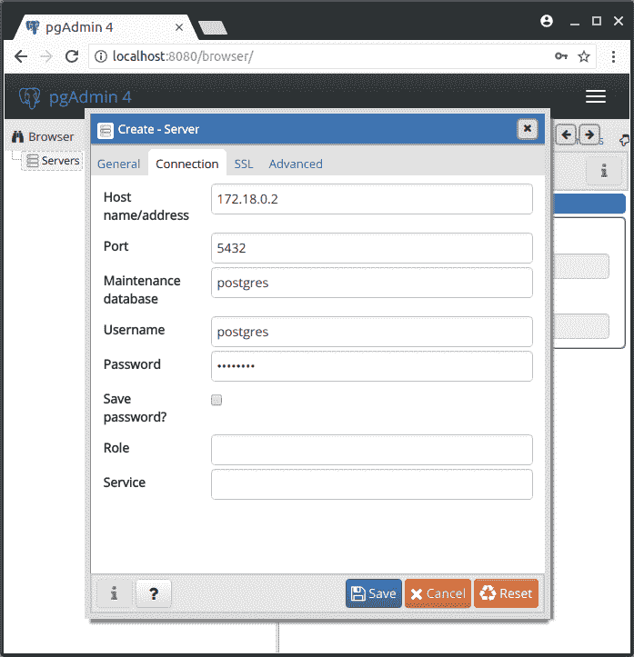
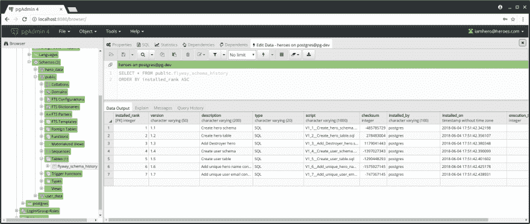

# Flyway -入门

> 原文：<https://dev.to/drminnaar/flyway---getting-started-3emm>

## 概述

本指南受到几年前我读过的一篇文章的启发，这篇文章描述了进化数据库设计的概念。文章可以在这里找到[。在文章中，提到了许多数据库迁移工具。](https://www.martinfowler.com/articles/evodb.html) [Flyway](https://flywaydb.org) 就是提到的工具之一。事实证明，我最终采用的是*飞行路线*。为什么*飞道*？因为它功能强大而且易于学习和使用。

在本指南中，我将通过提供一个使用工具的工作示例来解释如何使用 *Flyway* ，例如 *Docker* 、 *Docker-Compose* 、 *PostgreSQL* 、 *pgAdmin* ，当然还有 *Flyway* 。

根据官方 Flyway 文档，Flyway 是一个开源数据库迁移工具，它强烈支持简单性和约定胜于配置。

上述定义中的关键概念是*“数据库迁移”*。在讨论 *Flyway* 的上下文中，*“数据库迁移”*是一组一个或多个数据库变更。为了跟踪迁移， *Flyway* 创建了一个表(每个模式),为特定的模式维护所有迁移的历史。

Flyway 支持两种形式的迁移，即 ***版本化*** 和 ***可重复*** 迁移。

*   *版本化*

    *   包含版本号、校验和以及描述。版本号确保迁移是唯一的。校验和有助于防止意外更改被迁移。描述提供了关于迁移的元数据。
    *   版本化迁移按顺序应用且仅应用一次
    *   可以提供具有相同版本号的*“撤消迁移”*
*   *可重复*

    *   有描述和校验和，但版本号不是必需的。
    *   每当可重复迁移的校验和发生变化时，可以重新应用这些迁移。
    *   总是在*版本化的*迁移后应用。

迁移可以用 Java 和 SQL 编写。然而，在本指南中，我将重点介绍 SQL 迁移。SQL 迁移提供了最大的灵活性，因为它们不依赖于任何特定的开发平台。我还将关注*版本化的*迁移。

在本*入门*指南中，最简单的场景是从新数据库开始。本指南使用 *Postgres* 来说明迁移。为了更简单地查看数据库中的更改， *pgAdmin4* 将用于连接和检查数据库更改。将在本指南中创建的所有迁移均可在本报告中获得[。](https://github.com/drminnaar/flyway)

* * *

## 使用的技术

用于制作本指南的技术总结如下:

*   [Visual Studio 代码](https://code.visualstudio.com/)

Visual Studio Code 是微软为 Windows、Linux 和 macOS 开发的源代码编辑器。它包括对调试、嵌入式 Git 控件、语法高亮、智能代码完成、代码片段和代码重构的支持。

*   [码头工人](https://www.docker.com)

Docker 是一个执行操作系统级虚拟化的计算机程序，也称为容器化。它是由 Docker 公司开发的。

*   [坞站-复合](https://docs.docker.com/compose/overview/)

Compose 是一个定义和运行多容器 Docker 应用程序的工具。

*   [PostgreSQL](https://www.postgresql.org/)

PostgreSQL 是一个对象关系数据库管理系统。

*   [pgAdmin4](https://www.pgadmin.org/)

PostgreSQL 的开源管理和开发平台

*   [飞行路线](https://flywaydb.org/)

Flyway 是一个开源的数据库迁移工具。

* * *

## 先决条件

为了遵循本指南，需要对以下技术有基本的了解:

*   饭桶

Git 是一个免费的开源分布式版本控制系统。虽然不是严格强制的，但是建议在您的本地机器上安装 Git，以便更简单地检索附带的示例存储库。但是，也可以下载 zip 文件。

*   码头工人

对于本指南，我主要使用托管在 Docker 容器中的软件。虽然我提供了遵循本指南的所有说明，但仍然建议您熟悉 Docker。我写了一个 Docker 指南，可以在这里 找到 *[。作为 Docker 指南的一部分，还有一个](https://github.com/drminnaar/guides/tree/master/docker-guide)*[入门部分](https://github.com/drminnaar/guides/blob/master/docker-guide/2-getting-started.md)* 。*

除了 Docker 相关的技术，工具 *docker-compose* 也将用于运行容器。更具体地说， *docker-compose* 是一个用于定义和运行多容器 docker 应用程序的工具。

*   Postgres

PostgreSQL 是一个免费的开源对象关系数据库管理系统。在本指南中，PostgreSQL 将从 Docker 容器中运行。更多关于 Docker 上 PostgreSQL 的信息，请访问[官方 PostgreSQL Docker 注册表](https://hub.docker.com/_/postgres/)。

*   pgAdmin

工具 *[pgAdmin](https://www.pgadmin.org/)* ，是 PostgreSQL 的开源管理和开发平台。在本指南中， *pgAdmin* 将从 Docker 容器中运行。有关 Docker 上 *pgAdmin* 的更多信息，请访问[官方 pgAdmin Docker 注册表](https://hub.docker.com/r/dpage/pgadmin4/)。

* * *

## 环境设置

此时你应该已经安装了 *Docker* 和 *Docker-Compose* 。这可以通过从命令行运行以下命令来验证。

*   要验证 Docker:

```
 docker version
  docker info
  docker run hello-world 
```

Enter fullscreen mode Exit fullscreen mode

*   要验证 Docker-Compose:

```
 docker-compose --version 
```

Enter fullscreen mode Exit fullscreen mode

如果一切正常，上面的命令应该已经完美地运行了。

接下来，让我们获取本指南的存储库。

### 获取知识库

有三种方法可以获取本指南的存储库:

1.  使用 HTTPS 克隆回购

```
 git clone https://github.com/drminnaar/flyway.git 
```

Enter fullscreen mode Exit fullscreen mode

1.  使用 SSH 克隆 Repo

```
 git clone git@github.com:drminnaar/flyway.git 
```

Enter fullscreen mode Exit fullscreen mode

1.  下载 Zip 文件

```
 wget https://github.com/drminnaar/flyway/archive/master.zip
   unzip ./master.zip 
```

Enter fullscreen mode Exit fullscreen mode

### 初始化环境

*   使用命令行导航到*‘flyway’*目录。

*   一旦进入 *flyway* 目录，你会注意到一个名为*‘docker-compose . yml’*的文件。这个文件包含了用所有需要的容器化软件初始化我们的环境所需的所有指令。在我们的例子中， *docker-compose.yml* 文件保存了运行 *postgresql* 和 *pgadmin* 容器的指令。

*   键入以下命令来初始化运行 Flyway 代码迁移的环境:

```
 docker-compose up 
```

Enter fullscreen mode Exit fullscreen mode

*   键入以下命令，验证是否有 2 个容器正在运行。一个容器将是我们的 PostgreSQL 服务器。第二个容器将是我们的 pgAdmin web 应用程序。

```
 docker-compose ps 
```

Enter fullscreen mode Exit fullscreen mode

上面的命令应该显示在 *docker-compose* 文件中指定的运行容器。

* * *

## 创建数据库

创建迁移时要注意的第一件事是，迁移不会创建数据库。迁移仅适用于数据库环境，不会创建数据库本身。因此，在我的演示中，我将从头开始创建一个空数据库，然后为该数据库创建迁移。

在这个例子中，我创建了一个名为*“heroes”*的数据库。这是一个数据库，存储与英雄有关的数据，你猜对了。

*   此时，您应该有一个正在运行的 PostgreSQL 容器实例。要验证这一点，请运行以下命令:

```
 docker-compose ps 
```

Enter fullscreen mode Exit fullscreen mode

*   通过运行以下命令列出可用的数据库:

```
 docker exec -it $(docker container ls -qf name=pg-dev) psql -U postgres -c '\l' 
```

Enter fullscreen mode Exit fullscreen mode

目前没有*英雄*数据库。

*   键入以下命令创建一个*英雄*数据库:

```
 docker exec -it $(docker container ls -qf name=pg-dev) psql -U postgres -c 'CREATE DATABASE heroes OWNER postgres' 
```

Enter fullscreen mode Exit fullscreen mode

通过运行以下命令列出可用的数据库:

```
 docker exec -it $(docker container ls -qf name=pg-dev) psql -U postgres -c '\l' 
```

Enter fullscreen mode Exit fullscreen mode

* * *

## 创建迁移

为了清楚起见，请注意迁移只不过是一个 SQL 文件，由要在数据库上执行的各种 SQL 操作组成。

### 了解迁移

英雄数据库现在已经存在。我们现在准备运行我们的迁移。请注意*迁移*文件夹，这是本例中回购的一部分。*迁移*文件夹由 7 个迁移组成，简要描述如下:

*   V1_1_ *创建 _ 英雄 _ 模式. sql -创建一个新的 _ 英雄 _ 数据*模式

```
 CREATE SCHEMA hero_data AUTHORIZATION postgres; 
```

Enter fullscreen mode Exit fullscreen mode

*   V1_2_ *创建 _ 英雄 _ 表. sql -在*英雄 _ 数据*模式中创建一个新的 _ 英雄*表

```
 CREATE TABLE hero_data.hero
  (
      id BIGSERIAL NOT NULL,
      name VARCHAR(250) NOT NULL,
      description TEXT NOT NULL,
      debut_year INT NOT NULL,
      appearances INT NOT NULL,
      special_powers INT NOT NULL,
      cunning INT NOT NULL,
      strength INT NOT NULL,
      technology INT NOT NULL,
      created_at TIMESTAMPTZ NOT NULL,
      updated_at TIMESTAMPTZ NOT NULL
  );

  ALTER TABLE hero_data.hero ADD CONSTRAINT pk_hero_id PRIMARY KEY (id); 
```

Enter fullscreen mode Exit fullscreen mode

*   V1 _ 3 _*Add _ Destroyer _ hero . SQL-将我们的第一个英雄插入 _hero* 表中

```
 INSERT INTO hero_data.hero (
      name,
      description,
      debut_year,
      appearances,
      special_powers,
      cunning,
      strength,
      technology,
      created_at,
      updated_at) VALUES (
      'Destroyer',
      'Created by Odin, locked in temple, brought to life by Loki',
      1965,
      137,
      15,
      1,
      19,
      80,
      now(),
      now()); 
```

Enter fullscreen mode Exit fullscreen mode

*   V1_4_ *创建用户模式. sql -创建用户数据模式*

```
 CREATE SCHEMA user_data AUTHORIZATION postgres; 
```

Enter fullscreen mode Exit fullscreen mode

*   V1_5_ *创建 _ 用户 _ 表. sql -在*用户 _ 数据*模式中创建一个新的 _ 用户*表

```
 CREATE TABLE user_data.user
  (
      id BIGSERIAL NOT NULL,
      first_name VARCHAR(250) NOT NULL,
      last_name VARCHAR(250) NOT NULL,
      email VARCHAR(250) NOT NULL,
      alias VARCHAR(250) NOT NULL,
      created_at TIMESTAMPTZ NOT NULL,
      updated_at TIMESTAMPTZ NOT NULL
  );

  ALTER TABLE user_data.user ADD CONSTRAINT pk_user_id PRIMARY KEY (id); 
```

Enter fullscreen mode Exit fullscreen mode

*   V1 _ 6 _*Add _ unique _ hero _ name _ contra int . SQL-Alter _ hero*表通过添加唯一名称约束

```
 ALTER TABLE hero_data.hero ADD CONSTRAINT uk_hero_name UNIQUE (name); 
```

Enter fullscreen mode Exit fullscreen mode

*   V1 _ 7 _*Add _ unique _ user _ email _ constraint . SQL-Alter _ user*表通过添加唯一的电子邮件约束

```
 ALTER TABLE user_data.user ADD CONSTRAINT uk_user_email UNIQUE (email); 
```

Enter fullscreen mode Exit fullscreen mode

你会注意到奇怪的命名惯例。我们命名迁移的方式如下:

[根据官方 Flyway 文档](https://flywaydb.org/documentation/migrations#naming)，文件名由以下部分组成:

[T2】](https://res.cloudinary.com/practicaldev/image/fetch/s--Bxp5E8GP--/c_limit%2Cf_auto%2Cfl_progressive%2Cq_auto%2Cw_880/https://user-images.githubusercontent.com/33935506/40931818-bc78fb5a-682c-11e8-90ce-cb9f8d0e8c95.png)

*   **前缀:** V 表示版本化迁移，U 表示撤消迁移，R 表示可重复迁移
*   **Version:** 下划线(在运行时自动替换为点)分隔任意多的部分(不用于可重复的迁移)
*   **分隔符:** __(两个下划线)
*   **描述:**下划线(运行时自动替换为空格)分隔单词

### 运行迁移

最终我们开始迁移。为了运行迁移，我们将执行 [*Flyway* Docker 容器](https://hub.docker.com/r/boxfuse/flyway/)。

在运行迁移之前，我们需要获得 postgres 容器的 IP 地址，如下所示:

```
docker container inspect -f "{{ .NetworkSettings.Networks.flyway_skynet.IPAddress}}" flyway_pg-dev_1 
```

Enter fullscreen mode Exit fullscreen mode

我们将上面获得的 IP 地址插入到下面的命令中。我的 IP 地址是 *172.18.0.2*

```
docker run --rm --network docker_skynet -v $PWD/migrations:/flyway/sql boxfuse/flyway -url=jdbc:postgresql://172.18.0.2:5432/heroes -user=postgres -password=password migrate 
```

Enter fullscreen mode Exit fullscreen mode

您应该会看到类似以下输出的输出:

[T2】](https://res.cloudinary.com/practicaldev/image/fetch/s--E7lcPYnx--/c_limit%2Cf_auto%2Cfl_progressive%2Cq_auto%2Cw_880/https://user-images.githubusercontent.com/33935506/40933249-2e5510b6-6831-11e8-8df5-526f6c191434.png)

从上面的输出可以看出，所有 7 次迁移都成功运行。

运行以下命令来查看 heroes 数据库中的表列表:

```
docker exec -it $(docker container ls -qf name=pg-dev) psql -U postgres -d heroes -c "SELECT table_schema, table_name FROM INFORMATION_SCHEMA.TABLES WHERE table_schema NOT IN ('pg_catalog', 'information_schema')" 
```

Enter fullscreen mode Exit fullscreen mode

您应该会看到如下表格列表:

| 表模式 | 表名 |
| --- | --- |
| 公众的 | 飞行路线 _ 模式 _ 历史 |
| 英雄 _ 数据 | 英雄 |
| 用户数据 | 用户 |

数据库表 *flyway_schema_history* 包含发生的数据库迁移的所有记录。

最后，登录到 pgAdmin 查看 *flyway_schema_history* 表。

*   注册

在浏览器中导航至 [http://localhost:8080](http://localhost:8080)

*   **邮箱/用户名:**【iamhero@heroes.com T2】
*   **密码:**密码

如果您想知道 pgadmin 凭证来自哪里，您可以在 *docker-compose.yml* 文件中找到它们。它们作为环境变量传入。

[T2】](https://res.cloudinary.com/practicaldev/image/fetch/s--xY9Rm8L2--/c_limit%2Cf_auto%2Cfl_progressive%2Cq_auto%2Cw_880/https://user-images.githubusercontent.com/33935506/40934525-5ccbda3e-6835-11e8-8f6d-33efc5eea30c.png)

*   登录后，您可以通过添加如下连接来连接到 PostgreSQL 服务器:

[T2】](https://res.cloudinary.com/practicaldev/image/fetch/s--4F4umsC8--/c_limit%2Cf_auto%2Cfl_progressive%2Cq_auto%2Cw_880/https://user-images.githubusercontent.com/33935506/40934521-5bf26fec-6835-11e8-83dd-ea686c47be22.png)

[T2】](https://res.cloudinary.com/practicaldev/image/fetch/s--l1j2IUIx--/c_limit%2Cf_auto%2Cfl_progressive%2Cq_auto%2Cw_880/https://user-images.githubusercontent.com/33935506/40934522-5c29c0b4-6835-11e8-8a9d-b1324f377011.png)

*   打开位于英雄数据库公共模式中的 *flyway_schema_history* 表。

[T2】](https://res.cloudinary.com/practicaldev/image/fetch/s--TxCX0bFu--/c_limit%2Cf_auto%2Cfl_progressive%2Cq_auto%2Cw_880/https://user-images.githubusercontent.com/33935506/40934524-5c976d62-6835-11e8-9b51-892aa1493c8b.png)

* * *

## 结论

这是使用工具 *Flyway* 执行数据库迁移的基本介绍。虽然很基本，但实际上没有比这更复杂的了。

我没有介绍如何在现有数据库中使用 *Flyway* ，但是，这也可以通过在 *Flyway* 中使用 *baseline* 命令来支持。我将在本指南的下一部分更详细地介绍这一点。