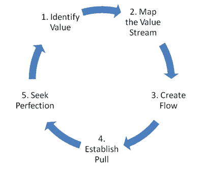

# 在敏捷环境中，关注原则而不是方法-(或者更精益)

> 原文：<https://dev.to/danwright_dev/focus-on-the-principles-and-not-the-methodology-when-in-an-agile-environment---or-just-be-more-lean-2of7>

我已经在敏捷环境中工作了大约 4 年，这是我第一次在这样的环境中工作，我开始意识到我们经常会过于专注于方法论和坚持方法论，以至于我们会忘记我们通过变得敏捷而试图解决的问题。

我第一次就这个话题做了 10 分钟的简短发言，我想我应该把它写在一篇文章里。

其目的是试图帮助那些试图拥抱敏捷的人，浏览术语，但也提醒那些已经在敏捷环境中工作的人后退一步，将任何变化或讨论提交给敏捷原则，或更好的精益原则。

最近，我一直试图向处于非敏捷非技术环境中的人介绍，敏捷将帮助他们更好地管理日常事务。在不强调软件开发的情况下，更好地理解敏捷对我来说是一个非常值得的练习。为了做到这一点，我求助于“像一个 5 岁的孩子一样向我解释”的方法，这让我思考敏捷对我来说是什么，我想到了:

> 它鼓励我继续以客户为中心，同时不断提高工作质量，减少浪费。”

虽然这似乎是对敏捷的简化观点，但我认为它很好地解释了采用敏捷的原因，在某种程度上，非敏捷、非技术人员很容易接受。

## 方法论先于原则

精益真正扎根于 1930 - 1950 年代的丰田汽车制造厂，是为了在行业中具有竞争力。通过观察交付系统中的流程，他们意识到小的增量变化可以提供更好、更少浪费的交付。正是在这里定义了查看系统流程的概念，并制定了精益的 5 项原则。
精益的完整历史可以在:[https://www.lean.org/WhatsLean/History.cfm](https://www.lean.org/WhatsLean/History.cfm)找到

精益和敏捷总是有联系的，最初的敏捷开发者都从精益中寻找灵感。Martin Fowler 解释说，Mary 和 Tom Poppendieck 帮助激发了最初的敏捷思维方式及其原则。玛丽在一家制造厂工作，汤姆从事软件工作。他们都是敏捷社区的积极成员，在 1970 - 1990 年代塑造了敏捷社区的发展方向。
马丁·福勒的文章:[https://martinfowler.com/bliki/AgileVersusLean.html](https://martinfowler.com/bliki/AgileVersusLean.html)

敏捷宣言在 2001 年由 12 条原则创建，鼓励一种适应软件开发精益原则的工作方式。《敏捷宣言》被认为是 12 条原则所支持的敏捷工作的事实指南。
敏捷宣言和 12 项原则:[https://www . agile alliance . org/agile 101/12-principles-behind-The-agile-manifesto/](https://www.agilealliance.org/agile101/12-principles-behind-the-agile-manifesto/)

一旦这些原则到位，坚持这些原则的不同方法就形成了，从 20 世纪 90 年代早期的 Crystal 开始，经历了许多变化，并以许多不同的方式进行了调整，一些更流行的方法包括，Scrum，Kanban 和 SAFe。

## 原则

精益工具包([https://leankit.com/learn/lean/lean-principles/](https://leankit.com/learn/lean/lean-principles/))将敏捷的 7 个原则定义为:

| 精益原则 |  |
| --- | --- |
| 整体优化 | 创造知识 |
| 消除浪费 | 推迟承诺 |
| 建立质量 | 尊重他人 |
| 快速交付 | - |

如 lean.org([https://www.lean.org/WhatsLean/Principles.cfm](https://www.lean.org/WhatsLean/Principles.cfm))所示，这 5 个原则形成了精益持续学习循环:

[T2】](https://res.cloudinary.com/practicaldev/image/fetch/s--ClOUyBPL--/c_limit%2Cf_auto%2Cfl_progressive%2Cq_66%2Cw_880/https://www.lean.oimg/5stepslean.gif)

我发现这 5 个原则或循环阶段与 7 个精益套件原则一起使用时，有助于巩固“精益工作”所需的精益思想。确定对客户的价值不断提醒我们，在规划实现客户需求的方式之前，要记住你是在为谁提供服务。一旦理解了，就要清除服务流程中的所有障碍，确保服务以高质量、少浪费的方式及时到达客户手中。在系统中建立拉动式生产会促使你确认对产品的需求，确保不做不需要的工作，然后在不产生库存的情况下尽可能及时地满足需求。看板方法鼓励这种通过系统的流动的拉动而不是流动的推动，这种工作流建立了到过程中的下一阶段的负责任的/尊重的工作交付，而不是仅仅“把它扔出围栏”。

敏捷宣言定义的 12 条敏捷原则([https://www . agile alliance . org/agile 101/12-principles-behind-the-agile-manifesto/](https://www.agilealliance.org/agile101/12-principles-behind-the-agile-manifesto/))建立在以前的精益思想基础上，使其适用于软件开发。

| 敏捷原则 |  |
| --- | --- |
| 我们最优先考虑的是通过早期和持续交付有价值的软件来满足客户 | 工作软件是进步的主要衡量标准。 |
| 欢迎不断变化的需求，即使是在开发的后期。敏捷流程利用变化为客户带来竞争优势。 | 敏捷过程促进可持续发展。发起人、开发人员和用户应该能够无限期地保持恒定的步调。 |
| 频繁地交付工作软件，从几个星期到几个月，优先选择较短的时间尺度。 | 对技术优势和良好设计的持续关注增强了敏捷性。 |
| 业务人员和开发人员必须在整个项目中每天一起工作。 | 简单——最大化未完成工作量的艺术——至关重要。 |
| 围绕有积极性的个人建立项目。给他们需要的环境和支持，相信他们能完成工作。 | 最好的架构、需求和设计来自自组织团队。 |
| 向开发团队传达信息的最有效的方法是面对面的交谈。 | 该团队定期反思如何变得更有效，然后相应地调整自己的行为。 |

他们提倡个人和交互优于过程和工具，工作软件优于综合文档，客户协作优于合同谈判，响应变化优于遵循计划。对我来说，这听起来很像它的根源，精益。在我看来，虽然我不反对他们试图传递的信息，但这 12 项原则可以减少。

虽然没有涉及所有的原则，但我想指出几条。将软件作为进展的主要衡量标准，这一原则会导致团队成员过于专注于完成“工作单”,而没有任何假设、实验和学习的空间。“快速失败”和“概念验证”是如何融入到我要衡量的工作软件中的？围绕积极的个人构建项目，优先考虑面对面的交流和对细节的持续关注，是我认为成熟软件员工良好工作实践的另外 3 个原则，也可能是我们应该自然而然做的现代工作环境的先决条件。

我认为最重要的一个敏捷原则是，“最好的架构、需求和设计来自自组织团队”。我认为这是一个非常重要的原则，也是推进精益原则的一个原则，作为团队，我们应该对自己的工作量、优先级以及如何实现客户设定的目标负责。这应该是单个团队规定的事情，毕竟是团队要对没有完成的任务负责。

为了让我的想法更有分量，敏捷原则已经被缩小了，有了“现代敏捷”或“敏捷之心”。

现代敏捷:[http://modernagile.org/](http://modernagile.org/)T2【心灵敏捷:[http://heartofagile.com/](http://heartofagile.com/)

## 方法论的问题

当你选择变得更加敏捷或者以一种敏捷的方式工作时，你可能会使用一种已建立的方法。但是你怎么知道它是正确的呢？我真诚地相信，没有一种方法是完美的，这常常是一个问题。试图更多地坚持 scrum 原则并不等同于更加敏捷，坚持一种方法通常会让人觉得你违背了作为一个自我调节团队的敏捷原则。

方法论应该被视为指导方针，而不是让人们为没有以正确的方式完成“任务”负责的东西。将任何方法作为指导方针都允许混合(敏捷+敏捷)或混合(敏捷+好主意)的工作方式，确保团队对他们的工作环境和自我调节保持灵活。以看板的方式工作，但是想要促进更多的结对编程(极限编程)，如果方法论是一个指南而不是一个硬性的规则，这不是问题。

如果他们不了解敏捷，他们会收到电子邮件，或者参与关于 sprints、velocity、backlogs 和 t 恤衫尺寸的对话，那么与业务或客户的集成可能会很有挑战性。这种缺乏理解会导致对从事这项工作的人缺乏信任或信心，从而导致资金短缺。不要和人们谈论方法，不要用术语解释做某事的敏捷原因，这有助于建立关系，并能让非敏捷人员更好地与敏捷实践者融合。当我们把焦点从为什么我们做敏捷转移到我们如何做敏捷时，我们在我们自己和实践敏捷的原因之间增加了一层抽象，我们忘记了做敏捷的动机，而把注意力集中在完成任务的方式上，这可能不是一种非常敏捷的方式。

## 那么为什么要关注原则呢？

敏捷方法是一种工具，就像 JavaScript 库或 IDE 一样，应该如此使用。有了这种想法，我们可以看到所有的敏捷工具都有相同的工具包,“5 个为什么”,持续的反馈循环，以客户为中心，透明度，等等。专注于我们为什么要做敏捷、以客户为中心、更好的交付、减少浪费、更快的交付，我们可以为工作选择最好的工具，而不局限于方法论所说的。

> 通过拥抱敏捷给我们工作带来的自由，我们可以成为真正的敏捷。

虽然我知道这不是对敏捷、它的方法和我们用来完成工作的工具的深入探究，但我希望它有助于提醒人们，我们应该从我们正在做的事情后退一步，问问我们自己“这个决定是敏捷的吗”？