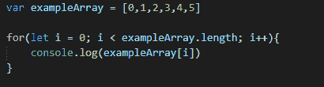
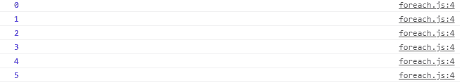
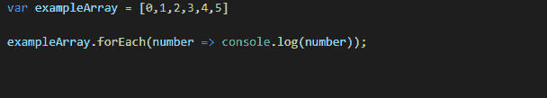
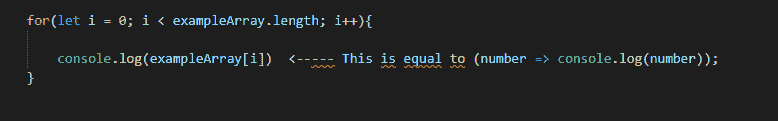
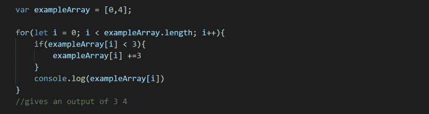
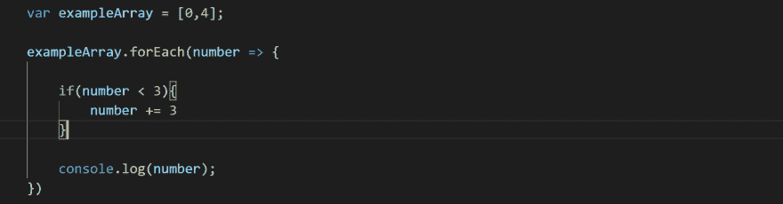

# Foreach 数组循环分解

> 原文：<https://dev.to/yoonsl/foreach-array-loop-breakdown-4mna>

大家好，我仍然是使用 JavaScript 的初学者，但我在这里分享我和我的同事在学习 JavaScript 时遇到的最困难的问题之一。Foreach 数组循环不是最难的方法之一，但却是最难养成习惯的方法之一。因为我们在 foreach 数组循环之前已经学习了 for 循环，所以我认为，如果不使用 foreach 数组循环，一切都可以完成。

下面是 for 循环的一个简单示例:

[T2】](https://res.cloudinary.com/practicaldev/image/fetch/s---LzNhtMK--/c_limit%2Cf_auto%2Cfl_progressive%2Cq_auto%2Cw_880/https://thepracticaldev.s3.amazonaws.com/i/nnb65dxv6w7my7v3snih.PNG)

循环的控制台日志输出如下:

[T2】](https://res.cloudinary.com/practicaldev/image/fetch/s--e0lnGBLz--/c_limit%2Cf_auto%2Cfl_progressive%2Cq_auto%2Cw_880/https://thepracticaldev.s3.amazonaws.com/i/ruurz6irhmblcgn5itxk.PNG)

另外，这是一个关于 Foreach 循环的简单示例:

[T2】](https://res.cloudinary.com/practicaldev/image/fetch/s--ysxE9uV8--/c_limit%2Cf_auto%2Cfl_progressive%2Cq_auto%2Cw_880/https://thepracticaldev.s3.amazonaws.com/i/bwrzbueyxqsf0nydoiyw.PNG)

Foreach 循环的控制台日志输出如下:

[T2】](https://res.cloudinary.com/practicaldev/image/fetch/s--e0lnGBLz--/c_limit%2Cf_auto%2Cfl_progressive%2Cq_auto%2Cw_880/https://thepracticaldev.s3.amazonaws.com/i/ruurz6irhmblcgn5itxk.PNG)

如果你看一下这两个例子，代码的编写方式是不同的，但是两个循环有相同的输出。

所以，理论上，exampleArray.forEach 方法等于 for(设 I = 0；i < exampleArray.lengthi++)并且 forloop 内的函数等于 forEach 循环内的函数。

[T2】](https://res.cloudinary.com/practicaldev/image/fetch/s--_3bXMN4f--/c_limit%2Cf_auto%2Cfl_progressive%2Cq_auto%2Cw_880/https://thepracticaldev.s3.amazonaws.com/i/f6v45ilx1d2iivo4djmv.PNG)

当然，我们知道在 foreach 循环中没有变量 I，所以使用变量 I 创建方法最好使用 forloop。

下面是另一个在 forloop 中包含 if 语句的示例:

[T2】](https://res.cloudinary.com/practicaldev/image/fetch/s--0VulAv0E--/c_limit%2Cf_auto%2Cfl_progressive%2Cq_auto%2Cw_880/https://thepracticaldev.s3.amazonaws.com/i/1nvf0htxnydrqs8nsue6.PNG)

以及带有 if 语句的 foreach 循环示例:

[T2】](https://res.cloudinary.com/practicaldev/image/fetch/s--ObrhR5Ly--/c_limit%2Cf_auto%2Cfl_progressive%2Cq_auto%2Cw_880/https://thepracticaldev.s3.amazonaws.com/i/c0228f08tnsauguuj1qx.PNG)

在此示例中，if 语句包含在 forloop 和 foreach 循环中。在 forloop 示例中，数组使用数组变量名后跟一个括号来表示。括号中的 I 是一个数字，表示当前选定数组的位置。for 循环检查数组是否小于 3，如果为真则加 3，如果为假则不对数组做任何事情。在 foreach 示例中，number 按顺序表示每个数组，它检查数组 0 或 1 中的数字是否小于值 3，如果每个数组中的数字小于 3，则添加值 3。所以使用 forloop is array 的好处是可以用指针指出来，但坏处是代码会更长更乱。