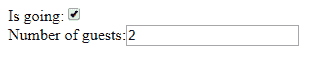

# React 中带有表单的函数式编程

> 原文：<https://dev.to/nestedsoftware/forms-in-react-a-functional-programming-primer-183>

最近我在 React 中开发了一些表单。当然，我发现自己在每个表单中复制和粘贴相同的逻辑来处理输入、验证等等，所以我开始考虑如何减少代码重复的数量。

我的第一个想法是将共享逻辑放入我的表单组件将继承的基类中。然而，当我研究它时，我发现 React 倾向于不鼓励以这种方式使用继承。

[https://reactjs.org/docs/composition-vs-inheritance.html](https://reactjs.org/docs/composition-vs-inheritance.html):

> 在脸书，我们在数以千计的组件中使用 React，我们还没有发现任何我们会建议创建组件继承层次的用例。
> 
> Props 和 composition 为您提供了所需的所有灵活性，以一种显式且安全的方式定制组件的外观和行为。记住，组件可以接受任意的属性，包括原始值、反应元素或函数。

我想，“好吧，这很有趣。我如何使用组合来提取表单中的共享逻辑？”我有一些想法，但是我不太清楚如何使它全部工作。我做了一些研究，偶然发现了一个很好的 React 表单库，名为 [Formik](https://github.com/jaredpalmer/formik) 。

在 Formik 中，表单是功能组件。这意味着它们不直接处理自己的状态。相反，我们编写一个函数，将状态和一些处理函数作为参数。该函数返回表单的 JSX，并适当绑定到传入的参数。逻辑和状态管理都发生在 Formik 组件中，该组件将每个功能表单组件作为输入。我还发现了一个很棒的[视频](https://www.youtube.com/watch?v=oiNtnehlaTo)，其中 Jared 概述了一些基本的搭建代码，展示了如何开始编写像 Formik 这样的东西。

我浏览了视频，并创建了我自己版本的代码，做了一些简化，使事情变得更加清楚。

在本文中，我将从头开始讲述创建类似 Formik 的东西的基础知识。但是，如果您想在实际的应用程序中使用这种方法，只使用实际的 Formik 库可能是一个好主意。

和视频一样，我们从 React 文档中的一个基本表单开始:

[](https://res.cloudinary.com/practicaldev/image/fetch/s--xwVcS0lB--/c_limit%2Cf_auto%2Cfl_progressive%2Cq_auto%2Cw_880/https://thepracticaldev.s3.amazonaws.com/i/c6unrz3meq7ea37mj8d7.png)T3】

```
class Reservation extends React.Component {
  constructor(props) {
    super(props);
    this.state = {
      isGoing: true,
      numberOfGuests: 2
    };

    this.handleInputChange = this.handleInputChange.bind(this);
  }

  handleInputChange(event) {
    const target = event.target;
    const value = target.type === 'checkbox' ? target.checked : target.value;
    const name = target.name;

    this.setState({
      [name]: value
    });
  }

  render() {
    return (
      <form>
        <label>
          Is going:
          <input
            name="isGoing"
            type="checkbox"
            checked={this.state.isGoing}
            onChange={this.handleInputChange} />
        </label>
        <br />
        <label>
          Number of guests:
          <input
            name="numberOfGuests"
            type="number"
            value={this.state.numberOfGuests}
            onChange={this.handleInputChange} />
        </label>
      </form>
    );
  }
} 
```

Enter fullscreen mode Exit fullscreen mode

这个表单组件管理自己的状态，更重要的是，它依赖于一些代码，比如`handleInputChange`，这些代码显然会被复制并粘贴到每个表单中。

相反，让我们将表单提取为一个功能组件:

```
const ReservationForm = ({state, handleChange, handleBlur, handleSubmit}) => (
  <form onSubmit={handleSubmit}>
    <label>
      Is going:
      <input
        name="isGoing"
        type="checkbox"
        checked={state.values.isGoing}
        onChange={handleChange} 
        onBlur={handleBlur}/>
    </label>
    <br />
    <label>
      Number of guests:
      <input
        name="numberOfGuests"
        type="number"
        value={state.values.numberOfGuests}
        onChange={handleChange}
        onBlur={handleBlur}/>
    </label>
    <button>Submit</button>
    <pre>{JSON.stringify(state)}</pre>
  </form> 
) 
```

Enter fullscreen mode Exit fullscreen mode

好了，这样不是更好看吗？现在我们的表单变成了一个函数，它接受一些参数并返回一个绑定到这些参数的 JSX。`ReservationForm`只是根据接收到的输入返回一个对象:这是一个[纯函数](https://en.wikipedia.org/wiki/Pure_function)。

> 该功能组件仍然必须具有类似于`state`、`handleChange`等的参数。直接传给了它。这意味着我们需要将这个样板文件作为我们编写的每个表单的一部分。实际的 Formik 项目提供了一些标准的表单组件，允许我们绕过这些组件。

下一个问题是，“我们如何将功能表单组件与实际处理表单逻辑的代码连接起来？”下面我们简单地将`BabyFormik`包裹在`ReservationForm`周围:

```
const ReservationFormWithBabyFormik = props => {
  const initialValues = {
    isGoing: true,
    numberOfGuests: 2,
  }

  const onSubmit = values => alert(JSON.stringify(values))

  return <BabyFormik  initialValues={initialValues} onSubmit={onSubmit}>
    <ReservationForm/>
  </BabyFormik>
} 
```

Enter fullscreen mode Exit fullscreen mode

接下来我们看看`BabyFormik`是如何访问`ReservationForm`的。下面的代码包含我们的状态管理逻辑，并与传入的表单进行通信:

```
class BabyFormik extends React.Component {
  constructor(props) {
    super(props)

    this.handleChange = this.handleChange.bind(this)
    this.handleBlur = this.handleBlur.bind(this)
    this.handleSubmit = this.handleSubmit.bind(this)

    this.state = {
      values: this.props.initialValues || {},
      touched: {},
      errors: {}
    }
  }  

  handleChange(event) {    
    const target = event.target;
    const value = target.type === 'checkbox' ? target.checked : target.value;
    const name = target.name;

    this.setState(prevState => ({
      values: {
        ...prevState.values,
        [name]: value
      }
    }))
  }

  handleBlur(event) {
    const target = event.target
    const name = target.name
    this.setState(prevState => ({
      touched: {
        ...prevState.touched,
        [name]: true
      }
    }))
  }

  handleSubmit(event) {
    event.preventDefault()
    //add validation here 
    //set `isSubmitting` to true here as well
    this.props.onSubmit(this.state.values)
  }

  render() {
    //pass state and callbacks to child as parameters
    return React.cloneElement(this.props.children, {
      state: this.state,
      handleChange: this.handleChange,
      handleBlur: this.handleBlur,
      handleSubmit: this.handleSubmit
    })
  }
} 
```

Enter fullscreen mode Exit fullscreen mode

`render`函数将所需的变量作为参数传递给子组件，在我们的例子中是`ReservationForm`。

关于像函数式或面向对象编程这样的范例的文章往往会给出非常抽象或过于简单的例子。我喜欢这个例子，因为它展示了如何在实际环境中使用函数式方法:我们让表单成为纯粹的函数，只返回 JSX，我们把“脏活”委托给更高级别的组件。在这个例子中，那是`BabyFormik`。这是函数式编程的标准方法:我们试图编写尽可能多的纯函数代码，并隔离管理状态或产生副作用的代码。

以下是完整的示例:

[https://codepen.io/nestedsoftware/embed/vVEjKb?height=600&default-tab=result&embed-version=2](https://codepen.io/nestedsoftware/embed/vVEjKb?height=600&default-tab=result&embed-version=2)