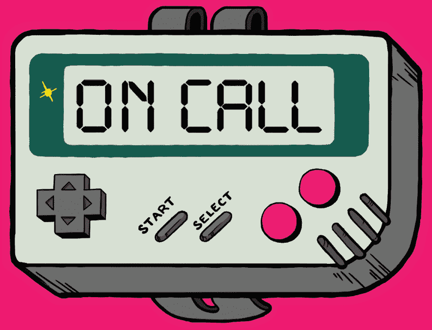
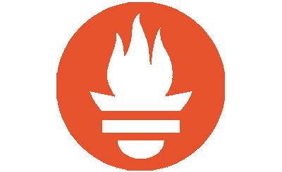
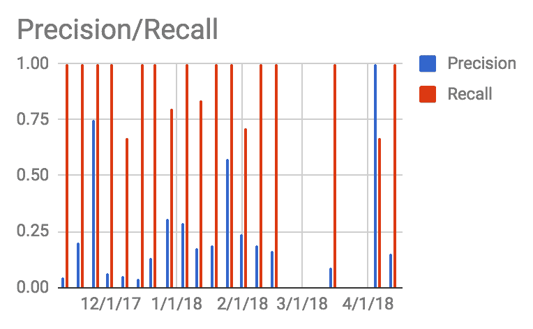

# 培养强大的工程待命文化

> 原文：<https://dev.to/jiaqicodes/fostering-a-strong-engineering-on-call-culture-2lkj>

*这篇文章最初发表在[按钮博客](https://blog.usebutton.com/fostering-a-strong-engineering-on-call-culture-218f6156e4b5)上。*

当我第一次加入 Button 的待命团队时，我对被传呼感到非常焦虑。如果我睡过了一页呢？那个服务到底是干什么的？我应该看哪个仪表板？从那以后，我在轮值上呆了快一年，回复了无数的页面。虽然我不能说我喜欢随叫随到，但我可以证明，成为随叫随到的一员绝对是我在 Button 工作的一大亮点——这在很大程度上要归功于我们随叫随到团队的[支持和文化](https://www.usebutton.com/company/culture)。

### 什么是随叫随到，为什么文化很重要？

在运营和工程中，待命团队通常负责确保服务和应用程序的可靠性和可用性。如果待命团队不能取得成功，将会给企业带来明显的后果——直接的收入损失和声誉损害。不太明显但同样具有影响力的是不健康的随叫随到文化可能在工程组织中滋生的压力和挫折。工程既要构建软件，也要维护软件。如果您总是担心生产中断，那么很难构建可伸缩的软件！

如果处理不当，凌晨 2:00 的中断可能会对公司造成损害，也会让必须起床处理相关页面的个人感到沮丧和疏远。对于一个健康的随叫随到的文化来说，留意这两种观点是很重要的。在这篇博客中，我将概述一些按钮待命团队的最佳实践。

### 随叫随到@按钮

 

<figcaption>按钮的随叫随到贴纸，由【】黄</figcaption>

设计

在 Button，构建服务的产品工程师还负责保证所有关键服务的全天候正常运行时间。为了做到这一点，我们保持每周随叫随到，从周五中午开始，届时我们会进行物理切换以交换 WiFi 热点。总有两个人随叫随到——一个主要的，一个次要的。如果主节点在收到由中断触发的初始页面时没有响应或不可用，则该页面会升级到辅助节点。工程技术支持团队还有一个业务团队对应人员，负责处理合作伙伴面临的问题升级和有关停机的外部沟通。

最后但同样重要的是，在按钮处待命是自愿的。不是所有的产品工程师都在轮换，他们可以随时自由加入或离开。因为随叫随到是一项独特的责任，通常需要做出独特的牺牲，所以 Button 每月会给随叫随到团队的每个成员发放一笔不多的奖金，以示感谢。

### 是什么让我们的待命团队取得成功？

以下是我们随叫随到文化的一些核心理念:

*   **正在进行登机流程**
*   **设定正确的期望值**
*   **单点人**
*   无可指责的验尸报告
*   **我们的警报理念**
*   **鼓励自我保健**

**入职流程**

为成功做准备从一开始就开始。我们不只是增加待命轮换的人员，并希望有最好的结果。我们的入职流程如下:

1.  跟踪当前的待命工程师。
2.  在一周的工作时间里做主要工作，并结对进行真正的升级。
3.  自己处理升级—我们模拟一次升级，让一名新工程师进行分类和解决。
4.  加入到旋转中。

**设定正确的期望值**

处理升级并不一定意味着您最终解决了每个问题背后的根本原因，甚至不意味着您拥有这样做的专业技能。

引用我们的升级手册:

> 把它想象成一所医院:急诊室的医生在那里对病人进行分类和稳定，然后把病人送到更专业的护理人员那里。

当我们收到传呼时，并不指望我们解决所有问题，而是希望我们评估问题，确定对业务的影响，通过我们的状态页面与外部沟通，并尽最大努力减轻损失。通常情况下，需要后续任务来确保升级得到完全解决，不会成为再次发生的事件。我们非常信任我们的工程师能够做出最好的判断，在上报期间始终做出正确的决定需要经验和实践。

**单点人**

有时高压升级可能会造成混乱。可能涉及许多人或许多系统，跟踪正在发生的变化以及谁在做什么很快变得至关重要。我们遵循的理念是，任何时候都由一个单点人负责上报响应。

我们的手册指出:

> *关键人物是* ***负责升级期间的所有决策*** *，包括生产变更以及决定与其他方沟通的内容和时间。如果你不是重点人，你就不应该做这些事情，除非重点人有* ***明确要求并指示*** ***你*** *帮忙。*
> 
> *在升级过程中，负责人可能会发生变化；只要它是明确的(例如，“生产问题解决了，Barry 将从这里接手。”).*

无可指责的验尸报告

> 我们努力从错误中学习，其中很大一部分是一种无可指责的事后文化。

无可指责的事后分析让我们诚实而大胆地谈论我们本可以做得更好的地方，并反思我们所学到的东西。这是工程师倡导关键基础设施改进或现有流程变更的地方。这为公司的其他人提供了一个权衡和讨论业务影响并设定未来预期的机会。

事后分析也是深入探究问题根源的机会。我们坚信有一个**神秘自由产品**——如果我们的生产系统以一种意想不到的方式运行，我们想知道为什么。

**我们的警报理念**

 

<figcaption>普罗米修斯标志</figcaption>

我们使用[普罗米修斯](https://prometheus.io/)作为我们监控堆栈的一部分。警报规则提交给[Github](https://github.com/)T8】同行评审。 [Alertmanager](https://prometheus.io/docs/alerting/alertmanager/) 向 [PagerDuty、](https://www.pagerduty.com/) email 和 Slack 发送警报。我们有 3 种不同类型的警报:

*   **非寻呼警报**:仅向电子邮件和 Slack 发送警报
*   **日间寻呼警报**:在日间时段向寻呼机值班发送警报，否则仅发送至电子邮件和 Slack
*   **寻呼告警**:随时向 PagerDuty、email、Slack 发送告警。

团队中的任何工程师都有权添加或删除警报，但所有警报都应该**可操作**，**必须有剧本**。我们的行动手册旨在简明扼要，描述当警报触发时可以采取的具体行动。每个剧本条目都包含对业务影响的简要描述、有用的 bash 命令以及到适当仪表板的链接。我们的目标是让任何工程师，不管他们有多少背景知识，都能够使用行动手册中的信息来快速诊断问题。

为了跟踪我们的警报是否真正可行，我们从数据科学中借用了一些概念，并测量我们的警报的[精度和召回](https://en.wikipedia.org/wiki/Precision_and_recall)。在这种情况下，precision 指的是发出的可操作警报的百分比，recall 指的是我们的警报通知我们的可操作事件的百分比。当精度较低时，我们会评估是否应禁用或修改特定警报，以便在较低的阈值触发。当回忆率较低时，我们会尝试看看是否有更好的信号来衡量我们应该做出反应的实际症状。

**鼓励自我保健**

无论是在晚上被传呼，还是不得不重新安排晚餐，随叫随到*都会对你的个人生活造成干扰。然而，如果设置得当，随叫随到的*不应该成为任何个人的过度负担。以下是 Button 待命团队确保我们的工程师不会筋疲力尽的几种方法:**

*   在一周结束时，我们努力让下一个人更好地轮换。如果有未解决的问题，我们会将其解决或交给产品团队负责人。
*   我们保留了呼叫历史记录，因此如果问题再次出现，您可以看到之前的工程师是如何处理和解决的。
*   在处理升级时，我们的随叫随到工程师使用 Slack 来传达他们的决策和行动的详细情况，以便其他人可以跟进。
*   我们的随叫随到时间表是灵活的。如果有人需要休息几个小时，我们就放松我们的行动频道，看看是否有人可以替代。如果初级在晚上收到传呼，我们鼓励他们第二天换出来，这样他们就可以得到他们应得的休息。
*   我们被鼓励并准备好在工作时间内外寻求帮助。没有什么比得到一个你根本不知道从哪里开始的页面更令人沮丧的了。我们知道，寻求帮助总是比根据错误的假设采取行动要好。我们将待命团队的联系信息存储在 PagerDuty 中，以便在工作时间之外发生紧急情况时，我们能够联系到相关人员。

### 互相支持

Button 现在的规模不适合期望每个工程师都知道每个服务是如何工作的。我们的随叫随到的工程师不仅来自不同的工程学科，而且在 Button 的不同产品团队中工作。不是每个人都是 DevOps 专家，当然也不是每个人都熟悉我们系统中的每一个软件。然而，我们作为一个团队互相支持，互相帮助增长我们的优势，克服挑战，学习新技能。我在随叫随到的过程中获得的经验教会了我如何设计和构建更好的软件，如何清晰地交流，以及如何成为一个更有同理心的队友。

如果你正在寻找一个致力于发展和文化的团队，我们正在招聘！

### 资源

*   [成为一名随叫随到的工程师:谷歌 SRE 的视角](https://ai.google/research/pubs/pub44813)
*   爱丽丝·戈德福斯的 [Oncall-Handbook](https://github.com/alicegoldfuss/oncall-handbook)
*   罗布·埃瓦舒克的[预警哲学](https://docs.google.com/document/d/199PqyG3UsyXlwieHaqbGiWVa8eMWi8zzAn0YfcApr8Q/edit)

* * *