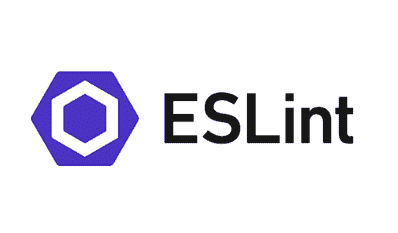

# 四个选项帮助你开始林挺你的 JavaScript

> 原文：<https://dev.to/bnevilleoneill/four-options-to-help-you-get-started-linting-your-javascript-34i0>

你几乎总是可以打赌，一篇好文章是好编辑的恩人。在这方面，代码和散文没什么不同。作为开发人员和程序员，我们享受的一个好处是编辑器，或代码翻译器，它们可以内置到我们的工作流中。

林挺是检查您的代码是否有任何错误的行为或过程。关于如何优化给定代码的有效性，有许多想法。但是检查以确保它没有错误并且符合特定的风格指南是基线。有时这是一致性和可读性的问题，有时是让代码实际运行的问题。

谈到 JavaScript 林挺，有几个工具是与众不同的。让我们来看四个 linters，它们可以帮助你开始或者改进你的林挺过程:JSLint、standardJS、JSHint 和 ESLint。

[T2】](https://logrocket.com/signup/)

### JSLint

[T2】](https://res.cloudinary.com/practicaldev/image/fetch/s--1ogXqN-L--/c_limit%2Cf_auto%2Cfl_progressive%2Cq_auto%2Cw_880/https://cdn-images-1.medium.com/max/232/1%2ATyN5Vstv9Vr_BIc_6deF3w%402x.png)

JSLint 由道格拉斯·克洛克福特于 2002 年创立，他也写了一本可以说是 T2 最好的关于 JavaScript 的书。JSLint 为表格带来了简单性和速度。但它也非常固执己见，这可能是一件好事，也可能是一件坏事。

JSLint 由一个页面站点组成，该站点由一个文本字段控制，您可以在其中粘贴代码。单击“JSLint”按钮，任何错误、文体错误、语法错误或其他错误都会显示在文本字段下。文本字段下是一个小选项列表，可通过复选框进行配置。选项包括容忍额外的空白，使用“this”关键字(Crockford 在他的演讲中不鼓励这样做)，以及包含 Node.js。

如果您不依赖任何特定的风格指南，并且想要一个可靠的来源来检查您的代码，JSLint 是一个很好的选择。对于测试代码片段，或者如果您正在寻找一种快速 lint 小项目的方法——可能是一个只包含一个 JavaScript 文件的单页静态站点，它特别有效。

### 标准

[T2】](https://res.cloudinary.com/practicaldev/image/fetch/s--cTSuIFxJ--/c_limit%2Cf_auto%2Cfl_progressive%2Cq_auto%2Cw_880/https://cdn-images-1.medium.com/max/250/1%2A8es60D8fS4-SeuPUWfLXOg.jpeg)

仅基于 GitHub 的星星， [standardJS](https://standardjs.com/) 是最受欢迎的选项，有近 19，000 颗星星。它是完全自以为是的，意味着它根本不可定制。但是，如果你不依赖任何特定的风格指南，这可能是一件好事。它以节点 CLI 的形式出现，可以在全球范围内安装，或者作为开发依赖项使用您选择的终端或命令行:

```
$ npm install standard --global
// or
$ npm install standard --save-dev 
```

Enter fullscreen mode Exit fullscreen mode

因为 standardJS 将 Node 和 npm 作为先决条件，并且因为它是从命令行或通过 npm 脚本运行的，所以标准比 JSLint 的标准稍微高了一些。但是因为它是不可配置的，所以你没有什么可担心的。你可以从命令行运行它作为一个单词的命令，它会检查每个文件与。js '扩展名的文件。

它发现的任何错误都将被打印到您的终端或命令行。您可以从 standardJS [文档](https://standardjs.com/index.html#install) :
中看到类似这个例子的输出

```
$ standardError: Use JavaScript Standard Style
lib/torrent.js:950:11: Expected '===' and instead saw '=='. 
```

Enter fullscreen mode Exit fullscreen mode

如果需要指定文件或目录，可以将路径作为参数，并使用通配符。它也接受通配符。在本例中，standardJS 将在“src”目录及其子目录中查找并 lint 任何 JavaScript 文件:

`$ standard "src/**/*.js" --fix`

文件路径后面的'— fix '标志是在发现错误时自动修复错误的选项。这可以节省大量的时间，但也是一个很好的学习练习，让你自己去修正错误。

如果你想在决定是否使用它之前探索一下 standardJS 使用的惯例和规则，完整的列表可以在这里找到。对于那些寻找快速可靠的方法来开始使用 JavaScript linter 的人来说，StandardJS 是一个很好的选择。

### JSHint

[T2】](https://res.cloudinary.com/practicaldev/image/fetch/s--CWv7pecV--/c_limit%2Cf_auto%2Cfl_progressive%2Cq_auto%2Cw_880/https://cdn-images-1.medium.com/max/577/1%2A-SsoEZPBekzxvx4xg6Z0RA.png)

JSHint 开始是 JSLint 的一个分支。目标是制造一个更加可配置的棉绒。如果你一直在使用 standardJS，或者另一个固执己见的 linter，并且你正在寻找一种方式开始定制你自己的林挺规则，JSHint 可能适合你。它具有上述棉绒的大部分优点，还有其他一些优点。

和 JSLint 一样， [JSHint 主页](http://jshint.com/)有一个文本字段，你可以在那里粘贴代码。文本字段右侧的“Metrics”字段将在您键入时实时更新，记录您代码的运行统计列表，例如它包含多少个函数。当然，它还会显示找到的任何林挺错误。

如果您不喜欢复制/粘贴方法，并且想要将它烘焙到您的项目中，可以使用 npm:
全局安装 JSHint，或者将其作为项目依赖项安装

```
$ npm install jshint --global
// or
$ npm install jshint --save-dev 
```

Enter fullscreen mode Exit fullscreen mode

安装后，您将使用 CLI 来 lint 您的代码。下面是两个分别检查单个文件和目录的命令示例:

```
$ jshint index.js// or
$ jshint src/ 
```

Enter fullscreen mode Exit fullscreen mode

在第一个例子中，JSHint 将 lint ' index . js '文件，在第二个例子中，它将递归地搜索' src/'目录并 lint 它找到的任何 JavaScript 文件。JSHint 将打印它在终端中发现的任何错误。

如果您不关心定制，JSHint 可以像上面的例子中描述的那样使用，它会工作得很好。但是，从这里开始，复杂性会显著增加，因为 JSHint 是完全可配置的，并且它还公开了一个 API，这意味着它可以在您自己的 JavaScript 文件中用作 JavaScript 模块。

自定义配置，应存储在名为'的文件中。jshintrc '，文件可能如下所示:

```
{
"esversion": 5,
"eqeqeq": true,
"strict": true
} 
```

Enter fullscreen mode Exit fullscreen mode

此示例从上到下将 ECMAScript 版本设置为 5，需要使用三个等号(===或！==)而不是两个(==或者！=)并强制执行严格模式。您可以通过指定的路径来包含您的自定义配置。或者在项目的“package.json”文件中将它们声明为“jshintConfig”属性。JSHint 将对您没有自定义的任何规则使用其默认选项。

命令行选项可能如下所示:

```
// looks for '.jshintrc' in the current directory
$ jshint --config './.jshintrc' 
```

Enter fullscreen mode Exit fullscreen mode

而“package.json”选项可能如下所示:

```
{
  "jshintConfig": {
    "esversion": 5,
    "eqeqeq": true,
    "strict": true
  }
} 
```

Enter fullscreen mode Exit fullscreen mode

您可以使用这些基础知识开始使用 JSHint 定制您自己的林挺规则。如果你想了解更多，官方文档包含了关于如何使用 JSHint API 的详尽描述，以及定制它来满足你的需求的所有方法。

### ESLint

[T2】](https://res.cloudinary.com/practicaldev/image/fetch/s---GoJn40g--/c_limit%2Cf_auto%2Cfl_progressive%2Cq_auto%2Cw_880/https://cdn-images-1.medium.com/max/398/1%2ATPkhIqPgVzFSSpwdlVwhVw.png)

抛开 GitHub 明星不谈，谈到 JavaScript，林挺·埃斯林可能是最常见的，也将是很多人的首选。在它自己的[文档](https://eslint.org/docs/user-guide/getting-started)中，它将自己与 JSLint 和 JSHint 进行比较，看它用于解析 JavaScript 的方法。而且，与 JSHint 类似，您可以使用缺省值，并随着您的偏好或需求的变化添加定制。

要开始使用 ESLint，请全局安装它或作为开发依赖项:

```
$ npm install eslint --save-dev// or
$ npm install eslint --global 
```

Enter fullscreen mode Exit fullscreen mode

如果您全局安装 ESLint，它的配置将应用于您运行它所针对的任何和所有项目文件。但是如果您希望不同的项目有不同的配置，您可以将它作为开发依赖项安装，并为每个项目创建不同的配置文件。请注意，如果 ESLint 是作为项目依赖项安装的，而不是全局安装的，您需要从“node_modules”文件夹中运行可执行文件，如下所示:

`$ ./node_modules/.bin/eslint --init`

当您运行上面的命令时，将通过一系列的问题引导您配置 ESLint。(注意:无论您计划如何定制您的林挺规则，您都必须从这一步开始，因为 ESLint 需要。“eslintrc”文件，该文件将由该进程在 lint 您的代码之前生成。)

问你的第一个问题是如何配置 ESLint。您有三种选择:使用流行的风格指南，回答关于您的风格的问题，或者让 ESLint 通过检查您的文件来决定如何设置规则，从而为您配置自身。如果马上自己配置它的前景看起来令人生畏，您可以依靠使用由少数几个已知组织之一开发的流行风格指南。

不管你走哪条路，ESLint 都会用你的答案生成一个名为'的文件。当前工作目录中的“eslintrc”。如果以后想修改林挺规则，就要修改这个文件。

这里有一个例子。JSON 格式的“eslintrc”文件，使用默认的 [Airbnb JavaScript 样式指南](https://github.com/airbnb/javascript)规则，并包括两个自定义规则来关闭严格模式并允许 console.log()语句:

```
{
  "extends": "airbnb-base",
  "rules": {
    "strict": "off",
    "no-console": "off"
  }
} 
```

Enter fullscreen mode Exit fullscreen mode

如果你选择回答关于你的风格的问题，它会问你使用哪个 ECMAScript 版本，你是否喜欢制表符或空格，分号或没有，你是否使用 JSX 和/或反应。ESLint 对 React 和补充插件的现成支持可能会使其成为 React 开发者的最佳选择。至少对于那些刚刚开始接触林挺的人来说是这样。

安装 ESLint 和一个。eslintrc '文件已经生成，您可以使用 CLI 开始林挺您的代码。埃斯林寻找你的。eslintrc '文件，所以您不需要在命令行中指定任何配置。但是您可以使用各种标志来改变 ESLint 的行为。在下面的例子中，'— quiet '标志告诉 ESLint 只显示错误，而不是同时显示警告和错误。“— fix”标志告诉它尝试自动修复它发现的任何错误。

```
// run eslint against file1.js
$ ./node_modules/.bin/eslint file1.js// run eslint against file1.js and file2.js with flags to modify behavior
$ ./node_modules/.bin/eslint file1.js file2.js --quiet --fix 
```

Enter fullscreen mode Exit fullscreen mode

与我们讨论的其他 CLI 一样，如果需要，您可以使用通配符和文件路径来代替特定的文件名。虽然 ESLint 是高度可配置的，但它通过使用一个可接近的设置指南来简化默认配置方法的学习曲线。如果你真的想深入了解定制，[官方文档](https://eslint.org/docs/user-guide/getting-started)包含了你可以用 ESLint 做的所有事情的详细解释。

### 下一步步骤和结论

总而言之:

*   JSLint 非常适合检查代码片段或单个文件。它的一个潜在缺点是不适合大型项目。
*   StandardJS 非常适合那些想要轻松入门和/或在工作流中构建 linter 和构建脚本的人。但是，它是不可配置的。因此，如果你需要制定自定义规则，你可能会想看看 JSHint 或 ESLint。
*   JSHint 也可以通过 npm 安装，它的林挺规则是完全可配置的。这可能是好的也可能是坏的，取决于你的需求和技能水平。您可以从默认规则开始，并根据需要进行定制。它还提供了一个单页面站点，您可以使用它来 lint 片段或单个文件。
*   ESLint 可以通过 npm 安装，并像 JSHint 一样内置到工作流中。其 CLI 的问答格式可以帮助您入门。在其开箱即用的形式，它包括行业标准，开源风格指南和林挺规则，可适用于任何项目。

我们研究的所有四种 linters 都是可靠的、有信誉的，因为它们是由 web 开发社区中的知名人士和组织使用和开发的。他们中的任何一个都会给任何人带来好处。如果您已经掌握了本文中讨论的基础知识，下一步将是学习如何使用 npm 脚本或 Webpack 之类的捆绑器将它们进一步集成到您的工作流中。

任何工具的好坏取决于你如何使用它。这对 linters 和它们帮助你完善的代码来说都是正确的。即使您是单独开发，并且不需要担心整个开发团队的代码一致性，您仍然可以从内置编辑器中受益。这是学习正确编写 JavaScript 的非常有效的方法。不管你使用哪种棉绒，使用棉绒只能帮助你。你可以打赌你的代码质量会提高，你作为开发人员的技能也会提高。

* * *

### Plug: [LogRocket](https://logrocket.com/signup/) ，一款适用于网络应用的 DVR

<figure>[](https://logrocket.com/signup/)

<figcaption></figcaption>

</figure>

LogRocket 是一个前端日志工具，可以让你回放问题，就像它们发生在你自己的浏览器中一样。LogRocket 不需要猜测错误发生的原因，也不需要向用户询问截图和日志转储，而是让您重放会话以快速了解哪里出错了。它可以与任何应用程序完美配合，不管是什么框架，并且有插件可以记录来自 Redux、Vuex 和@ngrx/store 的额外上下文。

除了记录 Redux 操作和状态，LogRocket 还记录控制台日志、JavaScript 错误、堆栈跟踪、带有头+正文的网络请求/响应、浏览器元数据和自定义日志。它还使用 DOM 来记录页面上的 HTML 和 CSS，甚至为最复杂的单页面应用程序重新创建像素级完美视频。

免费试用。

* * *

帮助你开始学习林挺 JavaScript 的四个选择这篇文章最先出现在 T2 的博客上。