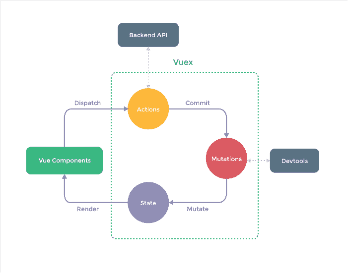

# 从 Angular 到 Vue:感觉又像个初学者了

> 原文：<https://dev.to/florimondmanca/from-angular-to-vue-feeling-like-a-beginner-again-1d6h>

*更新(2018 年 10 月 30 日):写完这篇文章几天后，我已经对 Vue 及其生态系统有了很好的了解。感谢分享关于 Vue 有用资源的大家；这对我帮助很大！*

在过去一年左右的时间里，我参与了几个网络项目。我现在对一些精选的技术感到轻松和高效。在前端开发领域，这意味着[角度](https://angular.io)。而且说实话，感觉*很棒*。

然而，我发现我已经开始固步自封，厌倦甚至开始占上风。于是，我开始学习 [Vue](https://vuejs.org) 。

在这篇简短的帖子中，我将暴露我的心态，我目前遇到的困难以及我在与 Angular 合作一年后学习 Vue 的过程中如何应对这些困难。

## 我们是怎么到那里的？

我最近和 Angular 一起工作了很长时间。Angular 是我学到的第一个现代网络框架，我已经开发了至少三四个不同大小的应用程序。我也学到了很多现代概念，比如渐进式网络应用和服务器端渲染。

但是有一个问题。每次我有机会为新项目选择前端框架时，我都会选择 Angular。为什么？简单来说，**因为这是我唯一认识的，和**在一起感觉很舒服。

然而，就在做出这个决定后，一个微弱的声音悄悄潜入我的脑海，低声说道:“又有棱角了？咩……”。

不要误解我的意思——对某项技术有足够的了解，以至于我可以不用看文档就能构建一个完整的系统，这确实是一种奖励。我为**感到骄傲**。

也没有必要*本身*精通每一个前端框架——它们太多了，而且专业化也有它的优势。

但对我来说，有一个问题:

> 挑战在哪里？难点在哪里？还有什么要学的？

你看，我喜欢学习新东西。我并不特别喜欢初学者的感觉——那相当不舒服——但我总是喜欢结果:**我可以做我在**之前不能做的事情，这很令人兴奋。

这就是促使我尝试其他东西的原因。此外，一些环境也有所帮助。

## 抓住机会

几周前我参与了一个重要的学校项目。我们可以在 Angular 和 Vue 之间进行选择。

我对 Vue 了解不多——只是在这里或那里读到过一些东西，也许是一年前的一个玩具项目。选择 Angular 会容易得多，因为我积累了很多经验和知识。

但是你猜怎么着？我们去找 Vue。

有时候，离开你的舒适区就像问一句“为什么不呢？”。

## 这可不容易

我今天刚刚潜入水中，让我告诉你——我很兴奋，但是现在感觉很不舒服。

其实我感觉**挫败**。我必须**重新学习**一切。为什么看起来如此相似，却又如此不同？我觉得我是个大师，但我现在完全是个 00b。咄。

所以，在这个新的未知的生态系统中，我需要一个**生存策略**不要淹没在看似巨大的新事物学习量中。

## 建立在你所知道的基础上

幸运的是，与我第一次尝试 Vue 时相比，我现在对前端开发有了更好的理解。很多东西已经不在我的考虑范围内，我可以专注于框架和它的生态系统。(还有，Vue 成熟了很多，这是非常好的消息。)

很自然地，**我在寻找熟悉的东西**。我已经注意到:

*   Angular 和 Vue 都是组件驱动的——太好了！
*   两者都有一个[命令行界面](https://cli.vuejs.org)——太棒了！(但我想念`ng generate`)
*   两者都有一个基于指令的模板系统——太棒了！
*   两者都有通过输入(`@Input()`对`@Prop()`)和输出/事件(`@Output()`对`$emit()`)的双向数据绑定——不错！
*   模板语法相当类似:`*ngFor`变成`v-for` , `[foo]="bar"`变成`:foo="bar"`等等——恒星！
*   两者都有广泛而精确的文档记录和充满活力的社区——太棒了！
*   我还可以用 Vue 使用[TypeScript](https://vuejs.org/v2/guide/typescript.html)——耶！🎉
*   我一直在挖掘有棱角的材料，似乎有更多的 Vue 组件框架出现，比如[Vue 化](https://vuetifyjs.com)——太神奇了！

至少，这不是一个冷启动。确实有很多方面我可以涉及和比较。唷！

<figure>

[T2】](https://res.cloudinary.com/practicaldev/image/fetch/s--PCTt7s0N--/c_limit%2Cf_auto%2Cfl_progressive%2Cq_auto%2Cw_880/https://florimondmanca-personal-website.s3.amazonaws.com/media/markdownx/7af66c43-a947-4a81-aad8-5d5b6bb55cbc.png)

<figcaption>Me generating a project using Vue CLI: "TypeScript! There you are!"</figcaption>

</figure>

## 识别差异

然而，我不禁注意到了巨大的差异:

*   Vue 组件是单文件的，而 Angular 把 HTML、CSS、TypeScript 分开放在自己的文件里。(我大概会习惯的。)
*   **Vue 专注于视图层**，Angular 自带电池:我心爱的`Router`和`HttpClient`在哪里？！
*   Vue 没有**模块**，取而代之的是一些其他的概念，比如混音、滤镜和转场。
*   没有**服务**的概念——我该如何从组件中抽象出逻辑？这是 Vue 哲学的一部分吗？
*   如果没有服务，那么状态管理呢？我是否被迫求助于 Redux/Flux/similar，即使是对于较小的应用程序？
*   我的`Observable`在哪里？我花了很长时间去了解他们。我应该用什么来代替 [RxJS](https://angular.io/guide/rx-library) ？

所有这些差异给了我一个总体的直觉，即 **Vue 对开发者**的要求要少得多。

作为一个有棱角的背景的人，我觉得这有点令人生畏。

Angular 的惯例和做事方式让人感到安全。他们也促进了与其他开发人员的合作——因为我们都共享相同的实践。和 Vue 在一起会怎么样？每个人都有不同的工作流程吗？

## 寻找最佳实践和流行的解决方案

那我还剩下什么？有些东西看起来很熟悉，有些看起来更好(毕竟单文件组件看起来很光滑)，但也有一些东西我错过了。所以我在寻找**的替代者**。

以 **HTTP 请求**为例:我见过的两种流行的解决方案是`axios`和`vue-resource`。看起来是 T2 的一个很好的替代品。

**路由**的问题也已经得到解决——Vue 中没有内置的`Router`，但是 [vue-router](https://router.vuejs.org) 是一个标准插件，甚至在通过 Vue CLI 创建新项目时都会建议使用。

现在，**状态管理**呢？Angular 有服务，我足够幸运，当数据绑定变得不够时，我可以使用服务来存储一些共享状态。

Vue 没有这样的服务概念，那还剩下什么？一个流行的选项似乎是 [vuex](https://vuex.vuejs.org) ，一个受 Flux 启发的状态管理 Vue 插件。我以前听说过状态管理(虽然主要是通过 Redux——参见[了解 Redux](https://medium.freecodecamp.org/understanding-redux-the-worlds-easiest-guide-to-beginning-redux-c695f45546f6) )，所以我有兴趣深入挖掘，看看结果如何。我只希望不会成为太大的负担。

<figure>

[T2】](https://res.cloudinary.com/practicaldev/image/fetch/s--hOHCc77n--/c_limit%2Cf_auto%2Cfl_progressive%2Cq_auto%2Cw_880/https://vuex.vuejs.org/vuex.png)

<figcaption>The Vuex state management pattern. Looks sensible, but I hope it won't be too heavy. (Source: Vuex docs.)</figcaption>

</figure>

最后— RxJS 和**事件流**。这大概是我在 Angular 里面最喜欢的东西了。可观察性使得处理事件流变得如此愉快和可维护。

嗯，我还没找到替代品。我的猜测是——不会有。事实上，我认为 Vue 不会妨碍我，我可以使用 RxJS，但似乎已经有许多内置功能来确保反应性——我也觉得很令人兴奋。我们走着瞧！

## 享受旅程

我曾经觉得自己对 Angular 非常了解，然而 Vue 让我回到了初学者的位置。这并不容易，而且肯定感觉很不舒服。

但是——这是给所有努力奋斗的初学者的一个信息——经验也告诉我这个旅程是值得的。

在一天结束的时候，你会学到另一项技术，并且能够做你以前不能做的事情。这可能需要几周或几个月，但它会发生，你会感到自豪。💪

对于我来说，我还没有放弃 Angular，但是我很高兴能更多地了解 Vue。我将专注于建立一个关于 Vue 中所有东西如何组合在一起的心智模型。我期待有一天一切都“一拍即合”——因为**没有什么比挑战你的极限去学习新东西更令人兴奋的了**。💻

* * *

你已经做过这个职位了吗？你是如何应对不得不重新学习一切的？我很乐意听听你的想法！

## 保持联系！

如果你喜欢这篇文章，你可以在 Twitter 上找到我，获取更新、公告和新闻。🐤