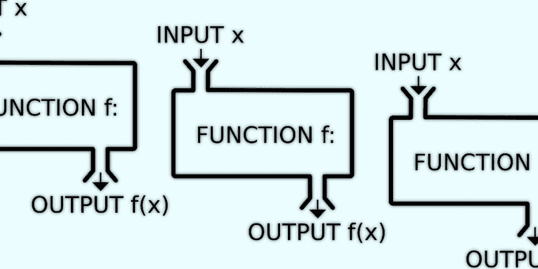

# 从 cobalt.rs 到 gutenberg

> 原文：<https://dev.to/asaaki/from-cobaltrs-to-gutenberg-2kdm>

我希望我能拥有这两种工具的特性，但是现在我将使用 gutenberg 而不是 cobalt。一个微小的迁移和特性比较的故事。

虽然 [cobalt](https://cobalt-org.github.io/) 是一个用 Rust 编写的非常好且简单的静态站点生成器(在 GitHub 页面使用的著名工具 [Jekyll](https://jekyllrb.com/) 的脉络中)，我还是挣扎了一下。特别是样式表编译在默认情况下还没有启用，但其他一些小麻烦或缺失的特性也加入了进来。我仍然想坚持使用 [Rust](https://www.rust-lang.org/) ，这里唯一的其他活动选项是 [gutenberg](https://www.getgutenberg.io/) 。但是说实话，这个也有它的复杂之处。

Cobalt 是一个快速设置博客的工具，因为它支持两种不同的文章类型(静态)页面和博客文章。**古腾堡**并没有这样的区别，因此，如果你想达到同样的效果，你需要更加详细。

### 不尽完美，但我们正在努力

由于这两个项目都很年轻，它们有着相似的缺点:模板库通常还没有完整的特性，或者与它们的精神角色模型稍有不同。大多数情况下，人们可以解决这些问题，但仍然有点痛苦。

Gutenberg 在这里表现得更好，因为它支持宏和短代码。尤其是后者是一件好事，因为我可以用片段快速丰富我的页面，这些片段通常很奇怪或者很难纯粹在 Markdown 中完成。嵌入式 HTML 不是最好的东西，如果我能把它们抽象出来，我会全力以赴。

另一个小小的好处是:Gutenberg 得到了 Netlify 的支持，因此我不需要在他们那边安装二进制文件。现在，我可以让它在部署时构建最终站点，并跳过提交预构建项目。我很确定我也可以用钴来做，但是这种方式是开箱即用的。

### 工具、工具、工具

说到工具:我有点冒险，把两个小的二进制文件捆绑在一起，它工作了。

#### `fd`——更简单的发现，写在铁锈上

fd 将自己标榜为*一个简单、快速且用户友好的“寻找”替代工具。*

根据他们的基准，速度快得令人难以置信。但是我也喜欢更简单的命令行选项。该界面是为常见情况设计的。它写在《铁锈》上。我有没有说过我爱铁锈？没有吗？；-)

#### `tidy-html5` -摆脱尴尬的空白和缩进

> HTML 工具的鼻祖。

HTML 工具的鼻祖。——嗯，是的， [tidy](http://www.html-tidy.org/) 是一个相当老的工具，我可能已经用了十多年了。

我把这个助手推荐给那些从 CMS、静态站点生成器或其他自动生成这类文件的工具中得到一些糟糕的 HTML 的人。

通常保持 HTML 页面原样没有坏处，只要它们能在大多数浏览器中呈现。我喜欢我的页面又漂亮又干净。我希望大多数程序都有整洁的内置程序。我知道，我知道，我是这样一个梦想家。

下面是我如何使用`fd`和`tidy`进行后处理的一个片段:

```
# from my Makefile:

TIDY_SETTINGS = -q -m -w 0 -i \
                --indent-with-tabs yes \
                --indent-spaces 2 \
                --tab-size 2 \
                --clean yes \
                --join-styles yes

build-tidy-html:
  fd -p public -e html -x sh -c "echo {} && tidy $(TIDY_SETTINGS) {}" \; 
```

Enter fullscreen mode Exit fullscreen mode

*   在`public`文件夹中查找所有扩展名为`.html`的文件
*   应用带有`-x`选项的命令；因为我想做多件事，所以我必须用`sh -c "…"`来包装它
*   删除所有多余的空格和空行，适当缩进标签，并清理内联样式，这对于代码片段来说非常方便，因为 gutenberg(和 cobalt)不使用全局/外部样式表来突出显示语法

如果你想了解更多关于所有可能的标志和选项，查看 [tidy reference](http://api.html-tidy.org/tidy/quickref_5.6.0.html) 获取细节和解释。

这一步对我获得整个网站的一致输出帮助很大，如果我在模板和标记中搞砸了什么，我也会得到警告/错误。

[T2】](https://res.cloudinary.com/practicaldev/image/fetch/s--JmtpJ2bX--/c_limit%2Cf_auto%2Cfl_progressive%2Cq_auto%2Cw_880/https://thepracticaldev.s3.amazonaws.com/i/0kfvxpq2yqe9s24rgok5.png)

### 更多关于`gutenberg`

在[古腾堡回购](https://github.com/Keats/gutenberg#comparisons-with-other-static-site-generators)本身就是对**古腾堡**、**钴**、**雨果**和**鹈鹕**的一个很好的比较。由于我对不生锈的发电机并不感兴趣，我只是不断地重复前两者的区别。

gutenberg 唯一没有的是 cobalt 的[数据文件](http://cobalt-org.github.io/docs/data.html)特性，它可以被视为 YAML、JSON 或 TOML 格式的平面文件数据库。如果你在网站生成阶段组织和使用大量数据，你可能需要这个。虽然听起来不错，但这不是我真正需要的东西。

在 gutenberg 中，我真正欣赏的是对补充基于 Markdown 的编辑的微小特性的广泛支持。类似于 GitHub wikis，你可以在文档之间进行内部链接。此外，您可以自动获得可链接的标题，并可以自动生成目录(TOC)。模板引擎相当不错(我仍然需要更多可定义的类型，如[数组](https://github.com/Keats/gutenberg/issues/270)和地图，我可以用基于液体的引擎来做)。主题、别名和分页还不是我主要关心的，但至少后者很快会派上用场。我真正喜欢的是(自定义的)短代码，几年前我就喜欢它作为 WordPress 插件了(或者你甚至从公告栏/论坛软件上记得它们)。当你的设计基于一个主题时，宏系统是非常有用的。如上所述，基于 SASS 的样式表编译非常好，因为将样式分成逻辑块有助于更好地推理它们。

目前[有一个关于定制分类法](https://github.com/Keats/gutenberg/issues/246)的讨论，很有趣。

哦，我完全忘记了一个微小但非常方便的功能:在编辑和调整时自动重新加载页面。也构建 React 应用程序的人会喜欢它。

#### 心愿单

我还有更多想看的物品:

*   可能是一个插件系统，虽然我还没有一个想法，它会是什么样子；但是由于 gutenberg 本身似乎是一个相当模块化的代码库，所以可能有一个选项来实现它(尽管扩展语言不一定是 Rust)
*   更多的“本地”博客支持(基于公共父目录的博客文章集合类型)
*   更好的页面集合访问，在全球范围内(我已经看到网站地图和 feed 生成已经在内部完成了，我们只需要很好地抽象和公开它)
*   tera，模板引擎可能受益于更多的类型和相关的过滤器/内置函数；即使有了宏系统，有些事情仍然感觉笨拙或几乎不可能

### 迁移所有的东西

虽然古腾堡不是钴或杰基尔，此举并不像我最初想象的那样痛苦。模板语言在语法和语义上非常相似，所以调整有时只是搜索和替换，两者都使用 curlies 作为它们的标签。

Tera 的一些缺点使得一些改变变得更加困难，但总的来说，没有什么是完全不可能的，或者我现在可以接受一个类似但更简单的解决方案。

我不喜欢内置的 rss 提要生成，而且它缺少不同的提要格式，所以我通过以一种有点笨拙的方式创建自己的提要页面来解决这个问题:我为每种提要格式构建“html”页面，并在稍后的后处理步骤中重命名/移动文件。网站地图的生成更加直接。

我花了大部分时间来采用博客文章目录结构和主页的页面遍历。在写这篇文章的时候，我有一个想法，如何让我未来的生活更容易:因为我没有真正使用类别(还没有)，我可以利用一个默认的类别页面来列出更简单的博客文章。一定会尝试这一款。(如果/当我们得到自定义分类法时，我可以再次根据需要使用类别。)

与 post 相关的资产的组织现在有点不同，但可能更容易/更直观。获取封面图片网址变得简单了。

总的来说，迁移速度相当快，不到一天左右。对于如何做到这一点，我建议前往 [markentier.tech 库](https://github.com/markentier/markentier.tech)查看提交历史。

[T2】](https://res.cloudinary.com/practicaldev/image/fetch/s--GFSsLpfa--/c_limit%2Cf_auto%2Cfl_progressive%2Cq_auto%2Cw_880/https://thepracticaldev.s3.amazonaws.com/i/mis15y9ozpuf5ptaes2x.png)

### 功能，lambdas 和“无服务器”

最近 Netlify [公开了他们之前的测试版特性](https://www.netlify.com/blog/2018/03/20/netlifys-aws-lambda-functions-bring-the-backend-to-your-frontend-workflow/) : **形式、身份和功能(Lambdas)。**

我还没有立即使用表单和身份服务，但是这些功能可能是一个很好的特性。

与他们的大多数工具和支持一样，他们承诺这将比底层解决方案更容易或更容易。虽然我还没有主动使用过 AWS Lambda，但我通过 Netlify 的函数特性对它进行了测试。当然，免费层是非常有限的，但是我想象不出一个更简单的方法来开始使用函数和 lambdas 以及整个无服务器世界。虽然我不太喜欢这个营销术语，因为最终所有东西都在某个地方的某个服务器上运行。我更愿意想到 Heroku 之后的发展，它从未声称是无服务器的，而是一个平台，在这个平台上，大多数痛苦的基础设施管理被抽象掉了。函数和 Lambdas 只是进一步缩小了范围和表面，但仍然是:它们是运行在托管服务器和服务上的非常小的应用程序，并且是按需提供的。

我不得不承认，这种服务很有吸引力。特别是对于单人项目(像这个网站)，你想要的不仅仅是纯粹的静态，但也不想在设置上投入太多的时间和精力。

因为最终你真正想要的是:把事情做完。