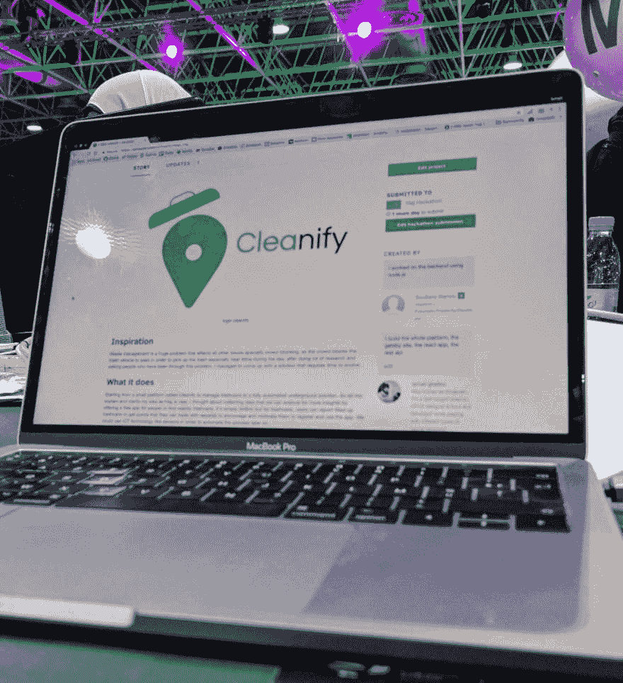

# 从失败到发射-朝觐黑客马拉松

> 原文：<https://dev.to/smakosh/from-failure-to-launch---hajj-hackathon-424d>

> 这篇文章最初发表在我的个人博客 [Smakosh](https://smakosh.com/blog) 上。

[T2】](///static/launch-b5f6fc813829531f7a356c0931983a15-c84dc.jpg)

在前往拉巴特访问摩洛哥办事处 [Obytes](https://obytes.com) (我工作的公司)时，我受邀参加了麦加朝圣马拉松，该活动旨在寻找愿意解决与[麦加朝圣](https://en.wikipedia.org/wiki/Hajj)相关的一些主要问题的人，特别是以下九个主题:

*   废物管理
*   食品和饮料
*   运输
*   人群管理和交通控制
*   旅行和住宿安排
*   公共卫生
*   房屋
*   通信解决方案
*   金融解决方案

黑客马拉松的组织者支付了我们所有的费用，包括机票(沙特航空公司的经济舱)，因为他们提供了令人敬畏的服务，所以非常好，酒店住宿也包括在内，每个团队都住在不同的酒店，我住在酒店 [Salsabil](https://warwickhotels.com/salsabil/) 。

我一上飞机就开始编写样板 rest api，我使用了 express js，mongoose，mongodb，postman，我离线工作，我设置了我的模型(user，post)和一个经过验证的中间件，所以不是每个人都可以访问一些私有路由，我忘了添加另一个中间件，所以只有管理员用户可以向一些 post 路由发送请求。

当我到达酒店时，我的朋友们正在检查房间，而我正坐在接待处的沙发上设置我的 react 应用程序(一个简单的认证应用程序，一旦注册或登录，就会将你重定向到你的个人资料)，我使用了`create-react-app`样板文件，但正如我通常所做的那样，我必须弹出它来添加 sass，设置我的 react-router v4，私有和公共路由，我的项目结构，reducers，actions 和 redux store 等…

那天晚上我没有睡觉，第二天他们带我们去了一个体育场，我们在那里注册为参与者，我们得到了我们的徽章和一个关于该计划的想法，然后他们带我们去了举办活动的地方。

我无法支持人群，回到酒店房间完成 progressive web 应用程序，当我洗澡时，我有了更多的想法，我愿意在地图上向用户显示附近的垃圾桶，奖励那些通过报告垃圾桶满了来帮助改善平台的人。工人(第二种类型的用户)在单个垃圾桶收到大量已满的报告时得到通知，然后去检查垃圾车，如果是真的，所有第一个报告者都得到分数，他们可以用这些分数来获得奖励，否则，他们会受到惩罚。

管理员(第三种类型的用户)订阅一个计划(基本或专业)来管理平台，管理员是一个有权限管理垃圾桶和工人的人。

第二天是黑客马拉松的第二天，他们成功打破了 2950 人参加黑客马拉松的吉尼斯世界纪录。

我花了一天时间重新设计我的 progressive web 应用程序，使其对 UX 更加友好，设计了一个简单的标志和一些头像，准备了演示文稿和我的推介，然后在两天无眠之后，我在酒店睡觉，而我的整个团队都在玩。

在黑客马拉松的最后一天，我正在寻找一个 USB type C 到 HDMI 的适配器，但遗憾的是，其中一个组织者告诉我，我甚至不会参加决赛，所以为什么要问适配器。我很生气，回到我的桌子边，想着他为什么要这么说，直到我走进房间去推销，我才明白整个事件只是为了媒体，因为当我向评委介绍想法和工作应用程序时，没有人听我的推销，也没有人注意我的演示，你可以查看我的幻灯片[这里](https://docs.google.com/presentation/d/1NT1ganL9jGxdlnRllixDjfvApM3hcC2IyXvP9zncLNo)

在吉达逗留的最后一天，当我在红海附近散步时，我想到了更好的想法，我把它们写了下来，并开始批判性地思考，并将我的想法与其他成功创业公司的商业模式进行比较，我可以想到一个更好的想法，它也使用地图，一个 SAAS 平台，提供在线预订餐厅，用户可以在地图上看到附近的餐厅，根据特定参数过滤或排序，将项目添加到他的预订中，选择时间和桌号，然后支付一半的价格进行确认。

我的想法的问题是它需要很多钱，但我已经决定建立一个完整的工作应用程序，并寻求风投或天使投资者的投资。

以下是我认为朝觐黑客马拉松的利与弊:

优点:

*   组织良好
*   他们通过为每张桌子提供以太网电缆来解决互联网问题
*   免费食物和饮料
*   支付我们的机票和住宿费用

缺点:

*   缺少适配器
*   由于获胜者没有可用的应用程序，黑客马拉松的规则没有得到评委和组织者的尊重
*   他们应该选出 9 名获胜者，因为有 9 个问题需要解决
*   由于缺乏设计师和开发人员，我不得不独自设计、编码和准备摊位