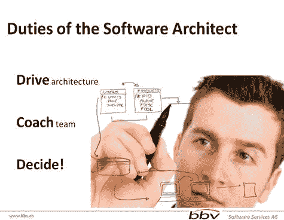
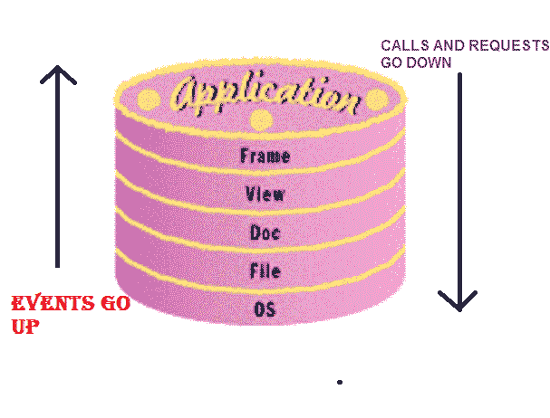
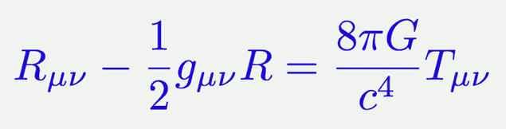

# 从优秀到优秀(将优秀的软件变成优秀的、可维护的软件)

> 原文：<https://dev.to/lucpattyn/from-good-to-great-turn-a-good-software-into-a-great-and-maintainable-one-2556>

* * *

 ## 介绍

太多次我看到鲁莽的年轻开发人员把拥有一个好的架构的想法放在一边，而不是快速快速的软件开发。所以，我想表达什么是软件架构，以及它如何将一个好的软件变成一个伟大的可维护的软件。

## 建筑究竟是什么？

我已经浏览了一些定义，但是下面的符合我对架构的理解:
*系统的软件架构是推理系统所需的一组结构，包括软件元素、它们之间的关系以及它们的属性。*

(来源:http://www . informit . com/articles/article . aspx？p=1994790)

## 那么，成为一名成功的建筑师需要具备哪些条件呢？

我认为软件架构师首先应该具备的技能是

对业务问题领域有很好的理解，*之后是*

*a)总体战略和战术*

*b)业务和技术概念的抽象和建模基础*

*c)在推荐一种方法时，如何评估其中的利弊*

现在是他/她的职责——下图很好地说明了这一点:

[T2】](https://res.cloudinary.com/practicaldev/image/fetch/s--cc3UT4tG--/c_limit%2Cf_auto%2Cfl_progressive%2Cq_auto%2Cw_880/http://www.codeproject.com/KB/architecture/873448/softwarearchitect.jpg)

现在有些事情

**至关重要的**:软件架构师还必须擅长社交技能- >软技能
(来源:http://www . brede Meyer . com/Architect/roleofthearchitect . htm)

## 软技能？真的吗？

是的，这包括

1)沟通——管理层和团队之间的频繁沟通是被引导的。

2)谈判——很好地理解什么是可能的，什么是不允许的

3)说服影响，

4)需要知道如何传达你的想法，这样每个人都能理解。

现在是百万美元的问题

## 为什么是建筑？

我将简短扼要地说明这一点，这完全是基于我的经验:

I)轻松集成新功能

ii)维护和可持续性

iii)通过模块化

的团队工作 iv)查明潜在的问题领域

v)娱乐多个平台的可能性

## 伟大架构的先决条件:

首先，清晰的意图——清楚地知道你要做什么。

驱使你去做的是在编码中反映出你的意图，这样其他人就可以(通过一点努力)理解你的想法。

更不用说考虑语言/工具之外的问题

## 现在我们准备开始了，但首先:

改善日常的编码习惯，让我为你一一列举

一:一行又一行的评论——不！！

二:有意义的变量名和类名，方法名和函数名
- >有意义且简洁精确

三:作为关键时刻评论的短笺

四:制表符、格式和缩进

第五:练习基础级算法，并对数据结构有很好的理解(耐心)

## **什么是好的架构**

**信不信由你——一个分层蛋糕**

[T2】](https://res.cloudinary.com/practicaldev/image/fetch/s--l5H7bOQ---/c_limit%2Cf_auto%2Cfl_progressive%2Cq_66%2Cw_880/http://www.codeproject.com/KB/architecture/873448/cake.gif)

资料来源:http://msdn.microsoft.com/en-us/magazine/cc163962.aspx

蛋糕的配料(摘自上述来源中提到的 MSDN 的一篇文章):

1.简单意味着你不能用十行做你能用五行做的事！！出错的可能性更小。

2.可读性意味着它所说的:其他人可以阅读你的代码

3.模块化意味着你的程序像宇宙一样构建。好的程序从更小的系统中建立起大的系统，而小的系统又是由更小的构件组成的。

4.分层意味着在内部，你的程序就像一个分层蛋糕。应用位于框架之上，操作系统位于硬件之上。模块和层是由 API 定义的，API 描述了它们的边界。因此，设计至关重要。

5.设计意味着在构建程序之前，你需要花时间来规划它。原料药应当按照计划或者系统进行编排

是的，看起来我盲目地抄袭了这篇文章，并把它的压缩版本放在这里，但是如果我的经验与文章中的观点如此接近，我该怎么办呢？

## 蛋糕上的糖衣

**效率&优雅**

## 

这个简单但看起来很漂亮的方程是伟大的阿尔伯特·爱因斯坦的广义相对论。如此强大的理论却能如此雄辩地表达出来。优雅是一种糖衣，使建筑的各层保持可维护性，即使在多年后看起来也令人振奋。

只要有优雅，系统就很有可能是高效的。

当你这么做的时候，尽量小心软件架构和设计模式的陷阱，也就是

a)过度设计

b)未经验证的过度优化

c)过度继承和等级制度

## 结论

这篇文章的重点是强调一个事实，没有好的软件架构设计的应用，任何好的可持续发展都不可能持续。我希望 https://lokkhi.io 等网站可能取得的成功将是未来几天这种情况背后的一个很好的证明。

## 历史

文章提交日期:2015 年 2 月 6 日