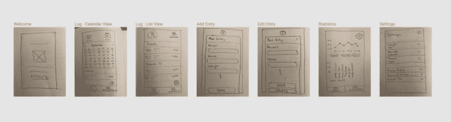

# 从创意到应用商店:用 React Native 构建我的第一个 iOS 应用

> 原文：<https://dev.to/robertcoopercode/from-idea-to-app-store-building-my-first-ios-app-with-react-native-1ej7>

最近，我的第一个 iPhone 应用程序被苹果应用商店接受了。能够有一个我自己开发的产品现在可供一大群人下载是非常令人兴奋的。我试图在整个应用程序创建/发布过程中使用结构化的方法，我在本文中概述了这个过程。

#### 动机

我当初为什么要做一个 iOS 应用？嗯，我喜欢做一些对自己和他人都有用的东西。创建一个可从 App Store 下载的应用程序，可以让其他人很容易地在他们的手机上获得应用程序并开始使用它。我在以前的一份工作中有一些使用 React Native 的经验，所以我相信我可以自己开发这个应用程序。

如果我选择将应用货币化，我也有可能通过 iOS 应用产生一些被动收入。我意识到 app store 中的大多数应用收入很低，所以这绝不是我的首要目标。

#### App 创意

我想**开发一个我想用**但其他人也想用的应用。我也不想创造一些已经存在的东西，因为我想为一个问题提供一个独特的解决方案。许多开发者为 App Store 开发游戏，但我不想这么做，因为我不在 iPhone 上玩游戏，而且我发现游戏通常不会对玩游戏的人产生积极影响。

我是一个对了解最新的健康、营养和表现感兴趣的人，我注意到一种叫做 [**食肉减肥法**](https://meat.health/knowledge-base/carnivore-diet-what-to-eat/) 的节食趋势，很多人都从中受益。出于好奇，我决定尝试一下这种饮食，而且我还挺享受的，所以一直坚持到现在。这种饮食只允许吃肉制品。

因为食肉者的饮食是最近才出现的现象，所以没有任何迎合这种饮食的应用程序，所以我认为这可能是一个很好的空白。我想到了创建一个食物日志应用程序的主意，这个应用程序只允许添加肉作为食物条目。

 

<figcaption>我决定继续前进，为食肉动物的饮食创建一个肉类日志应用程序(照片由 [Jez Timms](https://unsplash.com/photos/DVRXFIH42d0?utm_source=unsplash&utm_medium=referral&utm_content=creditCopyText) 在 [Unsplash](https://unsplash.com/search/photos/meat?utm_source=unsplash&utm_medium=referral&utm_content=creditCopyText) )</figcaption>

#### 规划

一旦我决定了我的 iOS 应用程序是关于什么的，我**写了一个我希望应用程序做什么的摘要**，这样我就可以在考虑添加功能时记住它。这是我想到的:

> 记录白天吃的肉的条目的应用程序。针对那些遵循食肉饮食的人。该应用程序很简单，不包含卡路里，因为食肉者只吃到饱。这款应用程序是记录食物摄入量的一种方式。一个简单的应用程序，没有额外的绒毛。

请注意我对保持应用简单的强调。由于这是我的第一个手机应用程序，我想确保自己不会把事情搞得太复杂。如果我设想了一个功能丰富的应用程序，我知道我可能会气馁，并可能放弃整个项目。

一旦我对我想要构建的东西有了更好的想法，我就开始列出我想在应用程序中拥有的功能。我把东西归类在 V1 和 V2 下，其中 V1 是应该成为应用程序第一版的一部分的功能，V2 是在未来版本中很酷的功能。

 

<figcaption>我计划在第一和第二版本的应用程序中拥有的功能列表。</figcaption>

#### 设计

我非常关心应用程序的用户界面，因为我相信当应用程序看起来很好的时候，它会使应用程序使用起来更愉快。对于我的应用程序，我确保**查看其他移动应用程序的设计，以获得我希望我的应用程序看起来如何的灵感**。我收集了我手机上一些应用程序的截图以及我在 [dribbble](https://dribbble.com/) 上找到的设计，并将它们合并成一个文档。在文档中，我记下了我喜欢的 UI 元素，以及类似的设计如何适合我的应用程序。

 

<figcaption>注释设计图片我整理的与其他手机 app 用户界面相关。</figcaption>

在我收集了一些用户界面的灵感后，我为我在应用中需要的屏幕绘制了线框草图。我用手完成了这个，然后把草图上传到我使用的设计应用程序 [Figma](https://www.figma.com) 。

<figcaption>app 中屏幕的手绘线框。</figcaption>

接下来，我开始为应用程序构建高保真设计。这些都是我在 Figma 中完成的，你可以亲自查看这些设计。我从 [FlatIcon](https://www.flaticon.com/) 上拿走了所有图标，并确保支付了使用权的费用。

<figcaption>app 每个屏幕的设计。</figcaption>

#### 发展

我决定对应用程序使用 React Native，因为我已经有了使用它的经验，并且不想学习新的编程语言。我还决定我将**只专注于为 iOS** 开发，尽管 React Native 也允许你为 Android 开发。之所以决定只关注 iOS，是因为要让所有东西都能在 iOS 和 Android 上完全按照预期运行，需要做大量的工作。有些东西能在 iOS 上运行，并不意味着它能在 Android 上运行。此外，由于我拥有的是 iPhone 而不是 Android，所以在 iOS 上开发是有意义的，因为我可以在模拟器和物理设备上测试应用程序。

我使用了一个 [**React 原生样板**](https://github.com/infinitered/ignite-ir-boilerplate-bowser) 来快速启动并运行应用程序开发流程。样板文件包括 [**打字稿**](https://www.typescriptlang.org/) **和** [**MobX**](https://github.com/mobxjs/mobx) ，使用起来真的很棒。在这个项目之前，我从未使用过 MobX，但是我非常喜欢使用它来管理全局应用程序状态。

我还使用[**Visual Studio App Centre**](https://visualstudio.microsoft.com/app-center/)的**持续集成/部署来设置项目，以便我对主分支所做的每个提交都将构建应用并将其部署到 Itunes Connect。在 Itunes Connect 上，你可以将你的应用提交到 App Store，也可以使用 [TestFlight](https://testflight.apple.com/) 进行测试。**

我选择 Visual Studio App Centre 作为项目的 CI/CD，因为他们的免费层能够满足我的所有需求，每月 240 分钟的构建时间，每次构建的最大构建时间为 30 分钟。我想使用 [Circle CI](https://circleci.com) ，但是他们的免费计划不允许在 MacOS 机器上构建，而这是 iOS 所要求的。我也考虑过使用 [Bitrise](https://www.bitrise.io/) ，因为他们的 UI/UX 非常好，但是他们的最大构建时间是每次构建 10 分钟，而我的构建只花了 10 分钟多一点就完成了。

#### 用户测试

苹果有自己的用户测试应用程序，名为 **TestFlight** ，它允许你在应用程序发布到应用程序商店之前邀请其他人下载并测试应用程序。我真的没有一群值得信任和感兴趣的人来测试我的应用程序，但我设法让我的两个朋友通过 TestFlight 下载了我的应用程序。**对我的应用程序进行用户测试并不是我的首要任务，因为我对这个应用程序并没有很高的期望。**

我最终为我的应用获得了很多反馈的地方是我参加的一个当地 UI/UX 反馈会议。我向一群人展示了我的应用程序，然后他们就如何改进应用程序以及我可能希望添加到应用程序中的潜在功能提供了反馈。很多人对这个应用感兴趣，但我认为这主要是因为食肉动物的饮食看起来很奇怪。

#### App Store 提交

在提交到 app store 之前，我确保阅读了 [App Store 审查指南](https://developer.apple.com/app-store/review/guidelines/)，以确保我没有错过任何我应该做的事情。提交表单中有一个部分，你可以为应用程序审核者提供注释，并且**我确保留下了该应用程序应该能够做什么的详细描述**。我听说这让苹果的评论者对你的应用更有信心，并降低了你的应用被拒绝的可能性。

此外，我确保**在我提交的应用**的截图中投入了精力，因为这些截图是那些在应用商店中查看该应用的人对该应用的最初印象。我遵循了一个典型的截屏设计趋势，你可以在 iPhone 的框架内包含一个应用程序的截屏，并附有简短的描述。

 

<figcaption>App 截图我随 App 一起提交的。</figcaption>

在我提交我的应用程序以获得批准后，不到 24 小时后我就收到了一封电子邮件，说我的应用程序获得了批准，几个小时后我的应用程序就可以在应用程序商店中找到了！

<figcaption>App Store 中的 meat journal App。</figcaption>

#### 总结

从构思到发布，**整个过程花了我一个月**。此外，在成本方面，我花了 136 加元购买苹果开发者许可证，花了 15 加元购买我在应用程序中使用的图标的权利。所以总共，**我花了 151 加元(约。117 美元)上的应用程序**。苹果开发者许可证的有效期为 1 年，之后我必须更新许可证。

#### 接下来是什么

我会自己继续使用这个应用程序，看看是否有其他我想添加到这个应用程序中的功能。我会监控这款应用的下载量，并收集用户的反馈，看看是否值得投入更多时间来进一步开发这款应用。我非常喜欢整个体验，所以我甚至可能会尝试为应用商店开发更多的应用程序。