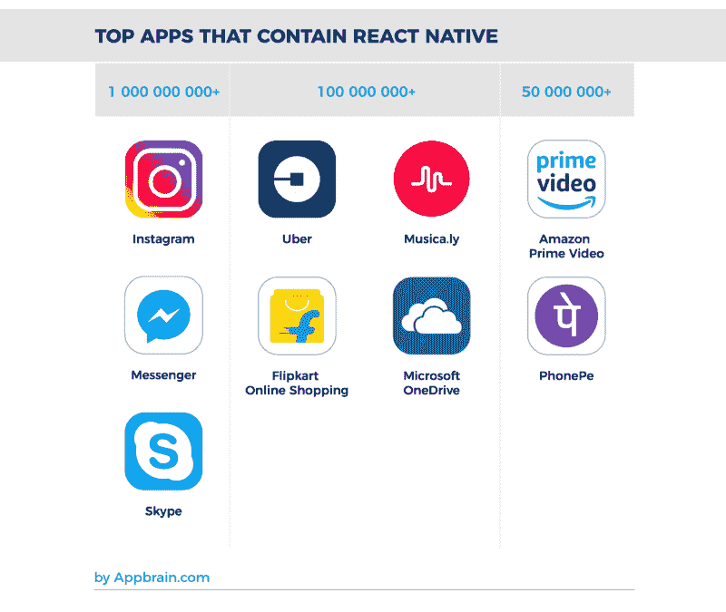

# 从 Java 到 React Native

> 原文：<https://dev.to/pa1nd/from-java-to-react-native-23b8>

[T2】](https://res.cloudinary.com/practicaldev/image/fetch/s--wZWXZ-qi--/c_limit%2Cf_auto%2Cfl_progressive%2Cq_auto%2Cw_880/https://blog.penguin.academy/conteimg/downloaded_images/From-Java-to-React-Native/1-Ln2ZpXRfv6SlWFYC7p1wUw.png)

为什么 React Native 不是原生 app 的好选择？

我们目前正在更新 Poverty Stoplight 的技术堆栈，这是一个由 Fundacion Paraguaya 创建的应用程序，其目标是消除贫困。

在过去的几年里，我们开发了原生 Java 应用程序，但这些应用程序已经被 React Native 所取代。这篇文章解释了做出转行决定的原因、发现和想法

## 问题围绕 React Native (RN)？

仍然有很多人没有听说过 React Native，仍然有相当多的人将它与 Cordova / PhoneGap 和所有其他早期的移动开发框架联系在一起。

此外，Airbnb 最近发布了关于停止 ReactNative 应用程序的帖子，以支持原生构建它们，这可能会给一些人留下 React Native 只是一个宣传框架的印象。

这篇文章希望给出一个更加不同的观点，并展示该技术的优势以及使用它的场合。这篇文章还旨在传达团队决定从当前堆栈迁移到新的 React 原生堆栈的原因。

## 谁使用 React Native

在 AirBnB 决定停止使用 React Native 之后，许多人的印象是，除了脸书之外，RN 不再以任何有意义的方式被使用。

首先，下图显示了 React Native 是一项健壮的技术，并且成熟到足以被世界领先的公司在其旗舰产品中使用。

[T2】](https://res.cloudinary.com/practicaldev/image/fetch/s--wZWXZ-qi--/c_limit%2Cf_auto%2Cfl_progressive%2Cq_auto%2Cw_880/https://blog.penguin.academy/conteimg/downloaded_images/From-Java-to-React-Native/1-Ln2ZpXRfv6SlWFYC7p1wUw.png)

特斯拉、沃尔玛和彭博也是 React Native 的大量用户。这里有一个依赖这项技术的项目列表:[https://facebook.github.io/react-native/showcase.html](https://facebook.github.io/react-native/showcase.html)

## 那么什么是 React Native 呢？

引用 [*学习反应原生*](https://www.oreilly.com/library/view/learning-react-native/9781491929049/ch01.html) :

React Native 是一个 JavaScript 框架，用于为 iOS 和 Android 编写真实的、本地呈现的移动应用程序。它基于 React，脸书用于构建用户界面的 JavaScript 库，但它的目标不是浏览器，而是移动平台。换句话说: _ **web 开发人员现在可以编写外观和感觉都真正“原生”的移动应用程序，所有这些都来自于我们已经熟悉并喜爱的 JavaScript 库** _ *。此外，因为您编写的大部分代码可以在平台之间共享，React Native 使同时为 Android 和 iOS 开发变得很容易。*

从本质上来说，React Native 是一个工具包，它不仅允许我们像在网络上一样工作，还允许我们在 Android 和 iOS 之间使用共享的代码库，从而大大加快开发过程。这意味着:

1.  我们可以为两个系统开发一个组件，同时确保它们彼此一致。
2.  我们只需要编写一次测试，这为我们使用 TDD 方法节省了大量的开发时间。
3.  我们不必担心实现移动和网络应用的差异，从而减少我们系统中的技术数量以及开发和维护所需的专业知识。

## React Native 为什么这么有趣？

这篇文章提到了很多使用 RN 的好处。[https://hacker noon . com/react-native-it-the-future-of-mobile-app-development-31 CB 2c 531747](https://hackernoon.com/react-native-is-it-really-the-future-of-mobile-app-development-31cb2c531747)

举几个例子:

*   跨平台兼容性(Android、iOS、Web)
*   本机功能(事实上，代码就像本机代码一样执行)
*   简单易学
*   积极的开发者体验(最重要的一点)
*   在脸书和不断发展的技术的支持下

**我们对这项技术的目标:**

*   更快的迭代速度(更快的开发和消耗速度)
*   只需编写一次代码，而不是两次——在应用程序和 web 之间共享代码，还可以选择支持 iOS
*   对贡献者来说更容易加入
*   改善开发人员体验
*   更一致的技术(我们在 Web 应用程序和网站中使用 React)

## 有什么可能违背它？

尽管有各种理由迁移到 React，但总的来说还是有很多反对 React Native 的理由。我们挑选了其中一些，并对它们进行了更深入的研究。

**(1)陈述问题:** ***React Native 对老设备兼容性较差(老 native app 支持回 API 19)***

[T2】](https://res.cloudinary.com/practicaldev/image/fetch/s--IBnjycET--/c_limit%2Cf_auto%2Cfl_progressive%2Cq_auto%2Cw_880/https://blog.penguin.academy/conteimg/downloaded_images/From-Java-to-React-Native/1-dY-mh9SyqrH1_Rd0YNegAg.png)

API 19 是 KitKat 或者 Android 4.4。对于 RN，我们支持向后到 4.1(我们只在 4.4 设备上测试)。从全球来看，这意味着我们只遗漏了 0.6%的设备，实际上**覆盖的范围甚至超过了大多数当前的本地应用。**

[T2】](https://res.cloudinary.com/practicaldev/image/fetch/s--vL8-ssAH--/c_limit%2Cf_auto%2Cfl_progressive%2Cq_auto%2Cw_880/https://blog.penguin.academy/conteimg/downloaded_images/From-Java-to-React-Native/1-bsKeNRhvmm7HbfJ51h3jdQ.png)

看看巴拉圭的图片(南美和非洲看起来一样):我们使用 Android 4.1 和 4.2 的设备略多(约 1.4%)。

**(2)陈述的问题:** _ **在旧设备上本机反应较慢** _

这方面的统计不计其数。这里有一个报告(我也是从这里取了下面的图):[https://code burst . io/react-native-vs-real-native-apps-ad 890986 f1f](https://codeburst.io/react-native-vs-real-native-apps-ad890986f1f)

[T2】](https://res.cloudinary.com/practicaldev/image/fetch/s--ceMBM6iq--/c_limit%2Cf_auto%2Cfl_progressive%2Cq_auto%2Cw_880/https://blog.penguin.academy/conteimg/downloaded_images/From-Java-to-React-Native/0-8GKzRGh1lti90-wH.)

> Codeburst 是这样表述的:
> 
> 这是我最大的挫折。**如果你打算开发一个复杂的应用，比如图像/视频编辑器，React Native 对你来说不是一个好的选择。**

在我们的例子中(以及大多数你认为 React Native 的例子)，我们并没有为视频编辑创建一个复杂的应用程序！相反，我们正在创建一个数据收集应用程序顺便说一句:图表显示，在某些情况下，React Native 甚至优于 Swift！

**(3)陈述问题:** ***没有 React 本机库来处理同步(离线功能)***

很明显，一个应该感觉像 app 的 app，是需要离线能力的。但是随着贫困红灯的到来，我们面临着一个额外的挑战。我们在塞拉利昂等国家运营，在那里我们的应用程序几天甚至几周没有互联网，只有 2G 连接可用。

> 今天，超过 10 亿人可以使用高速互联网，30 亿人可以访问网络，超过 50 亿人拥有移动电话。每年都会有更多的人接入互联网。他们中的大多数将是移动用户，通过低速、间歇的连接进行连接。对于这些人来说，线下支持不是奢侈品，是基本的可及性。阅读布鲁斯·劳森的文章[万维网，而不是财富西方网](https://www.smashingmagazine.com/2017/03/world-wide-web-not-wealthy-western-web-part-1/)有更深入的了解。

Redux Offline 是一项针对离线优先应用(和 Web 应用)的技术。他们在 GitHub 上有超过 [5k 的星星，并写了一篇](https://github.com/redux-offline/redux-offline) [*非常有趣的文章，讲述框架背后的想法。*](https://hackernoon.com/introducing-redux-offline-offline-first-architecture-for-progressive-web-applications-and-react-68c5167ecfe0)

目前我们还不需要后台同步，但是一旦它变得相关，我们会尽快研究它。

**(4)陈述的问题:** _ **使用 React Native 的一个主要问题是缺乏对项目的长期承诺。** _

我们非常仔细地研究开源项目，在采用某样东西之前会三思。我们始终考虑的两个关键因素是:

*   这个框架对我有多大帮助？
*   保养的怎么样？背后的保障是谁？

这两个问题都必须与技术对我们的战略地位相匹配。我们如何看待我们的应用程序:这是一个基于我们的 API 的应用程序(有多个基于 API 的应用程序，因此 API 很难更改)。我们想开发 3 到 5 年。目前这是一个重要的部分，我们将在开发中投入中等水平的资金。该功能是非常 UI 重，而不是计算密集型。

我们必须记住，React Native 是一个开源项目，它的所有者和它的社区一样驱动着它。对于脸书来说，仅仅为了改变 React Native 以达到自己的目的是疯狂的。看看 Github 库[https://github.com/facebook/react-native](https://github.com/facebook/react-native)，这些年来**有超过 1700 人对项目**贡献代码**有超过 13000 个由社区确定的问题得到解决**。事实上，这是许多人的承诺，他们认为这项技术很重要，有价值，足以帮助改进它。

目前，我们并不缺乏对该项目的长期承诺。每项技术都会在某个时候停止使用(希望如此)。从 3 年的角度来看，以及当前社区的支持和发展，这似乎是一个非常可靠的决定。

**(5)陈述问题:** _ **React Native 还在内测，爆料更新直接推送出去。这使得小型开发团队很难维护**

这是真的，注册护士正在大力发展，并已通过了一些重大的改进，在过去几年。与更稳定的框架相比，这导致更新的成本更高，并且存在一定的中断更改的风险。

我们希望上一节列出的与节省时间相关的优势能够超过这些缺点。

*这里要提到一点:* RN 已经存在 3 年了，并且变得越来越重要。随着我们向前发展，我们预期会比过去更少(或至少不会更多)的突破性变化。

(6) React Native 是脸书创造的，所以它迎合了脸书的需要，可以打破你依赖的东西。T3】

再次参考上面提到的 React Native repository 上的贡献统计数据，RN 必须能够听取其开发人员社区的意见，并将他们的需求包含在项目中，才能像他们现在这样成功。他们在这方面已经做得非常好了，他们的投入只是改进了技术，让其他人使用起来更加容易和可行

## 10 个开发者 1 年后 RN？

让我们看看 RN 如何扩展。在一个更大的团队中使用 RN 更长的时间后，开发人员和公司报告了什么？这是一个有很多答案的帖子的主题:[https://news.ycombinator.com/item?id=15293573](https://news.ycombinator.com/item?id=15293573)

问题是，它是否适用于更大的团队，以及那些在拥有至少一年经验后后悔的人。**下面是一些答案:**

> 我们有一个 15 人的工程团队，并在今年年初将我们的移动应用程序转换为 React Native。我们不后悔。我们使用 React Native 的交付速度比我们能够实现的本地构建要快得多。我们的应用程序有超过 100 个屏幕，只需要实现一次功能就可以在两个平台上使用，这很好。进行代码更改时的反馈循环要快得多，尤其是在编写单元测试时。有一些粗糙的边缘，但对我们来说，好处远远超过成本。

* * *

> 绝对不行。我们全押进去了。我们甚至基于它开发了自己的开源框架，名为 Gluestick。[……]我们还构建了一个组件/样式库，使我们能够快速轻松地将响应式设计应用到 web 和移动应用中。Gluestick 还允许轻松创建本机应用程序(本机/react 本机/web 视图), 90%以上的代码共享。我们还增加了一些功能(基于正则表达式的路由等)来帮助 seo。我们从基于 react 的单一框架中完成所有这些工作。我们使用了许多前端“框架”,但没有一致性。现在我们知道了。这是一项艰巨的工作，但对我们来说完全值得。我们还做了一系列优化来提高 react 的速度，包括我们如何在 react native/native 应用中处理 webviews。天衣无缝。我想链接一个视频，但专有工作没有完成…等等等等，公司机密，等等等等。我们将很快发布另一篇博文，详细介绍所有的原生增强。

* * *

> 一年多前，我所在的团队(约 14 人)开始开发两个新的 Android 应用程序，并将我们的 iOS 应用程序转换为 React Native。总的来说，我认为这是一个巨大的成功；我们有四个应用程序(2 个 iOS 和 2 个 Android)基于相同的代码库构建，很快就会有 5 个，React Native 使我们能够非常灵活地为它们开发框架和功能。有些事我很后悔:
> 
> 1.  我们并没有完全依赖 React Native，而是将大部分代码保留在本机中，以防性能或安全需要。这意味着任何给定的功能都需要 iOS、Android 和 React 原生开发。我们所有人现在都可以流利地完成每一项工作，但是在桥上移动的动作的上下文切换和调试是速度杀手。
> 2.  我们没有意识到 RN 的跨平台集成测试故事如此糟糕；我们认为我们应该“只使用 Appium，它是完美的。”不 React 原生团队做出的设计决策实际上让 Appium 无法用于我们的 Android 应用。这迫使我们的测试策略发生了很多变动，在这一点上我们仍然有很多手动测试。在我看来，这是脸书或 React 原住民社区应该关注的首要问题。

* * *

*在* [*企鹅数码*](https://www.penguin.digital) *我们专注于使用正确的工具，帮助我们的客户做出符合他们情况的决策。我们与我们的客户* [*一起努力消除贫困！如果你想更多地了解一些令人敬畏的技术、企鹅和我们的工作，请随时联系我们或访问*](https://medium.com/u/7785b2c46245)[*www . penguin . digital*](https://www.penguin.digital)🐧并确保检查[povertystoplight.org](https://www.povertystoplight.org/)🚦。