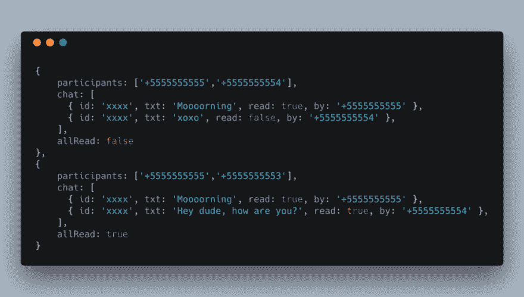
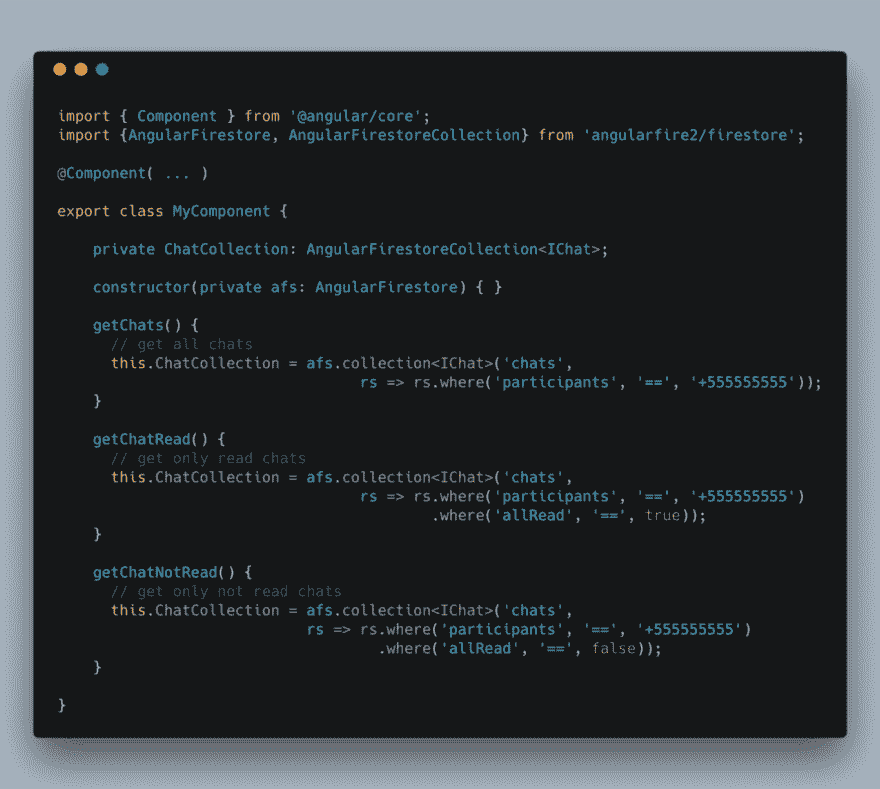
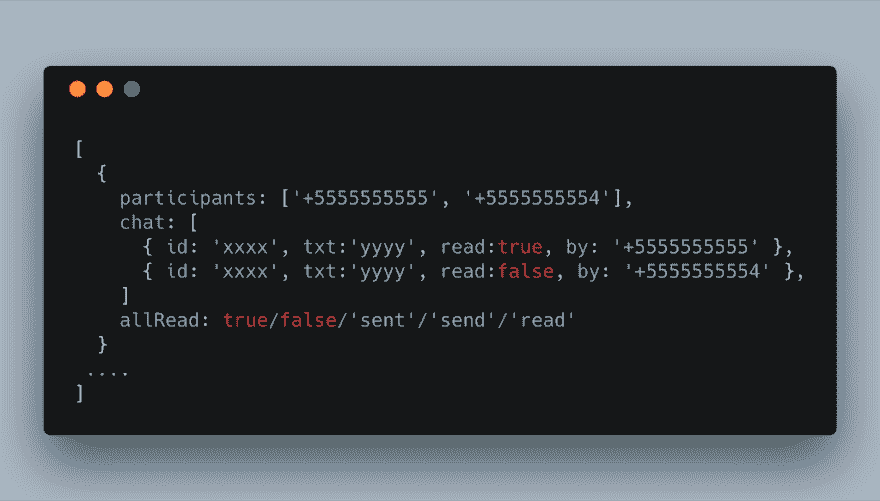
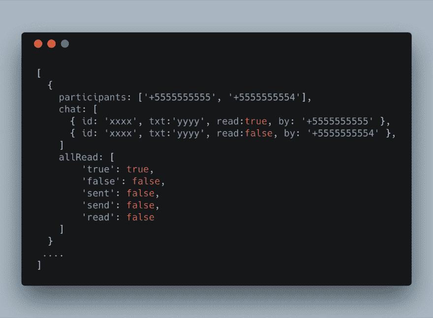
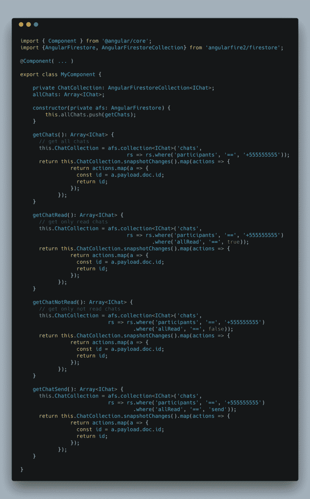
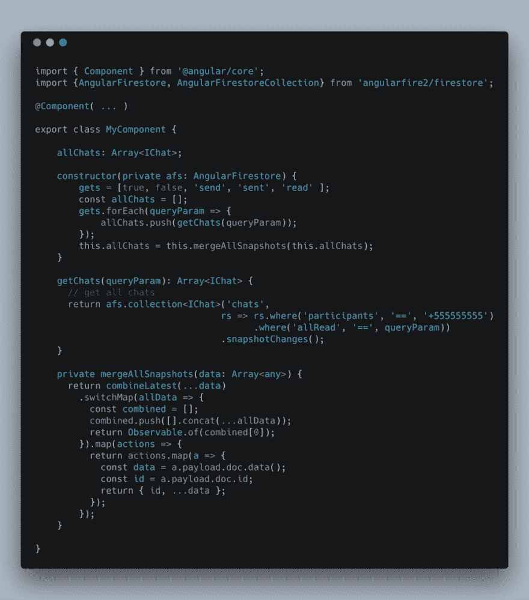

# 从非 sql 数据库到 Firestore & AngularFire

> 原文：<https://dev.to/jorgeucano/from-no-sql-database-to-firestore-angularfire-k1j>

### 从无 sql 数据库到 Firestore & AngularFire

你有没有想过 firestore 独特的 query 格式不同于任何其他 nosql …

Firestore 是由 google 的 Firebase 团队创建的超级强大的数据库，但是当我们想要迁移我们在另一个数据库中的数据，并且我们发现我们处理状态数据，而这些数据在 Firestore 的 query 中没有得到同等处理时会发生什么呢…

[T2】](https://res.cloudinary.com/practicaldev/image/fetch/s--WqVRJFWS--/c_limit%2Cf_auto%2Cfl_progressive%2Cq_auto%2Cw_880/https://cdn-images-1.medium.com/max/1024/1%2AijwRLDPUlke-7twDinUvSg.jpeg)

假设我们想从 mongodb 迁移到 firestore…

假设我们正在迁移的是一个聊天…一个聊天通常有数据，如谁发送它，谁接收它，最重要的是它有一个重要的数据，著名的双蓝检查，或者说是 read 的后续。

那么我们就会有一个类似于这个的结构:

[T2】](https://res.cloudinary.com/practicaldev/image/fetch/s--kXfzdo7c--/c_limit%2Cf_auto%2Cfl_progressive%2Cq_auto%2Cw_880/https://cdn-images-1.medium.com/max/1024/1%2A9im_IjBxBA9sI7lQQsuzfQ.png)

有了这种格式，我们就可以轻松地进行查询，确定它是真还是假，读取它们，因为只有两种状态，如果我们想看到“读数”，我们就去找那些为真的，相反的是“未读的”

让我们考虑一下如何进行查询:

[T2】](https://res.cloudinary.com/practicaldev/image/fetch/s--SVGFKFKN--/c_limit%2Cf_auto%2Cfl_progressive%2Cq_auto%2Cw_880/https://cdn-images-1.medium.com/max/1024/1%2AkrQaHIQwe-cEseVq4PAYLQ.png)

[T2】](https://res.cloudinary.com/practicaldev/image/fetch/s--ZY1EqSSB--/c_limit%2Cf_auto%2Cfl_progressive%2Cq_auto%2Cw_880/https://cdn-images-1.medium.com/max/368/1%2AP_j3Ducx8Aj4qE3cHo0p-w.jpeg)

但是有更多的“状态”实际上读取或不读取…我们必须识别“通过发送”，“发送”，“接收/不读取”，“接收/读取”

[T2】](https://res.cloudinary.com/practicaldev/image/fetch/s--KLQU0P-m--/c_limit%2Cf_auto%2Cfl_progressive%2Cq_auto%2Cw_880/https://cdn-images-1.medium.com/max/299/1%2ADiX3IpEpnST9CiBZcYel3Q.jpeg)

[T2】](https://res.cloudinary.com/practicaldev/image/fetch/s--zfUuSlrp--/c_limit%2Cf_auto%2Cfl_progressive%2Cq_auto%2Cw_880/https://cdn-images-1.medium.com/max/1024/1%2Asz2Sg58EJSpwLWh9udxqXQ.png)

但是，会有什么问题呢？这很简单，我可以添加更多的“where ”,并通过 2 或 3 个不同的“allRead”进行过滤，在 MongoDB 中可以，但在 firestore 中不行

[T2】](https://res.cloudinary.com/practicaldev/image/fetch/s--qQcdvKRV--/c_limit%2Cf_auto%2Cfl_progressive%2Cq_66%2Cw_880/https://cdn-images-1.medium.com/max/500/1%2AChMf4j6WKQG0z7XTO4cnGw.gif)

在 fforestre 中，我们必须生成这种类型的结构:

[T2】](https://res.cloudinary.com/practicaldev/image/fetch/s--XsUNKZhF--/c_limit%2Cf_auto%2Cfl_progressive%2Cq_auto%2Cw_880/https://cdn-images-1.medium.com/max/1024/1%2A7PfCBObtSCQ_kkZLsG04bQ.png)

那么，你是在告诉我我不能做迁移吗？

实际上，如果我们想保持数据的格式，我们必须对代码做一些修改…

我们可以考虑的第一件事是调用不同的函数并推入一个通用数组:

[T2】](https://res.cloudinary.com/practicaldev/image/fetch/s--q47jVHp9--/c_limit%2Cf_auto%2Cfl_progressive%2Cq_auto%2Cw_880/https://cdn-images-1.medium.com/max/1024/1%2AsFrmOrF9csJPELJNsIn7Dw.png)

但是，这样可以吗？

这样做是不是最好的方法？

不存在的东西不用做那么多代码？

我重复了很多同样的话…

感谢 RXJS 和一些小技巧，我们将能够改善我们对 AngularFire 和 Firestore 的体验

[T2】](https://res.cloudinary.com/practicaldev/image/fetch/s--eiOIXUAX--/c_limit%2Cf_auto%2Cfl_progressive%2Cq_66%2Cw_880/https://cdn-images-1.medium.com/max/1024/1%2A1f_qkwdoDwKIWzFRBLLaRw.gif)

[T2】](https://res.cloudinary.com/practicaldev/image/fetch/s--a_YhK2dl--/c_limit%2Cf_auto%2Cfl_progressive%2Cq_auto%2Cw_880/https://cdn-images-1.medium.com/max/1024/1%2Ah2cf3kr3O-EWBsBWobB9ww.png)

<figure> 

<figcaption>RxJS 我的宝贝</figcaption>

</figure>

通过这种方式，感谢来自 firestore 的数据和数据，我们将能够融合数据，并能够完整地展示它们，而不用考虑我们有多少事情要做。

#### 但它是如何工作的呢？

我们所做的是迭代数组，从而能够处理不同的返回，但 firestore 实际上提供的是一种“可观察的”,我们通过它发送我们在查询中请求的数据。通过这种方式，利用切换图，我们将能够获得所有可观察到的数据，并以这种方式将它们连接起来。

一旦所有的数据都建立在同一个数组中，我们将制作映射来获取集合的数据以及每个集合的唯一 ID，并将其传送到我们的列表中，以便正确地处理数据。

请记住，该收集当然不包括真实聊天数据库中存在的所有真实数据，但它是一种解释我们如何使用非 sql 和 Firestore 的差异的方式。

该功能可以在: