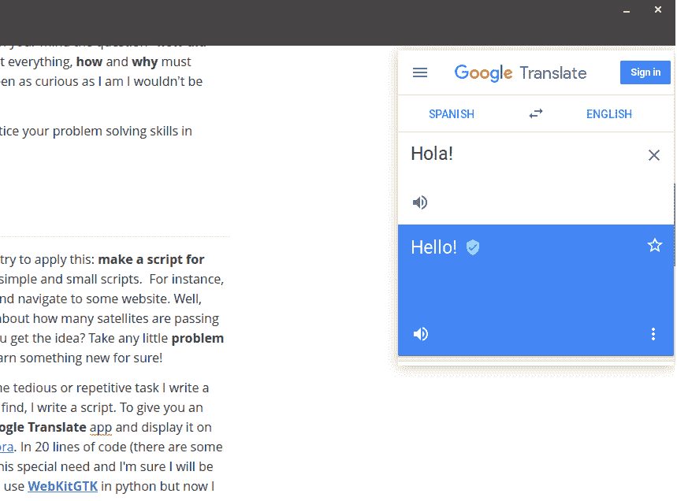
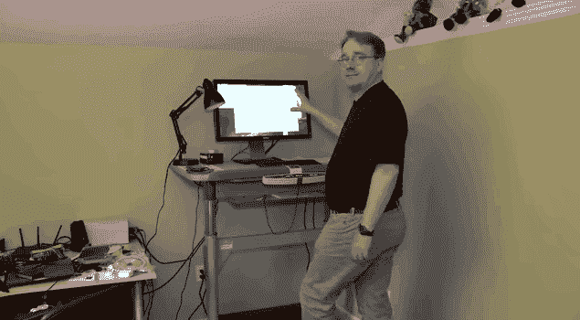

# 从伪代码到全栈软件开发者

> 原文：<https://dev.to/protium/from-pseudo-code-to-full-stack-software-developer-4n7l>

嗨，我叫布莱恩，今年 25 岁，我认为自己是一个自学者。到今天为止，我已经从事编程工作大约七年了，我想我有一些建议给那些开始进入这个奇妙的二进制世界的人。

## 一点介绍

当我 18 岁的时候，我学习了一年的计算机工程，在这一年里，我了解了什么是 T2 算法以及为什么我们需要它们。我也是从职业生涯第二年开始辅助听课的(太着急了？)在其中我学到了**命令式编程**和**数据结构**(和 OOP)。

在大学里，我得到了一个授权版本的 Visual Studio 2010 Pro Edition，并开始学习 C#。到我 19 岁生日的时候，我已经在每一个单独的应用程序中制作了应用程序。NET 堆栈框架。我太激动了，以至于我决定退学，专注于学习更多的软件开发知识。2016 年，我在我家乡的一家小公司(有大的国家客户)担任 **CTO** 的角色，我遇到了这个世界的商业一面(这是我不喜欢的)。

直到我远程工作的那一天。一家中型公司的 NET 和 JavaScript 开发人员。虽然我越来越远离。NET 并深入学习 JS、C/C++、python 和 Go。我查询了许多软件/电子相关的东西，如计算机视觉、机器学习、安全、家庭自动化、编译器等。在这篇文章中，我将写下所有我认为帮助我成为一名软件开发人员、找到一份工作并独立生活的事情。

## 从哪里开始？

> 注意:我不是一个以英语为母语的人，我做的第一件事实际上是学习英语(我仍然是)。这是我给那些想学习编程的非英语人士的第一个建议。

现在有大量的资源可以开始:在线免费课程、免费教程、免费电子书、数百万的 youtube 视频。你可能会感到不知所措，因为所有这一切。但是，不要慌！这里有一个简单的步骤列表:

1.  找一门相对易学的**面向对象的**编程语言。毫无疑问，我会推荐 **python** 或者 **javascript (ES6/7)** 。
    1.  在你的笔记本电脑上安装一个 GNU/Linux 发行版(如果你还没有的话)。相信我，GNU/Linux 和开源社区是这个世界上最好的东西。我建议[安特戈斯](https://antergos.com/)或者[乌班图](https://www.ubuntu.com/)
2.  拥抱**终端**:使用终端，习惯终端，热爱终端。
3.  了解**数据结构**。了解它们是如何工作的，你可以用它们解决哪些问题，为什么。
4.  了解**递归**和 **BigO 符号**
5.  分而治之:习惯把一个问题分成**个小块**。
6.  从头开始写**干净的代码**。编写可读性强、结构良好的代码将有助于你快速学习，避免令人沮丧的错误。

## 好奇！

[T2】](https://res.cloudinary.com/practicaldev/image/fetch/s--q8Gm5sVI--/c_limit%2Cf_auto%2Cfl_progressive%2Cq_auto%2Cw_880/https://boygeniusreport.files.wordpress.com/2018/06/screen-shot-2018-06-18-at-7-55-25-am.png%3Fw%3D782)

另一个很好的学习资源是**源代码**。是啊！源代码，通过阅读来自**开源**项目的源代码，我学到了很多。阅读有才华的开发人员如何解决他们的问题，并试图找出他们为什么这样做，这是一个总能教会你一些东西的过程。但是不要只是读它，想想，**你怎么能改进它？**

回到过去，当我试图阅读源代码时，我不知道 GNU 和开源，我只使用 Windows。我想在我成为一名开发人员之前，我已经成为一名优秀的“**反编译器**”。不要误会我，我没有反编译的东西，以复制&粘贴到我的项目代码。我总是对事物是如何运作的感到好奇。记得有一次玩网页游戏赢了一台智能电视。游戏显示图像，你必须尽可能快地输入你看到的内容。我第一次尝试的成绩是 1.5 分钟完成比赛。排行榜上有一个人的成绩是 **10 秒**。WTF，不可能！所以我在 Chrome 上按了 F12 键(显示了**网页检查工具**)。这个游戏是一个 Flash 游戏。我知道 Flash 是什么，但我从未尝试过，所以我开始查找源代码。我没找到。那么:**好的 google(或者 alexa)，我如何反编译一个 SWF 文件？**我拿到了源代码。它把你必须输入的所有字符串映射到图像上。然后我用这些图片做了一个应用程序。每当我点击一张图片，应用程序就会在游戏中插入文字。于是，我取得了 **8 秒**的成绩(老实说我不记得确切的数字了)。当然，我没有赢得任何东西，幸运的是我没有遇到麻烦。但是我确实学到了一些东西。

所以，去网络空间找一些很酷的开源项目(如果它是用你正在学习的语言制作的就更好了)。如果某个应用程序在你脑海中触发了这个问题**“他们是怎么做到的？”**，去看看代码！**要好奇！**凡事问自己，**如何**和**为什么**一定成为你使用频率最高的词。我想如果我不像现在这样好奇，我就不会写下这些。

当你对某件事不好奇的时候，你可以在 [HackerRank](https://hackerrank.com) 里练习你的解题技巧。

## 全部脚本化

在从终端跳转到浏览器或桌面应用程序之前，尝试应用这个:**为所有事情制作一个脚本**。你会惊奇地发现，通过编写简单的小脚本，你可以学到很多东西。例如，让我们说，每次你打开你的电脑，你打开浏览器，导航到一些网站。嗯，**你为什么不为此写个剧本呢？**或者，你可能对现在有多少颗卫星正从你的当前位置上方经过感到好奇？为这个也写个剧本吧！你明白了吗？把你遇到的任何小的**问题或需求**写下来，你一定会学到新的东西！

我可以说我对每件事都有一个脚本，每当我发现一些乏味或重复的任务时，我就写一个脚本。每当我需要一些我找不到的特定工具(或者只是一个函数)时，我就写一个脚本。给你一个例子，几分钟前我有这个需求:我想要一个桌面**谷歌翻译**应用程序，并显示在顶部，这样我就可以在我用 [Typora](https://typora.io/) 写这篇文章时检查我的英语。[20 行代码](https://gist.github.com/b1tdust/95b094e4890e7fa49553425a54d87eab)(有一些神经网络是 14 行写的，我应该做的更好🤔)我解决了这个特殊需求。昨天，我还不知道如何在 python 中使用 **[WebKitGTK](https://webkitgtk.org/)** 但是现在我有了一个基本的想法。下面是我运行的脚本:

[T2】](https://res.cloudinary.com/practicaldev/image/fetch/s--GjOB_F4H--/c_limit%2Cf_auto%2Cfl_progressive%2Cq_auto%2Cw_880/https://thepracticaldev.s3.amazonaws.com/i/lji5l6pqh50tuf7wtp1v.png)

​

脚本也是学习新语言的好机会。用不同的语言写脚本是一个很好的练习！

*“需要的话，写个剧本”*总有一天你会在我的坟墓里读到。

## 继续:如果...

前端，后端，DevOps，物联网，区块链，计算机视觉，这么多东西！这里很容易陷入困境并感到沮丧(我是，我什么都想做！).首先，阅读它们中的每一个(如果你心里还没有一个)，哪种技术正在被使用？它们是如何工作的？你应该为此学习什么？

但是，我认为一个好的开始是建立一个 web 应用程序，前端和后端。是的，这看起来是一个巨大的飞跃，但是试着去实现它。你可以从一些非常简单的东西开始，比如一个向服务器发出请求的按钮，然后服务器用当前时间来响应。我建议你用 **[NodeJS](https://nodejs.org/en/)** 来做这个。对于你的后台使用[快车](http://expressjs.com/)或[波尔卡](https://github.com/lukeed/polka)。这里一步一步地列出你写的第一个**一键 web 应用:**

1.  你知道什么是 **HTTP** 吗？
2.  你现在知道什么是 **HTML** 吗？
3.  你明白**前端**和**后端**开发的概念吗？你确定吗？
4.  制作带有按钮的 web 应用程序，并为 **click 事件**添加一个事件监听器。(事件什么？)
5.  写一个简单的 nodeJS 服务器(**什么是服务器？**)可以处理一个**得到**的请求。将你的 html 文件作为**静态**内容(我该怎么做？)
6.  你知道什么是 XMLHttpRequest 吗？
7.  创建一个**函数**，一旦你的按钮被点击，它就向服务器发出请求。服务器以纯文本的形式给出当前时间。
8.  如果现在我想为我的网络应用程序设计一个非常漂亮的用户界面，该怎么办？学点 **CSS** 。
9.  **如果**现在我想让服务器在每次客户端发出请求时都记录日志，该怎么办？了解如何从代码中编写文本文件。
10.  **如果**我想让服务器也记录每个客户端的 **IP** ，但是这次使用的是**数据库**呢。你现在知道什么是 **SQL** 和 **NO-SQL** 了吗？
11.  如果我希望应用程序在一天中的每个小时都改变它的背景颜色，该怎么办
12.  如果...会怎样...

我不是想告诉你应该如何做一个一键应用程序。我希望你们考虑一下我们如何从一个简单的想法开始，一点一点地把它变得更复杂。以及你应该如何通过阅读、学习和理解每一个相关的概念来进入这个过程。一旦你的应用程序有了一个基本版本，你就可以从你的**假设列表**开始。例如，如果我想让我几分钟前写的脚本从剪贴板中获取文本，这样每次我复制一些文本时，它就会被注入到谷歌翻译应用程序中，该怎么办？(是的，我做到了。现在我需要一些捷径🤔)

好吧，你开发了一个应用程序，你如何处理不同的版本？我向你们介绍**生产**和**开发**环境！这是你去学习如何使用一个好的**版本控制系统**像 **[Git](https://git-scm.com/)** (也有像[SVN](https://subversion.apache.org/)[TFS](https://visualstudio.microsoft.com/tfs/)等等的东西)。

## 第一份工作

[T2】](https://res.cloudinary.com/practicaldev/image/fetch/s--QkXcKAXF--/c_limit%2Cf_auto%2Cfl_progressive%2Cq_auto%2Cw_880/https://rebuildcreditscores.com/wp-content/uploads/2015/06/spot-fake-debt-collectors.jpg)

你职业生涯的第一步非常重要！如果你有机会申请初级开发人员的工作，请记住:

*   公司的主要产品/服务是什么？你喜欢吗？
*   你的任务是什么？你想做吗？

我知道，作为一名初级开发人员，你不能假装有一份理想的工作，而是要努力找到一份让你感到舒适的工作，这对开始你的职业生涯很重要。一旦你找到了一份符合你期望的工作，记住其他的事情:

#### 不要害怕求助

当我还是 CTO 的时候，我很快注意到我们雇佣的大多数初级开发人员害怕或羞于寻求帮助，所以他们往往会感到沮丧并犯错误或愚蠢的错误。那是一个大大的**不**。举起你的手，问你的问题。你才刚开始，你不知道所有的事情，而且**这完全没关系！首先你必须自己尝试，然后，如果你碰壁了，寻求帮助。**寻求线索，而不是寻求完整的解决方案。****

#### 帮助同事

如果他们比你更有经验也没关系。尝试帮助他们，提出可能的解决方案。只会发生两件事:

*   **你是对的:**你证明了自己真正理解了问题，并且**你正在取得进步**
*   **你错了**:也许你对脑海中出现的第一个解决方案反应太快了。你的同事会告诉你为什么你错了，因此，你正在学习新的东西，并且**你正在取得进步**

#### 遵循良好的惯例

我认为每个结构良好的软件公司都有一份关于编写代码的良好实践的文档。如果他们没有，就去要。你应该如何命名函数或者记录你的代码？**帕斯卡肠衣**还是**骆驼肠衣**？、**制表符**或**空格**？，您应该如何设置开发环境？等等。

#### 先设想最坏的情况

当你测试你的代码时，考虑最坏的情况，你认为这种情况可能永远不会发生，几乎不可能，并让你的代码为此做好准备。我可以向你保证，有一个**测试人员**在那里等着为你创建一个标签。

#### 调试

我觉得新手之间有一个普遍的做法:找一个 bug，做修改，重新编译。他们进入循环，直到解决他们问题。那样你会浪费一生的时间！设置一个调试器，记录可以帮助你更快修复错误的值和信息。

#### 重视自己的成就，不要低估自己

为你取得的每一项成就感到自豪。感到骄傲(不要太骄傲)，当你解决了一个困扰你几个小时甚至几天的问题时，感到骄傲是正常的，不管它是一个简单的还是一个非常困难的解决方案，你做到了！

还有，**不要低估自己**。接受大挑战，接受你认为自己无法解决的问题，并战胜它们！**挑战自我！**这里有一句激励的话挂在你的墙上:

[T2】](https://res.cloudinary.com/practicaldev/image/fetch/s---Y3zhfaB--/c_limit%2Cf_auto%2Cfl_progressive%2Cq_auto%2Cw_880/https://scontent.faep8-1.fna.fbcdn.net/v/t1.0-9/40244728_2141117689239784_3496875317711077376_n.jpg%3F_nc_cat%3D100%26oh%3Dc73a329e1979c65c5963cf80fb065eea%26oe%3D5C611195)

你可以做任何事情，你这个神奇的骷髅！

#### 复制&粘贴:小心

复制粘贴代码来赢得时间，让事情变得更快，这是可以的。不理解代码的作用和工作原理就复制粘贴**是完全不行的。你会发现自己经常访问像 [Stack Overflow](https://stackoverflow.com/) 或 **forums** 这样的网站，寻找其他开发者在你之前遇到的问题的解决方案。**那也行**。但是一旦你找到了拯救你生命的那段代码，在你把它粘贴到你的项目之前，你必须确定那段代码是否是最好的解决方案。**

**注意:**改变变量名并不能使代码成为你的！

#### 尽情享受！

永远不要忘记享受它！你得到报酬是为了做一些你喜欢并充满激情的事情。这种感觉太棒了！我记得自己在想“哇，他们付钱让我做这个！我会免费这样做，因为我喜欢编程”(永远不要大声这样想)。

我的第一份“工作”实际上不是一份有报酬的工作。我 19 岁的时候遇到一个家伙，他想用 [**微软 Kinect**](https://developer.microsoft.com/en-us/windows/kinect) 做一个*“基于用户运动的社交网络”*。那是 2012 年，Kinect 是最流行的东西，每个人都在用它做一些很酷的事情。我当时对**软件工程**一窍不通。这太有趣了，我从谷歌搜索、阅读和与他讨论数据库定义、代码优化、几何公式等中学到了很多东西。到第四个月的时候，我正在面试加入这个项目的新候选人。到了第六个月，我离开了这个项目。当然，该项目没有看到任何光明，但[在这里](https://youtu.be/2IbOpTl88U0)你可以看到一个用手玩的井字游戏的快速演示(我对“pc player”算法感到非常自豪)。我遇到了如此多的挑战，我获得了许多经验。NET to Maya Studio)让我在 2014 年 12 月找到了一份工作，开始了我的职业生涯。我获得了**半高级开发人员**的资格。

## 个人项目

你的每一个想法，你都应该实现它，或者至少尝试一下。我有一条黄金法则:如果你有一个很棒的想法，**先谷歌一下**。哦，这么多伟大的想法，我有另一个人，在这个世界的某个地方，已经做到了。但不要让这阻止你！去看看其他人是如何发展你的想法的。如果你还想继续下去，你可以考虑如何改进它。或者更好的是，和那个人一起努力实现它！

## 支持开源社区

我无法描述我有多爱开源社区。不仅仅是软件和硬件。分享知识的哲学，分享你的想法，互相合作让这个世界变得更好(我是科学披露的忠实粉丝)。最近几年，大公司意识到开源项目有多好，我想到的最好的例子是 Visual Studio 代码。它有 679 个贡献者，而**你可能是其中之一！**

所以，我认为另一件有助于你在职业生涯中不断进步的事情是为开源项目做贡献。也试着开源你做的每一件事(如果你愿意)，分享你的脚本，你的解决方案。去论坛帮助其他开发者解决他们的问题。我总是发现自己在帮助我所有的朋友和同事，学习新的东西，因为他们在用不同的框架和语言做不同的事情。

## 尽可能参加每一个开发者大会

与上述相关的是，如果你听说某个 dev 会议将在你住的地方举行，那就去吧！不要失去那个机会。开发者大会很酷！你会遇到做疯狂事情的人，你会学到新的东西。如果你愿意，你也可以成为一名演讲者！去年，我去了当地镇上的一个 **DockerConf** ，多亏了它，我开始进入我真正喜欢的 Docker & Kubernetes 世界。有才华的开发人员谈论他们的经历，并免费教你一些很酷的东西(至少我从未付费参加会议，但我确实捐了一些钱)。

而如果你去不了，或者你所在的城市没有很多会议(我经常遇到)，你可以关注这个 youtube 频道: [Coding Tech](https://www.youtube.com/channel/UCtxCXg-UvSnTKPOzLH4wJaQ) 。对我来说，这是我睡觉前必看的节目，你会发现几乎所有关于**的演讲/会议**

## 身心上:注意你的健康

是的，我们开发人员**也是人**！不要忘记这一点。有一件事不是每个开发人员都谈论的:**编程是会上瘾的。**有时候，我感觉到大脑中的化学脉冲触发了某种**时间追踪**阻断蛋白，我忘记了时间，我花了几个小时阅读、编码、调试、编码。不要那样做！(我也是)。去散散步，不要天天吃快餐。**喝水！** **好好睡吧！我是认真的。如果你把健康放在一边，你会感到恶心、疲倦、有压力，那时编程就不再有趣了。这是 Linus Torvalds 行走和工作的 GIF 照片:**

[T2】](https://res.cloudinary.com/practicaldev/image/fetch/s--WWYLaN0c--/c_limit%2Cf_auto%2Cfl_progressive%2Cq_66%2Cw_880/https://static.businessinsider.com/image/54e3e52a6da811e73585a479/image.gif)

小心你的脖子和后背。拿一把符合人体工程学的椅子。将显示器调整到一个合适的视角。学习如何正确坐姿，这听起来很傻，但知道如何正确坐姿将帮助你度过一天，避免颈部疼痛。相信我，一边写代码一边脖子疼是我做过最糟糕的事情。如果你已经有脖子&背痛，做一些**理疗**并摆脱它。

[T2】](https://res.cloudinary.com/practicaldev/image/fetch/s--hoREUylj--/c_limit%2Cf_auto%2Cfl_progressive%2Cq_auto%2Cw_880/https://i.ytimg.com/vi/TKrTaJAulFQ/hqdefault.jpg)

众所周知，在我们热爱的二元世界里有很多压力。死线，bug，压力，更多 bug，服务器故障，更多压力。我有焦虑问题，但是现在我越来越老，越来越聪明(我希望如此)，我可以比几年前更好地处理它。但有时避免压力几乎是不可能的。所以，如果你做得不太好，如果编程不有趣，如果你不想再工作了，试着找个人聊聊。朋友、家人甚至心理治疗师。还是那句话，寻求帮助真的没问题，别忘了。你的心理健康和身体健康一样重要。

## 哎，别拖了！

几年前我就应该制造某种传感器，如果它检测到我在拖延，就给我发个电击什么的。对付拖延症是一件事。它可能不会以同样的方式影响每个人，但你必须处理它，如果你不给自己设限，这将是一个巨大的问题。找到一种每天都更有效率的方法。在短时间内实现更多的目标会让你感觉超级酷，它会鼓励你做得越来越多。这是我的弱点之一，但我已经在努力了。

## 不要和框架或编程语言结婚

嗯，这可能是一个讨论的话题。现在我认为你不应该只掌握一种编程语言或一个框架。我认为那样你会很快厌倦。我知道，有很多公司在寻找具有特定背景的候选人，比如*“具有 ReactJS 技能的高级 Django 开发人员”*，但是也有很多公司只对你解决问题的技能感兴趣。然后，他们会教你一些他们正在使用的编程语言，或者一些框架。这就是为什么你应该关心掌握你的解决问题的技能，你的计算机科学知识，关于设计模式。一旦你理解了所有这些概念，你就可以在任何语言中运用它们。

如果你已经每天只用一种语言工作，试着在你的兼职项目中加入另一种语言。建议你的团队尝试一些你读到的新东西，你认为它可以改善你的公司产品。

## 还有什么？

见鬼了。我从来没有写过这么长的帖子。大约 3800 字，还在计算中，这里没有一行代码！这就是人们在完成一篇论文时的感受？我不知道我是否应该把它分成 2 或 3 部分，但如果你足够疯狂，读到最后，你认为它真的很长，请让我知道，我会考虑如何分割它。

这篇帖子的主要原因是给每个正在考虑成为一名**软件开发人员**并且不知道从哪里或如何开始的人一些提示。如果你也出于同样的目的写了一些东西，把链接放在评论里，我会把它添加到这篇文章的列表里。谁知道呢，我们可以一起写下一本圣经！

## 结论

说实话，我真的不知道怎么写结论。但是我要告诉你的是:永远不要停止好奇！

希望你能在这里找到一些动力。某种开始你旅程的向导。