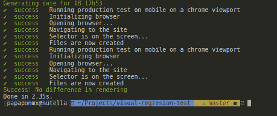

# 使用木偶师实现前端开发自动化。第三部分

> 原文：<https://dev.to/papaponmx/front-end-development-automation-with-puppeteer-part-3-3pl6>

## [T1】简介](#intro)

*   [这个系列的第一部分](https://dev.to/papaponmx/front-end-development-automation-with-puppeteer-part-1-2k9n)
*   [本系列的第二部分](https://dev.to/papaponmx/front-end-automation-with-puppeteer-part-2-2pmb)
*   [链接到回购](https://github.com/papaponmx/visual-regresion-test)

这篇文章颇具讽刺意味，因为在这周的工作中，我在产品中做了一些改变，而这些改变本可以被你在这篇文章中读到的内容所阻止。希望这篇文章能让你从我的错误中吸取教训。

## 场景 3:比较本地与测试的快照。

你正在改变你的应用的核心，也许是一些在后端使用的端点，但是业务逻辑和核心功能应该保持不变。应用程序的渲染必须保持不变。现在我们将制作一个脚本来比较这两种环境，并保证它会发生。

## 应用概要。

作为样板文件，我们将从创建 React 应用程序和包开始，只是为了在页面上呈现一些内容，只有起始页面就足够了。

```
app
├── src
│   └── App.js         # The single component we'll render.
├── scripts
    └── visual-regresion-test
        ├──|actions    # All the DOM traversing functions.
        |  └──getPageScreenshot.js
        |  └──generateDateString.js
        |  └──compareScreenshots.js
        ├── images     # Here we will store our evidence.
        ├── index.js  # The main script were we will run our tests.   
        ├── config.json # For the url, viewport sizes, etc. 
```

Enter fullscreen mode Exit fullscreen mode

## 项目设置。

我们将使用 [`parcel-react-app`](https://github.com/miljan-fsd/parcel-react-app) 来搭建我们的项目。

1.  安装 parcel-react-app
    T0】

2.  安装依赖项
    `yarn add puppeteer chalk signale pixelmatch pngjs`

我们使用`chalk`和`signale`是为了得到一个更好的`console.log`。如果你需要的话，这里还有这些系列第一部分的[链接。](https://dev.to/papaponmx/front-end-development-automation-with-puppeteer-part-1-2k9n)

我们还有`pngjs`来编码/解码我们的图像，还有`pixmatch`来为我们提供图像比较。

1.  将我们的测试脚本添加到`package.json`

```
// package.json
scripts: {
//...
    "vrt": "node --experimental-modules ./scripts/visual-regresion-tests/index.js"
} 
```

Enter fullscreen mode Exit fullscreen mode

*注意*:我们使用`--experimental-modules`是为了无需额外设置即可使用 ESM🤓

然后我们会把它部署到 https://visual-regresion-testing.firebaseapp.com/的火力基地

## 书写我们的行动脚本

1.  它看起来与本系列的第一部分和第二部分非常相似。我们将创建一个函数，它接受一些参数并获取屏幕截图

```
// actions/getPageScreenshots.js
export const getPageScreenshot = async (url, env, viewportConfig) => {
  const { height, width } = viewportConfig;
  const dateString = generateDateString();
  const selector = 'h1' // This could be any valid CSS Selector

  await signale.success('Initializing browser')

  const browser = await puppeteer.launch()
  const page = await browser.newPage()

  await page.setViewport({ width, height })
  await signale.success('Opening browser...')
  await signale.success('Navigating to the site ');
  await page.goto(url);
  await page.waitForSelector(selector)
    .then(async () => {
      signale.success('Form was submitted successfully');
      await page.screenshot({ path: `./scripts/visual-regresion-tesimg/${env}_${dateString}.png` });
      browser.close();
    })
}; 
```

Enter fullscreen mode Exit fullscreen mode

当`getPageScreenshot`在两个环境中运行后，我们必须将文件命名为这样的名字:
`Production_7_21h30.png`
`Test_7_21h30.png`

## 比较两幅图像

为此，我们需要尺寸完全相同的图像，这就是为什么我们在`config.json`上定义它

为了比较这两个图像，我们将从 中选取示例，并将代码改为 ES6。

如果你想知道它在引擎盖下做什么，这里有解释:

1.  将两幅相同大小的图像作为输入。
2.  将它们解码并作为流进行处理。
3.  一旦完成，它将对它们进行比较，并创建第三个流，该流被转换为图像，以便我们能够更好地欣赏差异。我们还可以使用来自第三个流的信息来了解有多少像素是不同的，并对它们采取行动。

```
//actions/compareScreenshots.js

const imageFromFile = filename =>
  new Promise(resolve => {
    const img = fs
      .createReadStream(filename)
      .pipe(new PNG())
      .on('parsed', () => {
        resolve(img.data)
      })
  })

const compareScreenShots = async (FILENAME_A, FILENAME_B, viewportConfig) => {
  const IMAGES_FOLDER_PATH = './scripts/visual-regresion-tesimg/'
  const { height, width } = viewportConfig

  const newLayout = await imageFromFile(IMAGES_FOLDER_PATH + FILENAME_A + '.png') // './automatiimg/local_host_layout.png'
  const oldLayout = await imageFromFile(IMAGES_FOLDER_PATH + FILENAME_B + '.png') // './automatiimg/local_host_layout.png'

  const diff = await new PNG(viewportConfig)
  const diffPixels = await pixelmatch(
    newLayout,
    oldLayout,
    diff.data,
    width,
    height,
    {
      threshold: 0
    }
  )

  if (diffPixels === 0) {
    console.log('Success! No difference in rendering'.green)
  } else {
    console.log(
      `Uh-oh! Ther are ${diffPixels} different pixels in new render!`.bgRed
    )
  }
} 
```

Enter fullscreen mode Exit fullscreen mode

## 把所有的东西放在一起

谢谢你坚持这么久。现在我们需要把所有东西放在一个文件中，然后简单地运行我们的测试。我们将在`scripts/visual-regresion-tests/index.js`做这件事。这是我们在运行`yarn vrt`时指向的文件夹。

下面是一个文件中的代码:

```
// scripts/visual-regresion-tests/index.js
const signale = require('signale')
const colors = require('colors')
const config = require('./config.json')
const { generateDateString }= require('./actions/generateDateString.js');
const { getPageScreenshot } = require('./actions/getPageScreenshot.js');
const { compareScreenShots } = require('./actions/compareScreenShots.js');

let testImage;
let productionImage;

const runLocalTest = async (device = 'default', config, dateString) => {
  const { env, viewport } = config
  // await signale.success(`Running production on ${device}`)
  await signale.success(
    `Running production test on ${device} on a ${
      config.browser.clientName
    } viewport`
  )
  await getPageScreenshot(env.local, 'Test', config.viewport[device], dateString)
  await signale.success('Files are now created')
}

const runProductionTest = async (device = 'default', config, dateString) => {
  const { env, viewport } = config
  // await signale.success(`Running production on ${device}`)
  await signale.success(
    `Running production test on ${device} on a ${
      config.browser.clientName
    } viewport`
  )
  await getPageScreenshot(env.stagging, 'Production', config.viewport[device], dateString)
  await signale.success('Files are now created')
}

const runItAll = async (config) => {
  const dateString = await generateDateString();
  await console.log(`Generating date for ${dateString}`.green);
  productionImage = await `Production${dateString}`;
  testImage = await `Test${dateString}`;

  await runLocalTest('mobile', config, dateString);
  await runProductionTest('mobile', config, dateString).then(() => {
  compareScreenShots(testImage, productionImage, config.viewport.default)
  });
}

runItAll(config)
  .catch(error => console.log('error'.red, error)); 
```

Enter fullscreen mode Exit fullscreen mode

我们正在做的是:

1.  首先声明测试文件和本地文件的名称。我们在最外面的范围中声明它们，因为我们需要获取屏幕截图的函数和比较两幅图像的函数之间的日期一致。
2.  声明`runProductionTest`和`runLocalTest`。唯一不同的是环境，他们初始化`puppeteer`，转到相应的 url 并为每个环境生成一个截图。注意，两个函数都将`dateString`作为参数，*必须使用相同的视窗*来比较两幅图像。
3.  我们定义了`runItAll`函数，它生成两种环境都使用的主要配置。
4.  我们用`config.json`中定义的配置执行`runItAll(config)`。

正如我在这篇文章的开头所说的，我们的想法是能够用一个命令来测试我们的改变不会给应用程序带来任何视觉上的改变。

现在我们可以运行`yarn vrt`，应该会看到类似这样的内容:

[T2】](https://res.cloudinary.com/practicaldev/image/fetch/s--hgxTCb5r--/c_limit%2Cf_auto%2Cfl_progressive%2Cq_auto%2Cw_880/https://thepracticaldev.s3.amazonaws.com/i/j2m7rbb9xl6w99e6dzig.png)

### 结论

`puppeteer`和`Nodejs`很有潜力。在接下来的几周里，我会发一篇关于如何将这些工具与 Github 挂钩和 Conitinous 集成用于前端的帖子。

在这个项目的开发过程中，我试着使用 ES 模块，但是它们在一些库上不能很好地运行，至少现在还不能。我正在用我的印象写一篇博客。

**有用的链接**

*   [这个系列的第一部分](https://dev.to/papaponmx/front-end-development-automation-with-puppeteer-part-1-2k9n)
*   [本系列的第二部分](https://dev.to/papaponmx/front-end-automation-with-puppeteer-part-2-2pmb)
*   [回购与所有代码](https://github.com/papaponmx/visual-regresion-test/)

感谢阅读，伙计们。

干杯。