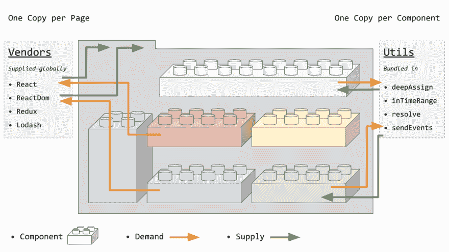

# Fiverr 分散系统中的前端资源共享

> 原文：<https://dev.to/omrilotan/front-end-resource-sharing-in-fiverr-s-decentralized-system-4ij4>

### 五矿分散系统中的前端资源共享

#### Fiverr 如何在分散式前端系统中平衡资源共享和组件独立性。

我们在 Fiverr 的前端架构规定了多个网关应用，提供“垂直”体验。每一个垂直领域都用来自不同来源的多个组件创建网页，这些组件共享一个运行时环境，即**窗口**，或**全局范围**。

在我们的组织中，许多组件共享极其相似的技术堆栈(React、Redux、Lodash…)，但我们仍然希望保持它们的独立性，不依赖于它们控制之外的资源。一些组件可能在很长一段时间内保持不变，而另一些组件则经常发生变化——新的组件和功能一直在构建。我们想满足他们所有人的需求。

> 支持遗留代码的环境和用新技术创新的愿望之间总是会有冲突。

我们的平台架构已经发展成为一种结构，我个人认为这种结构是可维护的、高性能的，并且易于开发。

在整个系统中，我们识别了最常用的资源，并将它们分为 3 个不同的组:

1.  **供应商** —大型库和框架，通常是众所周知的开源项目，它们的主要版本发布周期相当短。
2.  **高重现性—** 针对我们的开发需求量身定制的模块已经成为开发人员的第二天性，预计将在所有环境中可用，其中包括我们的 *i18n* 解决方案，以及技术和业务监控等统计报表。
3.  **其他实用程序—** 这些实用程序可能有不同程度的重复使用。它们包括助手功能、有用的类、可重复的业务逻辑或技术功能操作，这些功能与任何特性或领域都没有决定性的关系。

### 1。供应商

我们处理供应商资源的方法很简单:一个页面极有可能包含多个需要相同依赖项的程序，通常是很大的依赖项。我们希望确保他们能够使用相同的资源，为此，我们需要在全球范围内提供这些资源。这种方法旨在创建最佳的浏览器缓存和最小化(JIT)编译。

组件从预定义的列表中声明它们打算使用的依赖关系(列表本身作为公共依赖关系维护)。这是组件和服务之间的一种契约。比如说；组件 A 将声明:react，react-dom，lodash，组件 B 将声明 react，react-dom，redux。他们还确保将这些依赖关系作为[web pack external](https://webpack.js.org/configuration/externals/)包含在他们各自的浏览器目标构建中，因此他们从代码的捆绑解决方案中被省略。最后，他们必须假设主版本中的未来升级超出了他们的控制范围，所以实验性的特性通常是不可能的。

#### vendors.json

```
{  "lodash":  "\_",  "react":  "React",  "react-dom":  "ReactDOM",  "react-redux":  "ReactRedux",  "redux":  "Redux"  } 
```

#### externals.js

```
module.exports = Object.entries(require('./vendors.json'))
    .reduce(
        (collection, [route, name]) => Object.assign(
            collection,
            {
                [route]: {
                    'commonjs': route,
                    'commonjs2': route,
                    'amd': route,
                    'root': name,
                    'var': name,
                },
            }
        ),
        {}
    ); 
```

使用这些组件的网关应用程序是运行时的所有者；他们伪造 HTML 文档。他们通过使用相同的“供应商”包来了解所有的供应商。他们还可以免费升级补丁和次要版本，假设不会发生严重的破坏。它们将考虑所有组件的需求，将只加载所需的供应商脚本，并且或者在窗口上或者在全局中公开它们。

我们发现在这种方法中特别有用的是，因为我们从一个位置通过管道表示所有供应商脚本，所以我们可以叠加全局名称。最初我们将 React 公开为 React，但是我们认为公开我们使用的主要版本会更好，所以 React 将被表示为 window.React15。

看到所有组件都使用 Webpack externals，全局名称对代码本身来说是不明确的——它们只是从“react”导入 React，它们的配置将指向所需的版本。这种方法允许我们**逐渐迁移**并让同一个页面服务于**两个版本的 React** 而不会发生冲突。然而，我们已经决定在公司内设定迁移的截止日期，以避免供应商脚本随着时间的推移而膨胀。

### 2。高重现性

最终，我们决定解散这个小组，并根据规模、成熟度和突破性变化的可能性，在两个现有解决方案之间划分工具——“T0”供应商和“*杂项实用程序*”。在撰写本文时，“供应商”只包括我们自己的两个依赖项，我们之前认为是“*高重现*”组的依赖项，我们的 *i18n* 解决方案和浏览器的*获取* API 的装饰方法。

我们其余的实用程序，无论使用多么频繁，都已经被合并到实用程序库中，由单独的组件使用并捆绑到单独的组件中(见下文)。

[T2】](https://res.cloudinary.com/practicaldev/image/fetch/s--hY_NDjQ---/c_limit%2Cf_auto%2Cfl_progressive%2Cq_auto%2Cw_880/https://cdn-images-1.medium.com/max/960/1%2A1z-MY7fYDYbDHzWLy1vraQ.png)

### 3。杂项公用事业

因为我们想让每个包都消费它所需要的东西，而没有膨胀的软件，所以挑战在于创建一个单一的实用程序库，它可以包含最基本的需求，并且不包含重复，同时作为公共助手操作的单一查找点。

我们假设公用模块将需要来自实用程序库本身的方法，但是如果我们将每个模块单独导出为一个捆绑的解决方案，我们将导致组件内的代码重复。小而独立的软件包会产生重复，但也可能引入版本倍增。我们肯定想避免这种情况。

我们的解决方案以**原始和声模块**的形式提供了一个实用程序库。每个消费者从这些模块中捆绑他们需要的所有东西，模块之间的内部链接也保持不变。这为每个组件带来了最佳的捆绑解决方案。

这种解决方案允许我们以非破坏性的方式在我们的实用程序中引入突破性的改变。消费者按照自己的节奏更新。所有实用程序都保存在一个库中，这一事实创造了一个舒适的环境，在这个环境中，消费者和其他实用程序将在一个包(闭包)中为每个实用程序使用相同的版本。最后，这种方法允许绑定方法的发展，以保持消费模块内的一致性:polyfill 弃用、不同的 es 版本导出和分块绑定都在消费者的控制之下。例如，向支持浏览器提供 ES6 代码的决策现在也包括所有实用程序。

对实用程序库有一个限制——它只能使用广泛支持的 Javascript 特性，消费者的“transpile”过程可能不包括实验性特性(例如 babel 插件)。

#### 一种效用

```
export const resolve = (string = '', context = global) =>
    string
        .split('.')
        .reduce((prev, current) => typeof prev === 'object'
            ? prev[current]
            : prev, context
        ); 
```

#### 实用工具根

```
export * from './deepAssign';
export * from './env';
export * from './inTimeRange';
export * from './multiEventListener';
export * from './pluck';
export * from './resolve';
export * from './select';
export * from './sendEvents'; 
```

所有模块都作为**命名模块**导出。保留方法名有助于跨项目维护，并且对于开发人员在项目中跳转的能力至关重要。它还可以防止命名冲突。

出于这个原因，并且为了简化使用，无论它们是命名空间还是嵌套在目录中，模块都在实用程序库的根目录下公开。

```
import { inTimeRange, env, resolve } from '@fiverr/util'; 
```

实用程序库针对创建功能单元进行了优化，它可以清除技术操作中的功能代码。这个库还被一个带有真实浏览器的测试环境覆盖(包括 edge！)，创建自动化文档，通常最适合开发代码的功能单元。开发人员被鼓励使用它，即使对于没有重用潜力的模块。

> 我们觉得我们已经找到了一个很好的平衡，大型的依赖项享受着最佳的缓存和共享，同时一个可维护的实用程序库提供了一个快速的开发环境，能够安全地引入突破性的变化。

复杂的 web 应用世界正在快速发展，我确信更多的组织会遇到类似的挑战。我们希望这个 Fiverr 解决方案的例子能够帮助其他人定制他们自己的解决方案。

#### 额外收获—网络包排除/包含

从“transpile”过程(例如 babel)中排除依赖项的输出是很常见的。raw Harmony 模块的消费者必须将实用程序从他们的过程中“排除”。这一点也适用于 Jest 设置，以及任何其他 transpiler。

```
const MODULES_TO_INCLUDE = ['@fiverr/util', '@fiverr/another'];
const exclude = new RegExp(`node_modules/(?!(${MODULES_TO_INCLUDE.join('|')})/).*`);

...
    module: {
        rules: [{
            loader: 'babel-loader',
            exclude, 
```

* * *

<figcaption>Cover image by [Pierre Châtel-Innocenti](https://unsplash.com/@chatelp) on [Unsplash](https://unsplash.com)</figcaption>