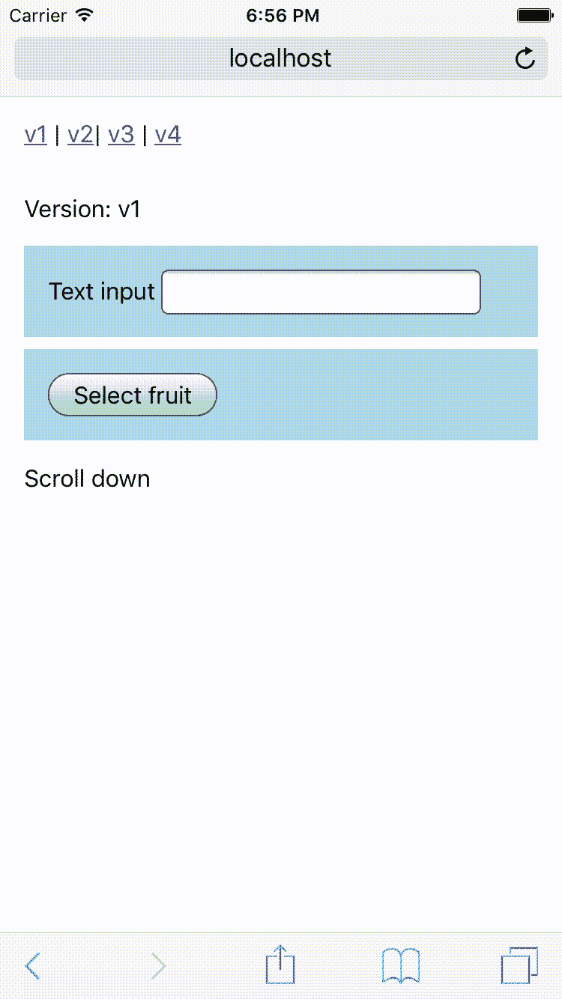
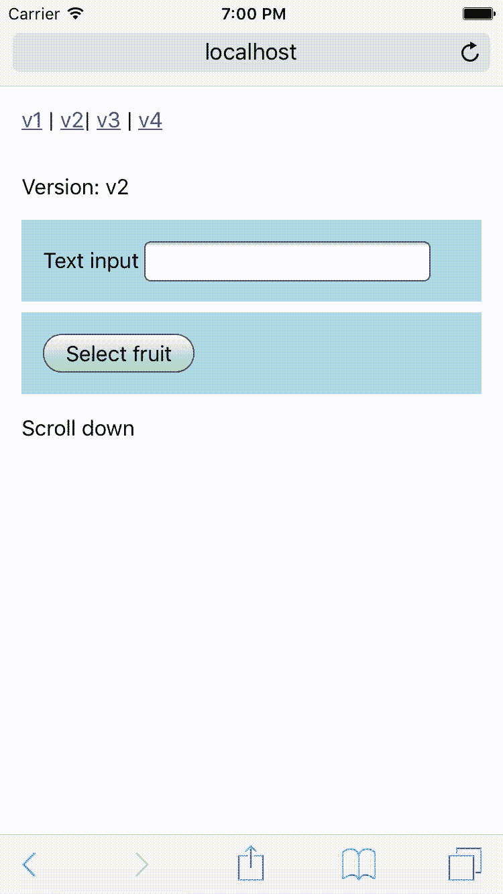
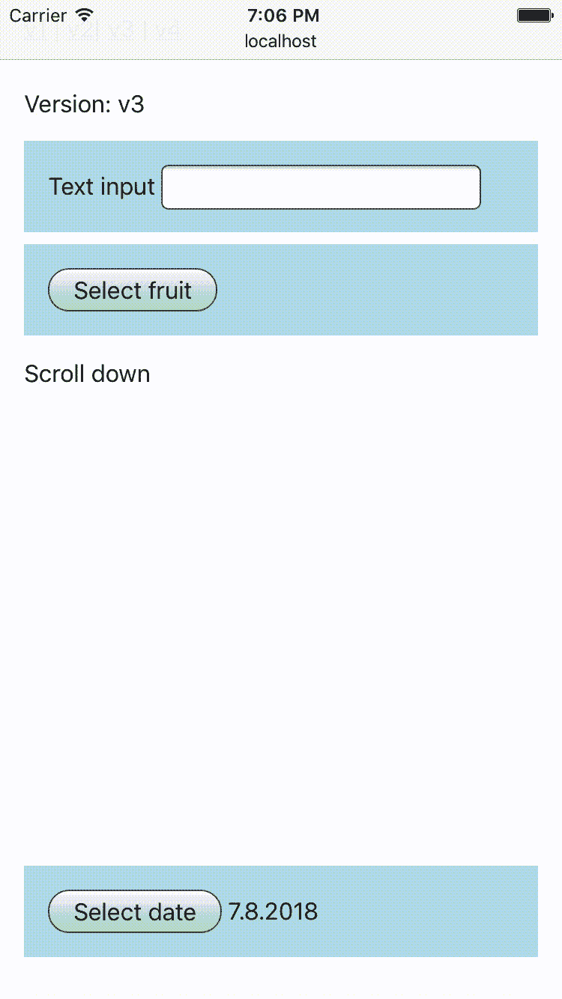
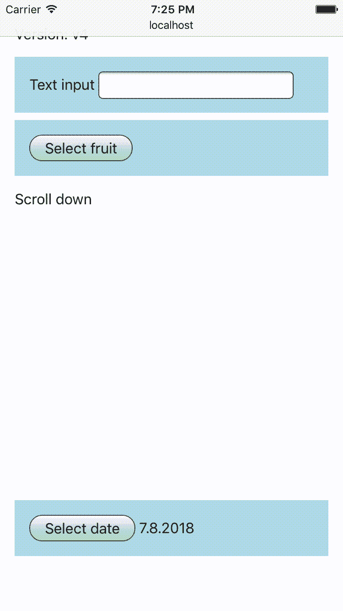

# 全屏移动模式。能有多难？

> 原文：<https://dev.to/stereobooster/fullscreen-mobile-modal-how-hard-can-it-be-7mj>

假设您需要实现一个移动友好的表单，除了传统的输入，您还需要实现全屏无限日历和全屏组合框。先说“全屏”。你认为会有多难？应该不难——用 z 索引和固定位置的全屏 div 就行了。对吗？我也是这么想的。

## 尝试次数 1

[在线示例](https://stereobooster.github.io/react-modal-experiment/)

让我们用`div`来覆盖整个屏幕

```
.FullScreenOne {
  position: fixed;
  bottom: 0;
  left: 0;
  right: 0;
  top: 0;
  z-index: 1;
  background: #fff;
} 
```

Enter fullscreen mode Exit fullscreen mode

它可以工作，除了用户可以使用`Tab`(或者 iOS 中的`⌃`和`⌄`)将光标移出模式。

[T2】](https://res.cloudinary.com/practicaldev/image/fetch/s--Zregfy2N--/c_limit%2Cf_auto%2Cfl_progressive%2Cq_66%2Cw_880/https://thepracticaldev.s3.amazonaws.com/i/dbt6moogpv3kqup2k0we.gif)

## 尝试次数 2

[在线示例](https://stereobooster.github.io/react-modal-experiment/v2/)

使用[到达`Dialog`](https://ui.reach.tech/dialog) (除了之前的解决方案)。`Dialog`将在`document.body`根的所有节点上设置`aria-hidden`，除了当前活动的对话。这将虚拟光标限制在对话框中。

~~边注:我试过[反应-对焦-锁定](https://github.com/theKashey/react-focus-lock)，但是在 iOS 里不管用(我是说对于`⌃`和`⌄`)。~~

除了当用户想要滚动模态的内容时，它是有效的，但是相反，他们将滚动模态后面的内容。

[T2】](https://res.cloudinary.com/practicaldev/image/fetch/s---GraV6gC--/c_limit%2Cf_auto%2Cfl_progressive%2Cq_66%2Cw_880/https://thepracticaldev.s3.amazonaws.com/i/4muntjp2tbz2t3ytny8m.gif)

## 尝试次数 3

[在线示例](https://stereobooster.github.io/react-modal-experiment/v3/)

使用 [`ScrollLocky`](https://github.com/theKashey/react-scroll-locky) (除了之前的方案)。在正文的`react-locky`和`position: relative`的帮助下，`ScrollLocky`阻止与页面其余部分的任何交互。

它的工作，除了当用户向下滚动和移动 Safari get 的底部 chrome 被隐藏，但后来有可能触发底部 chrome 的出现和模态的一部分将被隐藏。

[T2】](https://res.cloudinary.com/practicaldev/image/fetch/s--LyoP9ETy--/c_limit%2Cf_auto%2Cfl_progressive%2Cq_66%2Cw_880/https://thepracticaldev.s3.amazonaws.com/i/p9r323f5k3l3oeqx9m21.gif)

## 尝试次数 4

[在线示例](https://stereobooster.github.io/react-modal-experiment/v4/)

使用 [`mobile-safari-fullscreen`](https://github.com/stereobooster/mobile-safari-fullscreen) (除了之前的方案)。当打开模式时，它总是强制显示浏览器 chrome 的底部。

[T2】](https://res.cloudinary.com/practicaldev/image/fetch/s--1wRNRNz7--/c_limit%2Cf_auto%2Cfl_progressive%2Cq_66%2Cw_880/https://thepracticaldev.s3.amazonaws.com/i/3okfqyjq22n4wkk4dxqq.gif)

旁注:`WindowSize`可以代替`mobile-safari-fullscreen`。我会说这是首选的解决方案，这个演示更多地是为了展示有多少边缘情况是可能的。

```
<WindowSize>
  {({ height }) => (
    <ul style={{ height }}>
      <li />
    </ul>
  )}
</WindowSize> 
```

Enter fullscreen mode Exit fullscreen mode

## 结论

这种小细节使得前端开发既困难又有趣。如果你喜欢这篇文章，请阅读我关于网络图像 UX 的文章。

**PS**T3】不同的浏览器有不同的行为焦点。最引人注目的是移动 Safari，它不允许关注链接和按钮`¯\_(ツ)_/¯`。

查看[这个 GitHub 报告](https://github.com/stereobooster/react-modal-experiment)获得这篇文章的完整代码。

在 [twitter](https://twitter.com/stereobooster) 和 [github](https://github.com/stereobooster) 关注我。