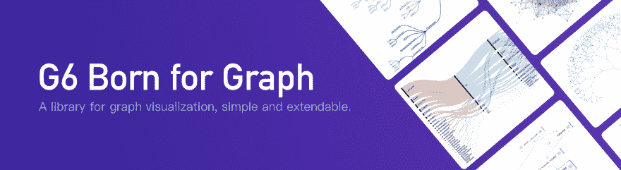
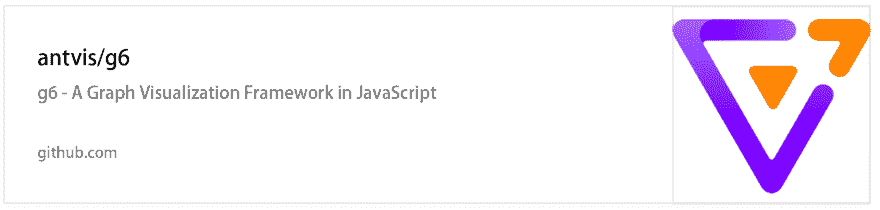
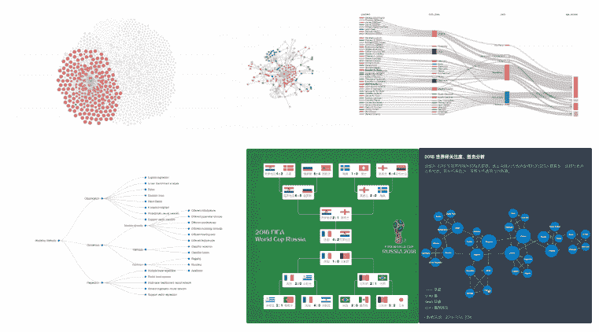

# G6，一个图形可视化框架

> 原文：<https://dev.to/antv36700460/g6-a-graph-vis-framework-4cda>

[T2】](https://res.cloudinary.com/practicaldev/image/fetch/s--YSm3ch4Z--/c_limit%2Cf_auto%2Cfl_progressive%2Cq_auto%2Cw_880/https://cdn.nlark.com/yuque/0/2018/png/156681/1535972865654-8c050fb6-a158-4e77-b547-6ffc3f0d4c18.png)

> 担心复杂的关系数据？难以理解嵌套关系？
> G6，图形可视化库，带你畅游图形数据，享受视觉盛宴。

G6 是阿里巴巴集团旗下蚂蚁金服旗下蚂蚁金服出品的 MIT 授权下的**开源** JavaScript 库。到现在为止，G6 已经支持了阿里巴巴内外上千个业务系统。我们希望 G6 可以帮助用户获得对关系数据世界的**洞察力**。

[Github](https://github.com/antvis/g6) | [文档](https://www.yuque.com/antv/g6-en)

[
T3】](https://github.com/antvis/g6)

# 名字

*   G6 的 g '来源于 Graphic 和 Graph，说明我们的目的是基于图形的图形可视化。
*   G6 的' 6 '来自'[六度分隔【T1 ')，表达了我们对关系数据的热情。](https://en.wikipedia.org/wiki/Six_degrees_of_separation)

[T2】](https://res.cloudinary.com/practicaldev/image/fetch/s--xDb96iSp--/c_limit%2Cf_auto%2Cfl_progressive%2Cq_auto%2Cw_880/https://gw.alipayobjects.com/zos/rmsportal/yYxasmMnaTqDLaycIxgP.png)

# 功能

#### 丰富、优雅、可重复使用的图形可视化解决方案

我们在 G6 中设计了丰富的有用特性以及可视化解决方案的视觉效果。

#### 可定制和扩展

G6 允许用户自由定制自己的图形。插件机制使 G6 可扩展。

[T2】](https://res.cloudinary.com/practicaldev/image/fetch/s--RPhUU_jO--/c_limit%2Cf_auto%2Cfl_progressive%2Cq_auto%2Cw_880/https://gw.alipayobjects.com/zos/rmsportal/dpeXKbaJcQjgsEmbzwCC.png)

# 基于 G6 的库

*   基于 G6 的可视化框架。
*   [GG-editor](http://ggeditor.com/) 伟大的图形编辑器，G6 的一个 React 包。

# 信任者

[T2】](https://res.cloudinary.com/practicaldev/image/fetch/s--naZFOfDw--/c_limit%2Cf_auto%2Cfl_progressive%2Cq_auto%2Cw_880/https://cdn.nlark.com/yuque/0/2018/png/156681/1535981624657-26a4be39-316f-48ad-be91-5dd9889c0808.png)

# 未来

我们正在为图形分析器准备更多的通用解决方案和技术。我们将永远保持对图形可视化的热情，跟随最先进的技术，并继续创新。这是一条很长的路，还有很长的路要走，我们在学习，在进步，在成长，在等你。

如果你在 G6 上遇到任何问题，请随时在 Github 上创建问题。

# 链接

*   [G6 单据](https://www.yuque.com/antv/g6-en)
*   [G6 Github 库](https://github.com/antvis/g6)
*   [G6](https://antv.alipay.com/zh-cn/g6/1.x/index.html)

[Doc 原文链接](https://www.yuque.com/antv/blog/g6-intro)