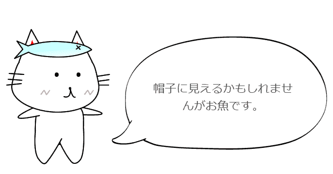

# 在 GAE+Nuxt.js+Firebase 上创建只让猫说话的服务

> 原文：<https://dev.to/dala00/gaenuxtjsfirebase-hga>

以前在 mixi APP 上做了一个叫“猫 corese”的 APP，因为发现那个素材处于放置状态很浪费，所以试着做了一个可以让猫换衣服说话并发布到 Twitter 上的简易的网络 APP。

[T2】](https://res.cloudinary.com/practicaldev/image/fetch/s--i9dCfgt9--/c_limit%2Cf_auto%2Cfl_progressive%2Cq_auto%2Cw_880/https://thepracticaldev.s3.amazonaws.com/i/vz03rmrp0k5ohnhl02e2.png)

[猫先生谈话](https://nekoko.alphabrend.com/)

不需要登录就可以马上使用。

## 

### 谷歌应用引擎

虽然这种 Web 服务没有什么意义，但是通过服务器端渲染( SSR )可以浏览全部页面，希望能起到一些 SEO 的效果，所以我们尝试了 Google App Engine 而不是静态托管服务。

### Nuxt.js

最近简单的 APP 应用程序是 Nuxt.js，总之很容易做很多，所以经常使用。 和前面一样，也是为了 SSR。

### 火基

因为这次是只注册并显示数据的简单的数据结构，所以使用了不需要特意准备服务器的 Firebase 的无服务器结构。

使用 Firestore 保存数据，使用 Storage 保存图像。

### 布埃菲

我在使用一个可以安装 Bulma 这种感觉柔软的设计的框架。 但是，Bulma 本身基本上只是 CSS，动作等必须自己安装，所以使用了也安装了动作部分的 Buefy。 只要加入这个就可以直接使用 Bulma 本身的 CSS，非常通用，非常方便。

## 结构

### 项目的创建

项目是使用 create-nuxt-app 创建的，并添加了 TypeScript。 是以前在下述总结的方法。

[将 Nuxt.js+Express 的项目 TypeScript 化](https://crieit.net/posts/Nuxt-js-Express-TypeScript)

### Store 的利用

将动物和替换选项保留为 store state，以便不仅在选定的组件中使用，还在其他地方使用，例如下载图像或创建共享图像。

Store 看了 Nuxt.js 的手册后非常容易理解，以下文章以前也进行了总结。

[Vuex 的 Store 一看到 Nuxt.js 的手册就能马上理解](https://crieit.net/posts/Vuex-Store-Nuxt)

### 图像的制作

图片是用 html2canvas 制作的。 因为这次没有服务器，所以用这个在浏览器上制作图像。 `left: -2000px`在整理好的 div 上做这样那样的配置，只是用 html2canvas 进行变换。

作为一点注意事项，在默认行为下，canvas 的比例似乎会根据终端的大小而变化，因此按如下所示等倍制作。

```
 const canvas = await html2canvas(this.$refs.canvas, { scale: 1 }) 
```

Enter fullscreen mode Exit fullscreen mode

转换为 Blob 的方法有以下各种信息。

[发送用 Canvas 画的图像并保存在服务器上- Qiita](https://qiita.com/0829/items/a8c98c8f53b2e821ac94)

好像还有 canvas.toBlob 呢。 希望快点在所有的浏览器上实现。

另外，在 Storage 的注册如手册所示。 文件名为登录的消息数据的 ID 名称。

```
 const ref = firebase.storage().ref()
    const imageRef = ref.child(`images/${messageId}.png`)
    const imageSnapshot = await imageRef.put(blob) 
```

Enter fullscreen mode Exit fullscreen mode

也保留图像的 URL。 根据调查的信息，好像不使用上述的 imageRef，而必须再次使用从 Storage 端取来的东西。

```
 const ref = firebase.storage().ref()
    const imageRef = ref.child(`images/${messageId}.png`)
    const url = imageRef.getDownloadURL() 
```

Enter fullscreen mode Exit fullscreen mode

把这个 URL 也保存在消息数据里就完成了。

之后，只要将在显示画面上输入的消息和图像的 URL 放入元标签中，就可以通过共享该详细页面的 URL 在推特上进行共享。

对于 Nuxt.js，请按如下方式在页面组件中设置元标记:

```
 head() {
    const title = this.getTitle() + ' - ネココさんトーク'
    const description = `${this.categoryExplanation}:${this.message.message}`
    return {
      title,
      meta: [
        {
          name: 'description',
          content: description
        },
        { name: 'og:title', content: title },
        {
          property: 'og:image',
          content: this.message.imageUrl
        },
        {
          property: 'og:description',
          content: description
        },
        {
          name: 'twitter:card',
          content: 'summary_large_image'
        },
        {
          name: 'twitter:image',
          content: this.message.imageUrl
        }
      ]
    }
  } 
```

Enter fullscreen mode Exit fullscreen mode

为了 SSR，数据用 asyncData 保存吧。

```
 async asyncData({ params }) {
    const messageRef = messagesCollection.doc(params.id)
    const message = await messageRef.get()
    const messageData: any = message.data()
    messageData.id = message.id
    return {
      message: messageData
    }
  } 
```

Enter fullscreen mode Exit fullscreen mode

在共享画面上创建 URL 的感觉如下。

```
 tweetUrl() {
    const url = encodeURIComponent(
      process.env.URL + `/messages/${this.message.id}`
    )
    const text = encodeURIComponent(this.categoryExplanation)
    const hashtags = encodeURIComponent('ネココさんトーク')
    return `https://twitter.com/share?url=${url}&text=${text}&hashtags=${hashtags}`
  } 
```

Enter fullscreen mode Exit fullscreen mode

### 部署

以前在下面对 Google App Engine 的部署进行了说明。

[在 App Engine 的标准环境下使用 Nuxt 免费 SSR](https://crieit.net/posts/App-Engine-Nuxt-SSR)

我觉得 Zeit 的 Now 也可以。 GAE 的差异在于 Firebase 的计划发生了变化(可以使用免费框)，Zeit 有免费的部署次数限制，请选择合适的方法。

### 再加上正式演出

Google Analytics 的导入只是安装并设定以下内容。 非常简单。

[nuxt-社区/分析-模块:谷歌分析模块](https://github.com/nuxt-community/analytics-module)

## 总结

简单地介绍了一下制作方法。 有兴趣的人请一定要试着做点什么看看！

如果有不明白的地方，如果能用 Twitter 等询问的话，我会在可能的范围内回答。