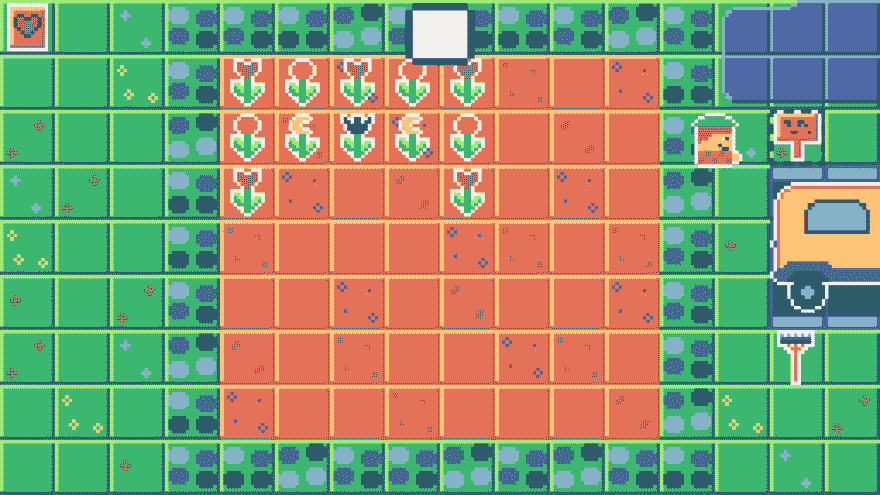

# 游戏关 2018 (7)

> 原文：<https://dev.to/bigaston/game-off-2018-7-ijn>

嗨！一个新的奇妙的开发博客来了！(耶！今天(也是最后一天)，我在做混合动力车(添加所有的花)。我在一个牌子上加了关于混合动力车的信息。我加了一个耙子来结束游戏。

[T2】](https://res.cloudinary.com/practicaldev/image/fetch/s--6nNL-IwI--/c_limit%2Cf_auto%2Cfl_progressive%2Cq_66%2Cw_880/https://thepracticaldev.s3.amazonaws.com/i/6l76e5oqvlio5lwt3luk.gif)

另一个小功能是丰富的不和谐的存在集成！这不是很有用，但它很有趣，我喜欢这个！

[T2】](https://res.cloudinary.com/practicaldev/image/fetch/s--aSdZCXQD--/c_limit%2Cf_auto%2Cfl_progressive%2Cq_auto%2Cw_880/https://thepracticaldev.s3.amazonaws.com/i/0pvuyc37q6x3dh57sllz.PNG)

这个游戏现在有名字了！是**混合动力**！我不确定，所以如果你有更好的名字，请发给我！

都是为了现在！感谢您的反馈和关注我的发展！

祝您愉快！