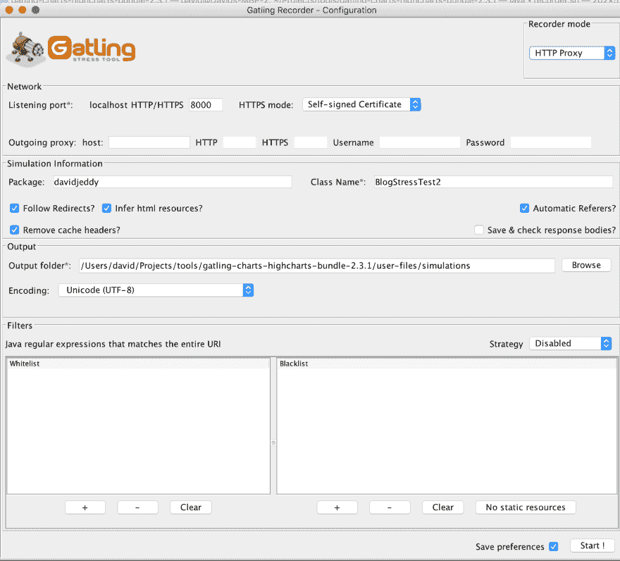
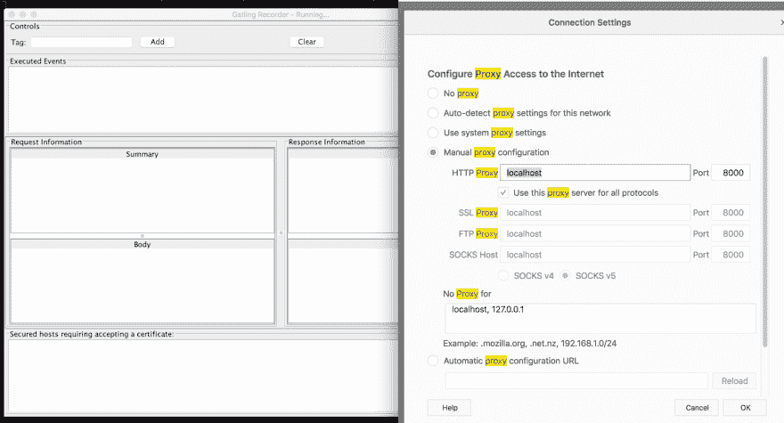
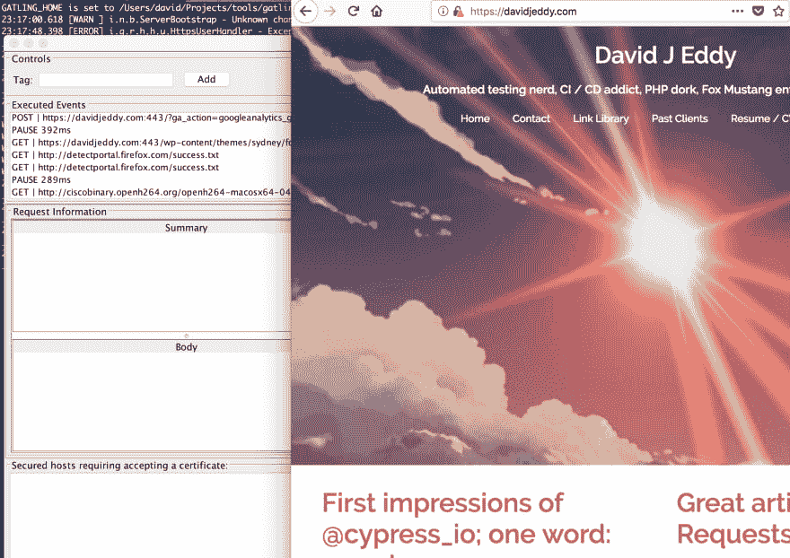
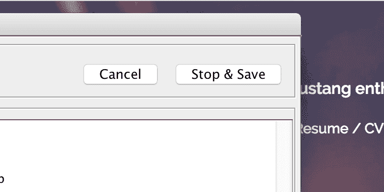
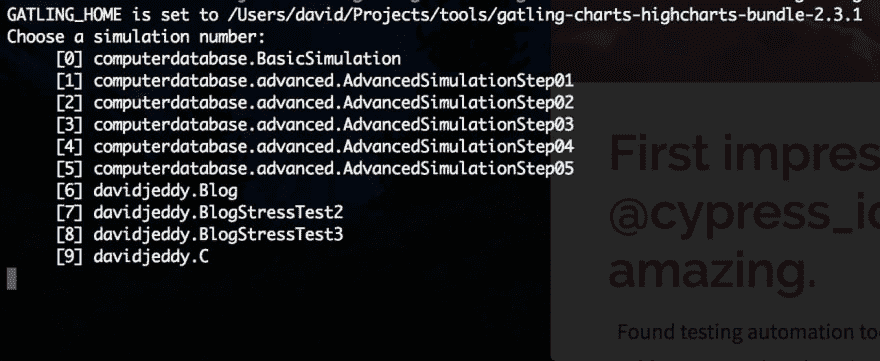
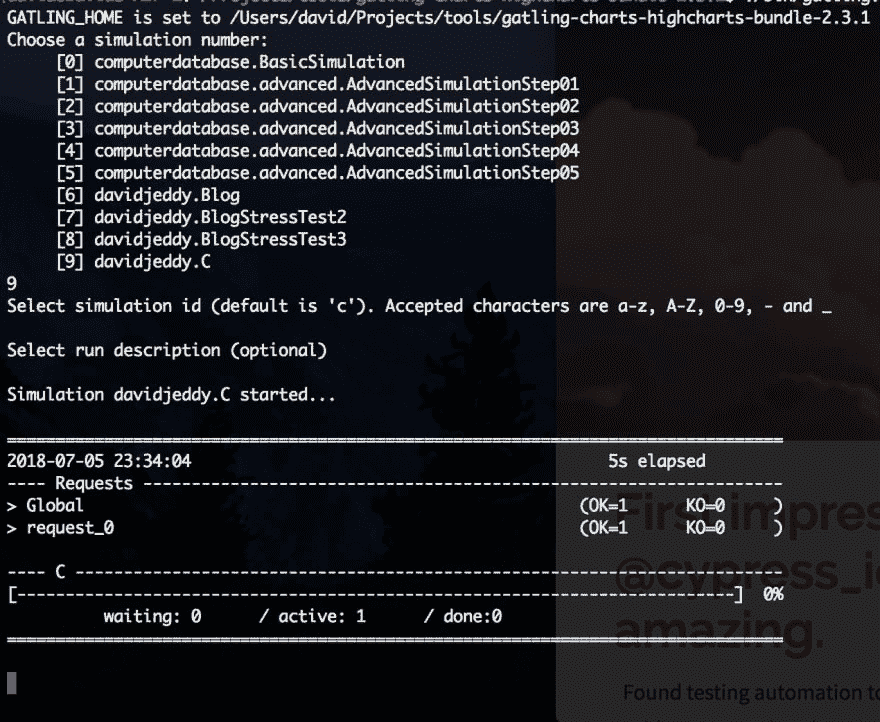
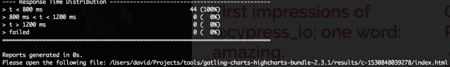
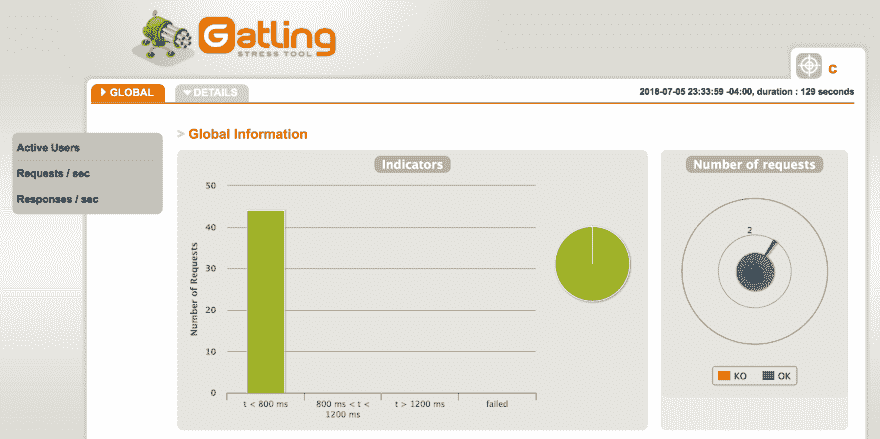

# Gatling，一个与众不同的负载测试工具。

> 原文：<https://dev.to/david_j_eddy/gatling-a-load-testing-tool-with-a-difference-5foc>

*Cross 发布自[我的博客](https://davidjeddy.com)。

**一点背景。**

负载测试工具通常会针对您选择的目标主机发送大量请求。这些工具用于压力测试一个服务在变得不可接受的慢、无响应或者甚至使服务崩溃之前可以处理多少请求。所以能够回答`how many users a website/app/service handle before the [slow down causes users to turn away](https://www.nytimes.com/2012/03/01/technology/impatient-web-users-flee-slow-loading-sites.html)`这个问题是一个非常非常重要的问题。负载测试工具有多种机制来计算答案。在这里，我评估了[加特林. io](https://gatling.io/) 的产品。

是什么让加特林与众不同？

Gatling 允许用户(开发者/操作者)在选择的浏览器中记录一系列动作。按照真实用户的速度，多个步骤、表单输入、重新加载；所有这些都可以完成，因为测试用例是由真实的用户在真实的浏览器中创建的。用例可以通过虚拟用户分配来分组和执行，也可以单独执行。对于我们中更倾向于技术的人来说，加特林也支持类似 Scala 的领域特定语言(DSL)。这种语言允许对如何执行测试进行近乎无限的控制。非常适合在基于云的大型系统中测试自动扩展策略和负载平衡。最后，如果你有预算，加特林提供了一个“T1”前线“T2”服务。一个 SaaS 娱乐城。

奖励:加特林还可以使用一些不同的图表系统来渲染输出，我只评估了高图表提供的可视化效果。

**固执己见的 15 分钟速成班**

对于这个演示，我们将像我一样逐步完成这个过程，以创建并执行一个基本的测试用例。[快速入门指南](https://gatling.io/docs/current/quickstart/)有更多细节。这是我快速开始的步骤。

**先决条件** : [Java 8](http://www.oracle.com/technetwork/java/javase/downloads/jdk8-downloads-2133151.html) ，一个终端/命令提示符，当前版本的 [Firefox](https://www.mozilla.org/en-US/firefox/new/) 。

安装

下载项目，在编写 [2.3.1 的时候](https://repo1.maven.org/maven2/io/gatling/highcharts/gatling-charts-highcharts-bundle/2.3.1/gatling-charts-highcharts-bundle-2.3.1-bundle.zip)是当前的。

解压文件，我做成了`~/Projects/tools/gatling-charts-highcharts-bundle-2.3.1`

进入新目录。

记录

执行。/bin.recorder.sh，等待，几分钟后将显示一个 Java 应用程序窗口。这是加特林的主 UI。

为`Package`输入一个值(想想`vendor`，然后提供一个类名值。

[T2】](https://res.cloudinary.com/practicaldev/image/fetch/s--bOGKRv8_--/c_limit%2Cf_auto%2Cfl_progressive%2Cq_auto%2Cw_880/https://davidjeddy.com/wp-content/uploads/2018/07/Gatling-Main-UI.png)

我查了一下`Save preferences`；终于打到`Start!`。不一会儿，记录器窗口出现了。暂时不要管它。

接下来，我启动了 Firefox，并将代理设置为对所有请求使用 localhost:8000。

[T2】](https://res.cloudinary.com/practicaldev/image/fetch/s--ZXm43KDr--/c_limit%2Cf_auto%2Cfl_progressive%2Cq_auto%2Cw_880/https://davidjeddy.com/wp-content/uploads/2018/07/Firefox-Proxy-2400x1296.png)

访问我选择的网站(我用了[这个网站](http://davidjeddy.com/))。你应该在记录器的`Executed Events`面板上看到一些输出。这很好，非常好。

我在网站上走来走去，记录了一些其他的事件。

[T2】](https://res.cloudinary.com/practicaldev/image/fetch/s--cZy4kf0u--/c_limit%2Cf_auto%2Cfl_progressive%2Cq_auto%2Cw_880/https://davidjeddy.com/wp-content/uploads/2018/07/Gatling-Recording-User-Events.png)

完成后，我按下`stop & save`按钮，窗口关闭。

[T2】](https://res.cloudinary.com/practicaldev/image/fetch/s--FzWvepv9--/c_limit%2Cf_auto%2Cfl_progressive%2Cq_auto%2Cw_880/https://davidjeddy.com/wp-content/uploads/2018/07/Gatling-Recorder-Stop.png)

当我完成了 UI，我也关闭了主窗口。

执行步骤

回到终端，执行记录的过程出人意料地简单。执行`./bin/gatling.sh`产生预期的包/类名选项。将这些与许多其他工具中的 suite/test 联系起来考虑。

[T2】](https://res.cloudinary.com/practicaldev/image/fetch/s--AGP2bfFR--/c_limit%2Cf_auto%2Cfl_progressive%2Cq_auto%2Cw_880/https://davidjeddy.com/wp-content/uploads/2018/07/Gatling-execute-1.png)

选择正确的值并按几次 enter 键，我看到执行步骤正在运行。

测试时间将与原始记录的过程一样长，甚至更长。步骤之间的等待、资源加载、点击等等。

[T2】](https://res.cloudinary.com/practicaldev/image/fetch/s--DHtsc5D---/c_limit%2Cf_auto%2Cfl_progressive%2Cq_auto%2Cw_880/https://davidjeddy.com/wp-content/uploads/2018/07/Gatling-execute-2.png)

最后，Gatling 提供了一个本地 URL，可以在带有漂亮图形的浏览器中查看结果。

[T2】](https://res.cloudinary.com/practicaldev/image/fetch/s--SgcAvRJ_--/c_limit%2Cf_auto%2Cfl_progressive%2Cq_auto%2Cw_880/https://davidjeddy.com/wp-content/uploads/2018/07/Gatling-execute-3.png)

与许多其他负载测试工具相比，这是非常好的部分。

[T2】](https://res.cloudinary.com/practicaldev/image/fetch/s--zxpnpSHd--/c_limit%2Cf_auto%2Cfl_progressive%2Cq_auto%2Cw_880/https://davidjeddy.com/wp-content/uploads/2018/07/Gatling-Graphs.png)

**结论**

作为一个负载测试工具，Gatling 非常简单；只需确保将 Java 8 JDK 设置为 JAVA_HOME env 变量。凭借记录器和高度通用的 DSL 脚本能力，以及直接的 CI/CD 集成，甚至是一线的 SaaS 产品，Gatling 成为运营/QA/测试流程中负载测试步骤的有力竞争者。

**附录**

加特林只适用于 Java 8 JDK。您必须将系统的 JAVA_HOME 全局变量设置为 JDK 8 java bin 目录。否则，您会得到一个关于无法找到测试类的神秘消息。

**编辑**

加特林的保罗·亨利看到了这篇文章并给我发了邮件。前线服务是内部服务，而不是 SaaS。谢谢你的纠正保罗-亨利！