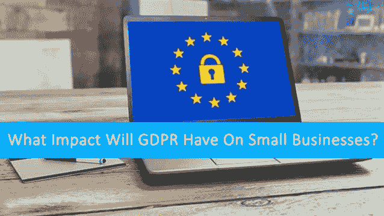

# GDPR 也影响小企业？GDPR 会对小企业产生什么影响？

> 原文：<https://dev.to/wenso_smith/gdpr-affects-small-businesses-too-what-impact-will-gdpr-have-on-small-businesses-57kd>

欧洲各地的公司都在争先恐后地按照新的数据保护指南提供的指导方针开展工作。然而，关注点将是看它如何影响中小型工业。

[T2】](https://res.cloudinary.com/practicaldev/image/fetch/s--CkxNeQnt--/c_limit%2Cf_auto%2Cfl_progressive%2Cq_auto%2Cw_880/https://cdn-images-1.medium.com/max/638/0%2AZQCQ4zGgfriNkXmc.jpg)

我们知道**一般数据保护条例将于 2018 年 5 月 25 日起适用于欧盟所有国家，欧盟居民正忙于讨论组织想要收集什么样的个人数据以及他们将如何利用这些数据。**

 **通过对 GDPR 要求的要点进行完整的概述，你将了解到这些公司需要通过选择加入来获得明确的同意才能使用公共数据，并且他们必须提供他们需要这些数据的目的。如果人们希望将他们的数据用于规定的目的，公司有责任通知他们。每次他们使用这些数据时，他们都需要获得同意，如果违反了给定的流程，将会受到严厉的处罚，这一次的规则将会非常严格。

我倒要看看 GDPR 实施的**将如何影响中小型公司。基本上，欧洲通用数据保护法规是围绕两个关键原则建立的。**

 **为公民和居民使用个人数据提供更多控制

通过简化针对国际企业的法规，统一整个欧盟(EU)的法规。

在详细讨论 **GDPR 对中小企业的影响**之前，需要记住的是,《GDPR 准则》适用于所有使用欧盟公民个人数据的企业，这意味着即使是欧盟以外的公司也将受其管辖。

为中小型企业列出了一份详细的清单:

1.  精通您的数据，因为您需要展示对个人数据类型的理解
2.  获得处理个人数据的明确同意，因为根据 GDPR，这些活动将变得更加复杂，因为批准需要清晰、具体和明确。
3.  要特别注意你的安全措施和政策，因为所有这些都应该是 GDPR。
4.  培训您的员工，并在 72 小时内报告严重违规行为。确保您的所有员工都清楚地了解导致个人数据泄露和任何危险信号的因素。
5.  讨论并决定是否有必要聘用一名数据保护官(DPO)。通常所有的小企业都将被豁免。不过，如果你公司的主要活动涉及大规模的“定期或系统的”数据主体监控，你将被要求雇佣一名 DPO。
6.  对你的供应链进行尽职调查。

*最初发表于*[*【www.wenso.co.uk】*](http://www.wenso.co.uk/news/gdpr-affects-small-businesses-impact-will-gdpr-small-businesses/)*。*****