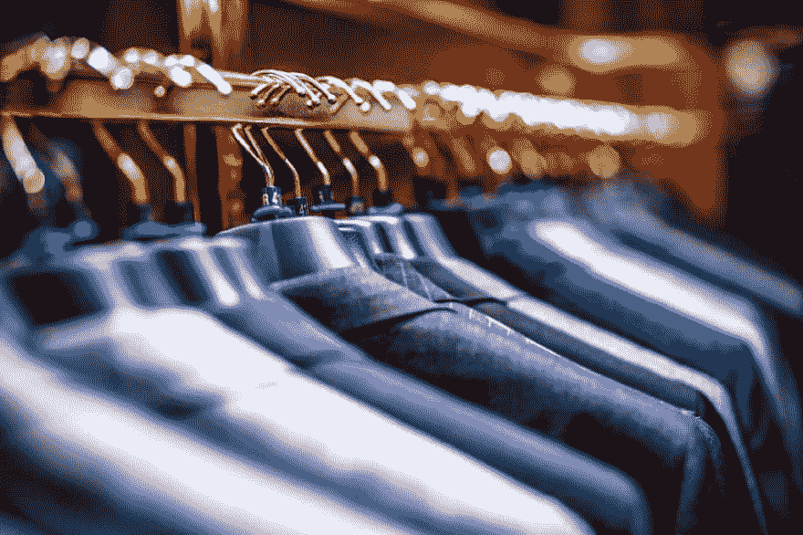
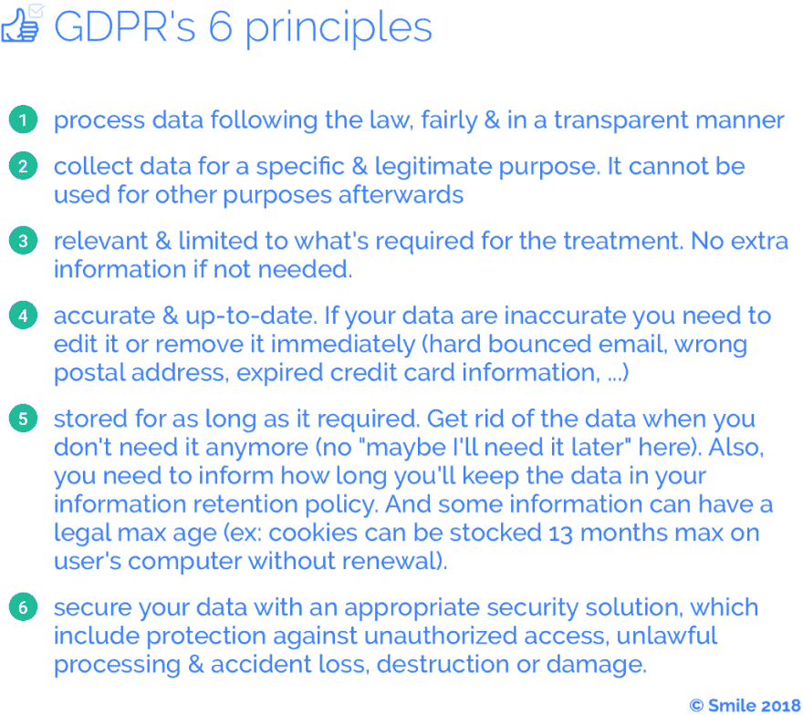
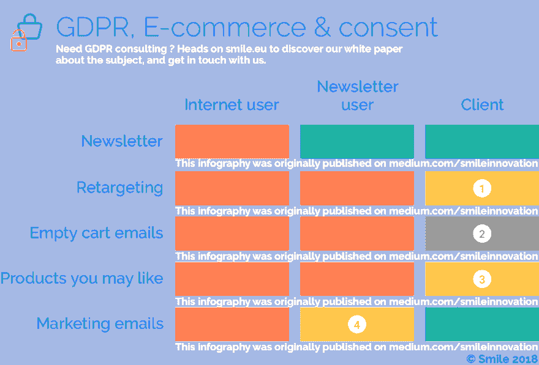

# GDPR 和电子商务

> 原文：<https://dev.to/clawfire/gdpr-e-commerce-5e7d>

<figure> 

<figcaption>【衣柜里衣架上的一套正装】由[伊戈尔·奥夫谢尼科夫](https://unsplash.com/@igorovsyannykov?utm_source=medium&utm_medium=referral)于 [Unsplash](https://unsplash.com?utm_source=medium&utm_medium=referral)</figcaption>

</figure>

在开始之前，也许我们都不知道 GDPR(真的吗？你是那 0.1%没有收到大量邮件的人的一部分)以及它给最终用户带来了什么新的权利。

> **通用数据保护条例** ( **GDPR** )(欧盟)2016/679 是欧盟法律中关于[欧盟](https://en.wikipedia.org/wiki/European_Union)(欧盟)和[欧洲经济区](https://en.wikipedia.org/wiki/European_Economic_Area) (EEA)内所有个人的数据保护和隐私的规定。它还解决了欧盟和欧洲经济区以外的个人数据输出问题。GDPR 的主要目标是让公民和居民控制他们的个人数据，并通过统一欧盟内部的法规来简化国际业务的监管环境。
> 
> *   [关于 GDP 的维基百科文章](https://en.wikipedia.org/wiki/General_Data_Protection_Regulation)

[T2】](https://res.cloudinary.com/practicaldev/image/fetch/s--ghIwpnNe--/c_limit%2Cf_auto%2Cfl_progressive%2Cq_auto%2Cw_880/https://cdn-images-1.medium.com/max/1024/1%2Aw6WFkHzghSf3Jex2gPXS3g.png)

因此，基本上 GDPR 州的一些规则，适用于所有欧盟和欧洲经济区，但也适用于外部，因为这些规则需要任何公司谁处理欧盟和 EAA 人民的数据遵守。这些人要么是客户、员工、承包商、访客、潜在客户……

[T2】](https://res.cloudinary.com/practicaldev/image/fetch/s--Eshwngms--/c_limit%2Cf_auto%2Cfl_progressive%2Cq_auto%2Cw_880/https://cdn-images-1.medium.com/max/1024/1%2AKJ8myFi-7R7STr5-7x4wlA.png)

我们可以将其转化为更简单的陈述:

1.  未经他们的同意，您不能与第三方提供商、合作伙伴和赞助商共享您客户的数据。
2.  您不能将任何人添加到您的营销列表中
3.  你必须在纸上写下一些计划，说明谁有权访问客户的数据，为什么、如何以及如何确保访问被记录下来，并在员工离开时可以撤销。
4.  您需要能够向客户提供他们所有的数据(以一种通用的可移植格式)，按需删除、编辑或匿名。

继 GDPR 之后，电子隐私也在演进，以适应 GDPR 需要的新政策，并增加对用户的保护。例如，我们已经看到许多服务需要用户接受他们的新政策。幸运的是，对于用户来说，这是非法的。

> [……]获取服务和功能不得以用户同意处理个人数据或处理与最终用户终端设备相关或由最终用户终端设备处理的信息为条件，这意味着应明确禁止 cookie 墙。

[阅读完整声明](https://edpb.europa.eu/sites/edpb/files/files/file1/edpb_statement_on_eprivacy_en.pdf) 🇺🇸

[T2】](https://res.cloudinary.com/practicaldev/image/fetch/s--mhL71c60--/c_limit%2Cf_auto%2Cfl_progressive%2Cq_auto%2Cw_880/https://cdn-images-1.medium.com/max/1024/1%2Aq6gw2AbepVhhYxljwYJCKw.png)

当收集同意时，有两个主要的概念要记住(因为你需要，为了使用你的用户个人信息):知情和明确。

这意味着你需要清楚地告知你的访问者和客户你将收集哪些数据，你将保留多长时间，他们如何访问/编辑/导出或要求完全擦除。

为了帮助你更好地理解 GDPR 法案(或之前的法律)对在线零售的影响，我们做了一个小图表。你可以看到你不能做什么(橙色)，你可以做什么(黄色)但有先决条件，你绝对可以做什么(绿色)。

<figure> 

<figcaption>电子商务营销的该做与不该做追随 GDPR。</figcaption>

</figure>

1.  *只有在您征得客户明确同意接收此类电子邮件的情况下，才允许重定向*。可以通过邮件或广告平台进行重定向，但技术方案对需要征得用户同意没有影响。
2.  这是一个棘手的问题，我对此毫无头绪。当然，空购物车电子邮件是营销电子邮件，但它也基于终端用户的行为，并迫使他完成他暂停的交易。即使这是一种众所周知的销售技巧，有时还会有优惠券作为激励，但在专家做出更多澄清之前，我不会建议继续使用它。
3.  *您可能喜欢的产品*如果您只是使用一些不是基于用户行为的交叉销售或升级销售功能，则无需同意即可使用这些功能。
4.  如果您的简讯用户同意，他们可以向您发送营销电子邮件。否则只能针对过去的客户。

[T2】](https://res.cloudinary.com/practicaldev/image/fetch/s--6x21dXC8--/c_limit%2Cf_auto%2Cfl_progressive%2Cq_auto%2Cw_880/https://cdn-images-1.medium.com/max/1024/1%2AYlj4Z322_qIbADGxJlhohg.png)

正如我们之前看到的，邮件活动可以发送给以下人员:

1.  订阅你的邮件列表。你需要能够证明他们添加订阅它。
2.  从你这里买东西的人。它属于所谓的*软选择加入*。你需要在每封电子邮件中提供一个取消订阅的链接*。*

对于这两类人来说，没有必要打扰他们询问是否可以确认他们的订阅。对于其他人来说，…嗯。从法律上讲，你的电子邮件数据库里不应该有其他类型的人。法律已经禁止你添加给你发邮件或者给你递名片人。

[T2】](https://res.cloudinary.com/practicaldev/image/fetch/s--Whjq6Q5B--/c_limit%2Cf_auto%2Cfl_progressive%2Cq_auto%2Cw_880/https://cdn-images-1.medium.com/max/1024/1%2AK0sbgC6SXgDXdmVGIuvDDg.png)

关于您的第三方提供商，GDPR 还有另一个“问题”。由于您可能已经选择了像 Shopify 这样的 SaaS 解决方案，因此您必须执行额外的步骤以符合 GDPR 标准:

1.  你必须确保你选择的供应商是 GDPR 合规的，因为你是对此负责的人。
2.  你需要确保提供商将在数据操作方面为你提供法律要求的所有可能性(将你拥有的所有数据发送给用户，删除所有这些数据……)。
3.  在数据丢失/泄露的情况下，您将无法躲在第三方解决方案提供商的背后。这主要不是 GDPR 的错，而是你的提供商可能已经发给你并要求你签字的新附录(通常是一份 D.P.A:数据处理协议)。所以要小心细纹。

[GDPR 耻辱堂](https://gdprhallofshame.com/)

[T2】](https://res.cloudinary.com/practicaldev/image/fetch/s--aoxnLdy6--/c_limit%2Cf_auto%2Cfl_progressive%2Cq_auto%2Cw_880/https://cdn-images-1.medium.com/max/1024/1%2AViikIYptMw1_2PyoiAWiug.png)

GDPR 的主题相当广泛，我们只涉及其中的一小部分，即与在线零售业相关的部分。但是 GDPR 影响了所有的企业，无论大小，非营利组织和政府，不仅仅是他们的客户，还有他们的员工。

如果你想更进一步，这里有一个小的资源集合。

*   [GDPR 合规支持工具](https://cst.cnpd.lu/portal/) 🇺🇸，一个在线分步指南，用于自我评估您是否符合 GDPR 法规
*   [GDPR:你(和你的商场)需要了解🇺🇸的新法律](https://www.shopify.com/blog/gdpr-ecommerce)
*   [GDP 对零售业的影响──gondola](http://www.gondola.be/fr/news/retail/limpact-du-gdpr-sur-le-retail)
*   [新数据保护总条例编制指南─cnpd](https://cnpd.public.lu/fr/dossiers-thematiques/Reglement-general-sur-la-protection-des-donnees/responsabilite-accrue-des-responsables-du-traitement/guide-preparation-rgpd.html)
*   [维基百科关于 GDPR 的条目](https://en.wikipedia.org/wiki/General_Data_Protection_Regulation) 🇺🇸
*   [电子隐私条例的修订及其对保护个人通信隐私和保密性的影响](https://edpb.europa.eu/sites/edpb/files/files/file1/edpb_statement_on_eprivacy_en.pdf) 🇺🇸

感谢阅读！如果你想了解更多关于 GDPR 的信息，请不要犹豫，前往 smile.eu 。我们还出版两周一期的技术观察时事通讯，你可以在网上[看一看](https://www.getrevue.co/profile/smileinnovation) &订阅！

你可以在 [Twitter](https://twitter.com/thibaultmilan) 、 [Linkedin](https://www.linkedin.com/in/thibaultmilan/) 、[我的简讯](https://www.getrevue.co/profile/thibault) & [我的网站](http://thibaultmilan.com/)找到我。

* * *