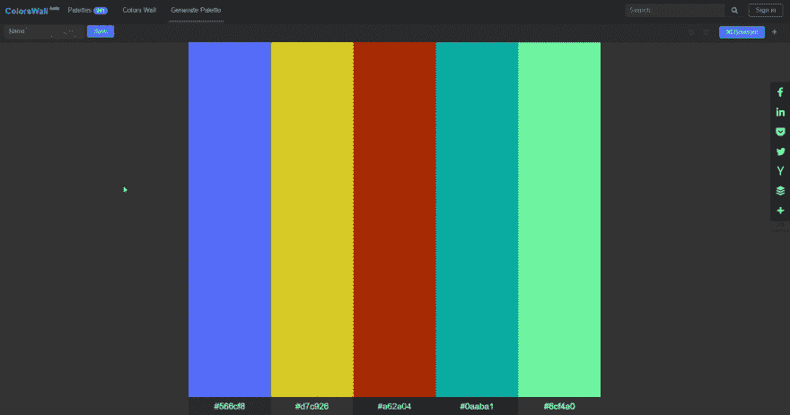

# 为你的网站生成调色板

> 原文：<https://dev.to/colorswall/generate-color-palette-for-your-website-5amn>

1.  参观 [ColorsWall](https://colorswall.com/palette/generate) 并放声歌唱。

2.  按“生成”按钮。
    [T3】](https://res.cloudinary.com/practicaldev/image/fetch/s--wbfjRahn--/c_limit%2Cf_auto%2Cfl_progressive%2Cq_66%2Cw_880/https://thepracticaldev.s3.amazonaws.com/i/28v2x0rhmcn5o1f4ulo1.gif)

3.  排序或自定义颜色。

4.  保存您的调色板。

5.  享受吧。

视频版
[https://www.youtube.com/embed/qxS66Tu0738](https://www.youtube.com/embed/qxS66Tu0738)