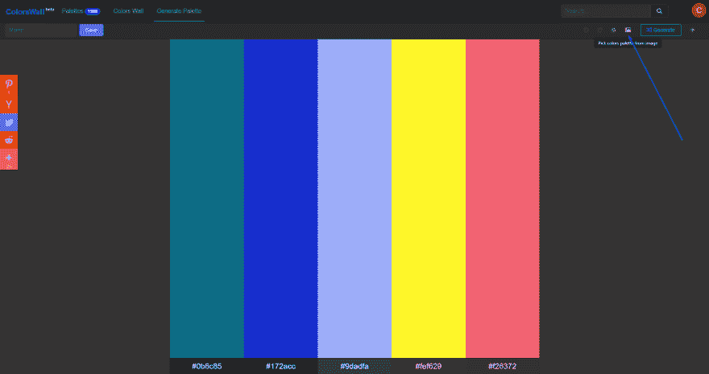
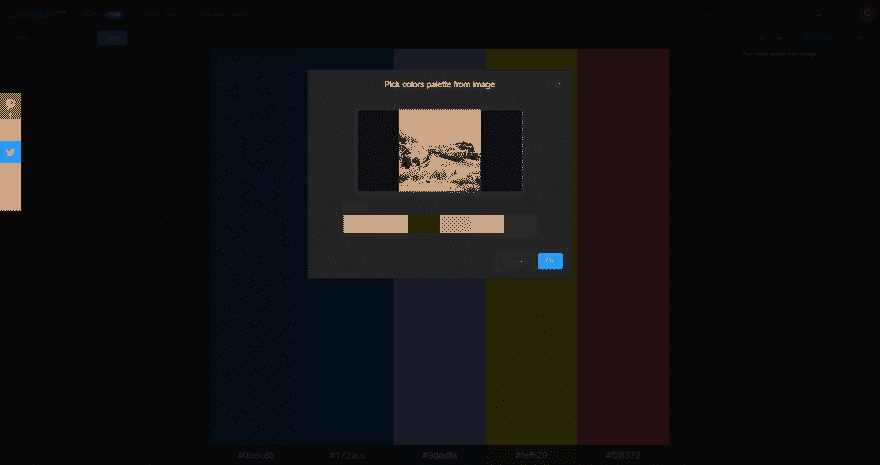
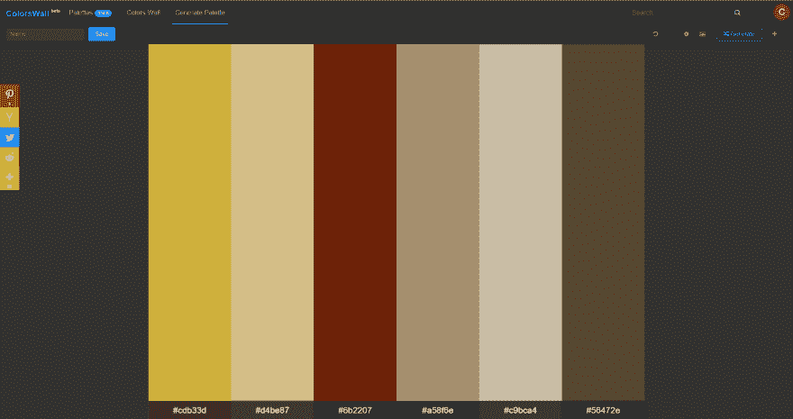

# 从图像生成调色板

> 原文：<https://dev.to/colorswall/generate-colors-palette-from-an-image-3d2e>

1.  选择并下载你最喜欢的图片(例如 [unsplash image](https://unsplash.com/photos/h1tRqt0kh8E) )。

2.  访问[颜色生成工具](https://colorswall.com/palette/generate)。

3.  点击“从图像中选择调色板”图标。
    [T3】](https://res.cloudinary.com/practicaldev/image/fetch/s--5RBGH2KG--/c_limit%2Cf_auto%2Cfl_progressive%2Cq_auto%2Cw_880/https://colorswall.cimg/from_image/from_image_icon.png)

4.  按下按钮“确定”。
    [T3】](https://res.cloudinary.com/practicaldev/image/fetch/s--ZdOkmC8O--/c_limit%2Cf_auto%2Cfl_progressive%2Cq_auto%2Cw_880/https://colorswall.cimg/from_image/from_image_with_image.png)

5.  享受你的新调色板。
    [T3】](https://res.cloudinary.com/practicaldev/image/fetch/s--gEJpGi0x--/c_limit%2Cf_auto%2Cfl_progressive%2Cq_auto%2Cw_880/https://colorswall.cimg/from_image/result.png)

视频版
[https://www.youtube.com/embed/ViNT-UZth_8](https://www.youtube.com/embed/ViNT-UZth_8)