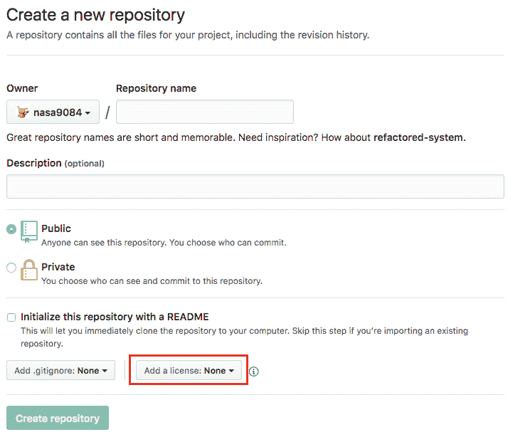

# 生成许可证文件:git-license

> 原文：<https://dev.to/nasa9084/generates-license-file-git-license-bc9>

*这篇文章最初出现在[blog . web-apps . tech](https://blog.web-apps.tech/)T3 上*

[T2】](https://res.cloudinary.com/practicaldev/image/fetch/s--vBW-S9Yl--/c_limit%2Cf_auto%2Cfl_progressive%2Cq_auto%2Cw_880/https://blog.web-apps.tech/conteimg/2018/02/git-logo.png)

当我们在 [GitHub](https://github.com) 上创建一个新的存储库时，我们可以选择一个开源许可。

[T2】](https://res.cloudinary.com/practicaldev/image/fetch/s--4jLG9zn_--/c_limit%2Cf_auto%2Cfl_progressive%2Cq_auto%2Cw_880/https://blog.web-apps.tech/conteimg/2018/02/create_new_repo.png)

我们选择一个 OSS 许可证，然后，`LICENSE`文件被放入新的存储库中。

现在，我通常使用 [`hub`](https://hub.github.com/) 命令来创建一个新的资源库。

下面我来做创建:

```
$ mkdir my_new_repository
$ cd my_new_repository
$ git init
#
# ... some code writing and commit ...
#
$ git create # git command is aliased to hub
$ git push -u origin master 
```

在这个流程中，我可以为存储库<sup>[【1】](#fn1)</sup>编写描述，设置主页<sup>[【2】](#fn2)</sup>，使存储库私有，但是我**不能**选择许可证。我可以在 GitHub 网页上选择和创建许可文件，也可以从我的其他存储库中复制，因为它的内容是固定的。

不过，我不这么做。

因此我创建了 [`git-license`](https://github.com/nasa9084/git-license) ，这是 git 的子命令。

如你所知，当你把`git-XXX`可执行文件放入你的路径时，你可以像`git XXX`一样使用`git-XXX`命令作为 git 的子命令。

`git-license`写的是围棋。

所以它的可执行文件只有一个二进制，意思是非常容易上手使用。

如果你已经有了 Go 环境，你可以用:

```
$ go get github.com/nasa9084/go-license 
```

如果没有，你可以从[发布页面](https://github.com/nasa9084/git-license/releases)为你的操作系统下载二进制文件。

该命令使用 [GitHub Licenses API](https://developer.github.com/v3/licenses/) 创建您选择的许可文件，因此需要网络连接。

如果有一些错误、评论或改进，请随时提出问题或请求。

* * *

1.  用`-d`选项 [↩︎](#fnref1)

2.  用`-h`选项 [↩︎](#fnref2)

3.  用`-p`选项 [↩︎](#fnref3)