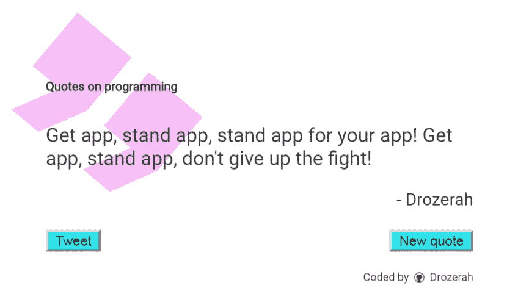

# Get App，stand app！

> 原文：<https://dev.to/drozerah/get-app-stand-app--2fhb>

[T2】](https://res.cloudinary.com/practicaldev/image/fetch/s--GsHXPQQw--/c_limit%2Cf_auto%2Cfl_progressive%2Cq_auto%2Cw_880/https://raw.githubusercontent.com/Drozerah/quotes-on-programming/f7be9d90d99e75428531067e0d01c2b6c223d76c/dist/img/getApp.png)

你好。我已经编写了一个关于编程领域的[报价生成器作为培训主题...该引擎基于一个简单的页面，通过一些 HTML5、CSS 和 Vanilla.js 实现随机返回报价……我不知道它是否一定更高效，但它在这方面工作得很好。](https://quotes-on-programming.netlify.com/)

不仅返回报价，我还添加了一个 Twitter 共享按钮，在弹出窗口中打开一个预先填充的输入文本(报价文本+标签+页面链接)，就像 originals Twitter 按钮通常使用元属性(不是在我的情况下)…我还添加了一个当用户要求新报价时报价之间的 CSS 转换。

在引擎构建过程中，我意识到接触和阅读所有的引用并深入其中是一种很好的体验，有点像编码的冥想方式……所以，我决定作为社会实验与你分享，心想:“嘿！如果其他关心此事的人也能像我一样喜欢在列表中添加引言，阅读它们，并投入其中，那就太有意义了！”

反正在它开发的实际状态下，引擎不可能真的叫“应用”，没有添加表单，一个简单的 JS 对象来存储数据，所以，到了那一步，你什么都贴不过！

请随意使用本文下面的表格来请求对你有意义的新报价，这样，我就可以将它们添加到非数据库的数据库中。您也可以使用与[相关的 GitHub 库](https://github.com/Drozerah/quotes-on-programming)直接打开 pull 请求，这也是添加报价的好方法...

[https://quotes-on-programming.netlify.com/](https://quotes-on-programming.netlify.com/)

感谢大家的阅读、分享、评论或参与！

德罗泽拉