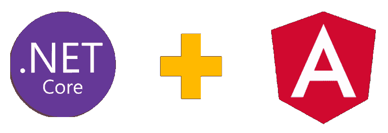

# 开始使用 Angular on。网络核心 2.1(第一部分)

> 原文：<https://dev.to/jeremylikness/get-started-with-angular-onnet-core-21-part-one-27l5>

### 上手有角。网络核心 2.1(第一部分)

#### 跨平台客户端 JavaScript SPA 框架，满足跨平台服务器端。NET 核心框架。

Angular 是开发客户端单页面应用程序(SPA)的顶级框架之一。它通过内置的声明性模板支持数据绑定和高度可配置的依赖注入(DI)框架，支持“现代 Web 开发的[3d](https://blog.jeremylikness.com/the-three-ds-of-modern-web-development-55d69fe048da)”。从《T4》开始，我就和 Angular 合作我无意在这篇文章中将其与其他框架(如 [ReactJs](https://reactjs.org/) 或 [Vuejs](https://vuejs.org/) )进行比较；目标是说明 Angular 如何与[一起工作。网芯](https://jlik.me/d90)。

[T2】](https://res.cloudinary.com/practicaldev/image/fetch/s--2OodAo9F--/c_limit%2Cf_auto%2Cfl_progressive%2Cq_auto%2Cw_880/https://cdn-images-1.medium.com/max/800/1%2A54IUNsFy3eZS3Fj1K4LkKQ.png)

。NET Core 是由[定义的 API 的跨平台和开源实现。网标](https://jlik.me/d91)。为...编写的应用程序。NET Core 能够在 Windows 机器(早在 Windows 7)、Mac OS 和几种 Linux 上运行。应用程序以多种语言编写； [C#](https://jlik.me/d92) 和 [F#](https://jlik.me/d93) 最受欢迎。编写从后端 API 到动态网站的所有东西，另外还有一个[模板可以集成 Angular。网芯](https://jlik.me/d94)。在 Azure 云中部署和托管应用程序有很多选择。

最近，我提出了一个关于角度和。网芯。本系列基于会议的内容和演示。点击或轻触下载演示文稿: [Angular in the。网游世界](https://jlik.me/d95)。这些代码全部包含在[的棱角中。NET GitHub 回购](https://github.com/JeremyLikness/angular-net)。

你可以在这里观看完整的演示:

[https://www.youtube.com/embed/xrzpYMstTvc](https://www.youtube.com/embed/xrzpYMstTvc)

这是一个四部分的系列。完整系列将陆续发布:

1.  **开始使用 Angular on。网芯 2.1(你在这里)**
2.  棱角分明。NET Core 2.1 模板
3.  带有角度输入的服务器端渲染(SSR)。网络核心 2.1
4.  展开角度和。NET Core 2.1 到 Azure 云

在这篇文章中，我将分享三种特定的角度和角度。NET Core 可以协同工作，还有一些指针来托管完成的应用程序。我假设您对这两个框架都有所了解。如果没有，请阅读本文前面的链接，因为这两种技术的文档都非常全面，有易于理解的教程。

#### 方法一:“必须把他们分开”

构建 SPA 应用程序的常见方法是将网站打包为一组静态资产，将主机打包为静态网页，然后建立一组独立的后端服务，应用程序与这些服务进行通信。。NET Core 支持[构建开箱即用的 REST API](https://jlik.me/d96)，集成了对各种认证和授权方案的[支持，以及](https://jlik.me/d97) [Swagger](https://jlik.me/d98) 来记录端点。

在这种方法中，你采取[标准步骤将你的 Angular 应用](https://angular.io/guide/quickstart)作为一个独立的项目。对于[示例应用程序](https://github.com/JeremyLikness/angular-net)，我们将做一些调整，但首先我想浏览一下。网芯后端。在你[安装之后。NET Core](https://jlik.me/d99) ，创建一个目录，运行命令创建一个新的 Web API 项目:

`dotnet new webapi`

将`ValuesController`重命名为`BifurcController`,并用以下代码填充它: