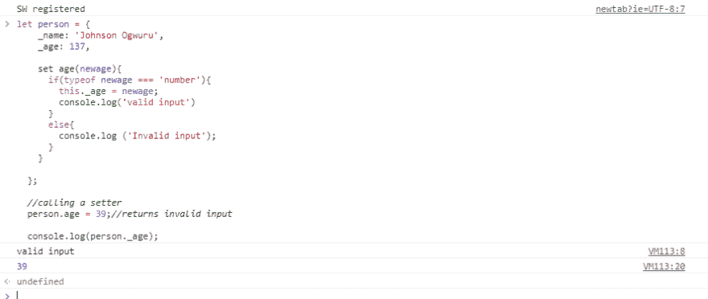

# JavaScript 对象中使用的 Getters 和 Setters....怎么会？

> 原文：<https://dev.to/ogwurujohnson/getters-and-setters-used-in-javascript-objectshow-4jef>

一个常见的对象范例是包含 *getter* 和 *setter* 方法作为属性。Getter 和 Setter 方法获取和设置对象的属性。

**优点:**

1.  您可以在设置属性之前检查新数据是否有效
2.  您可以对您正在*获取*或*设置*的数据执行操作。
3.  您可以控制可以存储和检索哪些属性。

显示如何使用**设置器**的示例如下所示:

```
let person = {
    _name: 'Johnson Ogwuru',
    _age: 137,

    set age(newage){
      if(typeof newage === 'number'){
           this._age = newage;
            console.log('valid input')
      }
      else{
           console.log ('Invalid input');
      }
    }

  }; 
```

Enter fullscreen mode Exit fullscreen mode

我们在属性名前面加上下划线`_`。开发人员使用下划线来表示属性或值不应被其他代码直接修改。这里的 setter 确保只有有效的值被添加到一个特定的属性中，这里的有效性是指该值是一个数字，但是当我们试图向这个属性添加一个字符串时会发生什么呢？让我们看看在我们的代码下面添加这一行会做什么；

```
 person.age = 'Thirty-nine';//returns invalid input

  console.log(person._age); 
```

Enter fullscreen mode Exit fullscreen mode

[T2】](https://res.cloudinary.com/practicaldev/image/fetch/s--3axpHrpL--/c_limit%2Cf_auto%2Cfl_progressive%2Cq_auto%2Cw_880/https://thepracticaldev.s3.amazonaws.com/i/jaa70xaes00w4bih1u0r.PNG)

从上面我们可以看到，在运行应用程序时，我们在控制台中记录了“无效值”,并且我们还注意到,`age`属性的值没有改变。但是我们现在用正确的值来修改参数`age`怎么样？让我们看看会发生什么，将前面代码中的字符串改为您选择的任意数字；

```
 person.age = 'Thirty-nine';//returns invalid input

   console.log(person._age); 
```

Enter fullscreen mode Exit fullscreen mode

[T2】](https://res.cloudinary.com/practicaldev/image/fetch/s--ycaEJ9yh--/c_limit%2Cf_auto%2Cfl_progressive%2Cq_auto%2Cw_880/https://thepracticaldev.s3.amazonaws.com/i/xzqnw45c5m1mscly5tdr.PNG)

从上面的图像中，我们的值被认为是有效的，age 属性的值也被成功地修改了。`Setters`到此为止。

**Getters** 用于获取对象内部的属性值。将一个 *getter* 方法添加到我们之前的例子中，我们会得到类似这样的结果；

```
let person = {
    _name: 'Johnson Ogwuru',
    _age: 137,

    set age(newage){
      if(typeof newage === 'number'){
        this._age = newage;
        console.log('valid input')
      }
      else{
        return 'Invalid input';
      }
    },

    get age(){
      console.log(`${this._name} is ${this._age} old`);
      return this._age
    }

  };

  person.age = 'Thirty-nine';
  person.age = 39;
  console.log(person.age); 
```

Enter fullscreen mode Exit fullscreen mode

运行上面的代码；

[T2】](https://res.cloudinary.com/practicaldev/image/fetch/s--Iqxp1yl7--/c_limit%2Cf_auto%2Cfl_progressive%2Cq_auto%2Cw_880/https://thepracticaldev.s3.amazonaws.com/i/hqqnncsuywep04ugp7wu.PNG)

**总结:**
`Getter`和`Setter`方法允许您在访问或设置属性值之前处理数据。

让我们看看如何在 Es6 类中使用`setter`和`getter`方法.....在我的下一篇文章中。英雄联盟