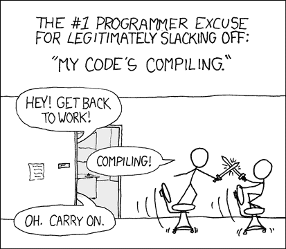

# 恢复速度，我的 Webpack 调试之旅

> 原文：<https://dev.to/jhotterbeekx/getting-speed-back-my-webpack-debugging-journey-37a5>

我想带你踏上一段旅程，穿越一片缓慢的土地。在那里一切都失去了前进的动力，希望似乎也失去了。我想带你调试一下 Webpack 的速度问题。通常我会试着写一些关于过程的文章，给人们建议和提示，让他们思考某个主题。对于这篇文章，我正在尝试一个不同的方向，我的目标是分享我在解决这个问题时经历的过程，描述我的思维过程，但没有任何判断。我做了什么，为什么。希望能启发和消除有经验的开发人员无所不知的错觉。我很想听听你对格式的想法。

[T2】](https://res.cloudinary.com/practicaldev/image/fetch/s--fOz2vv3I--/c_limit%2Cf_auto%2Cfl_progressive%2Cq_auto%2Cw_880/https://thepracticaldev.s3.amazonaws.com/i/hk4knli19og1vk6ijrsh.png)

## 背景

我已经在 React 工作了大约两年。虽然我们的项目使用了很多库，但我今天要研究的是 Webpack。Webpack 是一个我们用来捆绑我们的项目的包，它将我们编写的所有 javascript 和 typescript 代码转换、最小化和优化成浏览器可以使用的文件，同时还处理 CSS、HTML、图像和其他我们正在使用的文件。要了解更多信息，你可以在他们的网站上找到很多信息。

Webpack 是一个广泛使用的软件包，非常广泛，每周有超过 400 万次下载。虽然它变得简单了一些，但每次我不得不在上面工作时，感觉就像是在进行丛林探险...在一个岛上，一个老人成功地再造了一些恐龙...它们设法逃脱了...我们已经尝试了替代方案，但在所有方案中，Webpack 最符合我们的需求。文档很不错，网上有很多教程和例子，但同时很多都已经过时，不再有用了。但对我来说，最大的问题可能是调试可能非常困难，双手被绑在背后与狮子搏斗非常困难。

## 问题

当我们完成一个用户故事时，我们首先将我们的解决方案部署到我们的测试环境中，这样我们的自动化测试套件就可以发挥它的魔力。我们有一个故事，在这个环境中测试时，我们碰巧发现了一些问题，结果不得不多次重复这个过程。但是我开始注意到我花了很长时间，比平时更长。当在 Team City 上确认这种感觉时，我注意到我们的“运行单元测试和构建”花费了 15 分钟，而这通常最多是 7 / 8。当深入研究日志时，我发现我们的构建步骤花费了 8 到 10 分钟，在某些时刻甚至达到了 12 分钟。我们的解决方案没那么大，应该不会花这么长时间。更好的是，以前不用花那么长时间。有东西带走了它的魔力！

[T2】](https://res.cloudinary.com/practicaldev/image/fetch/s--NIelGkdt--/c_limit%2Cf_auto%2Cfl_progressive%2Cq_auto%2Cw_880/https://thepracticaldev.s3.amazonaws.com/i/wxmfdpwf4k4pnuuxxb3s.png)

## 从哪里开始？

我的第一反应是查看 team city 的历史。它保存了最后几个构建的信息，所以如果问题是在最后几个故事中引入的，我应该可以看到这里的时间有了很大的增加。但是都很慢，所以这不是最近造成的。

接下来呢？这可能是我们的 CI 环境的问题，所以我想检查一下它在我自己的机器上是否也很慢。这很容易确认，在我自己的机器上构建需要 8 分钟以上。

会不会是更新？我们在 sprints 开始的时候更新了所有的包。我们进行了两周的冲刺，所以我决定看看 Webpack 的发行说明。在最后一次冲刺中，没有任何变化会导致这种情况。当然，我试着将它降级到几周前的版本，但它仍然像以前一样慢。我很快检查了我们使用的其他主要软件包的更改日志，但是没有提到任何让我怀疑它们的事情。由于将所有的包恢复到早期版本需要相当多的工作，我决定跳过这一步，根据我的感觉，这可能是 Webpack 本身的一些问题。

## 直抵核心

我要使用的下一个工具是谷歌。首先试图找到有同样问题的人，查找“网络包速度慢”、“网络包性能问题”和“网络包速度”等术语。我发现了很多结果，真的很多。好了，现在我知道很多人觉得 Webpack 很慢，但这并不能解释性能的突然下降。我浏览了一些结果，其中大部分是通过缓存和预构建来提高性能的指南，这不是我想要的。因为我不想要一个通用的性能指南，而是一种找到我们突然的糟糕性能的原因的方法，所以我决定改变我的搜索方向，去寻找“Webpack 调试性能”。

## 调试

引起我注意的第一个建议是一个[插件](https://www.npmjs.com/package/speed-measure-webpack-plugin),它将向您显示流程不同部分的构建时间。“正是我需要的！”我就是这么想的。所以我安装了插件，并开始重新构建。当它最终完成时，我满怀希望地向上滚动构建结果，寻找时间。它告诉了我什么，什么都没有...总构建时间显示为 8 分钟多一点，它显示了几个构建步骤，但它们的组合时间甚至没有达到 3 分钟。我去谷歌查了一些例子，也许我用错了，但空手而归。回到我之前搜索性能调试帮助的时候，我在 github 的某个地方找到了一个讨论，这个人通过使用 webpack 中的'- progress '标志来显示速度缓慢。所以我决定试试看它能做什么。

## 我并不孤单

当运行带有 progress 标志的 webpack 时，我获得了关于它正在做什么的实时信息，并立即注意到我在几乎 90%的构建时间里停留在“92%块资产优化”上。这就是问题所在！于是我再次打开谷歌，搜索“webpack 92% chunk 资产优化”。终于有很多人遇到了同样的问题！

[T2】](https://res.cloudinary.com/practicaldev/image/fetch/s--WKUhTq36--/c_limit%2Cf_auto%2Cfl_progressive%2Cq_auto%2Cw_880/https://thepracticaldev.s3.amazonaws.com/i/2xtpkdx7ausk8ag1tsqv.jpg)

## 试错

我在 github 项目上发现了大量关于这个问题的讨论，有些讨论持续了一年多，有些讨论是在最近几天才发布的。所以这个问题已经在里面很久了，可能还是没有解决。但是在回复中有很多建议，人们说“这为我解决了这个问题”，很多不同的东西为不同的人解决了同一个问题。我的下一个直觉是通过尝试张贴在那里的解决方案来使用试错法，从提到最多的解决方案开始。提到最多的解决方案是在 UglifyJS 中禁用源地图和禁用压缩(以及其他一些选项)。所以我回到构建模式的基础上，禁用了源地图，并安装了一个单独版本的 UglifyJS，这样我就可以禁用压缩。我的下一个版本是 80 秒！

## 希望的第一个迹象

这个构建时间让我火了，它是可以修复的！但是在理想世界中，我希望拥有我们已经拥有的源映射，因为当生产中发生错误时，我们使用它们来获得堆栈跟踪。所以我再次尝试启用源地图，然后嘭！发生了一个错误。一个错误？这怎么可能呢？恐慌，迷茫，沮丧，关于离开软件工程去当农民的想法，都糊了我的脑子。我首先试图改变不同的设置为源地图，但我每次都得到错误。所以我决定看看错误，它们是类型脚本部分的语法错误。太奇怪了，这是有效的 javascript！让我们谷歌一下这个错误，所以我搜索了“typescript includes not exist on type ”,结果我又找到了同样问题的人。

## 运输文件

我们最近在解决方案中添加了 typescript，效果很好。但是建议是在 typescript 配置中添加一些部分，所以我就这么做了。重建，现在...不同的错误。嗯，所以它影响了一些东西，让我们检查一下新的错误。它们又是语法错误，但是看起来像是把类型脚本翻译成 javascript 的过程搞砸了。现在，事情已经水落石出了。我们已经在使用 babel 来传输我们的 javascript 了，难道我们不能让 babel 也做打字稿吗？我很快搜索了如何做到这一点，将 typescript 配置设置为只发送最新的语法版本，并更新了 webpack 配置以将 typescript 代码发送给 babel。兴奋地再次运行构建命令，并且...它....成功了！我现在有了大约 120 秒的构建时间，并有了源地图。

[T2】](https://res.cloudinary.com/practicaldev/image/fetch/s--AusGv6Ds--/c_limit%2Cf_auto%2Cfl_progressive%2Cq_auto%2Cw_880/https://thepracticaldev.s3.amazonaws.com/i/pt2yuh4corj4j9yrh13i.jpg)

## 调整和确认

我已经很接近了，成功了。我的下一步是找出是什么导致了缓慢。因为我读得最多的是 UglifyJS 上的压缩标志，所以我先把它关掉。构建时间立即跳回到 8 分钟。好的，这导致了速度变慢，但是为什么以前这不是问题呢？我认为随着项目的增长，它变得越来越慢，添加 typescript 最终对它的影响更大，慢慢地它达到了这一点。如果不是不得不在我们的测试环境中多次部署同一个故事，我们可能甚至不会注意到这个问题，直到它变得更糟。

## 我们能让它变得更好吗？

现在一切都正常了，是时候进一步调整了，看看我们是否能让它跑得更快！首先，我开始慢慢地将设置改回原来的样子，所以我最终只对丑陋的 JS 部分进行了设置，在那里压缩被禁用是唯一真正的改变。一旦这被证实是可行的，我的构建时间大约是 120 秒。还记得我在第一次搜索中找到的性能指南吗？我不需要的那些？我很高兴现在找到了。快速浏览这些指南，我发现一个简单的步骤对我来说很有意义。使用加载器时，最有效的方法是使用包含路径，以确保它只处理需要处理的文件。考虑到这一点，我查看了 webpack 配置，发现 js / jsx 和 ts / tsx 文件并不局限于一个文件夹。这可能意味着每个模块文件都要通过加载程序。我更新了设置，以确保在可能的地方定义了路径。又一次构建的时间到了，我们新的构建时间是...79 秒！

## 结论

回顾这个过程，你会注意到许多不同的技术。我喜欢跟随我的直觉，有时我只是开始尝试我找到的解决方案，即使我不理解它们。但我总是试图了解实际问题和最终的解决方案。我经常使用谷歌，如果不使用它，这简直是疯了，甚至不可能搞清楚这些东西。其他时候我会采取更有条理的方法，这完全取决于问题。没有两个问题是相同的，没有两个开发人员的工作是相同的，但这是我的方式。我写这篇文章是为了激发灵感，也是为了看看人们是否觉得纸上的这些真实世界的过程有趣、有用或其他什么。我很想听听你对此的看法。